# M4P Protocol Specification

## Multi-Modal Maritime Mesh Protocol

| | |
|---|---|
| **Version** | 0.1 |
| **Status** | Proposal Draft |
| **Date** | 2026-02-20 |

---

## Table of Contents

- [1. Introduction](#1-introduction)
  - [1.1 Purpose](#11-purpose)
  - [1.2 Scope](#12-scope)
  - [1.3 Conventions](#13-conventions)
  - [1.4 Normative Classification](#14-normative-classification)
  - [1.5 Conformance](#15-conformance)
  - [1.6 Notation](#16-notation)
- [2. Protocol Overview](#2-protocol-overview)
  - [2.1 Design Philosophy](#21-design-philosophy)
  - [2.2 Protocol Layers](#22-protocol-layers)
  - [2.3 Message Flow](#23-message-flow)
  - [2.4 Network-Wide Configuration](#24-network-wide-configuration)
    - [2.4.1 Addressing Mode Configuration](#241-addressing-mode-configuration)
    - [2.4.2 Required Configuration (MUST)](#242-required-configuration-must)
    - [2.4.3 Recommended Configuration (SHOULD)](#243-recommended-configuration-should)
  - [2.5 Design Constraints and Deliberate Tradeoffs](#25-design-constraints-and-deliberate-tradeoffs)
    - [2.5.1 Timestamp Ambiguity Window](#251-timestamp-ambiguity-window)
  - [2.6 Core Concepts and Terminology](#26-core-concepts-and-terminology)
  - [2.7 Application Layer Responsibilities](#27-application-layer-responsibilities)
  - [2.8 Relationship to Existing Standards (Non-Normative)](#28-relationship-to-existing-standards-non-normative)
- [3. Identity and Addressing Model](#3-identity-and-addressing-model)
  - [3.1 Global Identities](#31-global-identities)
    - [3.1.1 Node Unique Identifier (NodeUID)](#311-node-unique-identifier-nodeuid)
    - [3.1.2 Client Unique Identifier (ClientUID)](#312-client-unique-identifier-clientuid)
  - [3.2 Local Addresses](#32-local-addresses)
    - [3.2.1 Node Address (NA)](#321-node-address-na)
    - [3.2.2 Client Address (CA)](#322-client-address-ca)
  - [3.3 Address Scope and Lifetime](#33-address-scope-and-lifetime)
  - [3.4 Address Context Disambiguation](#34-address-context-disambiguation)
  - [3.5 Where Identifiers and Addresses Appear](#35-where-identifiers-and-addresses-appear)
- [4. Message Classification](#4-message-classification)
  - [4.1 Message Type ID Ranges](#41-message-type-id-ranges)
  - [4.2 Compact Type Encoding (CTE)](#42-compact-type-encoding-cte)
- [5. On-Wire Formats](#5-on-wire-formats)
  - [5.1 Status Packet Header](#51-status-packet-header)
  - [5.2 Event Packet Header](#52-event-packet-header)
  - [5.3 Request Packet Header](#53-request-packet-header)
  - [5.4 Response Packet Header](#54-response-packet-header)
  - [5.5 Network Control Packet Headers](#55-network-control-packet-headers)
    - [5.5.1 NC Announce Header](#551-nc-announce-header)
    - [5.5.2 NC Targeted Header](#552-nc-targeted-header)
  - [5.6 Field Definitions](#56-field-definitions)
  - [5.7 Flags and Optional Fields](#57-flags-and-optional-fields)
    - [5.7.1 Status Packet Flags (8 bits)](#571-status-packet-flags-8-bits)
    - [5.7.2 Event Packet Flags (8 bits)](#572-event-packet-flags-8-bits)
    - [5.7.3 Request Packet Flags (8 bits)](#573-request-packet-flags-8-bits)
    - [5.7.4 Response Packet Flags (7 bits)](#574-response-packet-flags-7-bits)
    - [5.7.5 Optional Field Ordering](#575-optional-field-ordering)
    - [5.7.6 Optional Field Definitions](#576-optional-field-definitions)
      - [Fragment Fields](#fragment-fields)
      - [Modality Mask](#modality-mask)
      - [TTL Override](#ttl-override)
      - [Status Key](#status-key)
      - [Client Address Fingerprint](#client-address-fingerprint)
      - [Authentication Tag](#authentication-tag)
  - [5.8 Transmission Encoding](#58-transmission-encoding)
- [6. Message Instance Tracking and Deduplication](#6-message-instance-tracking-and-deduplication)
  - [6.1 Message Instance ID (MIID)](#61-message-instance-id-miid)
  - [6.2 MIID Computation](#62-miid-computation)
  - [6.3 Response Correlation](#63-response-correlation)
  - [6.4 MIID Bit Layout](#64-miid-bit-layout)
  - [6.5 Deduplication Rules](#65-deduplication-rules)
- [7. Time-to-Live and Packet Expiration](#7-time-to-live-and-packet-expiration)
- [8. Fragmentation and Reassembly](#8-fragmentation-and-reassembly)
  - [8.1 Overview](#81-overview)
  - [8.2 Fragment Structure](#82-fragment-structure)
  - [8.3 Fragmentation Behavior](#83-fragmentation-behavior)
    - [8.3.1 Transmission-Time Decision](#831-transmission-time-decision)
    - [8.3.2 Who May Fragment](#832-who-may-fragment)
    - [8.3.3 Fragment Identity](#833-fragment-identity)
    - [8.3.4 Independent Forwarding](#834-independent-forwarding)
    - [8.3.5 Encryption Interaction](#835-encryption-interaction)
  - [8.4 Reassembly](#84-reassembly)
    - [8.4.1 Cross-Form Deduplication](#841-cross-form-deduplication)
    - [8.4.2 Status Reassembly Supersession](#842-status-reassembly-supersession)
    - [8.4.3 Event Reassembly Behavior](#843-event-reassembly-behavior)
  - [8.5 Fragment NACKs (Network Control Type 32,003)](#85-fragment-nacks-network-control-type-32003)
- [9. Transport Behavior](#9-transport-behavior)
  - [9.1 Store-Carry-Forward Model](#91-store-carry-forward-model)
  - [9.2 Per-Node Message Store](#92-per-node-message-store)
    - [9.2.1 Pending Address Resolution (Outbound)](#921-pending-address-resolution-outbound)
    - [9.2.2 Source Identity Resolution (Inbound)](#922-source-identity-resolution-inbound)
  - [9.3 Resend Behavior](#93-resend-behavior)
    - [9.3.1 Request Resend](#931-request-resend)
    - [9.3.2 Response Caching and Resend](#932-response-caching-and-resend)
    - [9.3.3 Status Coalescing](#933-status-coalescing)
    - [9.3.4 Event Resend](#934-event-resend)
  - [9.4 Priority and Scheduling](#94-priority-and-scheduling)
  - [9.5 Modality Classification](#95-modality-classification)
  - [9.6 Scheduling Modes](#96-scheduling-modes)
  - [9.7 Link Opportunities and Transmission Building](#97-link-opportunities-and-transmission-building)
    - [9.7.1 Fragment Size Selection](#971-fragment-size-selection)
    - [9.7.2 Worked Example: Mixed-Origin Transmission Packing](#972-worked-example-mixed-origin-transmission-packing)
    - [9.7.3 Worked Example: Fragmentation During Packing](#973-worked-example-fragmentation-during-packing)
  - [9.8 Forwarding Semantics](#98-forwarding-semantics)
    - [9.8.1 Broadcast Semantics](#981-broadcast-semantics)
    - [9.8.2 Infrastructure and Mesh Modality Forwarding](#982-infrastructure-and-mesh-modality-forwarding)
  - [9.9 Error Handling](#99-error-handling)
    - [9.9.1 Malformed Packets](#991-malformed-packets)
    - [9.9.2 Unknown Flag Bits](#992-unknown-flag-bits)
    - [9.9.3 Protocol Version Compatibility](#993-protocol-version-compatibility)
  - [9.10 Dispersion-Aware Scheduling (Mesh Modalities)](#910-dispersion-aware-scheduling-mesh-modalities)
- [10. DataLink Abstraction](#10-datalink-abstraction)
  - [10.1 DataLink Interface](#101-datalink-interface)
  - [10.2 Modality Classification](#102-modality-classification)
  - [10.3 Transmission Metadata](#103-transmission-metadata)
  - [10.4 Data Link Adaptation](#104-data-link-adaptation)
  - [10.5 Scheduling Inputs](#105-scheduling-inputs)
- [11. Network Layer](#11-network-layer)
  - [11.1 Address Derivation and Versioning](#111-address-derivation-and-versioning)
  - [11.2 Claim Timestamps](#112-claim-timestamps)
  - [11.3 Claim Expiration and Renewal](#113-claim-expiration-and-renewal)
    - [11.3.1 Expiration Interval](#1131-expiration-interval)
    - [11.3.2 Refresh Mechanism](#1132-refresh-mechanism)
    - [11.3.3 Lapsed Claim Detection](#1133-lapsed-claim-detection)
  - [11.4 Claim Lifecycle](#114-claim-lifecycle)
    - [11.4.1 Confirmation Paths](#1141-confirmation-paths)
    - [11.4.2 Pending Claim Rebroadcast](#1142-pending-claim-rebroadcast)
    - [11.4.3 Restored Claims](#1143-restored-claims)
  - [11.5 Local Persistence](#115-local-persistence)
  - [11.6 Network Control Message Format](#116-network-control-message-format)
    - [11.6.1 Transport Properties](#1161-transport-properties)
    - [11.6.2 Propagation Models](#1162-propagation-models)
  - [11.7 NC Message Catalog](#117-nc-message-catalog)
    - [11.7.0 Scheduling Bias](#1170-scheduling-bias)
    - [11.7.1 NC\_NODE\_SUMMARY (32,000)](#1171-nc_node_summary-32000)
    - [11.7.2 NC\_NETWORK\_STATE\_REQUEST (32,001)](#1172-nc_network_state_request-32001)
    - [11.7.3 NC\_NETWORK\_STATE\_RESPONSE (32,002)](#1173-nc_network_state_response-32002)
    - [11.7.4 NC\_NODE\_ADDRESS\_CLAIM (32,010)](#1174-nc_node_address_claim-32010)
    - [11.7.5 NC\_CLIENT\_ADDRESS\_CLAIM (32,011)](#1175-nc_client_address_claim-32011)
    - [11.7.6 NC\_CLIENT\_UID\_QUERY (32,015)](#1176-nc_client_uid_query-32015)
    - [11.7.7 NC\_CLIENT\_UID\_ANSWER (32,016)](#1177-nc_client_uid_answer-32016)
    - [11.7.8 NC\_NODE\_UID\_QUERY (32,013)](#1178-nc_node_uid_query-32013)
    - [11.7.9 NC\_NODE\_UID\_ANSWER (32,014)](#1179-nc_node_uid_answer-32014)
    - [11.7.10 NC\_NODE\_ADDRESS\_CONFLICT (32,020)](#11710-nc_node_address_conflict-32020)
    - [11.7.11 NC\_CLIENT\_ADDRESS\_CONFLICT (32,021)](#11711-nc_client_address_conflict-32021)
    - [11.7.12 NC\_ADDRESS\_CLAIM\_ACK (32,012)](#11712-nc_address_claim_ack-32012)
    - [11.7.13 Fragment NACK (32,003)](#11713-fragment-nack-32003)
    - [11.7.14 NC\_CLAIM\_RENEWAL (32,004)](#11714-nc_claim_renewal-32004)
    - [11.7.15 NC\_CLIENT\_ADDRESS\_RESOLVE\_QUERY (32,017)](#11715-nc_client_address_resolve_query-32017)
    - [11.7.16 NC\_CLIENT\_ADDRESS\_RESOLVE\_ANSWER (32,018)](#11716-nc_client_address_resolve_answer-32018)
  - [11.8 Conflict Detection and Resolution](#118-conflict-detection-and-resolution)
    - [11.8.1 Detection Mechanisms](#1181-detection-mechanisms)
    - [11.8.2 Resolution Rules](#1182-resolution-rules)
    - [11.8.3 Loser Behavior](#1183-loser-behavior)
    - [11.8.4 Convergence](#1184-convergence)
    - [11.8.5 Conflict Declaration Suppression](#1185-conflict-declaration-suppression)
  - [11.9 Peer Discovery and Fleet Membership](#119-peer-discovery-and-fleet-membership)
    - [11.9.1 Link-Level Discovery](#1191-link-level-discovery)
    - [11.9.2 Network-Level Discovery](#1192-network-level-discovery)
    - [11.9.3 Address Mapping State](#1193-address-mapping-state)
    - [11.9.4 Accelerated Client Address Convergence](#1194-accelerated-client-address-convergence)
    - [11.9.5 Worked Example: Network Bootstrap Sequence (Non-Normative)](#1195-worked-example-network-bootstrap-sequence-non-normative)
- [12. Encryption and Security](#12-encryption-and-security)
  - [12.1 Responsibility Summary](#121-responsibility-summary)
  - [12.2 M4P Payload Cipher](#122-m4p-payload-cipher)
    - [12.2.1 What Is Encrypted](#1221-what-is-encrypted)
    - [12.2.2 Nonce Derivation](#1222-nonce-derivation)
    - [12.2.3 Authentication Tag](#1223-authentication-tag)
    - [12.2.4 Transport Pipeline](#1224-transport-pipeline)
    - [12.2.5 Fragmentation Interaction](#1225-fragmentation-interaction)
  - [12.3 DataLink-Layer Encryption](#123-datalink-layer-encryption)
    - [12.3.1 Role](#1231-role)
    - [12.3.2 Recommended DataLink Security by Modality](#1232-recommended-datalink-security-by-modality)
    - [12.3.3 Gateway and Bridge Behavior](#1233-gateway-and-bridge-behavior)
  - [12.4 Key Management](#124-key-management)
    - [12.4.1 Payload Cipher Key](#1241-payload-cipher-key)
    - [12.4.2 Key Scope](#1242-key-scope)
    - [12.4.3 Key Rotation](#1243-key-rotation)
    - [12.4.4 DataLink-Layer Keys](#1244-datalink-layer-keys)
  - [12.5 Identity Obfuscation](#125-identity-obfuscation)
  - [12.6 Security Properties and Limitations](#126-security-properties-and-limitations)
    - [12.6.1 What This Model Provides](#1261-what-this-model-provides)
    - [12.6.2 What This Model Does Not Provide](#1262-what-this-model-does-not-provide)
- [13. Future Features (Non-Normative)](#13-future-features-non-normative)
  - [13.1 Runtime Network ID Management](#131-runtime-network-id-management)
  - [13.2 Graceful Network Departure](#132-graceful-network-departure)
  - [13.3 Message Type Defaults Synchronization](#133-message-type-defaults-synchronization)
- [14. Normative References](#14-normative-references)
- [15. Informative References](#15-informative-references)
- [Appendix A: Reference Algorithms](#appendix-a-reference-algorithms)
  - [A.1 Compact Type Encoding](#a1-compact-type-encoding)
  - [A.2 TTL Encoding and Decoding](#a2-ttl-encoding-and-decoding)
  - [A.3 Timestamp Age Calculation](#a3-timestamp-age-calculation)
  - [A.4 MIID Computation](#a4-miid-computation)
  - [A.5 Address Derivation](#a5-address-derivation)
  - [A.6 Client Address Fingerprint](#a6-client-address-fingerprint)
  - [A.7 Authentication Tag (CMAC with Header AAD)](#a7-authentication-tag-cmac-with-header-aad)
- [Appendix B: Glossary](#appendix-b-glossary)
- [Appendix C: Application Integration Guidelines (Non-Normative)](#appendix-c-application-integration-guidelines-non-normative)
  - [C.1 Message Payload Design](#c1-message-payload-design)
  - [C.2 Data Link Integration](#c2-data-link-integration)
- [Appendix D: Test Vectors (Forthcoming)](#appendix-d-test-vectors-forthcoming)

---

## 1. Introduction

### 1.1 Purpose

This document specifies the Multi-Modal Maritime Mesh Protocol (M4P), a delay-tolerant, store-carry-forward networking protocol designed for heterogeneous maritime communication environments. M4P provides reliable message exchange across multiple data link modalities — including, but not limited to, acoustic, radio, satellite, and IP-based links — under conditions of intermittent connectivity, extreme bandwidth constraints, and dynamic network topology.

### 1.2 Scope

This specification defines:

- The on-wire packet formats for all M4P message classes.
- The identity and addressing model used to identify nodes and application endpoints.
- The transport layer semantics governing message instance tracking, deduplication, expiration, fragmentation, store-carry-forward forwarding, and transmission scheduling.
- The DataLink abstraction boundary that separates protocol logic from modality-specific mechanics.
- The network layer protocols for address assignment, conflict resolution, peer discovery, and fleet membership.
- The encryption model for payload confidentiality and integrity, including the M4P payload cipher and DataLink-layer security.

This specification does not define:

- Application-layer message payload schemas or type allocations (these are deployment-specific).
- Implementation-specific APIs, deployment configurations, or runtime architectures.

### 1.3 Conventions

The key words "MUST", "MUST NOT", "REQUIRED", "SHALL", "SHALL NOT", "SHOULD", "SHOULD NOT", "RECOMMENDED", "MAY", and "OPTIONAL" in this document are to be interpreted as described in RFC 2119.

### 1.4 Normative Classification

Requirements in this specification fall into three categories, indicated by markers at the beginning of each major section:

**[WIRE FORMAT]** — On-wire protocol requirements. These define packet formats, field encodings, Message Instance ID (MIID) computation, Network Control (NC) message payload structures, encryption nonce construction, and any other aspect that two independent implementations MUST agree on to exchange packets. Deviation from a WIRE FORMAT requirement produces interoperability failure.

**[BEHAVIORAL]** — Node behavior requirements for protocol correctness. These define how a conformant node MUST process, store, forward, deduplicate, and expire packets. Two implementations that follow different behavioral rules may still exchange packets (the wire format is compatible), but the network will not function correctly — messages may loop, duplicates may propagate, conflicts may not resolve.

**[GUIDANCE]** — Recommended implementation practices. These define scheduling heuristics, priority scoring formulas, resend strategies, modality classification, and application design advice. An implementation MAY deviate from guidance without affecting interoperability or correctness, though following the guidance produces better operational behavior.

### 1.5 Conformance

A conformant M4P implementation MUST implement all [WIRE FORMAT] and [BEHAVIORAL] requirements defined in this specification. [GUIDANCE] sections are non-normative; implementations MAY deviate from guidance without affecting conformance or interoperability.

The following features are optional. A conformant implementation MAY omit them:

- **M4P payload cipher** (Section 12). When not supported, the node operates without payload encryption.
- **Authentication tag** (Section 12). When not supported, the `AUTH_TAG_SIZE` field is set to `00` (no tag) on originated packets; received packets with `AUTH_TAG_SIZE ≠ 00` are forwarded without modification.
- **Client address fingerprint** ([Section 5.7.6](#576-optional-field-definitions), [Section 11.9.4](#1194-accelerated-client-address-convergence)). When not supported, the `CA_FINGERPRINT_PRESENT` flag is never set.

Group addressing (`ADDITIONAL_DEST_PRESENT` flag and `additional_destinations` optional field) is a required feature of this protocol version. All conformant implementations MUST parse and correctly handle group Request headers.

Two conformant implementations MUST agree on the following network-wide parameters to interoperate: `network_id`, addressing mode, and (if the payload cipher is used) the cipher key.

### 1.6 Notation

- All multi-byte integers are encoded in **big-endian** (network) byte order.
- Bitfields are shown most-significant bit (MSB) first, bit 7 to bit 0 within each byte.
- Field sizes are specified in bits (b) or bytes (B). Where a field spans a non-byte-aligned boundary, the bit width is given explicitly.
- "(CTE)" denotes Compact Type Encoding as defined in [Section 4.2](#42-compact-type-encoding-cte).

---

## 2. Protocol Overview

### 2.1 Design Philosophy

M4P is built for intermittently connected, bandwidth-constrained maritime networks with mobile nodes, high latency, and modest scale (typically tens to hundreds of nodes).

**Primary use case (non-normative).** M4P is primarily designed to enable collaborative autonomy: multiple autonomous platforms and operator endpoints coordinating shared mission state, telemetry, and command/response workflows over intermittent, heterogeneous links. This design driver favors eventual dissemination, bounded staleness, and bandwidth-efficient forwarding over connection-oriented guarantees such as ordered delivery and per-hop acknowledgments.

- **Local broadcast + store-carry-forward.** Transmissions are sent as modality-local broadcast; receiving nodes may store and forward packets as later link opportunities appear (see [Section 9.1](#91-store-carry-forward-model)). End-to-end paths are not assumed at send time.
- **Local decisions, no global routing.** Nodes do not require global routing tables, topology convergence, or centralized coordination. Forwarding, address management, conflict resolution, and peer discovery operate through local observation and peer state exchange.
- **Dissemination over path optimality.** Scheduling prioritizes packets likely to add the most new information to peers, rather than shortest-path routing. Dispersion-aware scheduling is optional and interoperable (see [Section 9.10](#910-dispersion-aware-scheduling-mesh-modalities)).
- **Bandwidth-aware transport, bandwidth-agnostic applications.** Applications produce messages without per-link tuning; transport adapts per modality by selecting and packing the highest-value packets within each payload budget (see [Section 9.4](#94-priority-and-scheduling) through [Section 9.7](#97-link-opportunities-and-transmission-building)).
- **Wire efficiency first.** Header overhead is minimized for small payload budgets (for example, an 8-byte Status header, Compact Type Encoding in [Section 4.2](#42-compact-type-encoding-cte), and nonce derivation from existing header fields).
- **Static baseline, dynamic runtime convergence.** Nodes are pre-provisioned with network-wide constants (`network_id`, addressing mode, payload cipher settings, claim expiration interval, and per-message-type transport defaults; see [Section 2.4](#24-network-wide-configuration)). Runtime state (peer membership, address mappings/conflicts, and forwarding opportunities) converges through NC exchange and local observation.

### 2.2 Protocol Layers

M4P is organized into two protocol layers and a link abstraction boundary:

**Transport Layer.** Moves application messages across opportunistic links. It owns packet formats, message instance tracking and deduplication (MIID), Time-to-Live (TTL) and expiration, fragmentation and reassembly, priority scheduling, transmission packing, and store-carry-forward forwarding behavior. The transport layer is fully specified in this document.

**Network Layer.** Coordinates identity and address state needed by the transport layer across a deployment: mission-scoped address assignment and conflict resolution, global-identity to local-address mapping, peer discovery, and fleet membership signaling. In M4P this is a coordination layer, not a global routing protocol. It uses reserved Network Control message types (see [Section 4.1](#41-message-type-id-ranges)) carried by the transport layer and is specified in [Section 11](#11-network-layer).

**DataLink Abstraction.** Boundary between M4P and physical communication. Each modality adapter (acoustic modem, radio, satellite terminal, LAN interface) exposes transmission opportunities and payload budgets to M4P; modality-specific mechanics remain below this boundary. The DataLink abstraction is defined in [Section 10](#10-datalink-abstraction).

Figure 1 illustrates the three-layer architecture and the boundaries between them.

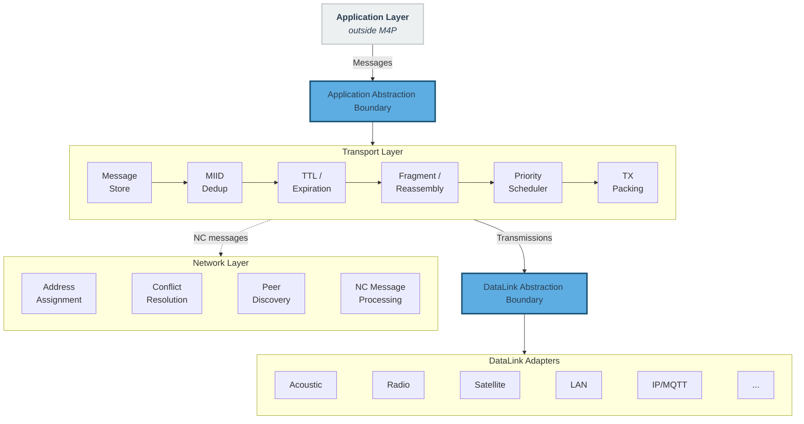

**Figure 1 — M4P Protocol Layer Architecture**

### 2.3 Message Flow

The fundamental data flow through M4P follows this path:

1. An application client issues a **Message** containing a message type identifier, a payload, and (for directed messages) a destination **ClientUID**. Broadcast application classes (Status and Event) carry no destination field. The transport layer resolves directed ClientUIDs to on-wire Client Addresses (CA) internally.
2. The originating node's transport layer converts the Message into one or more **Packets**, fragmenting if necessary, and stores them for delivery.
3. When a DataLink reports a transmission opportunity and payload budget, the node's scheduler selects eligible packets, packs them into a **Transmission** that fits within the budget, and delivers the Transmission to the DataLink for sending.
4. A receiving node unpacks the Transmission, deduplicates against previously seen MIIDs, delivers packets addressed to local clients (including group Requests addressed to any locally-hosted CA), and stores packets for subsequent forwarding.

This cycle repeats across every link and every intermediate node until the message reaches its destination or its TTL expires. Figure 2 illustrates this end-to-end data flow.

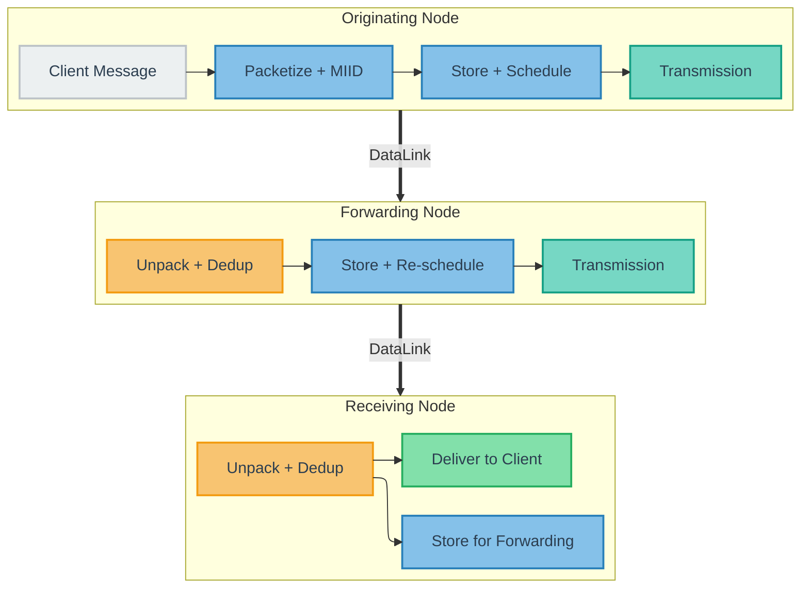

**Figure 2 — Message → Packet → Transmission Data Flow**

Receiving nodes deliver packets addressed to local clients and store them for forwarding to other neighbors. The detailed lifecycle of packets within the message store is specified in [Section 9.1](#91-store-carry-forward-model).

**Data Unit Summary**

| Unit | Key Metadata | Created By | Consumed By |
|---|---|---|---|
| **Message** | type, payload, destination ClientUID | Application Client | Destination Client |
| **Packet** | header + payload, MIID | Transport (packetize) | Transport (unpack, deduplicate) |
| **Transmission** | sender NA + serialized packets | Scheduler/Packer | DataLink (send) → DataLink (receive) |

### 2.4 Network-Wide Configuration

M4P uses a small set of deployment-wide configuration parameters. Some are required for interoperability (MUST): `network_id`, addressing mode, payload cipher configuration (when used), and claim expiration interval. Others improve transport efficiency (SHOULD) but are not strictly required for interoperability.

#### 2.4.1 Addressing Mode Configuration

M4P supports two network-wide addressing modes that govern the size of address fields in packet headers:

- **8-bit addressing**: Client Addresses (CA) and Node Addresses (NA) are 8-bit unsigned integers (address space: 1-255, with 0 reserved for broadcast). Produces 32-bit MIIDs.
- **16-bit addressing**: Client Addresses and Node Addresses are 16-bit unsigned integers (address space: 1-65,535, with 0 reserved for broadcast). Produces 40-bit MIIDs.

The addressing mode is a network-wide configuration parameter. All nodes in a deployment MUST use the same addressing mode. The addressing mode affects packet header sizes, MIID computation, and address field widths throughout this specification. Where field sizes differ between modes, both variants are specified.

#### 2.4.2 Required Configuration (MUST)

The following parameters MUST be consistent across all nodes in a deployment:

**Network identifier.** All nodes in a deployment MUST be configured with the same `network_id` — a UTF-8 string that uniquely identifies the M4P network instance. The `network_id` serves three roles:

1. **Address scoping.** Addresses are scoped to a `network_id`. Separate M4P networks MAY reuse the same numeric addresses without conflict, enabling multiple independent network instances to coexist on shared communication infrastructure.
2. **Address derivation.** The `network_id` is an input to the address derivation hash (see [Section 11.1](#111-address-derivation-and-versioning)).
3. **Encryption nonce construction.** The `network_id` is an input to nonce generation (see [Section 12.2.2](#1222-nonce-derivation), *Nonce construction*), ensuring that identical plaintext on different networks produces different ciphertext.

On data links that support topic or channel separation (e.g., MQTT), the `network_id` SHOULD be used as a topic prefix or equivalent mechanism to enforce network isolation at the data link layer.

The format and content of the `network_id` are deployment-specific (e.g., a mission name, a UUID, a fleet identifier). Two deployments operating in overlapping communication range MUST use different `network_id` values to prevent address collisions and nonce reuse.

The `network_id` is a static deployment-time configuration parameter. Runtime `network_id` assignment (cross-network management) is outside the scope of this version of the specification. Deployments requiring runtime reconfiguration MAY use out-of-band mechanisms (e.g., a LAN-based management interface) to update node configuration.

**Addressing mode.** All nodes in a deployment MUST use the same addressing mode (8-bit or 16-bit), as defined in [Section 2.4.1](#241-addressing-mode-configuration). The addressing mode determines the size of address fields in packet headers and MIID width. Nodes operating in different addressing modes cannot interoperate.

**Payload cipher configuration.** The M4P payload cipher key (also referred to as the pre-shared key, or PSK) is a symmetric key shared by nodes participating in payload encryption. If the optional M4P payload cipher is used (see [Section 12](#12-encryption-and-security)), all nodes that host application clients MUST share the same PSK. For deployments lasting more than 24 hours, the PSK SHOULD be used as a master key for epoch-based key derivation (see [Section 12.4.1](#1241-payload-cipher-key)). The payload cipher is fixed to AES-256-CTR (see [Section 12.2](#122-m4p-payload-cipher)); there are no configurable cipher suite options. Encryption configuration is all-or-nothing across a deployment:

- When a PSK is configured, the M4P transport encrypts application message payloads at the originating node and decrypts them at the destination node. Intermediate forwarding nodes do not need the PSK — they forward ciphertext payloads as opaque bytes.
- When no PSK is configured, payloads are carried in the clear (subject to any DataLink-layer encryption).

Nodes with inconsistent PSK configuration cannot decrypt each other's messages. The payload cipher is optional; deployments MAY operate without it if the threat model permits. The two-layer encryption architecture (payload cipher + DataLink-layer) is illustrated in Figure 12.

**Claim expiration interval.** All nodes in a deployment MUST use the same `expiration_interval` — the maximum duration an address claim remains valid without renewal (see [Section 11.3.1](#1131-expiration-interval)). Claim expiration status is computed independently by each node from the `claim_renewal_timestamp` and the shared `expiration_interval`; divergent values would cause disagreement on active addresses, producing inconsistent peer registries and potential address conflicts.

#### 2.4.3 Recommended Configuration (SHOULD)

**Per-message-type defaults.** Each Message Type ID SHOULD have default **Priority** and **TTL** values stored in per-node configuration and applied automatically during scheduling and forwarding. Per-packet overrides are available via the `priority_override` and `ttl_override` optional fields (see [Section 5.7.6](#576-optional-field-definitions) and [Section 7](#7-time-to-live-and-packet-expiration)). Defaults are deployment-specific and can be provisioned statically or synchronized dynamically (see [Section 13.3](#133-message-type-defaults-synchronization)). When a node receives a packet with a Message Type ID for which it has no configured defaults, it MUST NOT discard the packet; it MUST apply implementation-defined fallback values for priority and TTL so the packet can still be stored, scheduled, and forwarded.

### 2.5 Design Constraints and Deliberate Tradeoffs

M4P is not a general-purpose networking protocol. It is optimized for the collaborative-autonomy traffic patterns described in [Section 2.1](#21-design-philosophy): periodic telemetry (Status), append-retained observations (Event), command-and-control exchanges (Request/Response), and coordination signals among small fleets. The on-wire format reflects deliberate tradeoffs that optimize for these patterns under intermittent connectivity, extreme bandwidth constraints, and dynamic topology.

M4P deliberately omits reliable ordered delivery, per-packet acknowledgments, flow/congestion control, long-lived connection state, and large address spaces. These features assume conditions that do not hold in the target environment: continuous end-to-end connectivity, measurable round-trip times, and bidirectional links. Instead, M4P provides MIID deduplication, TTL expiration, request/response correlation, latest-value Status coalescing, and append-retained Event handling — mechanisms designed for intermittent, delay-tolerant networks. Headers are compact: a Status packet header can be as small as 8 bytes (Event minimum is 9 bytes).

**Design Note (Non-Normative):** Packet headers do not carry a protocol-version field to preserve byte budget on constrained links. Version compatibility is managed at deployment scope, with limited wire-level tolerance handled by rules such as unknown-flag processing (see [Section 9.9.2](#992-unknown-flag-bits) and [Section 9.9.3](#993-protocol-version-compatibility)).

#### 2.5.1 Timestamp Ambiguity Window

Timestamps use `mod 86400` arithmetic and are unambiguous within ±12 hours.

**Design Note (Non-Normative):** Ambiguity arises when any of the following applies:

- Packet age exceeds 12 hours between send and decode.
- Sender/receiver clock offset exceeds 12 hours.
- Packet age and clock offset combine to exceed the ±12-hour window.

The effective TTL range remains bounded below this window (maximum encodable TTL is ~7.4 hours), so packets expire before timestamp wrap ambiguity dominates under expected drift.

### 2.6 Core Concepts and Terminology

| Concept | Definition | Normative Section |
|------------|---------------------------------------------------------------|--------------------------|
| **Node** | Physical network participant (one per platform); hosts Clients, connects to DataLinks, maintains a local message store for store-carry-forward operation. Identified by NodeUID (global, persistent) and NA (mission-scoped). | [Section 3.1](#31-global-identities) |
| **Client** | Application-layer endpoint hosted on a Node; originates and consumes Messages. Each Client is independently addressable and isolated from other Clients on the same Node. Identified by ClientUID (global) and CA (mission-scoped). | [Section 3.1](#31-global-identities) |
| **Message** | Application-layer unit of communication (state update, event, command, query, response). Carries a Message Type ID, payload, optional destination ClientUID (directed classes only), and optional overrides (priority, TTL, modality mask, status key for Status only, authentication tag). | [Section 4](#4-message-classification), [Section 5.7.6](#576-optional-field-definitions) |
| **Packet** | On-wire unit; header (Status, Event, Request, Response, or NC format) + payload. Carries a complete Message or a single Fragment. | [Section 5](#5-on-wire-formats) |
| **Fragment** | Portion of a Message split across multiple Packets when the payload exceeds a DataLink's budget. All Fragments share the same MIID and Message Type ID. | [Section 8](#8-fragmentation-and-reassembly) |
| **Transmission** | One send operation on a DataLink; contains one or more serialized Packets plus the sender's NA. | [Section 9.7](#97-link-opportunities-and-transmission-building) |
| **DataLink** | Modality adapter connecting M4P to a physical communication layer. Exposes transmission opportunities and payload budgets; encapsulates all modality-specific mechanics. A node may have multiple DataLinks active simultaneously. | [Section 10](#10-datalink-abstraction) |
| **Modality** | Class of data link technology (acoustic, radio, satellite, LAN, IP/MQTT). Classified as **infrastructure** (reliable delivery to all peers; rebroadcast is redundant) or **mesh** (range-limited/lossy; multi-hop rebroadcast propagates packets). | [Section 9.8.2](#982-infrastructure-and-mesh-modality-forwarding) |

**Message fields.** A Message carries required fields (Message Type ID, payload), a destination ClientUID for directed Request/Response traffic, and optional overrides (priority, TTL, modality mask, status key for Status only, authentication tag). Field definitions are in [Section 5.7.6](#576-optional-field-definitions).

**Infrastructure vs. mesh modalities.** Infrastructure links deliver reliably to all connected peers (rebroadcast is redundant; examples: LAN, MQTT). Mesh links are range-limited or lossy (multi-hop rebroadcast propagates packets; examples: acoustic, radio). This classification is a property of the DataLink adapter, not the physical medium itself; the same radio technology may be classified either way by operating context. See [Section 9.8.2](#982-infrastructure-and-mesh-modality-forwarding) for forwarding rules.

**Processing hierarchy.** A Node hosts Clients and DataLinks. Clients produce and consume Messages; transport converts Messages to Packets (fragmenting if needed), packs Packets into Transmissions on link opportunities, and reverses that process on receive before client delivery.

Figure 3 illustrates the structural relationships between these entities.

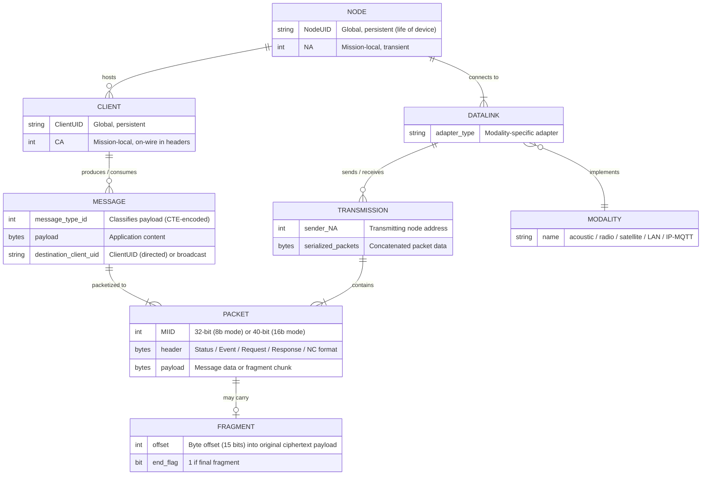

**Figure 3 — M4P Entity Relationships**

### 2.7 Application Layer Responsibilities

M4P handles transport-layer concerns (multi-hop delivery, deduplication, scheduling, fragmentation, expiration) and network-layer concerns (address assignment, conflict resolution, peer discovery). Applications are responsible for:

- **Message class intent.** Assigning Message Type IDs so transport semantics match intent: Status for "what is true now", Event for "what happened", and Request/Response for directed interactions.
- **Message payload design.** Defining application-specific payload schemas and using M4P's transport features effectively (see [Appendix C](#appendix-c-application-integration-guidelines-non-normative)).
- **Data link adaptation.** Configuring modality-specific behaviors (TDMA scheduling, MAC parameters, transmission power) based on operational context and M4P's network topology awareness (see [Section 10.4](#104-data-link-adaptation)). This is deployment-level policy, not per-message adaptation by applications.

Detailed guidance for application developers is provided in [Appendix C](#appendix-c-application-integration-guidelines-non-normative) (non-normative).

### 2.8 Relationship to Existing Standards (Non-Normative)

M4P shares conceptual heritage with the Bundle Protocol (RFC 9171) and related DTN standards. Both use store-carry-forward delivery, message-level identification for deduplication, and link abstraction layers. M4P diverges from BP in several areas driven by the constrained maritime operating environment:

- **Header compactness.** A BP primary block requires a minimum of ~26 bytes (CBOR-encoded). An M4P Status header can be as compact as 8 bytes. On acoustic links with 30-byte payload budgets, this difference determines whether a message carries mission data.
- **No custody transfer.** BP supports custody transfer and custody signaling. M4P omits custody in favor of TTL-based expiration and MIID deduplication, reducing protocol complexity and per-hop state.
- **Integrated addressing.** BP relies on external address resolution. M4P integrates a fully decentralized, hash-based address management system for environments without centralized infrastructure.

M4P's DataLink abstraction serves a similar architectural role to BP's Convergence Layer Adapter (CLA) — both decouple the networking layer from link-specific mechanics. M4P's DataLink interface is intentionally narrower: it provides only transmission opportunity and payload budget signals to the transport layer, with adaptive link behaviors (TDMA scheduling, MAC configuration) managed by the application layer rather than the protocol (see [Section 10.1](#101-datalink-interface)). Existing acoustic communication standards such as JANUS (STANAG 4748) could serve as DataLinks under M4P. M4P does not replace or compete with physical-layer standards — it provides the networking layer above them.

---

## 3. Identity and Addressing Model
**[WIRE FORMAT]**

M4P distinguishes between **global identities** (persistent, human-readable) and **local addresses** (compact, mission-scoped, transient). This separation applies to both nodes and clients.

### 3.1 Global Identities

#### 3.1.1 Node Unique Identifier (NodeUID)

A globally unique string identifying a physical node (device, vehicle, buoy, shore station, relay, etc.). The NodeUID is persistent and does not change over the life of the device — analogous to a serial number or MAC address. The NodeUID does not appear in transport layer packet headers. It is used for provisioning, configuration, address assignment logic, metadata exchange, and network layer control messages.

#### 3.1.2 Client Unique Identifier (ClientUID)

A globally unique string identifying a specific application-layer endpoint. Examples: `veh-123`, `veh-123.backseat`, `buoy-7`, `operator-123`. The ClientUID is provided by the client application when it registers with its local node. The ClientUID does not appear in transport layer packet headers. It is used for application-layer message addressing, configuration, logging, management, and network layer control messages. When an application submits a directed message (Request or Response), it specifies the destination by ClientUID; the transport layer resolves this to an on-wire Client Address internally (see [Section 9.2](#92-per-node-message-store)).

### 3.2 Local Addresses

Local addresses are small unsigned integers that appear on the wire. They are transient, mission-scoped, and may change between deployments.

#### 3.2.1 Node Address (NA)

An 8-bit or 16-bit unsigned integer (determined by the network-wide addressing mode) that identifies a node within a deployment. The Node Address is used by the transport layer for forwarding history, per-node metrics, and policies. The Node Address does not appear in transport layer data packet headers. It is carried in the Transmission encoding (see [Section 5.8](#58-transmission-encoding)) and in network layer control messages.

#### 3.2.2 Client Address (CA)

An 8-bit or 16-bit unsigned integer (determined by the network-wide addressing mode) that identifies a client endpoint within a deployment. The Client Address is encoded in the `source` field for all application packets, and in the `destination` field for directed application packets (Request/Response). Status and Event packets are broadcast classes and do not carry a `destination` field. The value `0` is reserved for broadcast addressing. Valid unicast Client Addresses range from `1` to `255` (8-bit mode) or `1` to `65,535` (16-bit mode). Each client that participates in M4P is assigned exactly one CA per deployment.

Client Addresses and Node Addresses are internal to the protocol and are not exposed at the application API boundary; applications interact with M4P exclusively through UIDs (see [Section 3.1](#31-global-identities)).

### 3.3 Address Scope and Lifetime

Scope, lifetime, and wire presence for each identifier type are summarized in the Identifier Summary table after Figure 4.

### 3.4 Address Context Disambiguation

Client Addresses and Node Addresses share the same numeric space but are always disambiguated by context:

- In packet headers, application packets always carry a Client Address in `source`; only directed application classes (Request/Response) carry a `destination` Client Address. For Network Control (NC) messages (message_type_id range 32,000–32,767), these fields refer to **Node Addresses** (see [Section 11.6.1](#1161-transport-properties)). The transport distinguishes the two cases by message_type_id.
- In transmission metadata, node-level fields always refer to **Node Addresses**.
- In network layer control messages, the field semantics are defined per message type.

It is valid for a Client Address and a Node Address with the same numeric value to coexist in the same deployment.

### 3.5 Where Identifiers and Addresses Appear

Where each identifier type is used across the protocol is summarized in the "Where It Appears" column of the Identifier Summary table after Figure 4.

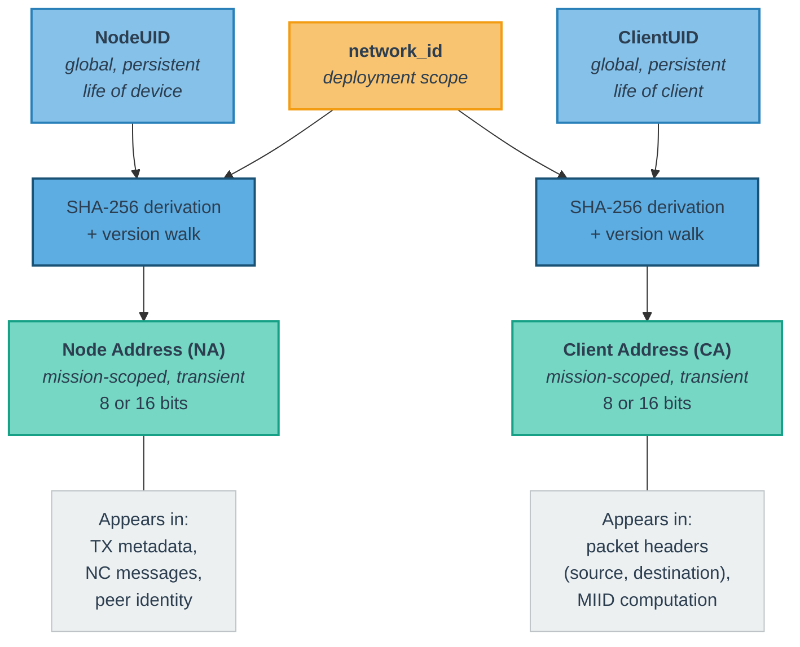

**Figure 4 — Identifier Scope and Mapping Hierarchy**

**Identifier Summary**

| Identifier | Scope | Lifetime | On Wire? | Primary Use | Where It Appears |
|:---|:---|:---|:---|:---|:---|
| **NodeUID** | Global | Persistent (life of device) | No | Provisioning, NC messages, conflict resolution | NC messages, provisioning/config |
| **ClientUID** | Global | Persistent (life of client) | No | Application-layer message addressing, provisioning, NC messages, conflict resolution | Application API (message destination/source), NC messages, provisioning/config |
| **Node Address (NA)** | Deployment-local | Mission-scoped; reassignable | No (TX metadata only) | Forwarding history, peer identity, NC addressing | TX metadata, NC messages |
| **Client Address (CA)** | Deployment-local | Mission-scoped; reassignable | Yes (`source`; `destination` on directed classes) | MIID computation, routing, dedup | Packet headers (`source`, `destination` where present), MIID computation, NC messages |

Decentralized addressing comes from deterministic derivation: each node computes addresses from UID and `network_id` ([Section 11.1](#111-address-derivation-and-versioning)), so no central allocator is required. The UID/address split complements this by keeping persistent identity separate from mission-scoped on-wire addresses. UIDs also anchor conflict resolution and stale-mapping handling ([Section 11.8](#118-conflict-detection-and-resolution)). Keeping CAs in packet headers and NAs in transmission/NC metadata preserves wire compactness while supporting per-node forwarding state.

---

## 4. Message Classification
**[WIRE FORMAT]**

### 4.1 Message Type ID Ranges

Message Type IDs are unsigned integers partitioned into the following ranges. M4P defines only the range boundaries and the transport semantics associated with each range (Status, Event, Request/Response, Network Control). The specific Message Type IDs within the application ranges (0–31,998 excluding 31,999) are defined by each application or deployment — the protocol does not allocate or reserve individual type IDs within these ranges. Only the Network Control range (32,000–32,767) contains type IDs defined by this specification. The following table summarizes the range partitioning.

This range-based classification is deliberate: class semantics are inferred from `message_type_id`, so packet headers do not need a separate class field. On constrained links, avoiding that fixed byte of overhead on every packet is a primary design goal.

| Range | Class | Description |
|---:|---|---|
| 0 - 7,999 | **Status** | Broadcast state information (e.g., navigation, health, telemetry) with latest-value semantics. Status messages have no destination — every node that receives a Status message delivers it to all locally hosted clients. The transport layer maintains only the latest value per `(source CA, message_type_id, status_key)` variant; newer Status messages supersede older ones. |
| 8,000 - 9,999 | **Event** | Broadcast event/fact information with append-retained semantics. Event messages have no destination and are delivered to all locally hosted clients. Event messages are retained and forwarded per message instance until TTL expiry; newer Events MUST NOT supersede older Events. |
| 10,000 - 31,998 | **Request / Response** | Command-and-control or query messages that follow a request/response pattern. Odd values (10,001 - 31,997) denote Requests. Even values (10,000 - 31,998) denote Responses. The Response type for a given Request is `request_type_id + 1`. The value `10,000` is reserved as a generic Response type. |
| 32,000 - 32,767 | **Network Control** | Reserved for transport-internal and network layer control traffic (discovery, address management, fragment control, link probes). Network Control packets MUST NOT be delivered to application clients. |

Message Type ID `31,999` is reserved. Values `32,768` and above cannot be encoded with the current 2-byte Compact Type Encoding and are reserved for future protocol versions that define extended encoding schemes.

| Range | Class | CTE Width | Notes |
|---:|:---|:---|:---|
| 0 – 127 | Status | 1 byte | Most common status types use 1-byte encoding |
| 128 – 7,999 | Status | 2 bytes | Extended status types |
| 8,000 – 9,999 | Event | 2 bytes | Event class; no 1-byte encoding range |
| 10,000 – 31,998 | Request/Response | 2 bytes (always) | Odd = Request, Even = Response; `type + 1` pairs them |
| 31,999 | *Reserved* | — | Reserved for future use |
| 32,000 – 32,767 | Network Control | 2 bytes (always) | Internal to transport; never delivered to clients |
| ≥ 32,768 | *Reserved* | — | Cannot be encoded with current 2-byte CTE |

> **CTE boundary at 128:** Status types 0–127 use a single-byte Compact Type Encoding (MSB = 0), saving 1 byte per packet on the most bandwidth-sensitive state class. Event, Request/Response, and Network Control ranges always use 2-byte CTE (MSB = 1).

### 4.2 Compact Type Encoding (CTE)

To minimize header overhead on constrained links, Message Type IDs are encoded using a variable-length Compact Type Encoding:

**1-byte encoding** (values 0 - 127): The most-significant bit of the byte is `0`. The remaining 7 bits encode the value directly.

```text
Byte 0:  0 x x x x x x x
         ^ |           |
         | +-----------+
        MSB=0  value (7 bits)
```

**2-byte encoding** (values 128 - 32,767): The most-significant bit of the first byte is `1`. The remaining 15 bits across both bytes encode the value in big-endian order.

```text
Byte 0:  1 x x x x x x x    Byte 1:  x x x x x x x x
         ^ |           |             |             |
         | +-----------+ - - - - - - +-------------+
        MSB=1          value (15 bits, big-endian)
```

Receivers MUST infer the encoding length from the MSB of the first byte.

---

## 5. On-Wire Formats
**[WIRE FORMAT]**

M4P defines four application-facing packet header formats (Status, Event, Request, Response) and two Network Control header formats (NC Announce, NC Targeted).

The notation `(CA: 8b or 16b)` indicates that the field width depends on the network-wide addressing mode.

**Bit layout of `timestamp_24h | msg_counter` (3 bytes).** This packing is used in all header formats except Response (which substitutes its own variant; see [Section 5.4](#54-response-packet-header)):

```text
 0                   1                   2
 0 1 2 3 4 5 6 7 8 9 0 1 2 3 4 5 6 7 8 9 0 1 2 3
+-+-+-+-+-+-+-+-+-+-+-+-+-+-+-+-+-+-+-+-+-+-+-+-+
|          timestamp_24h (17b)      |msg_ctr (7)|
+-+-+-+-+-+-+-+-+-+-+-+-+-+-+-+-+-+-+-+-+-+-+-+-+
```

### 5.1 Status Packet Header

Applies to Message Type IDs 0 - 7,999.

```text
Offset  Field                          Width
──────  ─────                          ─────
 0      message_type_id                CTE: 1B or 2B
 +1/+2  source                         CA: 1B or 2B
  ...   timestamp_24h | msg_counter    3B (bit layout above)
  ...   payload_length                 2B
  ...   flags                          1B
  ...   [optional fields per flags]    variable
  ...   payload                        payload_length B
```

**Minimum header size:** 8 bytes (8-bit addressing, 1-byte CTE, no optional fields) to 10 bytes (16-bit addressing, 2-byte CTE, no optional fields).

### 5.2 Event Packet Header

Applies to Message Type IDs 8,000 - 9,999.

```text
Offset  Field                          Width
──────  ─────                          ─────
 0      message_type_id                CTE: 2B
 +2     source                         CA: 1B or 2B
  ...   timestamp_24h | msg_counter    3B (bit layout above)
  ...   payload_length                 2B
  ...   flags                          1B
  ...   [optional fields per flags]    variable
  ...   payload                        payload_length B
```

Event packets use the Status-like broadcast header shape: no destination field and no class-specific key field. Event flags bit 4 is reserved (see [Section 5.7.2](#572-event-packet-flags-8-bits)).

**Minimum header size:** 9 bytes (8-bit addressing) to 10 bytes (16-bit addressing), excluding optional fields.

### 5.3 Request Packet Header

Applies to Message Type IDs 10,001 - 31,997 (odd values only).

```text
Offset  Field                          Width
──────  ─────                          ─────
 0      message_type_id                2B
 +2     destination                    CA: 1B or 2B
  ...   source                         CA: 1B or 2B
  ...   timestamp_24h | msg_counter    3B (bit layout above)
  ...   payload_length                 2B
  ...   flags                          1B
  ...   [optional fields per flags]    variable
  ...   payload                        payload_length B
```

Request Message Type IDs always fall in the 2-byte CTE range; the `message_type_id` field is always 16 bits.

**Minimum header size:** 10 bytes (8-bit addressing) to 12 bytes (16-bit addressing), excluding optional fields.

**Group destination.** When the `ADDITIONAL_DEST_PRESENT` flag is set, the Request targets multiple CAs. The `destination` field contains the lowest CA in the group; additional CAs appear in the `additional_destinations` optional field (see [Section 5.7.6](#576-optional-field-definitions)).

### 5.4 Response Packet Header

Applies to Message Type IDs 10,000 - 31,998 (even values only).

```text
Offset  Field                                       Width
──────  ─────                                       ─────
 0      message_type_id                              2B
 +2     destination                                  CA: 1B or 2B
  ...   source                                       CA: 1B or 2B
  ...   timestamp_24h_request | msg_counter_request  3B (same packing as above)
  ...   payload_length                               2B
  ...   timestamp_24h_response | flags               3B (see bit layout below)
  ...   [optional fields per flags]                  variable
  ...   payload                                      payload_length B
```

Response packets carry two timestamps: the original request's timestamp (for correlation) and the response's own timestamp. Response Message Type IDs always fall in the 2-byte CTE range; the `message_type_id` field is always 16 bits. The `timestamp_24h_request | msg_counter_request` field uses the same 17b+7b packing defined above.

**Bit layout of `timestamp_24h_response | flags` (3 bytes):**

```text
 0                   1                   2
 0 1 2 3 4 5 6 7 8 9 0 1 2 3 4 5 6 7 8 9 0 1 2 3
+-+-+-+-+-+-+-+-+-+-+-+-+-+-+-+-+-+-+-+-+-+-+-+-+
|    timestamp_24h_response (17b)   | flags (7) |
+-+-+-+-+-+-+-+-+-+-+-+-+-+-+-+-+-+-+-+-+-+-+-+-+
```

Where `flags` = 7 bits (see [Section 5.7.4](#574-response-packet-flags-7-bits)). Response flags are 7 bits (not 8) because the `timestamp_24h_response` field consumes the high bit of the third byte.

**Minimum header size:** 12 bytes (8-bit addressing) to 14 bytes (16-bit addressing), excluding optional fields.

> **Design rationale:** Why two timestamps in Response? The Response carries copies of the Request's `timestamp_24h` and `msg_counter` (as `timestamp_24h_request` and `msg_counter_request`) to enable stateless MIID reconstruction for request correlation ([Section 6.3](#63-response-correlation)). The Response's own `timestamp_24h_response` (17 bits) and `flags` (7 bits) are bit-packed into 3 bytes — see the bit layout above.

### 5.5 Network Control Packet Headers

Network Control (NC) messages (Message Type IDs 32,000–32,767) use dedicated header formats that differ from the application-facing headers in three ways:

1. **Address fields contain Node Addresses (NAs), not Client Addresses (CAs).** NC messages are exchanged between nodes, not between application clients.
2. **No flags field.** NC messages do not carry optional fields — no fragmentation, no priority override, no modality mask, no TTL override, no CA fingerprint, and no authentication tag.
3. **NC messages MUST NOT be fragmented.** NC payloads are designed to fit within a single packet. The transport MUST NOT set `IS_FRAGMENT` on an NC message, and MUST NOT apply intermediate fragmentation to NC messages.

Two NC header variants are defined, corresponding to the two NC transport patterns:

#### 5.5.1 NC Announce Header

Used by NC messages with Announce or Query propagation (see [Section 11.6.2](#1162-propagation-models)). Broadcast to all nodes; no destination field.

```text
Offset  Field                          Width
──────  ─────                          ─────
 0      message_type_id                2B
 +2     source                         NA: 1B or 2B
  ...   timestamp_24h | msg_counter    3B (bit layout above)
  ...   payload_length                 2B
  ...   payload                        payload_length B
```

**Header size:** 7 bytes (8-bit addressing) or 8 bytes (16-bit addressing).

#### 5.5.2 NC Targeted Header

Used by NC messages with Targeted propagation (see [Section 11.6.2](#1162-propagation-models)). Addressed to a specific destination node.

```text
Offset  Field                          Width
──────  ─────                          ─────
 0      message_type_id                2B
 +2     destination                    NA: 1B or 2B
  ...   source                         NA: 1B or 2B
  ...   timestamp_24h | msg_counter    3B (bit layout above)
  ...   payload_length                 2B
  ...   payload                        payload_length B
```

**Header size:** 8 bytes (8-bit addressing) or 10 bytes (16-bit addressing).

### 5.6 Field Definitions

**Field Purposes**

| Field | Width | Purpose | Present In |
|-------|-------|---------|-----------|
| `message_type_id` | CTE: 1 or 2 B | Classifies the message type | All packets |
| `source` | CA/NA: 8b or 16b | Address of the originating endpoint | All packets |
| `destination` | CA/NA: 8b or 16b | On-wire address of the intended recipient, resolved from the application-provided destination ClientUID by the transport layer; `0` = broadcast. For group Requests (`ADDITIONAL_DEST_PRESENT` set), contains the lowest CA in the destination list. | Request, Response, NC Targeted |
| `timestamp_24h` | 17b | Seconds since midnight when the message was originated; used for MIID and TTL | Status, Event, Request, NC Announce, NC Targeted |
| `msg_counter` | 7b | Per-source rolling counter (0–127); combined with `source` and `timestamp_24h` to form the MIID | Status, Event, Request, NC Announce, NC Targeted |
| `timestamp_24h_request` | 17b | Copied from the original Request; used for correlation via MIID | Response only |
| `msg_counter_request` | 7b | Copied from the original Request; used for correlation via MIID | Response only |
| `timestamp_24h_response` | 17b | When the Response was generated; used for TTL computation | Response only |
| `payload_length` | 16b | Length of the payload in bytes | All packets |
| `flags` | 8b or 7b | Bit field controlling presence of optional fields (see [Section 5.7](#57-flags-and-optional-fields)) | Status, Event, Request, Response |
| `payload` | `payload_length` B | Message content; interpretation determined by `message_type_id` | All packets |

**Compact Type Encoding (CTE).** See [Section 4.2](#42-compact-type-encoding-cte). The `message_type_id` field uses CTE in Status packets (types 0–127 encode in 1 byte, 128–7,999 in 2 bytes). Event, Request, Response, and NC packets always use the 2-byte encoding (values are always >= 8,000).

**Source and Destination.** Valid values: `1` to `255` (8-bit mode) or `1` to `65,535` (16-bit mode). The `destination` field contains the on-wire Client Address resolved from the destination ClientUID (see [Section 9.2](#92-per-node-message-store)). The destination value `0` denotes broadcast (see [Section 9.8.1](#981-broadcast-semantics)). Status and Event messages are broadcast classes and delivered to all local clients on each receiving node; client-side filtering by message type is an application concern. For Request packets with `ADDITIONAL_DEST_PRESENT` set, the transport delivers the Request to each locally-hosted CA in the destination list (see [Section 5.7.6](#576-optional-field-definitions)). For NC messages (message_type_id 32,000–32,767), these fields contain Node Addresses (see [Section 11.6.1](#1161-transport-properties)).

**Timestamp Encoding and Age Calculation.** The `timestamp_24h` field wraps at midnight. To correctly calculate packet age across the midnight boundary, implementations MUST use modular arithmetic with normalization to a +/-12 hour range:

```text
age = current_time_24h - packet_timestamp_24h

if age > 43,200:
    age = age - 86,400
else if age < -43,200:
    age = age + 86,400

age = max(0, age)
```

**Constraint:** Timestamps are only unambiguous within +/-12 hours of the current time. Packets whose timestamps appear to be in the future after normalization MUST be clamped to age `0`.

**Message Counter.** `msg_counter` is a 7-bit rolling counter, range `0`–`127`, maintained independently per source address. Each Client Address hosted on a node has its own counter, and the node itself maintains a separate counter for Network Control messages (which use the Node Address as source, per [Section 11.6.1](#1161-transport-properties)). A node hosting *n* clients therefore maintains *n* + 1 independent counters. Each counter is incremented for every new message originated by that source and rolls over to `0` after `127`.

**Payload Length and Payload.** `payload_length` maximum value: `65,535`. The interpretation of the payload is determined by the `message_type_id` and is outside the scope of this specification (except for Network Control messages, whose payload formats are defined in [Section 11.7](#117-nc-message-catalog)).

### 5.7 Flags and Optional Fields

Each packet class defines a flags field that controls the presence of optional fields. Optional fields, when present, appear in the order defined below, immediately after the flags field and before the payload.

#### 5.7.1 Status Packet Flags (8 bits)

All flag-gated optional fields are defined in [Section 5.7.6](#576-optional-field-definitions).

| Bit | Name | When Set |
|---:|---|---|
| 0 | `IS_FRAGMENT` | Fragment fields are present. |
| 1 | `PRIORITY_OVERRIDE_PRESENT` | `priority_override` field is present. |
| 2 | `MODALITY_MASK_PRESENT` | `modality_mask` field is present. |
| 3 | `TTL_OVERRIDE_PRESENT` | `ttl_override` field is present. |
| 4 | `STATUS_KEY_PRESENT` | `status_key_length` and `status_key_string` fields are present. |
| 5 | `CA_FINGERPRINT_PRESENT` | `ca_fingerprint` field is present. |
| [7:6] | `AUTH_TAG_SIZE` | 2-bit field selecting authentication tag size. |

#### 5.7.2 Event Packet Flags (8 bits)

| Bit | Name | When Set |
|---:|---|---|
| 0 | `IS_FRAGMENT` | Fragment fields are present. |
| 1 | `PRIORITY_OVERRIDE_PRESENT` | `priority_override` field is present. |
| 2 | `MODALITY_MASK_PRESENT` | `modality_mask` field is present. |
| 3 | `TTL_OVERRIDE_PRESENT` | `ttl_override` field is present. |
| 4 | `RESERVED` | Reserved for future use; MUST be `0` in this version. |
| 5 | `CA_FINGERPRINT_PRESENT` | `ca_fingerprint` field is present. |
| [7:6] | `AUTH_TAG_SIZE` | 2-bit field selecting authentication tag size. |

Event does not define `STATUS_KEY_PRESENT`, and no Event-specific optional field occupies position 5.

#### 5.7.3 Request Packet Flags (8 bits)

| Bit | Name | When Set |
|---:|---|---|
| 0 | `IS_FRAGMENT` | Fragment fields are present. |
| 1 | `PRIORITY_OVERRIDE_PRESENT` | `priority_override` field is present. |
| 2 | `MODALITY_MASK_PRESENT` | `modality_mask` field is present. |
| 3 | `TTL_OVERRIDE_PRESENT` | `ttl_override` field is present. |
| 4 | `ADDITIONAL_DEST_PRESENT` | `additional_destinations` field is present. |
| 5 | `CA_FINGERPRINT_PRESENT` | `ca_fingerprint` field is present. |
| [7:6] | `AUTH_TAG_SIZE` | 2-bit field selecting authentication tag size. |

#### 5.7.4 Response Packet Flags (7 bits)

| Bit | Name | When Set |
|---:|---|---|
| 0 | `IS_FRAGMENT` | Fragment fields are present. |
| 1 | `PRIORITY_OVERRIDE_PRESENT` | `priority_override` field is present. |
| 2 | `MODALITY_MASK_PRESENT` | `modality_mask` field is present. |
| 3 | `TTL_OVERRIDE_PRESENT` | `ttl_override` field is present. |
| 4 | `CA_FINGERPRINT_PRESENT` | `ca_fingerprint` field is present. |
| [6:5] | `AUTH_TAG_SIZE` | 2-bit field selecting authentication tag size. |

#### 5.7.5 Optional Field Ordering

When multiple optional fields are present, they MUST appear in the following order after the flags field:

1. Fragment fields (`IS_FRAGMENT`)
2. `priority_override` (`PRIORITY_OVERRIDE_PRESENT`)
3. `modality_mask` (`MODALITY_MASK_PRESENT`)
4. `ttl_override` (`TTL_OVERRIDE_PRESENT`)
5. `additional_dest_count` + `additional_dest[]` (`ADDITIONAL_DEST_PRESENT`, Request packets only) / `status_key_length` + `status_key_string` (`STATUS_KEY_PRESENT`, Status packets only). Event packets define no class-specific optional field in this position.
6. `ca_fingerprint` (`CA_FINGERPRINT_PRESENT`)
7. `authentication_tag` (`AUTH_TAG_SIZE != 00`) -- 4, 8, or 16 bytes as determined by the `AUTH_TAG_SIZE` field. For any given `AUTH_TAG_SIZE` value, the field size is deterministic from the flags alone, consistent with the fixed-size design constraint.

**Design constraint:** All flag-gated optional fields are fixed-size, with field sizes determined by the flags byte alone. This property is relied upon by the packet parser to locate the payload after the optional fields block. There are two exceptions, both variable-length but self-delimiting: (1) the `status_key` field (Status packets only, gated by `STATUS_KEY_PRESENT`), where the `status_key_length` byte precedes the key string, allowing the parser to compute the field's total size (1 + `status_key_length` bytes) and skip past it; and (2) the `additional_destinations` field (Request packets only, gated by `ADDITIONAL_DEST_PRESENT`), where the `additional_dest_count` byte precedes the CA array, allowing the parser to compute the field's total size (1 + `additional_dest_count` × CA_width bytes) and skip past it. These two fields occupy the same position (position 5) but apply to different packet classes — `STATUS_KEY_PRESENT` is bit 4 in Status flags, while `ADDITIONAL_DEST_PRESENT` is bit 4 in Request flags — so they never coexist in the same packet. Event bit 4 is reserved in this version and MUST NOT gate any field. All other optional fields have sizes that are fully determined by the flags value without inspecting field contents.

#### 5.7.6 Optional Field Definitions

| Field | Flag | Size | Description |
|---|---|---:|---|
| `offset` | `IS_FRAGMENT` | 15 bits | Byte offset into the original ciphertext payload, zero-based. |
| `end` | `IS_FRAGMENT` | 1 bit | `1` for the final fragment; `0` otherwise. |
| `priority_override` | `PRIORITY_OVERRIDE_PRESENT` | 8 bits | Priority value `0`–`255` (higher = higher priority). Replaces the message type's default priority. |
| `modality_mask` | `MODALITY_MASK_PRESENT` | 8 bits | Bitmask of permitted data link modalities for this packet. |
| `ttl_override` | `TTL_OVERRIDE_PRESENT` | 8 bits | Piecewise-linear encoded TTL replacing the message type's default. |
| `additional_dest_count` | `ADDITIONAL_DEST_PRESENT` | 8 bits | Number of additional destination CAs beyond the `destination` header field. Request packets only. |
| `additional_dest[]` | `ADDITIONAL_DEST_PRESENT` | `additional_dest_count` × CA width | The additional destination CAs, in ascending CA order. Request packets only. |
| `status_key_length` | `STATUS_KEY_PRESENT` | 8 bits | Length of the status key string in bytes (0–255). Status packets only. |
| `status_key_string` | `STATUS_KEY_PRESENT` | variable | UTF-8 key string (`status_key_length` bytes). Status packets only. |
| `ca_fingerprint` | `CA_FINGERPRINT_PRESENT` | 16 bits | `SHA-256(ClientUID \|\| CA \|\| address_version)` truncated to 2 bytes. |
| `authentication_tag` | `AUTH_TAG_SIZE != 00` | 4/8/16 bytes | Truncated AES-CMAC tag for integrity and authentication. |

##### Fragment Fields

Present when `IS_FRAGMENT` is set. The two sub-fields (`offset` and `end`) occupy 16 bits (2 bytes) total. See [Section 8](#8-fragmentation-and-reassembly) for full fragmentation semantics.

##### Modality Mask

Present when `MODALITY_MASK_PRESENT` is set. The bit assignments are:

| Bit | Modality |
|---:|---|
| 0 | Acoustic |
| 1 | Radio |
| 2 | Satellite |
| 3 | LAN |
| 4 | IP/MQTT |
| 5–7 | Reserved |

When absent, the message type's default modality mask applies. Nodes MUST NOT transmit a packet on a modality not permitted by the effective modality mask.

##### TTL Override

Present when `TTL_OVERRIDE_PRESENT` is set. Uses a piecewise-linear encoding optimized for maritime operations:

| Wire Value `n` | Decoded TTL |
|---:|---|
| `0` | One-hop only (see [Section 7](#7-time-to-live-and-packet-expiration)) |
| `1`–`60` | `n` seconds (1-second precision) |
| `61`–`120` | `(n - 60) * 10 + 60` seconds (10-second precision, 70–660 s) |
| `121`–`180` | `(n - 120) * 60 + 660` seconds (1-minute precision, 720–4,260 s) |
| `181`–`255` | `(n - 180) * 300 + 4,260` seconds (5-minute precision, 4,560–26,760 s) |

> **Design rationale:** The maximum encodable TTL (~7.4 hours) remains within the +/-12 hour unambiguity window imposed by the 24-hour timestamp. Short-lived messages retain high precision. The one-hop mode (`n = 0`) enables efficient local flooding control.

**Representative values:**

| Wire Value | Decoded TTL |
|---:|---|
| `0` | One-hop |
| `30` | 30 seconds |
| `60` | 1 minute |
| `90` | 6 minutes |
| `120` | 11 minutes |
| `150` | 41 minutes |
| `180` | ~71 minutes |
| `200` | ~2.8 hours |
| `255` | ~7.4 hours |

**Additional destinations (group addressing).** Present when `ADDITIONAL_DEST_PRESENT` is set (Request packets only). The `additional_dest_count` field specifies the number of additional destination CAs beyond the `destination` header field. The `additional_dest[]` array contains those CAs, each encoded at the network's CA width (1 byte in 8-bit mode, 2 bytes in 16-bit mode).

The total group size is 1 (the `destination` field) + `additional_dest_count`. The `additional_dest_count` value MUST be >= 1; a group Request with `additional_dest_count = 0` is malformed (use a standard unicast Request instead).

The full destination list (`destination` field + `additional_dest[]`) MUST be sorted in ascending CA order. The `destination` header field contains the lowest CA; `additional_dest[]` contains the remaining CAs in ascending order. This provides a canonical representation — the same set of destination CAs always produces the same header bytes. The full destination list MUST NOT contain duplicate CAs. When the application submits a group Request by ClientUID, the transport MUST resolve ClientUIDs to CAs and deduplicate before constructing the header.

A group Request with `destination = 0` or any `additional_dest[] = 0` is malformed. CA 0 is reserved for broadcast addressing ([Section 3.2](#32-local-addresses)); broadcast semantics are accessed via the existing broadcast mechanism, not via group Requests.

When a node receives a Request with `ADDITIONAL_DEST_PRESENT` set, it reads the full destination CA list (`destination` field + `additional_dest[]`), checks if any CA in the list is hosted locally, and delivers the Request to each locally-hosted CA in the list. The packet is also stored for forwarding per standard store-carry-forward behavior ([Section 9.1](#91-store-carry-forward-model)).

##### Status Key

Present when `STATUS_KEY_PRESENT` is set (Status packets only).

The status key enables multiple concurrent Status messages with the same Message Type ID to coexist without overriding each other. Without a status key, stored Status messages of the same `(source CA, message_type_id)` supersede older messages. With a status key, Status messages are keyed by `(source CA, message_type_id, status_key)`, and supersession occurs only within the same variant.

The absence of a status key constitutes a distinct variant; `key=None` never supersedes or is superseded by any keyed variant.

> [GUIDANCE] On bandwidth-constrained links, the status key's overhead (1 + key_length bytes) is significant. Applications SHOULD use short status keys (1–4 bytes) or numeric identifiers encoded as short strings (e.g., "1", "2") when operating over constrained modalities. Alternatively, applications MAY avoid the status key entirely by allocating distinct Message Type IDs for each variant, which eliminates per-packet overhead at the cost of consuming type ID space.

##### Client Address Fingerprint

Present when `CA_FINGERPRINT_PRESENT` is set. See [Section 11.9.4](#1194-accelerated-client-address-convergence) for the full construction, injection frequency, and receiver behavior. Used by receiving nodes to detect stale client address mappings without waiting for periodic NC_NODE_SUMMARY broadcasts. On mismatch, the receiver queries the current identity via NC_CLIENT_UID_QUERY.

##### Authentication Tag

Present when `AUTH_TAG_SIZE != 00`. The `AUTH_TAG_SIZE` field is a 2-bit value located at bits [7:6] in Status, Event, and Request flags, and bits [6:5] in Response flags. It encodes the following tag sizes:

| `AUTH_TAG_SIZE` | Meaning | Tag Size |
|---|---|---|
| `00` | No tag | 0 bytes |
| `01` | Standard tag | 4 bytes |
| `10` | Extended tag | 8 bytes |
| `11` | Full tag | 16 bytes |

The tag provides integrity protection and message authentication for the encrypted payload. It appears in the header's optional field area, after all other optional fields and before the payload. The `payload_length` field reflects only the payload (ciphertext) size and does not include the tag. The tag computation, verification procedure, and security properties are defined in [Section 12.2.3](#1223-authentication-tag).

The `AUTH_TAG_SIZE` field MUST only be set to a non-zero value when the M4P payload cipher is active (a PSK is configured). If `AUTH_TAG_SIZE != 00` on a packet received by a node without a configured PSK, the node MUST forward the packet as-is without modification.

### 5.8 Transmission Encoding

A Transmission is the unit of data exchanged between nodes over a DataLink. It consists of the transmitting node's address followed by one or more serialized packets.

```text
+-----------------------------------------------+
| node_address_sender    (NA: 8b or 16b)        |
+-----------------------------------------------+
| packet₁ || packet₂ || ... || packetₙ          |
+-----------------------------------------------+
```

The `node_address_sender` field contains the Node Address of the transmitting node, encoded as an 8-bit or 16-bit unsigned integer matching the network-wide addressing mode. The remainder of the Transmission is a concatenation of serialized M4P packets (headers + payloads as defined in Sections [5.1](#51-status-packet-header)–[5.5](#55-network-control-packet-headers)). The packets within a single Transmission may belong to different message classes, originate from different source clients, target different destinations, and include both locally-originated and forwarded packets.

**Parsing.** The receiving node reads the `node_address_sender`, then parses packets sequentially — the `message_type_id` CTE encoding and `payload_length` field provide the information needed to determine packet boundaries. Any trailing bytes insufficient to form a valid packet header MUST be discarded. Implementations SHOULD NOT pad Transmissions with trailing bytes; if padding is required by the DataLink layer, the adapter MUST strip it before delivering the Transmission to the transport.

**DataLink adaptation.** The encoding above is the canonical Transmission wire format. A DataLink adapter MAY omit the `node_address_sender` prefix when the underlying link protocol natively provides the sender's identity (e.g., an acoustic modem's source address field). In this case, the receiving adapter MUST reconstruct the full Transmission by prepending the `node_address_sender` derived from link-layer metadata before delivering it to the transport. This optimization is encapsulated within the DataLink adapter pair — the transport layer always receives the canonical format. See [Section 10.3](#103-transmission-metadata) for adapter responsibilities.

---

## 6. Message Instance Tracking and Deduplication
**[WIRE FORMAT + BEHAVIORAL]**

### 6.1 Message Instance ID (MIID)

Every message in M4P is assigned a Message Instance ID (MIID) derived from packet header fields. MIIDs are computed from the on-wire `source` address field — the Client Address for application packets, or the Node Address for NC packets (see [Section 11.6.1](#1161-transport-properties)). They do not depend on UIDs.

MIIDs serve three functions:

1. **Deduplication**: Identifying and suppressing duplicate packets in a store-carry-forward network where the same message may arrive via multiple paths.
2. **Request/Response correlation**: Linking Response packets back to their originating Request.
3. **Caching**: Keying cached Responses for duplicate Request suppression.

**Rate constraint.** The `msg_counter` field provides 128 unique values (0–127) per source CA per second. A source CA MUST NOT originate more than 128 messages per second. If this rate is exceeded, MIID collisions will occur, causing valid messages to be suppressed by deduplication.

> **Design rationale:** The 7-bit counter width balances MIID compactness against uniqueness capacity. A wider counter would reduce the collision window but expand the MIID beyond 32 bits (8-bit mode) or 40 bits (16-bit mode), increasing per-packet overhead on every transmission. At 128 values per source CA per second, the counter provides ample headroom for maritime communication rates while keeping the MIID within a single 32-bit or 64-bit integer.

> [GUIDANCE] In practice, the bandwidth constraints of maritime communication links make the 128 messages-per-second limit unreachable under normal operation.

### 6.2 MIID Computation

For Status, Event, and Request packets, the MIID is computed as:

```text
MIID = (source_CA << 24) | ((timestamp_24h & 0x1FFFF) << 7) | (msg_counter & 0x7F)
```

- `source_CA`: Client Address (8 bits in 8-bit addressing mode, 16 bits in 16-bit mode).
- `timestamp_24h`: 17-bit seconds-since-midnight value.
- `msg_counter`: 7-bit rolling counter.

The width of `source_CA` determines the total MIID width. In 8-bit addressing mode the result is a 32-bit unsigned integer (MIID32). In 16-bit addressing mode the result is a 40-bit unsigned integer (MIID40). Implementations MUST store MIID40 values in an unsigned 64-bit integer type.

### 6.3 Response Correlation

Response packets correlate to their originating Request using the Request's MIID, reconstructed from fields in the Response header:

```text
Request_MIID = (destination_CA << 24) | ((timestamp_24h_request & 0x1FFFF) << 7) | (msg_counter_request & 0x7F)
```

- `destination_CA`: The Response's `destination` field (which is the original requester's CA).
- `timestamp_24h_request`: Copied from the original Request.
- `msg_counter_request`: Copied from the original Request.

Any node can therefore correlate a Response to its originating Request without maintaining request state.

**Request → Response Field Mapping**

| Request Field | → | Response Field | Role in Correlation |
|:---|:---:|:---|:---|
| `source` (requester CA) | → | `destination` | First component of Request MIID |
| `timestamp_24h` | → | `timestamp_24h_request` | Second component of Request MIID |
| `msg_counter` | → | `msg_counter_request` | Third component of Request MIID |
| — | | `source` (responder CA) | Distinguishes responses from different responders |
| — | | `timestamp_24h_response` | TTL computation only — not part of dedup key |

### 6.4 MIID Bit Layout

| Mode | Bits | Field |
|---|---|---|
| **MIID32** | 31–24 | `source_CA` (8 bits) |
| | 23–7 | `timestamp_24h` (17 bits) |
| | 6–0 | `msg_counter` (7 bits) |
| **MIID40** | 39–24 | `source_CA` (16 bits) |
| | 23–7 | `timestamp_24h` (17 bits) |
| | 6–0 | `msg_counter` (7 bits) |

The same MIID components (`source_ca`, `timestamp_24h`, `msg_counter`) also appear in the AES-CTR nonce construction for the M4P payload cipher (see [Section 12.2.2](#1222-nonce-derivation), *Nonce construction*).

### 6.5 Deduplication Rules
**[BEHAVIORAL]**

Nodes MUST maintain a deduplication cache. The message-level deduplication key depends on packet class:

| Packet Class | Deduplication Key |
|---|---|
| Status / Event / Request | `(MIID, message_type_id)` |
| Response | `(request_MIID, message_type_id, source_CA)` |

For fragmented packets, nodes MUST track a per-message received byte-range set keyed by the reassembly key defined in [Section 8.4](#84-reassembly): `(MIID, message_type_id)` for Status/Event/Request fragments, `(request_MIID, message_type_id, source_CA)` for Response fragments. A fragment is redundant if its byte range `[offset, offset + payload_length)` is entirely covered by the received-byte-range set for that message. Nodes MUST discard redundant fragments and MUST NOT forward them.

An unfragmented packet is considered a **duplicate** if a packet with the same deduplication key has been previously received and has not yet expired. Nodes MUST NOT forward duplicate packets.

- Nodes MUST NOT deliver duplicate packets to local clients.
- The deduplication cache SHOULD retain entries for at least the duration of the packet's effective TTL.

**Response deduplication.** Response packets do not carry their own `msg_counter` field and do not have an independent MIID. Instead, Response deduplication relies on the following transport-enforced invariant:

**The transport layer MUST reject a Response submission from a local client if a Response with the same `(request_MIID, message_type_id, source_CA)` has already been accepted.** Accepting a duplicate Response would produce an AES-CTR nonce collision (see [Section 12.2.2](#1222-nonce-derivation)), breaking payload confidentiality. The transport MUST return an error to the submitting client and MUST NOT encrypt or transmit the duplicate Response.

Given this invariant, the composite key `(request_MIID, message_type_id, source_CA)` uniquely identifies each Response: two Responses to different Requests have different `request_MIID` values; two Responses from different responders to the same Request have different `source_CA` values; and the one-response-per-request invariant ensures a given responder does not produce duplicate Responses to the same Request. The `request_MIID` is reconstructed from the Response header fields `destination_CA`, `timestamp_24h_request`, and `msg_counter_request` as defined in [Section 6.3](#63-response-correlation).

> [GUIDANCE] On memory-constrained nodes, the deduplication cache MAY implement bounded storage with least-recently-seen eviction. If a cache entry is evicted before its TTL expires, the node may fail to suppress a late-arriving duplicate. Implementations SHOULD size the cache to accommodate the expected traffic volume within the maximum configured TTL. In practice, the bandwidth constraints of maritime links limit the achievable message rate to well below the theoretical MIID capacity.

---

## 7. Time-to-Live and Packet Expiration
**[WIRE FORMAT + BEHAVIORAL]**

**Default TTL.** Every Message Type ID has a configured default TTL (see [Section 2.4.3](#243-recommended-configuration-should)). If a node has no configured default TTL for a given Message Type ID, it MUST fall back to an implementation-defined generic default TTL as required by [Section 2.4.3](#243-recommended-configuration-should). Deployments SHOULD ensure that per-message-type TTL defaults are configured for all expected Message Type IDs to avoid reliance on this fallback.

**Effective TTL.** The effective TTL for a packet is determined as follows:

- If `TTL_OVERRIDE_PRESENT` is set: the effective TTL is `decode_ttl(ttl_override)` (see [Section 5.7.6](#576-optional-field-definitions)).
- Otherwise: the effective TTL is the message type's configured default TTL.

**TTL override encoding.** The `ttl_override` field uses the piecewise-linear encoding defined in [Section 5.7.6](#576-optional-field-definitions).

**Special case — one-hop semantics (`ttl_override = 0`):** When `ttl_override` is `0`, the packet is governed by transmission-count semantics rather than time-based expiration. The originating node transmits the packet once per DataLink adapter instance; receiving nodes MUST NOT forward it further. One-hop packets are still subject to MIID-based deduplication.

**Expiration rules.** A packet is **expired** if:

```text
calculate_packet_age(current_time_24h, packet_timestamp_24h) > effective_TTL_seconds
```

Where `calculate_packet_age` uses the modular arithmetic defined in [Section 5.6](#56-field-definitions).

- Nodes MUST discard expired packets from their message stores.
- Nodes MUST NOT forward expired packets.
- Nodes MUST NOT deliver expired packets to local clients.

Status and Event differ in retention semantics while sharing the same expiration rules: Status entries are latest-value by variant, while Event messages are retained as independent message instances until expiration.

---

## 8. Fragmentation and Reassembly

**[WIRE FORMAT + BEHAVIORAL]**

### 8.1 Overview

Any message class (Status, Event, Request, or Response) MAY be fragmented when the message payload exceeds the capacity of a data link's transmission budget. Fragmentation is indicated by setting the `IS_FRAGMENT` flag in the packet header. For the interaction between fragmentation and the M4P payload cipher (encrypt-then-fragment ordering), see [Section 12.2.5](#1225-fragmentation-interaction) (Figure 13).

M4P uses **byte-offset-based fragmentation**. Each fragment's `offset` field encodes the fragment's starting byte position within the original ciphertext payload. Fragments at the same byte offset from different producers carry identical ciphertext and are interchangeable; fragments at different offsets are complementary regardless of which node produced them or what fragment size was used. Any node — originator or intermediate — MAY therefore fragment a complete message or re-fragment a received fragment without coordination.

Fragmentation is a **transmission-time decision**, not a storage decision. The message store holds complete (unfragmented) messages whenever possible; fragment size is determined by each link's payload budget minus per-fragment header overhead. Any node MAY fragment or re-fragment when the available link budget is insufficient (see [Section 8.3](#83-fragmentation-behavior) for rules).

Figure 5 illustrates the fragmentation and reassembly lifecycle, showing how a message payload is split, forwarded independently via store-carry-forward (SCF), and reassembled at the destination.

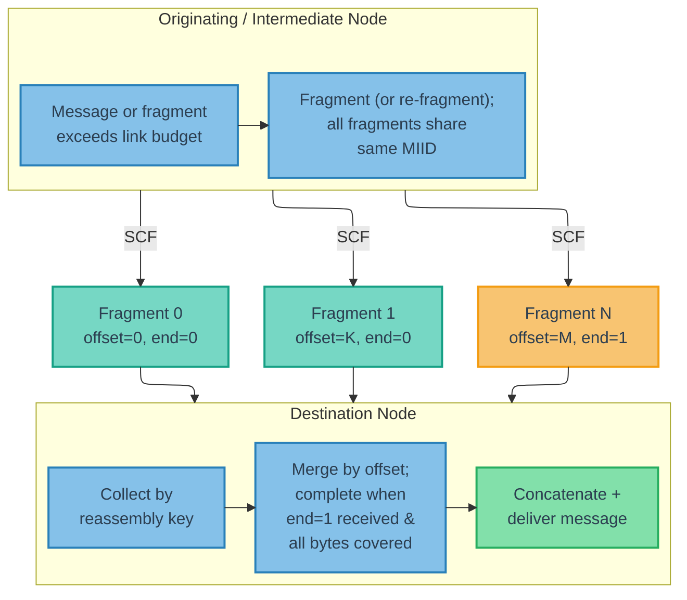

**Figure 5 — Fragmentation and Reassembly Pipeline**

### 8.2 Fragment Structure

**[WIRE FORMAT]**

When `IS_FRAGMENT` is set, the fragment fields appear immediately after the flags byte (and before any other optional fields) in the packet header:

```text
+-----------------------------------------------+
| offset (15b)                    | end (1b)    |
+-----------------------------------------------+
| fragment_payload (payload_length bytes)        |
+-----------------------------------------------+
```

- **`offset`** (15 bits): Byte offset into the original (unfragmented) ciphertext payload where this fragment's data begins. The first fragment has `offset = 0`.
- **`end`** (1 bit): `1` if this is the final fragment; `0` otherwise.
- **`fragment_payload`**: The portion of the original message payload carried by this fragment. The `payload_length` field in the packet header reflects the size of the fragment payload, not the total message size.

All fragments of a message carry the same `message_type_id`, `source`, `timestamp_24h`, and `msg_counter` as the original message. Consequently, all fragments share the same MIID.

### 8.3 Fragmentation Behavior

**[BEHAVIORAL]**

#### 8.3.1 Transmission-Time Decision

The message store holds complete messages; fragmentation occurs during transmission building ([Section 9.7](#97-link-opportunities-and-transmission-building)) when the serialized packet exceeds the available payload budget. The unfragmented message remains in the store for forwarding on other modalities.

#### 8.3.2 Who May Fragment

Any node — originator or intermediate — MAY fragment a complete unfragmented message when the available link budget is insufficient for the complete packet. This is essential for multi-modal operation: a message received unfragmented on a high-bandwidth link (e.g., LAN) can be forwarded as fragments on a constrained link (e.g., acoustic).

Any node MAY also **re-fragment** a received fragment into smaller fragments when the fragment exceeds the payload budget of an outgoing link. Each sub-fragment's `offset` is computed as the original fragment's `offset` plus the sub-fragment's starting position within the original fragment's payload. The `end` flag is set to `1` only on the sub-fragment that includes the final byte of the original fragment, and only if the original fragment had `end = 1`; all other sub-fragments have `end = 0`.

#### 8.3.3 Fragment Identity

All fragments — whether produced by the originating node or by intermediate nodes during re-fragmentation — share the original message's header fields and MIID ([Section 8.2](#82-fragment-structure)). Each fragment's `offset` is set to its starting byte position within the original ciphertext payload.

#### 8.3.4 Independent Forwarding

Intermediate nodes MUST forward fragments individually as they are received. Nodes MUST NOT suppress or delay forwarding of a fragment because other fragments of the same message have not yet been received.

#### 8.3.5 Encryption Interaction

When `AUTH_TAG_SIZE == 00`, fragmenting or re-fragmenting encrypted payloads requires no cryptographic operations — the ciphertext is split as opaque bytes (AES-CTR ciphertext can be split at arbitrary byte boundaries).

When `AUTH_TAG_SIZE != 00`, per-fragment authentication tags must be computed for each new fragment, which requires access to the PSK. Consequently, only nodes that possess the PSK MAY fragment or re-fragment authenticated messages. Nodes without the PSK (e.g., infrastructure relays) MUST NOT fragment or re-fragment authenticated messages — if the message or fragment exceeds the link budget, it is skipped for that link.

See [Section 12.2.4](#1224-transport-pipeline) and [Section 12.2.5](#1225-fragmentation-interaction) for the full encrypt-then-fragment pipeline and per-fragment authentication tag computation.

### 8.4 Reassembly

**[BEHAVIORAL]**

Reassembly for delivery is performed at the destination node for Request/Response packets (or at every node hosting a CA in the destination list for group Requests), or at every receiving node for Status and Event packets:

1. Collect all fragments with the same reassembly key: `(MIID, message_type_id)` for Status/Event/Request fragments, or `(request_MIID, message_type_id, source_CA)` for Response fragments.
2. Track received byte ranges: for each fragment, record `[offset, offset + payload_length)`.
3. Reassembly is complete when a fragment with `end = 1` has been received AND all bytes from offset 0 through `last_fragment_offset + last_fragment_payload_length` are covered. Total message size = final fragment's `offset` + final fragment's `payload_length`.
4. Place each fragment's payload at its byte offset to reconstruct the original message payload.

The reassembly key groups all fragments of the same message into a single reassembly buffer and keys the received byte-range set used for fragment forwarding suppression ([Section 6.5](#65-deduplication-rules)).

> **Design rationale:** When a broadcast or multicast Request elicits fragmented Responses from multiple nodes, all Responses share the same `request_MIID`. Without `source_CA` in the reassembly key, fragments from different responders would collide in the same reassembly buffer, producing corrupted payloads. Including `source_CA` keeps the reassembly key consistent with the Response deduplication key defined in [Section 6.5](#65-deduplication-rules).

Implementations SHOULD buffer out-of-order and overlapping fragments until all byte ranges are covered or the message's TTL expires. Overlapping fragments (from different nodes using different fragment sizes) carry identical ciphertext at the same byte positions and can be safely merged.

**Opportunistic intermediate reassembly.** Intermediate nodes MAY opportunistically reassemble fragments into a complete message for local storage. A reassembled message is stored as an unfragmented message and is available for future transmission opportunities on any link. Opportunistic reassembly is not required for correct forwarding — fragments are always forwarded individually as they arrive per [Section 8.3.4](#834-independent-forwarding).

#### 8.4.1 Cross-Form Deduplication

Because nodes may fragment unfragmented messages (see [Section 8.3](#83-fragmentation-behavior)), the same message may exist in the network in both unfragmented and fragmented form simultaneously. Cross-form deduplication is handled by message-level deduplication ([Section 6.5](#65-deduplication-rules)) and received byte-range tracking ([Section 8.4](#84-reassembly)).

Nodes performing delivery reassembly (destination nodes for directed traffic, and every receiving node for Status/Event traffic) MUST apply both mechanisms to prevent double delivery:

- When a complete unfragmented message is received and delivered, the node MUST record the base deduplication key as delivered — `(MIID, message_type_id)` for Status/Event/Request packets, or `(request_MIID, message_type_id, source_CA)` for Response packets. The node MUST mark the received byte-range set for the corresponding reassembly key as fully covered. Subsequent fragments for that reassembly key are therefore redundant and MUST be discarded. If a reassembly buffer exists for the same reassembly key, the node SHOULD discard it.
- When reassembly completes from fragments and the message is delivered, the node MUST record the base deduplication key as delivered. A subsequently received unfragmented copy with the same deduplication key MUST be treated as a duplicate and MUST NOT be re-delivered.

Intermediate forwarding nodes that hold a complete unfragmented message in their store MAY suppress forwarding of received fragments for the same reassembly key, since they can serve the same forwarding purpose by fragmenting the stored message on demand.

#### 8.4.2 Status Reassembly Supersession

Status messages have supersession semantics: the transport layer maintains only the latest value per `(source CA, message_type_id, status_key)` variant ([Section 9.3.3](#933-status-coalescing)). This supersession MUST extend to reassembly buffers. These supersession rules are Status-only.

When a node receives a Status message (fragmented or unfragmented) for a variant `(source CA, message_type_id, status_key)` that is newer than a partially-reassembled Status message for the same variant, the node MUST discard the older reassembly buffer. "Newer" is determined by MIID: if the newly received Status has a different MIID than the in-progress reassembly buffer, the buffer's contents are stale and MUST be discarded.

#### 8.4.3 Event Reassembly Behavior

Event messages are retained and forwarded per message instance. Unlike Status, Event reassembly buffers MUST NOT be superseded by newer same-type Event traffic. A node receiving a newer Event (different MIID) while an older Event reassembly is in progress MUST keep both as independent messages, subject to normal deduplication and TTL expiration.

### 8.5 Fragment NACKs (Network Control Type 32,003)

**[BEHAVIORAL + GUIDANCE]**

Any node MAY send a Fragment NACK message to request retransmission of missing byte ranges for a fragmented message. Fragment NACKs use the Network Control message type `32,003`.

Fragment NACK payload:

```text
+-----------------------------------------------+
| flags                    (u8)                 |
|   bit 0: RESPONSE_FRAGMENT                    |
+-----------------------------------------------+
| original_miid            (32b or 40b)         |
+-----------------------------------------------+
| original_message_type_id (CTE: 8b or 16b)    |
+-----------------------------------------------+
| original_source_ca       (8b or 16b)          |
|   [present only if RESPONSE_FRAGMENT is set]  |
+-----------------------------------------------+
| missing_range_count      (u8)                 |
+-----------------------------------------------+
| missing_start[0]         (16b)                |
| missing_length[0]        (16b)                |
| missing_start[1]         (16b)                |
| missing_length[1]        (16b)                |
| ...                                           |
+-----------------------------------------------+
```

- **`flags`** (u8): Bit 0 (`RESPONSE_FRAGMENT`, value `0x01`): when set, the NACK targets a Response fragment stream and the `original_source_ca` field is present. All other bits are reserved and MUST be set to 0.
- **`original_miid`**: The MIID of the fragmented message (32 bits in 8-bit addressing mode, 40 bits in 16-bit addressing mode). For Response fragments, this is the `request_MIID`.
- **`original_message_type_id`**: The Message Type ID of the fragmented message (CTE-encoded).
- **`original_source_ca`**: The Client Address of the responder whose fragment stream contains the missing fragments (8 bits for 8-bit addressing mode, 16 bits for 16-bit addressing mode). Present only when the `RESPONSE_FRAGMENT` flag (bit 0) is set.
- **`missing_range_count`** (u8): The number of missing byte ranges (0 - 255).
- **`missing_start`** (16 bits each): Starting byte offset of a missing range within the original ciphertext payload.
- **`missing_length`** (16 bits each): Length in bytes of the missing range.

> **Note:** The `RESPONSE_FRAGMENT` flag allows parsers to determine the NACK layout from the `flags` byte alone, without needing to inspect `original_message_type_id` to infer whether the target is a Response.

> **Design rationale:** Byte-range NACKs align naturally with the offset-based fragment model: the requester reports gaps in its byte coverage map without needing to know how the sender originally fragmented the message. The number of contiguous gaps is typically small (often 1–3 ranges even when many individual fragments are missing), so byte-range encoding is usually more compact than enumerating missing fragments individually. Any node receiving a byte-range NACK can retransmit using its own fragment sizes to cover the requested ranges.

Fragment NACKs SHOULD be rate-limited to avoid excessive retransmission requests over constrained links.

> [GUIDANCE] Intermediate nodes SHOULD only send Fragment NACKs when they have a reasonable expectation of completing reassembly (e.g., most fragments already received) and the link has sufficient budget for both the NACK and the expected retransmissions. On severely constrained links (e.g., acoustic), Fragment NACKs MAY be disabled entirely — the store-carry-forward model provides natural redundancy through multiple peers and paths. Fragment NACKs are most useful on higher-bandwidth links (LAN, radio) where retransmission cost is low.

---

## 9. Transport Behavior

**[BEHAVIORAL + GUIDANCE]**

### 9.1 Store-Carry-Forward Model

**[BEHAVIORAL]**

Each node maintains a local message store containing packets awaiting delivery or forwarding. Forwarding decisions are made locally and opportunistically based on available link opportunities. No global routing table or topology awareness is required.

The store-carry-forward cycle at each node:

1. **Receive**: Unpack incoming transmissions, apply message-level deduplication and fragment byte-range coverage checks, deliver to local clients, store packets for forwarding.
2. **Store**: Maintain packets in the message store until delivered, forwarded, or expired.
3. **Forward**: When a data link reports a transmission opportunity, select eligible packets, build a transmission, and send.

### 9.2 Per-Node Message Store

**[BEHAVIORAL]**

Each node MUST maintain a message store (or equivalent data structure) that tracks, at minimum, the following metadata per packet:

- MIID and `message_type_id`.
- Source address and (where present) destination header addresses (CA for application packets, NA for NC packets). For group Requests, the destination includes the full CA list (`destination` field + `additional_dest[]`).
- Effective TTL and creation timestamp.
- Effective priority (default or overridden).
- Effective modality mask (default or overridden).
- Per-modality last-sent time and send count.
- Whether the packet originated from a locally hosted client ("internal") or was received from the network ("external").
- Per-MIID forwarding history (which neighbors have already received this packet).
- Per-reassembly-key received byte-range coverage for fragmented messages (`[offset, offset + payload_length)`), used for both reassembly completion and fragment forwarding suppression.

Forwarding history entries MUST be retained for the lifetime of the associated MIID in the message store — that is, until the packet expires (TTL) or is purged. When the MIID entry is purged, its forwarding history is purged with it. Implementations SHOULD track forwarding history using a compact representation (e.g., a bitmask or small set of Node Addresses) rather than an unbounded list.

For Status messages, the store MUST additionally track:

- The latest value per `(source CA, message_type_id, status_key)` variant. Newer Status messages MUST supersede older ones for the same variant.
- Per-modality last-sent time for each Status variant.

For Event messages, the store MUST additionally track:

- Independent per-message instances (no supersession by newer same-type Events).
- Per-modality last-sent time and send count per Event message instance.

For cached Responses, the store SHOULD additionally track:

- Per-modality count of how many times the matching Request MIID has been observed after the Response was cached.

Figure 6 illustrates the per-packet lifecycle within the message store, showing the states a packet traverses from initial receipt (or local submission) through deduplication, storage, scheduling, transmission, and terminal disposition.

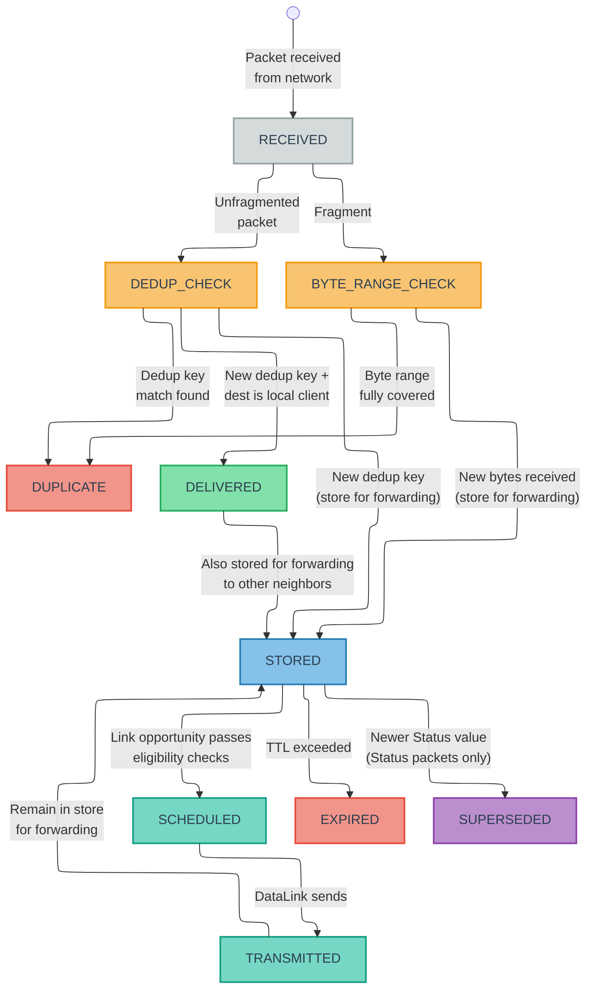

**Figure 6a — Inbound Message Lifecycle (received from network)**

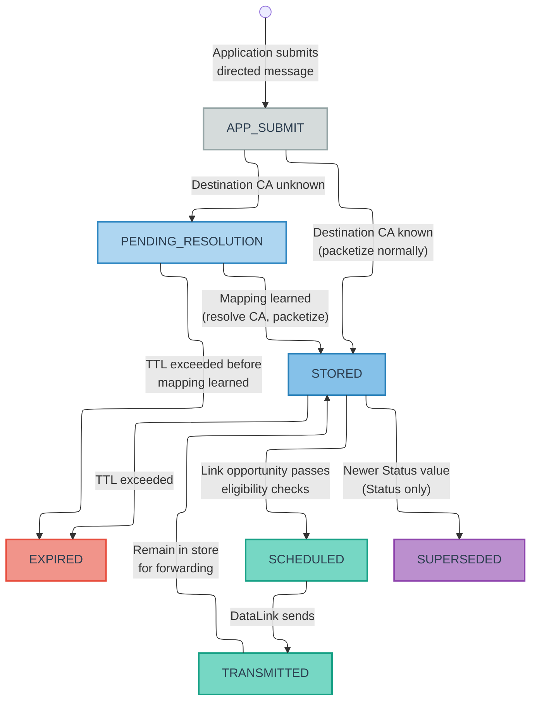

**Figure 6b — Outbound Message Lifecycle (submitted by local application)**

Figures 6a–6b show the message lifecycle within the per-node message store. Figure 6a shows the inbound path for packets received from the network. Figure 6b shows the outbound path for directed messages submitted by a local application client, including the pending-address-resolution state for destinations with unknown CA mappings. Both paths converge at STORED, from which the forwarding cycle (STORED → SCHEDULED → TRANSMITTED → STORED) is identical.

As shown in Figure 6a, unfragmented packets that pass message-level deduplication and fragments that contribute new byte ranges enter the STORED state, from which they cycle through SCHEDULED → TRANSMITTED → STORED as link opportunities arise. Forwarding history is updated on each TRANSMITTED transition, tracking which neighbors have already received the packet. Packets addressed to a local client are both DELIVERED to the client and STORED for forwarding to other neighbors — these are not mutually exclusive outcomes. Terminal states (EXPIRED, DUPLICATE, SUPERSEDED) remove packets from the active store. Status coalescing (the SUPERSEDED transition) occurs when a newer Status value arrives for the same `(source_CA, message_type_id, status_key)` variant, as specified in [Section 9.3.3](#933-status-coalescing).

#### 9.2.1 Pending Address Resolution (Outbound)

When the transport layer accepts a directed message (Request or Response) from a local application client, the destination ClientUID must be resolved to a Client Address before the message can be packetized and scheduled. If the destination ClientUID is not in the local address mapping table (see [Section 11.9.3](#1193-address-mapping-state)), the message enters a **pending address resolution** state (the `APP_SUBMIT → PENDING_RESOLUTION` path in Figure 6b):

- The message is accepted from the application (not rejected or errored).
- The message is stored in the message store with its TTL ticking normally.
- The message is NOT eligible for packetization, scheduling, or transmission — it does not enter the STORED state until the destination CA is resolved.
- The transport SHOULD emit an NC_CLIENT_ADDRESS_RESOLVE_QUERY ([Section 11.7.15](#11715-nc_client_address_resolve_query-32017)) to actively seek the mapping.
- When the mapping is learned (from any NC source — NC_NODE_SUMMARY, NC_CLIENT_ADDRESS_RESOLVE_ANSWER, NC_NETWORK_STATE_RESPONSE, NC_CLIENT_ADDRESS_CLAIM — or from locally persisted state), the transport resolves the destination CA and transitions the message to normal scheduling eligibility (STORED state).
- If the TTL expires before the mapping is learned, the message expires normally — the same expiration rules apply as for any other message in the store.

> **Note:** For group Requests where one or more destination ClientUIDs have no known CA mapping, the **entire group Request** enters pending-address-resolution state. The transport MUST NOT send a partial group to the resolved subset. TTL ticks normally, consistent with single-destination behavior. When all destination CA mappings are learned, the group Request transitions to normal scheduling eligibility.

#### 9.2.2 Source Identity Resolution (Inbound)

When a node delivers a received message to a local application client, the transport provides the source **ClientUID** resolved from the source CA via the address mapping table. If the source CA has no known identity mapping, the node SHOULD emit an NC_CLIENT_UID_QUERY ([Section 11.7.6](#1176-nc_client_uid_query-32015)) for the unknown source CA, subject to query coalescing (the node MUST NOT emit a duplicate query if one for the same CA is already outstanding and has not expired). The message SHOULD still be delivered to the application with the source identity marked as unresolved.

### 9.3 Resend Behavior

#### 9.3.1 Request Resend

Requests MAY be retransmitted multiple times on each modality to improve robustness in lossy or intermittent environments. The effective resend frequency for a given `(Request MIID, modality)` SHOULD:

- Start aggressively (transmit as soon as possible on the first opportunity).
- Back off approximately exponentially with the number of prior transmissions on that modality.
- Respect any per-modality minimum send interval configuration.

Requests MUST NOT be retransmitted after their effective TTL has expired.

**Response-based resend stop condition.** The originating node SHOULD cease resending a Request when matching Responses indicate that the Request has been received by its intended destination(s):

- **Unicast Requests:** The originator SHOULD cease resend when a Response matching the Request MIID is received from the destination CA.
- **Group Requests (`ADDITIONAL_DEST_PRESENT` set):** The originator SHOULD cease resend when matching Responses have been received from all CAs in the destination list. The originator tracks which destination CAs have responded by matching incoming Responses (via `request_MIID` and `source_CA`) against the destination list.

In both cases, the originator MUST stop resending at TTL expiry regardless of Response status. The Response-based stop condition is an optimization that reduces unnecessary retransmissions; a Request that does not elicit Responses (e.g., a fire-and-forget command) continues resending per the exponential backoff schedule until the backoff limit is reached or TTL expires.

#### 9.3.2 Response Caching and Resend

The transport layer MUST NOT accept more than one Response per `(request_MIID, message_type_id, source_CA)` from a local client. If a client submits a Response and the transport has already accepted a Response with the same `(request_MIID, message_type_id, source_CA)` key, the transport MUST reject the submission with an error and MUST NOT encrypt or transmit it (see [Section 6.5](#65-deduplication-rules) for rationale). If a client receives a duplicate of a Request it has already responded to (detected via the Request's MIID), the node's transport layer handles retransmission of the cached Response — the client is not asked to generate a second Response.

Nodes MAY cache Responses keyed by the full dedup key `(request_MIID, message_type_id, source_CA)`. When a group Request addresses multiple CAs hosted on the same node, each local CA may independently submit a Response; the node caches up to one Response per local CA, each tracked independently. For each cached Response and modality `m`, the transport tracks:

- The number of times the Response has been transmitted on `m`.
- The number of times the matching Request MIID has been observed on `m` (total observations on that modality since the Response was cached).

On a given modality `m`, a cached Response SHOULD be transmitted at most `max(1, n)` times, where `n` is the number of times the matching Request MIID has been observed on `m`. This ensures:

- Responses are sent at least once per DataLink adapter instance.
- Responses do not "overshoot" the number of observed Requests.

Once this budget is exhausted or the Response's TTL expires, further observations of the same Request MIID on that modality SHOULD NOT trigger additional Response transmissions.

#### 9.3.3 Status Coalescing

The transport layer MUST maintain only the latest Status per `(source CA, message_type_id, status_key)` variant; newer Status messages supersede older ones.

Status coalescing is Status-only. Implementations MUST NOT apply Status supersession rules to Event, Request, or Response packets.

For each modality, the scheduler tracks when the latest Status for a given variant was last transmitted. The effective scheduling priority for Status messages MAY depend on:

- The message type's base priority.
- Time since that Status variant was last sent on the modality (variants that have not been sent recently SHOULD receive a scheduling boost, capped by implementation).

On rate-limited modalities, this promotes rotation across Status variants while still favoring high-priority Status types. On high-throughput modalities, implementations MAY simplify to sending each new Status value at most once per update.

#### 9.3.4 Event Resend

Event messages MAY be retransmitted on each modality to improve robustness in lossy or intermittent environments, using the same general eligibility style as Status (TTL-valid, modality-allowed, and send-interval/backoff policy as configured by the implementation).

Unlike Status, Event resend scheduling is per message instance: each retained Event is an independent resend candidate until expiration. Nodes MUST NOT coalesce or supersede Event messages during resend scheduling.

### 9.4 Priority and Scheduling

**[GUIDANCE]**

**Base priority.** Every Message Type ID has a configured default priority value (`0` - `255`, higher values indicate higher priority; see [Section 2.4.3](#243-recommended-configuration-should)). The `priority_override` field, when present, replaces the default priority for that individual packet. Only the relative ordering (higher value = higher priority) is normative.

**Two-stage scheduling model.** Implementations SHOULD schedule in two stages:

1. **Eligibility (gating):** determine whether a packet is eligible to send on the current modality and time, including TTL/expiration checks, forwarding-history rules, modality mask checks, Request resend backoff, Response resend budget, Event resend rules, and Status coalescing rules.
2. **Ordering (ranking):** rank eligible packets by effective priority for selection/packing.

**Class bias defaults.** Implementations SHOULD apply class-aware bias so the default behavior favors:

1. **Network Control** — highest default bias.
2. **Request** — above Response, Event, and Status.
3. **Response** — above Event and Status.
4. **Event** — above Status.
5. **Status** — lowest default bias.

Class bias is advisory and implementation-defined (for example: weights, offsets, tie-breakers, or queue ordering). It is **not** an absolute preemption rule. A sufficiently high-priority packet in any class MAY outrank a lower-priority packet in another class.

**Retransmission interaction.** Request backoff, Response resend-budget, Event per-instance resend, and Status coalescing rules are part of eligibility, not class precedence. Backoff limits *when* a Request can be resent; resend budgets limit *how many times* a Response can be sent per modality; Event resend rules keep each retained Event as an independent candidate until expiry. Once packets are eligible, they compete using effective priority.

**Internal vs. external bias.** Internal traffic comprises packets whose `source` CA is assigned to a client hosted on the local node (originated locally). External traffic comprises packets first observed from the network (received from another node). Implementations SHOULD prefer internal traffic over external traffic when effective priority is otherwise similar.

**Future class compatibility.** If additional application classes are introduced in future revisions, they SHOULD integrate through the same mechanism: default per-type priorities plus optional class bias, without introducing strict cross-class barriers.

### 9.5 Modality Classification

**[GUIDANCE]**

M4P distinguishes between two classes of modalities for scheduling purposes. The classification of each modality is deployment-specific.

**Rate-limited / capacity-constrained modalities.** Examples: acoustic links, satellite links with strict airtime budgets. Characteristics: transmission opportunities are infrequent (seconds to tens of seconds between opportunities), and each transmission has a small payload limit. Scheduling approach: Full effective-priority scoring — incorporating class-bias weighting, resend-state gating (Request backoff, Response budget, Event resend, Status coalescing/staleness), and origin bias — with capacity-constrained packing to maximize the value of each scarce transmission opportunity.

**High-throughput / effectively-unlimited modalities.** Examples: LAN, IP/MQTT, many short-range radio configurations. Characteristics: transmission opportunities occur at high rates, and per-transmission payload limits are large or effectively absent for M4P's purposes. Scheduling approach: Simplified binary-eligibility scheduling where packets that pass gating checks (modality mask, resend rules, forwarding history) are included in the transmission, up to an implementation-defined per-transmission packet cap.

### 9.6 Scheduling Modes

**[GUIDANCE]**

**Rate-limited scheduling.** For rate-limited or capacity-constrained modalities, nodes SHOULD:

1. Discard expired packets.
2. Gather eligible packets for the modality based on: modality mask, forwarding history and one-hop semantics, and per-modality resend rules (Request backoff, Response budget, Event resend, Status coalescing).
3. Compute an effective priority for each candidate that respects class bias defaults and base priority (or override), and MAY factor in age, internal/external origin, Event age, Status variant staleness, Request ingress recency (early-hop spread urgency for Request packets only), and dispersion-aware bridge scoring ([Section 9.10](#910-dispersion-aware-scheduling-mesh-modalities)).
4. Sort candidates by effective priority (highest first).
5. Greedily pack packets into the Transmission up to the available capacity, selecting the highest effective-priority packet that fits in the remaining capacity at each step.
6. After sending, update per-modality state (send counts, last-sent timestamps, forwarding history).

**High-throughput scheduling.** For high-throughput modalities, nodes MAY use a simplified scheduling approach:

1. Discard expired packets.
2. Build the candidate set for the modality and apply gating checks (modality mask, forwarding-history/rebroadcast rules, Request backoff, Response resend budget, Event resend, and Status coalescing eligibility).
3. Order eligible candidates primarily by effective priority; implementations MAY use lightweight class/origin bucketing as an approximation if it preserves the intended behavior that high-priority packets can outrank lower-priority packets across classes.
4. Include candidates up to an implementation-defined per-transmission packet cap.

Because high-throughput links are capacity-rich, implementations MAY use simplified ranking approximations instead of full global sorting, provided priority semantics are preserved.

### 9.7 Link Opportunities and Transmission Building

When a DataLink signals a transmission opportunity with an available payload budget (see [Section 10](#10-datalink-abstraction)), the node builds a Transmission by:

1. Discarding any expired packets from the message store.
2. Identifying candidate packets that are eligible for transmission on the available modality (per modality mask, forwarding history, and resend rules).
3. Selecting and packing packets into the Transmission according to the priority and scheduling rules defined in [Section 9.4](#94-priority-and-scheduling) through [Section 9.6](#96-scheduling-modes). If a candidate packet exceeds the remaining transmission budget but is eligible for fragmentation (see [Section 8.3](#83-fragmentation-behavior)), the node MAY fragment it and pack as many resulting fragments as fit. Fragmentation eligibility depends on the authentication configuration: when `AUTH_TAG_SIZE == 00`, any complete message or received fragment may be fragmented or re-fragmented; when `AUTH_TAG_SIZE != 00`, only nodes possessing the PSK may fragment or re-fragment ([Section 8.3.5](#835-encryption-interaction)). See [Section 9.7.1](#971-fragment-size-selection) for fragment size guidance.
4. Transmitting via the DataLink.
5. Updating per-modality send counts, last-sent timestamps, and forwarding history for all transmitted packets.

Figure 7 illustrates this pipeline as a flow chart, showing the scheduling loop from the DataLink opportunity signal through candidate selection, effective-priority scoring, capacity-constrained packing, and handoff to the DataLink.

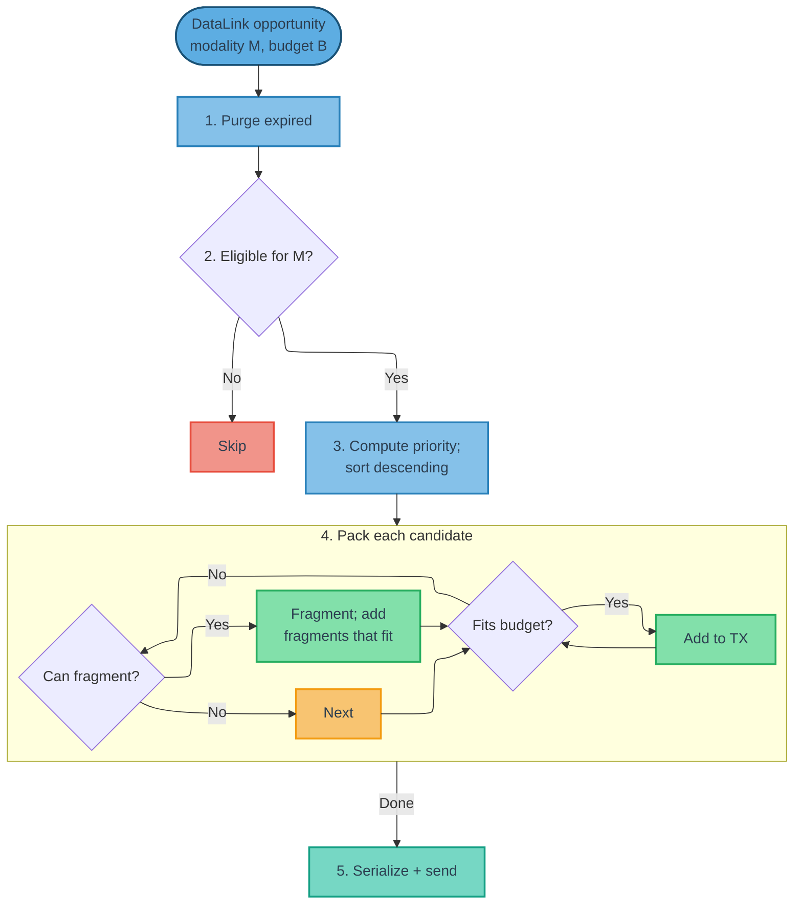

**Figure 7 — Transmission Building Pipeline**

#### 9.7.1 Fragment Size Selection

**[GUIDANCE]**

When fragmentation is required during transmission building, the node SHOULD fragment to the remaining transmission budget minus per-fragment header overhead (2 bytes for the `offset`/`end` fields). This maximizes fragment payload size, minimizing total fragment count and reassembly latency at the destination.

Each node fragments to its own outgoing link's budget. Downstream nodes re-fragment as needed ([Section 8.3.2](#832-who-may-fragment)). There is no requirement to anticipate downstream link constraints.

Implementations MAY use smaller fragment sizes to improve transmission packing density (e.g., reserving budget for additional lower-priority packets), but SHOULD NOT fragment below a deployment-configured minimum fragment payload size.

> **Design rationale:** Fragment sends interact with priority scoring and staleness tracking in non-trivial ways. A partially-transmitted message has no application value until reassembly completes, which argues for prioritizing fragment completion. However, on constrained links, monopolizing consecutive transmission opportunities for one message reduces information diversity across the network. The balance between fragment completion priority and message diversity is deployment-dependent and left to implementations.

#### 9.7.2 Worked Example: Mixed-Origin Transmission Packing

The message store is a **unified pool** containing all packets awaiting delivery or forwarding, regardless of origin or class. Locally-originated packets (from hosted clients) and externally-received packets (forwarded on behalf of other nodes) reside in the same store and compete for space in each transmission through the same scheduling pipeline, subject to priority ordering (including the internal-over-external bias defined in [Section 9.4](#94-priority-and-scheduling)). The scheduler does not maintain separate queues for local vs. forwarded traffic — it treats the store as a single priority-ordered pool that feeds each transmission opportunity.

The following example illustrates how the transmission building pipeline ([Section 9.7](#97-link-opportunities-and-transmission-building) steps 1–5) selects and packs packets from this unified message store into a single transmission on a rate-limited acoustic link.

**Scenario.** Node A hosts two clients (`veh-a.nav` at CA 12, `veh-a.backseat` at CA 13) and has an acoustic DataLink (mesh modality, 64-byte payload budget). Node A's message store contains:

| # | Packet | Class | Source | Origin | Serialized Size | Effective Priority |
|---|--------------------------|-------------|-------------|----------------|---------------|------------------|
| 1 | NC_NODE_SUMMARY | Network Control | Node A (NA 5) | Internal | 18 B | Highest default class bias |
| 2 | Emergency Stop (type 10,001) | Request | CA 99 → CA 13 | External (forwarded) | 14 B | Priority 240 (Request) |
| 3 | Leak Alarm Event (type 8,120) | Event | CA 77 | External (forwarded) | 10 B | Priority 190 (Event) |
| 4 | Navigation Status (type 100) | Status | CA 12 | Internal | 22 B | Priority 128 (Status) |
| 5 | Health Status (type 200) | Status | CA 45 | External (forwarded) | 16 B | Priority 80 (Status) |
| 6 | Sensor Telemetry (type 300) | Status | CA 13 | Internal | 30 B | Priority 64 (Status) |

**Transmission building.** The acoustic DataLink signals a transmission opportunity with a 64-byte budget. The scheduler executes:

1. **Purge expired:** All packets are within TTL. No packets removed.
2. **Filter eligible:** All six packets pass modality mask and resend checks for acoustic.
3. **Priority sort:** Sorted by effective priority with class bias and other tie-breakers:
   - Packet 1: NC (highest default class bias)
   - Packet 2: Request (priority 240)
   - Packet 3: Event (priority 190)
   - Packet 4: Status (priority 128, internal)
   - Packet 5: Status (priority 80, external)
   - Packet 6: Status (priority 64, internal — but lower base priority than Packet 5)
4. **Pack** (64-byte budget):
   - Packet 1 (18 B): fits → add. Remaining: 46 B.
   - Packet 2 (14 B): fits → add. Remaining: 32 B.
   - Packet 3 (10 B): fits → add. Remaining: 22 B.
   - Packet 4 (22 B): fits → add. Remaining: 0 B.
   - Packet 5 (16 B): does not fit (budget exhausted) → skip.
   - Packet 6 (30 B): does not fit (budget exhausted) → skip.
5. **Transmit:** The resulting transmission contains 4 packets totaling 64 bytes — an NC message, a forwarded Request, a forwarded Event, and a locally-originated Status — packed into a single 64-byte acoustic send.

#### 9.7.3 Worked Example: Fragmentation During Packing

The following example extends the transmission building pipeline to illustrate fragmentation decisions on a constrained link.

**Scenario.** Node B has an acoustic DataLink (mesh modality, 64-byte payload budget). Its message store contains:

| # | Packet | Class | Serialized Size | Effective Priority |
|---|--------|-------|-----------------|--------------------|
| 1 | NC_NODE_SUMMARY | Network Control | 18 B | Highest default class bias |
| 2 | Sensor Report (type 400) | Status | 90 B | Priority 128 (Status) |
| 3 | Health Status (type 200) | Status | 14 B | Priority 80 (Status) |

**Transmission building** (64-byte budget):

1. **Purge expired:** All packets are within TTL.
2. **Filter eligible:** All three packets pass modality mask and resend checks.
3. **Priority sort:** Packet 1 (NC, highest default class bias), then Packet 2 (Status, priority 128), then Packet 3 (Status, priority 80).
4. **Pack:**
   - Packet 1 (18 B): fits → add. Remaining: 46 B.
   - Packet 2 (90 B): does not fit (90 > 46). Eligible for fragmentation → fragment to remaining budget. Fragment 0: `offset=0`, 44 B payload (46 B budget − 2 B fragment header), `end=0` → add. Remaining: 0 B.
   - Packet 3 (14 B): does not fit (budget exhausted) → skip.
5. **Transmit:** The transmission contains 2 packets totaling 64 bytes: one NC message and one fragment of the Sensor Report.

The unfragmented Sensor Report (90 B) remains in the message store. On the next transmission opportunity, the remaining bytes (`offset=44`, 46 B payload, `end=1`) can be sent — along with Packet 3 if budget permits. An implementation that prioritizes fragment completion MAY boost the remaining fragment's effective priority to accelerate reassembly at the destination.

### 9.8 Forwarding Semantics

**[BEHAVIORAL]**

#### 9.8.1 Broadcast Semantics

The destination value `0` denotes broadcast. Broadcast is used for Network Control traffic and for Status and Event messages. Requests and Responses use directed (unicast or group) addressing; broadcast is not applicable to request/response exchanges.

Broadcast packets MUST obey TTL expiration and MIID deduplication. Nodes SHOULD forward each broadcast MIID at most once per DataLink adapter instance and MUST respect one-hop semantics when `ttl_override = 0`.

Broadcast forwarding policy MAY depend on modality, link cost, and local constraints. Implementations SHOULD keep TTLs short for broadcast packets on constrained links.

#### 9.8.2 Infrastructure and Mesh Modality Forwarding
The transport applies different forwarding policies to infrastructure and mesh modalities based on their delivery characteristics (defined in [Section 2.6](#26-core-concepts-and-terminology)).

**Infrastructure modalities.** [BEHAVIORAL] Nodes MUST NOT rebroadcast a packet on the same infrastructure link from which it was received. All peers on that link already received the original transmission; rebroadcasting produces redundant traffic that scales as O(N²) across all nodes on the link. For Status messages, each new value SHOULD be sent at most once per infrastructure modality until superseded by a newer value or expired. Event messages are retained and scheduled per message instance until expired.

**Mesh modalities.** [BEHAVIORAL] Nodes MAY rebroadcast packets received on mesh modalities, subject to TTL, one-hop semantics (when `ttl_override = 0`), forwarding history, and MIID deduplication. Mesh rebroadcasting extends the reach of packets beyond the originator's direct range. All per-modality statistics (last-sent time, send count, Response resend budget) are local to the node.

**Cross-modality forwarding.** Packets received on any modality SHOULD be forwarded on other modalities (both infrastructure and mesh) subject to normal TTL, deduplication, and modality mask constraints. The value of store-carry-forward is moving packets *across* modalities — a message received acoustically while submerged may be forwarded over LAN when the vehicle surfaces.

### 9.9 Error Handling

#### 9.9.1 Malformed Packets

Nodes MUST silently discard packets that cannot be parsed due to:
- Invalid or truncated CTE encoding.
- `payload_length` exceeding the remaining bytes in the Transmission.
- Truncated headers (insufficient bytes for the indicated packet class).
- `message_type_id` values that fall outside any defined range (see [Section 4.1](#41-message-type-id-ranges)).

Malformed packets MUST NOT be forwarded.

#### 9.9.2 Unknown Flag Bits

Status, Event, Request, and Response flag layouts are defined in [Section 5.7](#57-flags-and-optional-fields). Event bit 4 is reserved in this protocol version and MUST be zero. A received packet with non-zero reserved bits or any flag bit combination not defined by this specification indicates a protocol version mismatch or future extension; the node SHOULD forward the packet via store-carry-forward (preserving it for nodes that may understand it) but MUST NOT attempt to parse optional fields or payload, as the header layout may differ from what this version expects. See [Section 9.9.3](#993-protocol-version-compatibility) for version compatibility requirements.

#### 9.9.3 Protocol Version Compatibility

All nodes in a deployment MUST run the same M4P protocol version. The M4P transport layer does not include a protocol version field in packet headers or transmission metadata (see [Section 2.5](#25-design-constraints-and-deliberate-tradeoffs) for rationale). Version compatibility is ensured through deployment configuration. Interoperability between different protocol versions is outside the scope of this specification.

The following protocol-intrinsic properties enforce version-lock — a change to any of these requires fleet-wide coordinated upgrade:

- **Header field layout.** A version mismatch causes silent misalignment of address, timestamp, and control fields.
- **Addressing mode.** Mixed-mode nodes cannot parse each other's packets (see [Section 2.4.1](#241-addressing-mode-configuration)).
- **Address derivation algorithm.** The hash function and PRIME_STEP constant ([Section 11.1](#111-address-derivation-and-versioning)) are fixed per version.
- **CTE encoding.** The Compact Type Encoding scheme ([Section 4.2](#42-compact-type-encoding-cte)) reserves values 32,768+ for future extended encoding that current parsers cannot decode.
- **Cryptographic primitives.** The payload cipher (AES-256-CTR) and authentication (AES-CMAC) are fixed per version.

### 9.10 Dispersion-Aware Scheduling (Mesh Modalities)

**[GUIDANCE — EXPERIMENTAL]**

> **EXPERIMENTAL** — Dispersion-aware scheduling is an optional optimization for constrained mesh links. It is not required for interoperability and is expected to evolve with implementation experience.

Traditional network protocols optimize for routing: "what is the best path for this packet to reach its destination?" Because M4P operates without global routing tables or topology knowledge, that question has no answer. On rate-limited mesh modalities (acoustic links in particular), the relevant question becomes: "given this one scarce transmission opportunity, what is the most valuable thing I can send to add the most new information to my local neighborhood of the network?" Nodes MAY apply dispersion-aware scoring to answer this question — estimating which messages nearby peers have already received, prioritizing packets they are least likely to have seen, and reducing redundant rebroadcasts while preserving robust multi-hop propagation. These estimates can be informed by application-layer context such as estimated peer positions and data-link evidence such as SNR or signal strength.

The model is conceptual:

1. Estimate link reachability between peers using local evidence (and optional context hints).
2. Estimate, per peer and message, the likelihood that the peer has already seen the message.
3. Derive a bridge value that approximates expected new reach if this node transmits the message.
4. Combine bridge value with base scheduling factors (priority, class bias, resend state, size efficiency) when ranking candidates.

Implementations SHOULD use a two-pass packing strategy on constrained links:

1. **Deterministic pass:** greedily pack highest-value eligible candidates.
2. **Safety pass:** apply bounded probabilistic inclusion for non-selected candidates to avoid total suppression under model uncertainty.

The following invariants apply:

- Dispersion-aware scheduling changes scheduler behavior only; it does not change wire formats.
- Nodes that do not implement this optimization remain fully interoperable and continue to use base scheduling rules.
- Network Control traffic remains exempt from dispersion-based suppression.
- TTL expiry and per-modality minimum send intervals remain hard constraints.
- Missing or stale evidence should bias toward relaying more, not less.

When dispersion-aware scheduling is enabled, Request resend backoff MAY be integrated as a continuous scoring/selection decay rather than a binary eligibility gate, provided the base rate-limiting intent of [Section 9.3.1](#931-request-resend) is preserved.

---

## 10. DataLink Abstraction

**[GUIDANCE + BEHAVIORAL]**

The DataLink abstraction defines the boundary between the M4P transport layer and the physical communication layer.

### 10.1 DataLink Interface

**[BEHAVIORAL]**

Each data link modality (acoustic modem, radio, satellite terminal, LAN interface, etc.) is integrated with M4P through a DataLink adapter. The adapter exposes two pieces of information to the transport layer:

1. **Transmission opportunity**: An indication that the link is ready to send data ("I can send now" or "I cannot send now").
2. **Payload budget**: The maximum number of bytes the link can carry in the current transmission opportunity.

The adapter also delivers received transmissions to the transport for processing. The transport registers a callback with each adapter for inbound data delivery.

All modality-specific mechanics — waveform selection, duty-cycle management, MAC protocol behavior, TDMA scheduling, modem command interfaces, and physical-layer configuration — remain encapsulated within the DataLink adapter. The M4P transport layer MUST NOT depend on any modality-specific behavior beyond the transmission opportunity and payload budget interface.

**Boundary asymmetry.** The DataLink abstraction is intentionally asymmetric with respect to fleet-wide topology. The transport does not push fleet membership information — which peers exist on the network, when nodes join or depart, fleet size — down to DataLink adapters. Adaptive data link behaviors that depend on fleet composition (such as TDMA slot allocation and contention window sizing) are deployment-specific and are managed by the application layer (see [Section 10.4](#104-data-link-adaptation)).

**[GUIDANCE] Extended adapter interface.** The two-signal interface (transmission opportunity, payload budget) is the required contract. Adapters MAY additionally provide link quality or congestion metrics that the transport can use for scheduling and priority decisions. Implementations will typically expose richer scheduling metadata (timing constraints, rate characteristics, capability declarations) and may support modality-specific delivery optimizations (such as targeted delivery to a known peer's link-layer address on IP-based modalities). These implementation choices do not affect interoperability — the on-wire format of Transmissions is identical regardless of the adapter's internal interface. An adapter that provides only the required interface is fully conformant; the transport MUST function correctly without extended metadata.

**Non-networking capabilities.** The DataLink abstraction does not prevent applications or adapters from using hardware capabilities that fall outside M4P's networking scope. When a capability is networking-related (e.g., link-quality metrics that inform routing), it SHOULD be integrated into the M4P transport layer so all nodes benefit. When a capability falls outside the networking domain (e.g., USBL positioning from an acoustic modem), the DataLink adapter is free to expose it directly to applications through its own interfaces, independent of M4P.

Figure 8 illustrates the DataLink abstraction boundary with an expanded view of the adapter layer, showing how the M4P transport hands Transmissions to the boundary and how modality-specific adapters implement the connection to physical hardware.

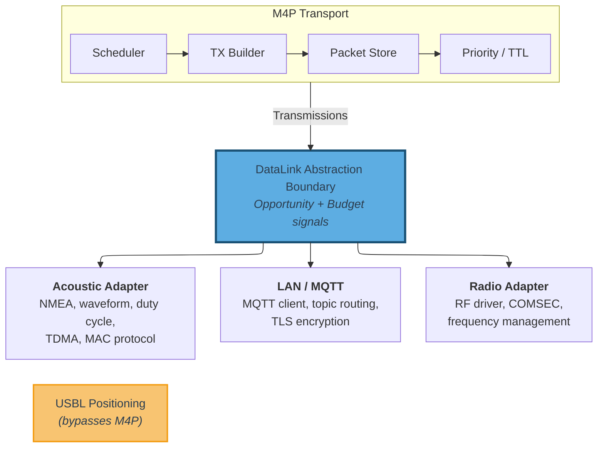

**Figure 8 — DataLink Abstraction Boundary**

### 10.2 Modality Classification

**[BEHAVIORAL]**

Each DataLink adapter MUST declare whether it operates as an infrastructure or mesh modality (see [Section 2.6](#26-core-concepts-and-terminology)). The transport uses this classification to apply the appropriate forwarding policy ([Section 9.8.2](#982-infrastructure-and-mesh-modality-forwarding)). The classification is fixed for the lifetime of the adapter and reflects the link's delivery characteristics, not its physical layer technology.

### 10.3 Transmission Metadata

The canonical Transmission wire format and parsing rules are defined in [Section 5.8](#58-transmission-encoding). The DataLink adapter is responsible for delivering a complete Transmission — including the `node_address_sender` — to the transport layer on receive, and accepting one from the transport on send.

When a DataLink adapter carries the sender NA out-of-band (as permitted by [Section 5.8](#58-transmission-encoding)), both the sending and receiving adapters for that modality MUST use the same convention. The sending adapter omits the `node_address_sender` prefix from the wire payload; the receiving adapter reconstructs it from link-layer metadata and delivers the canonical format to the transport. The transport layer is unaware of this optimization.

Evidence-plane metadata ([Section 10.5](#105-scheduling-inputs)), when provided alongside a received Transmission, is local API data and MUST NOT be forwarded to other nodes. Each node's evidence-plane observations are consumed locally by the transport's scheduling logic.

### 10.4 Data Link Adaptation

Adaptive data link behaviors — such as TDMA slot allocation, contention window sizing, MAC schedule adjustment in response to fleet size changes, and transmission power management — vary significantly across modem hardware, fleet compositions, mission profiles, and operational phases. These behaviors cannot be generalized into a modality-agnostic protocol without coupling the protocol to specific hardware and operational scenarios. They are outside the scope of M4P and are managed by the application or autonomy layer.

The expected integration pattern for deployments that require adaptive data link behavior is:

1. **M4P provides network awareness.** The NC discovery mechanisms (NC_NODE_SUMMARY/NC_CLAIM_RENEWAL, address claims, claim expiration — see [Section 11.9](#119-peer-discovery-and-fleet-membership)) provide the application with current fleet membership: which nodes are present, when new nodes join, and when nodes depart (via claim expiration). Applications access this information through the implementation's peer registry interface.

2. **The application decides.** The application or autonomy layer evaluates the current fleet state alongside operational context that M4P does not possess: mission phase, node roles, positional information, modem capabilities, and deployment-specific scheduling policies. Based on this evaluation, the application determines the appropriate data link configuration.

3. **The application configures the adapter.** The application issues configuration commands to the DataLink adapter through the adapter's modality-specific interface (e.g., modem command protocol, adapter API). The adapter adjusts its behavior accordingly. M4P's transport layer is unaffected — it continues to receive transmission opportunities and payload budgets through the standard interface.

See [Appendix C](#appendix-c-application-integration-guidelines-non-normative) for a concrete TDMA adaptation example.

[GUIDANCE] Common data link adaptation scenarios include:

- **TDMA slot allocation.** When M4P's peer registry indicates a new node has joined (via NC_NODE_SUMMARY), the application MAY reconfigure the acoustic adapter's TDMA schedule to allocate a slot for the new node. When a node's claim expires (indicating departure), the application MAY reclaim the slot. The specific slot assignment algorithm is deployment-specific and depends on the modem's TDMA capabilities.

- **Contention-based MAC tuning.** For modems using contention-based MAC (e.g., CSMA-style protocols), the application MAY adjust contention window parameters based on the number of active peers known to M4P's peer registry. Larger fleets benefit from wider contention windows to reduce collision probability.

- **Pre-provisioned schedules.** Deployments with known fleet composition at launch time (the common case for planned operations — see [Section 11.7.3](#1173-nc_network_state_response-32002) guidance on initial network state provisioning) SHOULD pre-configure data link schedules alongside M4P network parameters. Runtime adaptation then serves as a correction mechanism for unplanned topology changes, not the primary configuration path.

**Note:** The full DataLink adapter API design — including configuration interfaces, state machines, event models, and modem command protocols — is implementation-specific and outside the scope of this protocol specification.

### 10.5 Scheduling Inputs

**[GUIDANCE — EXPERIMENTAL]**

> **EXPERIMENTAL** — Scheduling inputs support the dispersion-aware scheduling model ([Section 9.10](#910-dispersion-aware-scheduling-mesh-modalities)), which is not yet fully implemented. This section is expected to evolve alongside it.

The dispersion-aware scheduling model ([Section 9.10](#910-dispersion-aware-scheduling-mesh-modalities)) benefits from optional inputs beyond the minimum data-plane contract. These inputs arrive from two sources — the application layer (context hints) and the data link layer (evidence plane) — and are consumed locally by the transport's scheduling logic. Neither source modifies on-wire formats, affects interoperability, or is required for protocol correctness. The transport MUST function correctly when no scheduling inputs are provided.

**Application context hints.** The application MAY provide environmental context that improves scheduling efficiency on constrained modalities. Context hints follow the same integration pattern as data link adaptation ([Section 10.4](#104-data-link-adaptation)): the application evaluates operational context that M4P does not possess and provides relevant parameters to the transport. Inputs include self-position and peer position estimates (with uncertainty and timestamps), NodeUID-to-Node-Address identity mapping, and propagation model parameters (reliable range, maximum range). Position hints may originate from any source — USBL ranging, GPS-at-surface telemetry, INS dead reckoning, mission-planned waypoints, or peer status message payloads.

**Data link evidence plane.** When delivering a received Transmission, a DataLink adapter MAY attach reception quality metadata (SNR, RSSI, decode confidence). All fields are individually optional; when none are provided, the transport treats reception as a binary event. Each adapter SHOULD declare at initialization which reception quality fields it can provide; an adapter that declares none is fully conformant. Evidence-plane data is local API only — never encoded in any on-wire structure — and MUST NOT be forwarded to other nodes.

**Invariants.** Missing or stale inputs from either source MUST cause the transport to degrade toward more aggressive forwarding, never toward suppression.

---

## 11. Network Layer

**[WIRE FORMAT + BEHAVIORAL]**

Network layer functions operate through Network Control (NC) messages — reserved message types (32,000–32,767) carried by the transport layer using the same store-carry-forward mechanisms as application traffic (see [Section 4.1](#41-message-type-id-ranges)). NC messages are never delivered to application clients. The network layer is fully decentralized; address coordination, conflict resolution, and peer discovery decisions are made locally from information exchanged between peers.

### 11.1 Address Derivation and Versioning

**[WIRE FORMAT]**

Each Node Address and Client Address is derived deterministically from global identity and network ID, so a given identity yields the same initial address on every node. This reduces (but does not eliminate) conflicts; full claim lifecycle behavior is shown in Figure 9 ([Section 11.4](#114-claim-lifecycle)).

The derivation algorithm:

```text
ADDRESS_SPACE = configured address space size (256 for 8-bit, 65536 for 16-bit)
PRIME_STEP = 7919  (coprime to ADDRESS_SPACE; 7919 is prime and odd, so coprime to 2^8 and 2^16)

network_id_bytes = UTF-8(network_id)
uid_bytes = UTF-8(uid)
digest = SHA-256(len(network_id_bytes) || network_id_bytes || uid_bytes)
base = (digest[0] << 24 | digest[1] << 16 | digest[2] << 8 | digest[3]) mod ADDRESS_SPACE
address(version) = (base + version * PRIME_STEP) mod ADDRESS_SPACE
```

Where `||` denotes byte-string concatenation, `len(network_id_bytes)` is the byte length of the UTF-8-encoded `network_id` as a 2-byte big-endian unsigned integer, and `digest[0..3]` are the first four bytes of the SHA-256 output, interpreted as a big-endian unsigned 32-bit integer. The length prefix eliminates domain ambiguity between the `network_id` and `uid` fields.

- First assignment: `version = 0`, `address = address(0)`.
- On conflict loss: increment version, compute `address(version)`, skip if locally occupied, continue incrementing until a free address is found.
- Because PRIME_STEP = 7919 is coprime to both 2^8 and 2^16, the sequence `address(0), address(1), ...` visits every address in the space (256 for 8-bit mode, 65,536 for 16-bit mode) before repeating. Address exhaustion occurs only when the space is full.

Valid unicast addresses range from `1` to `ADDRESS_SPACE - 1` (1–255 for 8-bit, 1–65,535 for 16-bit). The value `0` is reserved for broadcast and MUST NOT be assigned.

If the derived address for any version is 0 (broadcast) or already occupied by another local client, the node MUST increment the version and recompute. This is the same mechanism used after conflict loss.

Each address assignment carries a monotonically increasing `address_version` (unsigned 16-bit integer). The version is incremented each time a node or client re-addresses (e.g., after losing a conflict).

Address versioning solves the **stale mapping** problem: when the same UID is observed at two different addresses by different parts of the network, the higher version identifies the current assignment.

Resolution rules for stale mappings (same UID, different addresses):

- `new_version > stored_version` → accept the update as current.
- `new_version < stored_version` → discard as stale.
- `new_version == stored_version` with different address → tie-break by NodeUID; flag as potential misconfiguration.

### 11.2 Claim Timestamps

Each address assignment carries two timestamps:

- **`claim_origin_timestamp`** (u32, Unix epoch seconds): Set when an address assignment is created, persisted with the assignment, and immutable until the assignment changes. It MUST be reset to `now()` for a new assignment event (conflict loss, claim lapse, or network switch).
- **`claim_renewal_timestamp`** (u32, Unix epoch seconds): Set to `now()` on initial claim and updated on each claim refresh (NC_NODE_SUMMARY, NC_CLAIM_RENEWAL, or explicit claim broadcast). It is persisted with the assignment.

`claim_origin_timestamp` provides first-come ordering for active claim conflicts. `claim_renewal_timestamp` provides liveness (`active` vs `expired`).

**Clock synchronization assumption.** Nodes need reasonably aligned clocks for origin-timestamp ordering. Typical maritime timing sources (for example, GPS when surfaced) are sufficient. If clocks diverge significantly, tie-breaking falls back to deterministic UID ordering.

Address version, origin timestamp, and renewal timestamp each solve a different problem, as summarized in the following table:

| Scenario | Resolution Mechanism |
|---|---|
| Same address, different UIDs (conflict) | Active/expired status (`claim_renewal_timestamp`), then `claim_origin_timestamp` (earlier wins), then UID tiebreak |
| Same UID, different addresses (stale mapping) | `address_version` (higher wins) |
| Is this node still present? (liveness) | `claim_renewal_timestamp` vs `expiration_interval` |

Lifecycle rules that update these fields are defined in [Section 11.1](#111-address-derivation-and-versioning), [Section 11.3](#113-claim-expiration-and-renewal), [Section 11.4](#114-claim-lifecycle), and [Section 11.5](#115-local-persistence).

**Note:** Claim timestamps use Unix epoch seconds (u32) for absolute ordering across hours and days. This differs from the transport `timestamp_24h` field, which is a compact 24-hour transport timestamp. The two fields are not interchangeable.

### 11.3 Claim Expiration and Renewal

Address claims expire unless periodically refreshed, allowing reclamation of addresses held by departed nodes.

Expiration status is the first conflict-resolution factor: active beats expired; ties fall through to timestamp and UID rules ([Section 11.8.2](#1182-resolution-rules)).

#### 11.3.1 Expiration Interval

The `expiration_interval` is a network-wide configuration parameter defining the maximum duration a claim remains valid without renewal. A claim is **active** if:

```text
now - claim_renewal_timestamp < expiration_interval
```

A claim is **expired** if:

```text
now - claim_renewal_timestamp >= expiration_interval
```

Because `claim_renewal_timestamp` is carried in the NC payload and `expiration_interval` is a shared network-wide parameter, every node that receives the same claim computes the same active/expired status. This is fully deterministic.

The `expiration_interval` SHOULD be configured based on the deployment's operational profile — longer intervals (hours to days) for stable deployments with infrequent topology changes; shorter intervals (hours) for dynamic deployments with frequent node turnover.

#### 11.3.2 Refresh Mechanism

Nodes MUST periodically re-broadcast their address claims to keep them active. Two NC messages serve as refresh mechanisms:

- **NC_NODE_SUMMARY** ([Section 11.7.1](#1171-nc_node_summary-32000)) carries full identity and claim data. Used on modalities where the summary fits within the payload budget.
- **NC_CLAIM_RENEWAL** ([Section 11.7.14](#11714-nc_claim_renewal-32004)) carries only addresses and renewal timestamps. Used on constrained modalities where the full summary exceeds the payload budget.

Both refresh `claim_renewal_timestamp` values and keep claims active.

The recommended broadcast interval for NC_NODE_SUMMARY and NC_CLAIM_RENEWAL is:

```text
summary_broadcast_interval = expiration_interval / 2
```

Broadcasting at half-interval provides at least two renewal opportunities per expiration window. Deployments with very high loss MAY use a smaller fraction (for example, `expiration_interval / 3` or `expiration_interval / 4`).

**[GUIDANCE] NC summary scheduling on constrained links.** On mesh links, each summary interval produces one self-broadcast per node. Deployments SHOULD manage this overhead by:

- **Temporal jitter.** Add random jitter (up to `summary_broadcast_interval / N`) to stagger broadcasts and reduce clustering.
- **Short UIDs.** Keep node and client UIDs short; UID strings dominate summary size.
- **Expiration interval scaling.** For large fleets on severely constrained links, use longer `expiration_interval` values to reduce summary frequency.
- **Constrained-link fallback.** On modalities where the full NC_NODE_SUMMARY exceeds the payload budget, nodes SHOULD send NC_CLAIM_RENEWAL instead ([Section 11.7.14](#11714-nc_claim_renewal-32004)).

**Sizing reference:** Per-node summary payload is approximately `(13 + L_node + C × (12 + L_client))` bytes in 8-bit mode (`+1` byte per address field in 16-bit mode), where `L_node` and `L_client` are UID lengths and `C` is hosted client count.

#### 11.3.3 Lapsed Claim Detection

A node can detect that its own claim has lapsed by checking:

```text
now - last_broadcast_renewal_timestamp >= expiration_interval
```

This occurs when a node has been unable to broadcast for longer than the expiration interval. When a node detects that its own claim has lapsed, it MUST treat the next broadcast as a **new claim**:

- Set `claim_origin_timestamp = now()` (the node is now a new claimant, not the original holder).
- Set `claim_renewal_timestamp = now()`.
- Retain the existing `address` and `address_version` (attempt reclaim of the prior address).

If the address was taken during the lapse, normal conflict rules make the returning node lose (later `claim_origin_timestamp`) and re-address, preventing displacement of an established holder.

### 11.4 Claim Lifecycle

**[BEHAVIORAL]**

When a node derives or re-derives an address (first boot, conflict loss, or network join), it moves through a confirmation lifecycle before sending application traffic.

Figure 9 shows the lifecycle states (UNASSIGNED, PENDING, CONFIRMED) and transitions, including conflict recovery and lapsed-claim re-entry.

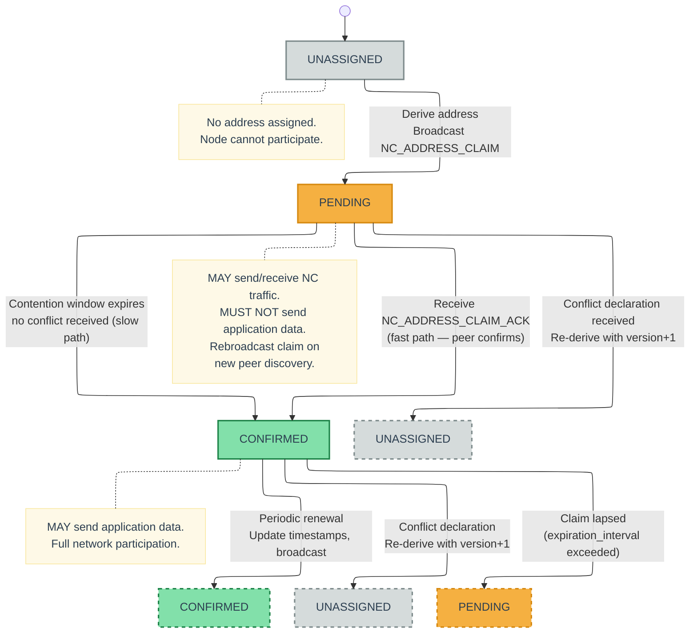

**Figure 9 — Address Claim Lifecycle State Machine**

**Claim states.** Each address assignment (node or client) is in one of three states: **UNASSIGNED** (no address derived; node cannot participate), **PENDING** (claim broadcast but not yet confirmed; node MAY send/receive NC traffic but MUST NOT send application data), and **CONFIRMED** (claim confirmed; node MAY send application data).

#### 11.4.1 Confirmation Paths

A PENDING claim transitions to CONFIRMED via either of two paths:

**Fast path (peer ACK).** A 1-hop neighbor receives the claim, checks its known address mappings, finds no conflict, and sends an NC_ADDRESS_CLAIM_ACK targeted back to the claimant. Upon receiving any single ACK, the claiming node transitions the address to CONFIRMED. In an established network, at least one neighbor typically responds within the fastest available link's round-trip time.

**Slow path (contention timeout).** If no ACK is received within the contention window, the claim auto-confirms. This covers the bootstrap case where the node is the first (or only) participant on the network and there are no peers to ACK.

If a conflict declaration (NC_NODE_ADDRESS_CONFLICT or NC_CLIENT_ADDRESS_CONFLICT) is received while PENDING, the node re-addresses immediately without waiting for the contention window to expire.

**Contention window.** [GUIDANCE] The `contention_scalar` is deployment-configurable. The contention window affects only the fallback auto-confirmation path; in the presence of peers, claims are confirmed by ACK receipt (Section 11.7.12) independent of the contention window. Conflict resolution operates regardless of confirmation state (Section 11.8), ensuring that divergent contention window configurations do not produce permanent addressing inconsistencies. Implementations SHOULD tune `contention_scalar` to match the expected round-trip characteristics of the deployment's primary modality.

**ACK suppression.** [GUIDANCE] ACK suppression uses a random backoff delay before sending an ACK, to reduce the probability of simultaneous ACK transmissions from multiple nodes. The backoff range SHOULD be tuned to the characteristics of the underlying data link — shorter delays for low-latency links (LAN, IP/MQTT), longer delays for high-latency or half-duplex links (radio), and potentially unnecessary on links where transmit scheduling already provides natural spacing (acoustic). The specific backoff ranges are an implementation choice.

#### 11.4.2 Pending Claim Rebroadcast

A node with a PENDING claim SHOULD rebroadcast the claim when it discovers a new 1-hop peer — that is, when it receives any NC message from a Node Address not previously known to the node. The new peer may not have been online when the original claim was broadcast and therefore has never had an opportunity to ACK or contest it.

This accelerates staggered boot convergence: the first node can be ACKed soon after peers appear instead of waiting for full contention timeout. Rebroadcast is event-driven (new-peer discovery), not timer-driven.

#### 11.4.3 Restored Claims

On startup, restored claim state enters the same lifecycle as fresh claims using these boot-path rules (for the node claim and each persisted client claim):

| Boot Condition | Entry State | Required Actions |
|---|---|---|
| **Active persisted claim** (`now - claim_renewal_timestamp < expiration_interval`) | CONFIRMED | Restore address and `address_version`; set `claim_renewal_timestamp = now()`; broadcast claim/summary/renewal refresh |
| **Lapsed persisted claim** (`now - claim_renewal_timestamp >= expiration_interval`) | PENDING | Restore address and `address_version` (increment only if a later conflict is lost); set `claim_origin_timestamp = now()` and `claim_renewal_timestamp = now()`; complete normal confirmation before application traffic |
| **No persisted state** | UNASSIGNED | Derive `address = derive(0)` with `address_version = 0`; set both timestamps to `now()` |

If an address was taken during a lapse, the returning claimant loses by `claim_origin_timestamp` ordering and re-addresses per normal conflict rules.

### 11.5 Local Persistence

Address assignments MUST be persisted locally to survive reboots without requiring full re-resolution. The persisted state per network includes:

- Node: `(NodeUID, node_address, address_version, claim_origin_timestamp, claim_renewal_timestamp)`
- Per client: `(ClientUID, client_address, address_version, claim_origin_timestamp, claim_renewal_timestamp)`

On startup, nodes MUST load persisted state for the active network ID. If persisted NodeUID does not match the current node identity, the node claim state MUST be treated as absent. Restored node/client claims then follow the boot-path lifecycle rules in [Section 11.4.3](#1143-restored-claims).

### 11.6 Network Control Message Format

**[WIRE FORMAT]**

#### 11.6.1 Transport Properties

NC messages use the same MIID deduplication, TTL expiration, and store-carry-forward delivery as application traffic.

NC Message Type IDs fall in the reserved range `32,000–32,767` and always use the 2-byte Compact Type Encoding.

NC messages MUST NOT be delivered to application clients. Nodes MUST intercept NC messages after unpacking a Transmission and route them to the network layer for processing.

NC messages use the dedicated NC packet header formats defined in [Section 5.5](#55-network-control-packet-headers). These headers use Node Addresses (not Client Addresses), carry no flags field, and do not support optional fields or fragmentation.

- **Announce and Query** NC messages use the NC Announce header ([Section 5.5.1](#551-nc-announce-header)); `source` is the origin node NA.
- **Targeted** NC messages use the NC Targeted header ([Section 5.5.2](#552-nc-targeted-header)); `source` and `destination` are NAs and are routed via peer-registry knowledge.

Only NC_NODE_SUMMARY and NC_NODE_ADDRESS_CLAIM carry origin NodeUID in payload. Other NC types omit it to reduce overhead; sender identity is resolved from source NA (header) or `node_address` fields plus summary/WHOIS state.

**Payload encoding.** NC payloads use binary encoding with big-endian byte order. String fields are length-prefixed (`u8` length + bytes). This keeps NC messages compact for constrained links.

**Address field widths.** All address fields in NC payloads (node addresses and client addresses) MUST use the same width as the network-wide addressing mode: 8-bit in 8-bit addressing deployments, 16-bit in 16-bit addressing deployments. The notation `(NA width)` and `(CA width)` in the payload diagrams below refers to this configured width (1 or 2 bytes).

#### 11.6.2 Propagation Models

NC defines three propagation models:

**Announce.** Broadcast + forward at each receiver; MIID deduplication prevents loops.

Specific NC message types may further constrain Announce forwarding by modality — see individual catalog entries in [Section 11.7](#117-nc-message-catalog). In particular, NC_NODE_SUMMARY and NC_CLAIM_RENEWAL suppress mesh forwarding ([Section 11.7.1](#1171-nc_node_summary-32000), [Section 11.7.14](#11714-nc_claim_renewal-32004)), and NC_NETWORK_STATE_REQUEST/RESPONSE suppress all forwarding ([Section 11.7.2](#1172-nc_network_state_request-32001), [Section 11.7.3](#1173-nc_network_state_response-32002)).

- **Header:** NC Announce ([Section 5.5.1](#551-nc-announce-header)).
- Used by: NC_NODE_SUMMARY, NC_CLAIM_RENEWAL, NC_NETWORK_STATE_REQUEST, NC_NETWORK_STATE_RESPONSE, NC_NODE_ADDRESS_CLAIM, NC_CLIENT_ADDRESS_CLAIM, NC_NODE_ADDRESS_CONFLICT, NC_CLIENT_ADDRESS_CONFLICT.

**Query/Response.** Queries propagate like Announce until reaching a resolver (local host state or learned mapping). A resolver:

1. MUST NOT forward the query further.
2. MUST emit the corresponding response, targeted back to the querier.

Responses are targeted to the querier NA (not network-wide broadcast). Query/answer provides on-demand resolution; periodic NC_NODE_SUMMARY provides eventual network-wide convergence.

If multiple nodes can resolve, each MAY absorb and answer; the querier accepts the first and discards duplicates.

- **Header:** Queries use the NC Announce header ([Section 5.5.1](#551-nc-announce-header)); answers use the NC Targeted header ([Section 5.5.2](#552-nc-targeted-header)).
- Used by: NC_CLIENT_UID_QUERY → NC_CLIENT_UID_ANSWER, NC_NODE_UID_QUERY → NC_NODE_UID_ANSWER, NC_CLIENT_ADDRESS_RESOLVE_QUERY → NC_CLIENT_ADDRESS_RESOLVE_ANSWER.

> [GUIDANCE] A resolver answering from learned (non-local) state may return stale data. This is acceptable in DTN operation: stale mappings are corrected by address versioning (Section 11.1), fingerprint-triggered refresh (Section 11.9.4), and periodic NC_NODE_SUMMARY convergence (Section 11.7.1).

**Targeted.** Addressed to one destination and forwarded only toward that destination via store-carry-forward.

- **Header:** NC Targeted ([Section 5.5.2](#552-nc-targeted-header)).
- Used by: NC_ADDRESS_CLAIM_ACK, NC_NODE_UID_ANSWER, NC_CLIENT_UID_ANSWER, NC_CLIENT_ADDRESS_RESOLVE_ANSWER, Fragment NACK.

The propagation definitions above are authoritative; message-type usage is listed in each model's "Used by" line and in the catalog below.

### 11.7 NC Message Catalog

#### 11.7.0 Scheduling Bias

**Scheduling bias.** NC messages have the highest *default* class bias relative to application traffic because correct address mappings and peer state are prerequisites for reliable application delivery. Recommended class bias order: (1) Network Control, (2) Request, (3) Response, (4) Event, (5) Status. This is a scheduling bias, not strict preemption: higher-priority eligible application packets MAY outrank lower-priority NC packets.

Conflict-related catalog entries in this section define trigger surfaces and message contents. Deterministic winner/loser rules, convergence, and declaration suppression are defined canonically in [Section 11.8](#118-conflict-detection-and-resolution).

**Shared catalog rules (unless overridden below):**
- **Propagation labels.** `Announce`, `Query`, and `Targeted` semantics (including header selection) are defined in [Section 11.6.2](#1162-propagation-models).
- **Query receiver handling.** For `NC_CLIENT_UID_QUERY`, `NC_NODE_UID_QUERY`, and `NC_CLIENT_ADDRESS_RESOLVE_QUERY`, a receiver that can resolve one or more queried items MUST emit the corresponding targeted answer(s) for resolved items; it MUST absorb (not forward) only when all queried items are resolvable; otherwise it forwards the full query and MAY include partial answers.
- **Mapping update handling.** Messages that carry UID/address mappings (summaries, claims, answers, and state responses) MUST apply stale-mapping rules from [Section 11.1](#111-address-derivation-and-versioning) and conflict rules from [Section 11.8](#118-conflict-detection-and-resolution).

NC message default priorities are deployment-configurable. The following RECOMMENDED defaults reflect the relative urgency of each message type:

| Type ID | Name | Propagation | Default Priority | Urgency |
|--------:|----------------------------|-----------|:------------:|-------------------------|
| 32,000 | NC_NODE_SUMMARY | Announce | 40 | Low — periodic background maintenance |
| 32,001 | NC_NETWORK_STATE_REQUEST | Announce | 120 | Medium — bulk sync, not time-critical |
| 32,002 | NC_NETWORK_STATE_RESPONSE | Announce | 120 | Medium — bulk sync response |
| 32,003 | Fragment NACK | Targeted | 160 | Medium — retransmission request |
| 32,004 | NC_CLAIM_RENEWAL | Announce | 40 | Low — periodic background maintenance |
| 32,010 | NC_NODE_ADDRESS_CLAIM | Announce | 200 | High — network formation |
| 32,011 | NC_CLIENT_ADDRESS_CLAIM | Announce | 200 | High — network formation |
| 32,012 | NC_ADDRESS_CLAIM_ACK | Targeted | 200 | High — unblocks application data |
| 32,013 | NC_NODE_UID_QUERY | Query | 160 | Medium — on-demand resolution |
| 32,014 | NC_NODE_UID_ANSWER | Targeted | 160 | Medium — on-demand resolution |
| 32,015 | NC_CLIENT_UID_QUERY | Query | 160 | Medium — on-demand resolution |
| 32,016 | NC_CLIENT_UID_ANSWER | Targeted | 160 | Medium — on-demand resolution |
| 32,017 | NC_CLIENT_ADDRESS_RESOLVE_QUERY | Query | 160 | Medium — on-demand resolution |
| 32,018 | NC_CLIENT_ADDRESS_RESOLVE_ANSWER | Targeted | 160 | Medium — on-demand resolution |
| 32,020 | NC_NODE_ADDRESS_CONFLICT | Announce | 240 | Critical — stop using wrong address |
| 32,021 | NC_CLIENT_ADDRESS_CONFLICT | Announce | 240 | Critical — stop using wrong address |

#### 11.7.1 NC_NODE_SUMMARY (32,000)

**Purpose:** Periodic broadcast of a node's identity, address, and hosted clients; primary baseline discovery.

**Propagation:** Announce.

**When sent:**
- On node startup (after address assignment).
- Periodically at `expiration_interval / 2` (see [Section 11.3.2](#1132-refresh-mechanism)).
- When the node's address or hosted client set changes.

**Payload:**

```text
+-----------------------------------------------+
| origin_node_uid_len    (u8)                    |
+-----------------------------------------------+
| origin_node_uid        (origin_node_uid_len B) |
+-----------------------------------------------+
| node_address           (NA width)              |
+-----------------------------------------------+
| node_address_version   (u16)                   |
+-----------------------------------------------+
| node_claim_origin_ts   (u32)                   |
+-----------------------------------------------+
| node_claim_renewal_ts  (u32)                   |
+-----------------------------------------------+
| hosted_client_count    (u8)                    |
+-----------------------------------------------+
| repeat hosted_client_count times:              |
|   client_address       (CA width)              |
|   client_address_version (u16)                 |
|   client_claim_origin_ts (u32)                 |
|   client_claim_renewal_ts (u32)                |
|   client_uid_len       (u8)                    |
|   client_uid           (client_uid_len B)      |
+-----------------------------------------------+
```

**Payload size:** `13 + N + C × (12 + Cᵢ)` bytes (8-bit) | `14 + N + C × (13 + Cᵢ)` bytes (16-bit), where N = `origin_node_uid_len`, C = `hosted_client_count`, Cᵢ = `client_uid_len` for each client.

**Receiver behavior:**
- Apply shared mapping-update handling and update node/client mapping state.

**Mesh forwarding suppression.** [BEHAVIORAL] Nodes MUST NOT forward received NC_NODE_SUMMARY packets on mesh modalities; only the originator broadcasts its own summary. On infrastructure modalities, normal Announce forwarding applies.

This suppression applies to NC_NODE_SUMMARY and NC_CLAIM_RENEWAL. NC_NETWORK_STATE_REQUEST and NC_NETWORK_STATE_RESPONSE suppress all forwarding (see [Section 11.7.2](#1172-nc_network_state_request-32001), [Section 11.7.3](#1173-nc_network_state_response-32002)). Other Announce NC messages remain fully forwarded.

#### 11.7.2 NC_NETWORK_STATE_REQUEST (32,001)

**Purpose:** Request known network mapping state from peers for fast bootstrap.

**Propagation:** Announce.

**When sent:**
- On node startup (after address assignment) on high-bandwidth modalities (LAN, MQTT).
- Optionally after extended downtime or reinitialization when local mapping state may be stale.
- SHOULD NOT be sent on constrained links (acoustic) where the response payload would exceed practical limits.
- A node MUST NOT send more than one NC_NETWORK_STATE_REQUEST per link within a cooldown period (implementation-defined, recommended minimum 30 seconds).
- A node MAY send one logical NC_NETWORK_STATE_REQUEST concurrently on multiple high-bandwidth modalities; all such transmissions MUST reuse the same MIID.

**Payload:** None (empty payload).

**Payload size:** `0` bytes.

**Forwarding suppression.** [BEHAVIORAL] Nodes MUST NOT forward received NC_NETWORK_STATE_REQUEST packets on any modality. This message is strictly link-local.

**Receiver behavior:**
- On first observation of a request MIID, start exactly one randomized jitter timer (single logical request; never per link or per modality) and choose the delay once: recommended range 50–500 ms if the request is observed only on LAN high-bandwidth links, or 1–5 s if observed on any non-LAN high-bandwidth link (for example, MQTT).
- If the same request MIID is later received on additional modalities, treat it as the same logical request; do not start, reset, or re-tune the timer.
- During the jitter window, monitor NC_NETWORK_STATE_RESPONSE traffic across all high-bandwidth modalities where the request was observed.
- When the timer fires, evaluate exactly once: respond with an NC_NETWORK_STATE_RESPONSE only if the node holds mappings that are newer than or absent from responses already observed. If all local mappings are already covered, suppress the response. See [Section 11.7.3](#1173-nc_network_state_response-32002) for truncation interaction.
- If responding, enqueue exactly one logical NC_NETWORK_STATE_RESPONSE in the local message store. The transport MAY transmit that logical response on one or more high-bandwidth modalities; all such transmissions MUST reuse the same response MIID.
- A node MUST NOT re-evaluate or enqueue more than one logical response per request MIID.

#### 11.7.3 NC_NETWORK_STATE_RESPONSE (32,002)

**Purpose:** Broadcast of a node's known mappings for bootstrap and link-local convergence.

**Propagation:** Announce.

**When sent:**
- After receiving an NC_NETWORK_STATE_REQUEST, subject to jitter-based suppression (see [Section 11.7.2](#1172-nc_network_state_request-32001) receiver behavior).
- A responder MAY emit one logical NC_NETWORK_STATE_RESPONSE on multiple high-bandwidth modalities that observed the request; this is one response instance (one MIID), not one response per modality.

**Payload:**

```text
+-----------------------------------------------+
| known_node_count       (u16)                   |
+-----------------------------------------------+
| repeat known_node_count times:                 |
|   node_uid_len         (u8)                    |
|   node_uid             (node_uid_len B)        |
|   node_address         (NA width)              |
|   node_address_version (u16)                   |
|   node_claim_origin_ts (u32)                   |
|   node_claim_renewal_ts (u32)                  |
|   hosted_client_count  (u8)                    |
|   repeat hosted_client_count times:            |
|     client_address     (CA width)              |
|     client_address_version (u16)               |
|     client_claim_origin_ts (u32)               |
|     client_claim_renewal_ts (u32)              |
|     client_uid_len     (u8)                    |
|     client_uid         (client_uid_len B)      |
+-----------------------------------------------+
```

**Payload size:** Variable. `2` bytes fixed (known_node_count), plus per node: `13 + N + C × (12 + Cᵢ)` bytes (8-bit) | `14 + N + C × (13 + Cᵢ)` bytes (16-bit), where N = `node_uid_len`, C = `hosted_client_count`, Cᵢ = `client_uid_len` for each client.

This is an **optional bootstrap optimization**; correctness does not depend on it. Because NC messages MUST NOT be fragmented ([Section 5.5](#55-network-control-packet-headers)), the sender MUST truncate the response to fit one packet and SHOULD prioritize entries with the most recent `node_claim_renewal_ts` values.

**Truncation and convergence.** When a peer's jitter timer fires and it has observed truncated responses, the peer SHOULD respond only if it holds mappings with newer `claim_renewal_ts` values than the newest entry in observed responses, or mappings for nodes entirely absent from observed responses. A peer SHOULD NOT respond solely to provide lower-priority entries that prior responders intentionally omitted by the most-recent-first truncation rule.

**Forwarding suppression.** [BEHAVIORAL] Nodes MUST NOT forward received NC_NETWORK_STATE_RESPONSE packets on any modality. This message is strictly link-local.

**Receiver behavior:**
- All receiving nodes — not only the original requester — MUST process each entry as if it were an NC_NODE_SUMMARY and apply shared mapping-update handling.
- Receivers MUST deduplicate NC_NETWORK_STATE_RESPONSE by MIID across modalities; duplicate copies of the same response are ignored after first processing.

**[GUIDANCE] Initial network state provisioning.** When deploying a new node into a network with established participants, the joining node SHOULD broadcast NC_NETWORK_STATE_REQUEST on high-bandwidth modalities immediately after address assignment. Existing peers respond with their current mapping state, allowing NC discovery to act primarily as convergence and correction rather than cold-start discovery.

#### 11.7.4 NC_NODE_ADDRESS_CLAIM (32,010)

**Purpose:** Explicit Node Address claim.

**Propagation:** Announce.

**When sent:**
- On node startup.
- After re-addressing due to conflict loss.
- Periodically alongside NC_NODE_SUMMARY or NC_CLAIM_RENEWAL (at `expiration_interval / 2`). On modalities where NC_CLAIM_RENEWAL is used as the refresh mechanism, the renewal satisfies the periodic claim obligation — separate explicit claims are not required.

**Payload:**

```text
+-----------------------------------------------+
| origin_node_uid_len    (u8)                    |
+-----------------------------------------------+
| origin_node_uid        (origin_node_uid_len B) |
+-----------------------------------------------+
| node_address           (NA width)              |
+-----------------------------------------------+
| address_version        (u16)                   |
+-----------------------------------------------+
| claim_origin_ts        (u32)                   |
+-----------------------------------------------+
| claim_renewal_ts       (u32)                   |
+-----------------------------------------------+
```

**Payload size:** `12 + N` bytes (8-bit) | `13 + N` bytes (16-bit), where N = `origin_node_uid_len`.

**Receiver behavior:**
- Apply shared mapping-update handling.
- If the claimed NA matches the receiver's own NA from a different NodeUID, emit NC_NODE_ADDRESS_CONFLICT (subject to [Section 11.8.5](#1185-conflict-declaration-suppression)).
- If no conflict is detected and the receiver is a 1-hop neighbor, send NC_ADDRESS_CLAIM_ACK (with backoff/suppression per [Section 11.4.1](#1141-confirmation-paths)).

#### 11.7.5 NC_CLIENT_ADDRESS_CLAIM (32,011)

**Purpose:** Explicit Client Address claim.

**Propagation:** Announce.

**When sent:**
- When a client registers on the node.
- After re-addressing due to conflict loss.
- Periodically alongside NC_NODE_SUMMARY or NC_CLAIM_RENEWAL (at `expiration_interval / 2`). On modalities where NC_CLAIM_RENEWAL is used as the refresh mechanism, the renewal satisfies the periodic claim obligation — separate explicit claims are not required.

**Payload:**

```text
+-----------------------------------------------+
| node_address           (NA width)              |
+-----------------------------------------------+
| client_address         (CA width)              |
+-----------------------------------------------+
| address_version        (u16)                   |
+-----------------------------------------------+
| claim_origin_ts        (u32)                   |
+-----------------------------------------------+
| claim_renewal_ts       (u32)                   |
+-----------------------------------------------+
| client_uid_len         (u8)                    |
| client_uid             (client_uid_len B)      |
+-----------------------------------------------+
```

**Payload size:** `13 + C` bytes (8-bit) | `15 + C` bytes (16-bit), where C = `client_uid_len`.

The host NodeUID is omitted to reduce overhead; `node_address` identifies the host and NodeUID can be resolved via summary/WHOIS state.

**Receiver behavior:**
- Apply shared mapping-update handling.
- If the claimed CA matches an existing mapping from a different ClientUID, emit NC_CLIENT_ADDRESS_CONFLICT (subject to [Section 11.8.5](#1185-conflict-declaration-suppression)).
- If no conflict is detected and the receiver is a 1-hop neighbor, send NC_ADDRESS_CLAIM_ACK (with backoff/suppression per [Section 11.4.1](#1141-confirmation-paths)).

#### 11.7.6 NC_CLIENT_UID_QUERY (32,015)

**Purpose:** WHOIS query for one or more Client Addresses with unknown identity mapping.

**Propagation:** Query.

**When sent:**
- When a node encounters one or more Client Addresses (in data traffic or via fingerprint mismatch) for which it has no known or valid identity mapping.
- Multiple unknown addresses SHOULD be batched into a single query to reduce transmit overhead on constrained links.
- Rate-limited to avoid excessive query traffic. The node MUST NOT emit a duplicate query if one for the same CA is already outstanding and has not expired.

**Payload:**

```text
+-----------------------------------------------+
| queried_address_count  (u8)                    |
+-----------------------------------------------+
| repeat queried_address_count times:            |
|   queried_client_address (CA width)            |
+-----------------------------------------------+
```

**Payload size:** `1 + C` bytes (8-bit) | `1 + 2C` bytes (16-bit), where C = `queried_address_count`.

**Receiver behavior:**
- Apply shared query receiver handling; resolver eligibility includes locally hosted clients and learned mappings.

#### 11.7.7 NC_CLIENT_UID_ANSWER (32,016)

**Purpose:** Targeted WHOIS answer for Client Address ownership.

**Propagation:** Targeted.

**When sent:**
- In response to an NC_CLIENT_UID_QUERY that the node can resolve (either hosts the client locally or has previously learned the mapping from other nodes).

**Payload:**

```text
+-----------------------------------------------+
| host_node_address      (NA width)              |
+-----------------------------------------------+
| client_address         (CA width)              |
+-----------------------------------------------+
| address_version        (u16)                   |
+-----------------------------------------------+
| claim_origin_ts        (u32)                   |
+-----------------------------------------------+
| claim_renewal_ts       (u32)                   |
+-----------------------------------------------+
| client_uid_len         (u8)                    |
| client_uid             (client_uid_len B)      |
+-----------------------------------------------+
```

**Payload size:** `13 + C` bytes (8-bit) | `15 + C` bytes (16-bit), where C = `client_uid_len`.

The host NodeUID is omitted; `host_node_address` provides routing context, and NodeUID can be resolved through summary/WHOIS state. A node may answer from learned mapping state.

**Receiver behavior:**
- Apply shared mapping-update handling.
- If the answer was for a locally originated query, mark that query as answered.
- If conflicting answers arrive (different UIDs for the same CA), emit conflict handling per [Section 11.8](#118-conflict-detection-and-resolution).

#### 11.7.8 NC_NODE_UID_QUERY (32,013)

**Purpose:** WHOIS query for one or more Node Addresses with unknown identity mapping.

**Propagation:** Query.

**When sent:**
- When a node encounters one or more Node Addresses (in data traffic, NC messages, or transmission metadata) for which it has no known identity mapping.
- Multiple unknown addresses SHOULD be batched into a single query to reduce transmit overhead on constrained links.
- Rate-limited to avoid excessive query traffic.

**Payload:**

```text
+-----------------------------------------------+
| queried_address_count  (u8)                    |
+-----------------------------------------------+
| repeat queried_address_count times:            |
|   queried_node_address (NA width)              |
+-----------------------------------------------+
```

**Payload size:** `1 + C` bytes (8-bit) | `1 + 2C` bytes (16-bit), where C = `queried_address_count`.

**Receiver behavior:**
- Apply shared query receiver handling; resolver eligibility includes self-identity and learned mappings.

#### 11.7.9 NC_NODE_UID_ANSWER (32,014)

**Purpose:** Targeted WHOIS answer for Node Address ownership.

**Propagation:** Targeted.

**When sent:**
- In response to an NC_NODE_UID_QUERY that the node can resolve (either is the queried node itself or has previously learned the mapping from other nodes).

**Payload:**

```text
+-----------------------------------------------+
| node_address           (NA width)              |
+-----------------------------------------------+
| address_version        (u16)                   |
+-----------------------------------------------+
| claim_origin_ts        (u32)                   |
+-----------------------------------------------+
| claim_renewal_ts       (u32)                   |
+-----------------------------------------------+
| node_uid_len           (u8)                    |
| node_uid               (node_uid_len B)        |
+-----------------------------------------------+
```

**Payload size:** `12 + N` bytes (8-bit) | `13 + N` bytes (16-bit), where N = `node_uid_len`.

**Receiver behavior:**
- Apply shared mapping-update handling.
- If the answer was for a locally originated query, mark that query as answered.

#### 11.7.10 NC_NODE_ADDRESS_CONFLICT (32,020)

**Purpose:** Conflict declaration for contested Node Address ownership.

**Propagation:** Announce.

**When sent:**
- When a node detects that two different NodeUIDs are claiming the same NA (via NC claims or transmission metadata), subject to declaration suppression ([Section 11.8.5](#1185-conflict-declaration-suppression)).

**Payload:**

```text
+-----------------------------------------------+
| conflict_node_address  (NA width)              |
+-----------------------------------------------+
| winner_claim_origin_ts (u32)                   |
+-----------------------------------------------+
| winner_node_uid_len    (u8)                    |
| winner_node_uid        (winner_node_uid_len B) |
+-----------------------------------------------+
```

**Payload size:** `6 + W` bytes (8-bit) | `7 + W` bytes (16-bit), where W = `winner_node_uid_len`.

**Receiver behavior:**
- If the local node is the winner for this NA: no action, keep address.
- If the local node is the loser: re-address (bump version, derive new NA, persist, emit new NC_NODE_ADDRESS_CLAIM).
- If the local node had independently detected the same conflict but not yet emitted a declaration: suppress its own declaration and start the re-claim watchdog timer ([Section 11.8.5](#1185-conflict-declaration-suppression)).
- Update local address mappings to reflect the winning assignment.

#### 11.7.11 NC_CLIENT_ADDRESS_CONFLICT (32,021)

**Purpose:** Conflict declaration for contested Client Address ownership.

**Propagation:** Announce.

**When sent:**
- When a node detects that two different ClientUIDs are claiming the same CA (via NC claims, WHOIS answers, or data-plane MIID detection), subject to declaration suppression ([Section 11.8.5](#1185-conflict-declaration-suppression)).

**Payload:**

```text
+-----------------------------------------------+
| conflict_client_address (CA width)             |
+-----------------------------------------------+
| winner_claim_origin_ts  (u32)                  |
+-----------------------------------------------+
| winner_client_uid_len   (u8)                   |
| winner_client_uid       (winner_client_uid_len B) |
+-----------------------------------------------+
```

**Payload size:** `6 + W` bytes (8-bit) | `7 + W` bytes (16-bit), where W = `winner_client_uid_len`.

**Receiver behavior:**
- If the local node hosts the winning ClientUID at this CA: no action, keep address.
- If the local node hosts the losing ClientUID at this CA: re-address (bump version, derive new CA, persist, emit new NC_CLIENT_ADDRESS_CLAIM).
- If the local node had independently detected the same conflict but not yet emitted a declaration: suppress its own declaration and start the re-claim watchdog timer ([Section 11.8.5](#1185-conflict-declaration-suppression)).
- Update local address mappings to reflect the winning assignment.

#### 11.7.12 NC_ADDRESS_CLAIM_ACK (32,012)

**Purpose:** Positive acknowledgment of an address claim.

**Propagation:** Targeted.

**When sent:**
- When a 1-hop neighbor receives an NC_NODE_ADDRESS_CLAIM or NC_CLIENT_ADDRESS_CLAIM, detects no conflict, and its random backoff timer fires before hearing another peer's ACK for the same claim (see [Section 11.4.1](#1141-confirmation-paths), *ACK suppression*).

**Payload:**

```text
+-----------------------------------------------+
| claimed_address        (NA or CA width)        |
+-----------------------------------------------+
| address_type           (u8)                    |
+-----------------------------------------------+
```

**Payload size:** `2` bytes (8-bit) | `3` bytes (16-bit).

- **`claimed_address`**: The address being acknowledged (node or client address).
- **`address_type`** (u8): `0` = Node Address, `1` = Client Address.

**Receiver behavior:**
- If the ACK matches a locally held PENDING claim, transition the claim to CONFIRMED (see [Section 11.4](#114-claim-lifecycle)).
- If the claim is already CONFIRMED, discard.

#### 11.7.13 Fragment NACK (32,003)

**Propagation:** Targeted.

Defined in [Section 8.5](#85-fragment-nacks-network-control-type-32003). Included here for catalog completeness.

#### 11.7.14 NC_CLAIM_RENEWAL (32,004)

**Purpose:** Lightweight claim refresh for constrained links where NC_NODE_SUMMARY exceeds the payload budget.

**Propagation:** Announce.

**When sent:**
- Periodically at `expiration_interval / 2`, on modalities where the node's NC_NODE_SUMMARY does not fit within the available payload budget.
- SHOULD NOT be sent on modalities where the full NC_NODE_SUMMARY fits.

**Payload:**

```text
+-----------------------------------------------+
| node_address           (NA width)              |
+-----------------------------------------------+
| node_claim_renewal_ts  (u32)                   |
+-----------------------------------------------+
| hosted_client_count    (u8)                    |
+-----------------------------------------------+
| repeat hosted_client_count times:              |
|   client_address       (CA width)              |
|   client_claim_renewal_ts (u32)                |
+-----------------------------------------------+
```

**Payload size:** `6 + C × 5` bytes (8-bit) | `7 + C × 6` bytes (16-bit), where C = `hosted_client_count`.

**Header/payload consistency.** If the NC Announce header `source` field and payload `node_address` differ, the packet is malformed and MUST be dropped.

**Receiver behavior:**
- NC_CLAIM_RENEWAL MUST NOT create, alter, or remove UID-to-address bindings, address versions, or origin timestamps. It updates `claim_renewal_ts` only.
- For the node claim: if `node_address` matches a known mapping, update `claim_renewal_ts` using `stored = max(stored, incoming)`. If unknown, ignore.
- For each client claim: if `client_address` matches a known mapping **hosted by the same node**, update `claim_renewal_ts` using `stored = max(stored, incoming)`. If the address is unknown or mapped to a different host node, ignore it.
- A receiver MAY emit NC_NODE_UID_QUERY for an unrecognized `node_address` to learn the full mapping, subject to existing query rate-limiting and duplicate-suppression rules ([Section 11.7.8](#1178-nc_node_uid_query-32013)).

**Large client sets.** When the hosted client count exceeds what fits in a single packet, the sender MUST split clients across multiple NC_CLAIM_RENEWAL packets. All packets carry the same `node_address` and `node_claim_renewal_ts`. Receivers accumulate client renewals across packets — there is no complete-set requirement.

**Mesh forwarding suppression.** [BEHAVIORAL] Same rule as NC_NODE_SUMMARY: nodes MUST NOT forward received NC_CLAIM_RENEWAL packets on mesh modalities. On infrastructure modalities, normal Announce forwarding applies.

#### 11.7.15 NC_CLIENT_ADDRESS_RESOLVE_QUERY (32,017)

**Purpose:** Reverse WHOIS query for ClientUID-to-CA resolution.

**Propagation:** Query.

**When sent:**
- When the transport layer accepts a message destined for a ClientUID with no known address mapping (see [Section 9.2](#92-per-node-message-store), *Pending address resolution*).
- Rate-limited to avoid excessive query traffic. The node MUST NOT emit a duplicate query if one for the same ClientUID is already outstanding and has not expired.

**Payload:**

```text
+-----------------------------------------------+
| queried_uid_count      (u8)                    |
+-----------------------------------------------+
| repeat queried_uid_count times:               |
|   client_uid_len       (u8)                    |
|   client_uid           (client_uid_len B)      |
+-----------------------------------------------+
```

**Payload size:** Variable. `1 + sum(1 + client_uid_len)` bytes.

**Receiver behavior:**
- Apply shared query receiver handling; resolver eligibility includes locally hosted clients and learned mappings.

#### 11.7.16 NC_CLIENT_ADDRESS_RESOLVE_ANSWER (32,018)

**Purpose:** Targeted reverse-WHOIS answer with ClientUID-to-CA mapping.

**Propagation:** Targeted.

**When sent:**
- In response to an NC_CLIENT_ADDRESS_RESOLVE_QUERY that the node can resolve (either hosts the client locally or has previously learned the mapping from other nodes).

**Payload:** Identical to NC_CLIENT_UID_ANSWER ([Section 11.7.7](#1177-nc_client_uid_answer-32016)).

**Payload size:** `13 + C` bytes (8-bit) | `15 + C` bytes (16-bit), where C = `client_uid_len`.

**Receiver behavior:**
- Apply shared mapping-update handling.
- Resolve pending-address-resolution messages for the resolved ClientUID (see [Section 9.2](#92-per-node-message-store)).

### 11.8 Conflict Detection and Resolution

**[BEHAVIORAL + GUIDANCE]**

#### 11.8.1 Detection Mechanisms

Address conflicts can be detected through three paths:

**Data-plane MIID detection (Client Address conflicts).** Each node maintains a cache of MIIDs for packets originated by its locally hosted clients. When an inbound packet has a source CA assigned to a local client but the MIID is not in the local origin cache, another node is originating traffic with the same CA. This triggers an NC conflict flow.

**Transmission metadata detection (Node Address conflicts).** Each incoming Transmission carries the sender's Node Address in its metadata (`node_address_sender`). If this value equals the local node's own NA and the transmission did not originate locally, another node is using the same NA.

**NC claim detection (both).** When an NC claim (node or client) is received and the claimed address matches a locally held address from a different UID, the conflict is detected directly from the claim.

#### 11.8.2 Resolution Rules

All conflict resolution is deterministic — given the same inputs, every node computes the same winner.

**Same address, different UIDs (address conflict):**

1. If one claim is **active** and the other is **expired** → the active claim wins.
2. If both claims are **active** (or both **expired**) → compare `claim_origin_timestamp` values. The earlier timestamp wins (first come, first serve).
3. If `claim_origin_timestamp` values are equal → the lexicographically smaller UID wins.
   - For client conflicts: compare `(ClientUID, host NodeUID)` tuples.
   - For node conflicts: compare `NodeUID`.

**Same UID, different addresses (stale mapping):**

1. Compare `address_version` values. The higher version is the current assignment.
2. If versions are equal with different addresses: tie-break by `NodeUID` (for cases where the same ClientUID is hosted on different nodes); flag as potential misconfiguration.

Figure 10 visualizes both resolution cascades as decision trees.

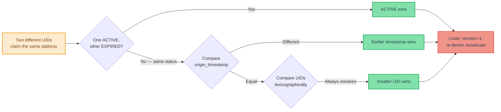

**Figure 10a — Same Address, Different UIDs (Address Conflict)**

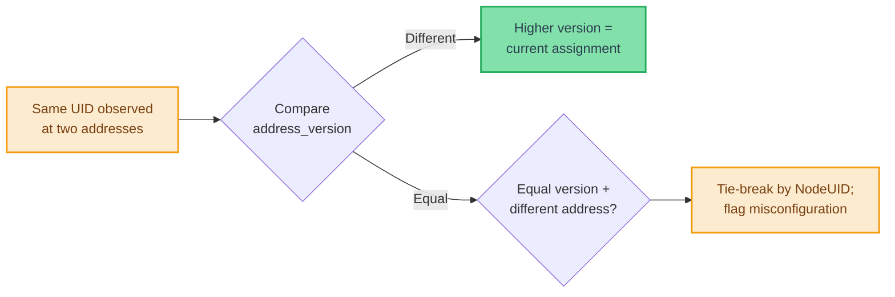

**Figure 10b — Same UID, Different Addresses (Stale Mapping)**

#### 11.8.3 Loser Behavior

The node hosting the losing UID in a conflict MUST:

1. Increment `address_version`.
2. Set `claim_origin_timestamp = now()` and `claim_renewal_timestamp = now()` (new assignment).
3. Derive a new address using `address(new_version)`.
4. If the derived address is locally occupied, continue incrementing until a free address is found.
5. Persist the new assignment.
6. Emit a new NC address claim (NC_NODE_ADDRESS_CLAIM or NC_CLIENT_ADDRESS_CLAIM) with the updated address, version, and timestamps.

#### 11.8.4 Convergence

Deterministic winner rules plus announce propagation of `NC_*_CONFLICT` ensure that observers converge on the same assignment.

Typical sequence:

1. Two nodes claim the same address.
2. An observer detects the conflict, computes the winner, and emits `NC_*_CONFLICT`.
3. Other observers suppress duplicate declarations and start watchdogs.
4. The loser re-addresses and emits a new claim with higher `address_version`.
5. Nodes update mappings and cancel watchdogs.

#### 11.8.5 Conflict Declaration Suppression

Because `NC_*_ADDRESS_CLAIM` uses Announce propagation, multiple nodes can detect the same conflict and emit redundant declarations. Suppression reduces this to one declaration in the common case while preserving self-healing under loss.

**[BEHAVIORAL]** When a node detects an address conflict:

1. If the node has already received a conflict declaration (NC_NODE_ADDRESS_CONFLICT or NC_CLIENT_ADDRESS_CONFLICT) for the same contested address declaring the same winner: suppress its own declaration and start a **re-claim watchdog timer**.
2. Otherwise: emit the conflict declaration (announce propagation).

**[BEHAVIORAL]** Re-claim watchdog: After suppressing a declaration (or after emitting one), the node monitors for a new address claim from the loser — a claim with a higher `address_version` for a different address from the same UID. Two outcomes:

- **Loser re-claims (happy path).** The loser's new NC_*_ADDRESS_CLAIM arrives before the watchdog expires. The node cancels the watchdog and updates its address mappings. The conflict is resolved.
- **Watchdog expires (unhappy path).** No new claim arrives within the timeout. The loser may not have received any conflict declaration. The node MUST re-emit the conflict declaration to ensure eventual delivery. The watchdog restarts on re-emission.

> [GUIDANCE] The watchdog timeout SHOULD allow sufficient time for the conflict declaration to propagate to the loser via store-carry-forward and for the loser's new claim to propagate back. On infrastructure links, a timeout of 2× the expected round-trip propagation delay is reasonable. On mesh or disruption-tolerant links, longer timeouts are appropriate. The specific timeout values are deployment-configurable.

> [GUIDANCE] When multiple nodes detect a conflict simultaneously and no prior conflict declaration has propagated, random backoff before emitting the first conflict declaration reduces the probability of simultaneous transmissions, allowing natural suppression to take effect. The backoff range SHOULD follow the same link-adapted principles as ACK suppression ([Section 11.4.1](#1141-confirmation-paths), *ACK suppression*).

### 11.9 Peer Discovery and Fleet Membership

**[BEHAVIORAL + GUIDANCE]**

#### 11.9.1 Link-Level Discovery

DataLink adapters (LAN, MQTT, radio) handle one-hop neighbor discovery and maintain `NA → transport endpoint` reachability mappings. This is link-specific and operates below the M4P network layer.

Link-level discovery determines *how to reach* a neighbor (which socket, topic, or endpoint). The network layer determines *who* that neighbor is (which NodeUID, which ClientUIDs it hosts).

Link-level adapters SHOULD NOT advertise client-level identity mappings. All client identity resolution is the responsibility of the network layer via NC messages.

#### 11.9.2 Network-Level Discovery

Network-level discovery operates through NC messages and provides multi-hop identity/address convergence:

- **NC_NODE_SUMMARY / NC_CLAIM_RENEWAL**: Periodic broadcasts provide baseline discovery and liveness. NC_NODE_SUMMARY carries full identity and client data; NC_CLAIM_RENEWAL refreshes timestamps only on constrained links.
- **NC_NETWORK_STATE_REQUEST / NC_NETWORK_STATE_RESPONSE**: Bulk bootstrap and link-local convergence — the joining node broadcasts a request on high-bandwidth links; peers respond with their known mappings, suppressing redundant responses through jitter-based observation.
- **NC_*_ADDRESS_CLAIM**: Explicit claims propagate address mappings as they change.
- **NC_NODE_UID_QUERY / NC_NODE_UID_ANSWER**: On-demand resolution for unknown NAs encountered in traffic or NC messages.
- **NC_CLIENT_UID_QUERY / NC_CLIENT_UID_ANSWER**: On-demand resolution for unknown CAs encountered in data traffic.
- **NC_CLIENT_ADDRESS_RESOLVE_QUERY / NC_CLIENT_ADDRESS_RESOLVE_ANSWER**: On-demand resolution for unknown ClientUIDs when the transport needs to route an outbound directed message (reverse direction: UID → CA).

These mechanisms provide eventual convergence without requiring continuous full connectivity. `NC_NETWORK_STATE_*` accelerates startup on high-bandwidth links but is optional for correctness.

Typical join flow: derive address, emit claims, receive ACK/confirm, emit summary, then broadcast NC_NETWORK_STATE_REQUEST on high-bandwidth modalities for fast bootstrap.

#### 11.9.3 Address Mapping State

Each node MUST maintain identity-to-address mappings sufficient to support the following operations:

- Resolving a Node Address to a NodeUID and its hosted clients.
- Resolving a Client Address to a ClientUID, its host NodeUID, address version, and claim timestamps.
- Resolving a ClientUID to a Client Address for outbound message routing (see [Section 9.2](#92-per-node-message-store), *Pending address resolution*).
- Detecting address conflicts (same address claimed by different UIDs).
- Detecting stale mappings (same UID observed at different addresses).
- Determining claim liveness (active vs. expired based on `claim_renewal_timestamp` and `expiration_interval`).

These mappings are populated and updated by NC messages (summaries, renewals, claims, answers, conflict declarations) and queried by the transport layer when resolving source identity for client-facing delivery.

#### 11.9.4 Accelerated Client Address Convergence

The periodic refresh cadence (`expiration_interval / 2` for NC_NODE_SUMMARY or NC_CLAIM_RENEWAL) guarantees eventual liveness, but the convergence window can be hours long. A node returning from downtime may therefore hold stale `CA -> ClientUID` mappings until fresh summaries arrive.

On high-bandwidth links (LAN, MQTT), NC_NETWORK_STATE_REQUEST triggers link-local broadcast responses from peers, enabling fast bulk refresh and convergence. On constrained links, response size limits make bulk refresh impractical. The client address fingerprint mechanism provides low-overhead staleness detection across all modalities.

**Client address fingerprint.** Each outgoing packet MAY carry a 2-byte **client address fingerprint** — a compact hash of the source client's identity and address assignment:

```text
digest = SHA-256(ClientUID_bytes || CA_bytes || address_version_bytes)
fingerprint = digest[0] << 8 | digest[1]
```

Where `ClientUID_bytes` is UTF-8 ClientUID, `CA_bytes` is a 2-byte big-endian CA (zero-padded in 8-bit mode), and `address_version_bytes` is a 2-byte big-endian version.

The fingerprint is carried as an optional packet field (see [Section 5.7](#57-flags-and-optional-fields)); when present, 2 bytes are appended to the optional-field area.

**Injection frequency.** Nodes SHOULD include a fingerprint on roughly every 5th transmission. Selection is implementation-defined (for example, counter-based or probabilistic). On ~30-byte acoustic payloads, this yields ~1.4% amortized overhead.

**Receiver behavior.** When a node receives a packet with the client address fingerprint flag set:

1. Extract the source CA from the packet header.
2. Look up the source CA in the local peer registry.
3. **CA found**: Compute the expected fingerprint from cached `(ClientUID, CA, address_version)` and compare.
   - **Match**: mapping is consistent; no action.
   - **Mismatch**: mapping may be stale; node SHOULD emit NC_CLIENT_UID_QUERY for that CA (see [Section 11.7.6](#1176-nc_client_uid_query-32015)), subject to normal query rate limits and duplicate suppression.
4. **CA not found**: handle via normal discovery (NC_NODE_SUMMARY and/or query).

**Forwarding.** Fingerprints are retained on forwarded packets, allowing each hop to validate its local mapping and accelerate convergence network-wide.

**Properties:**

- **Overhead:** 1 flag bit in the header and 2 bytes of fingerprint data on ~1 in 5 transmissions (~1.4% amortized acoustic overhead).
- **Detection latency:** bounded by `5 × transmit_interval` for traffic from a given CA (about 3.75 minutes at 45-second transmit intervals).
- **Correctness:** fingerprinting is detection-only; authoritative recovery remains NC_CLIENT_UID_QUERY/ANSWER plus normal conflict resolution. Hash collisions (~1/65536) may delay detection but do not create incorrect state.

#### 11.9.5 Worked Example: Network Bootstrap Sequence (Non-Normative)

The following example traces the NC message exchange for the first two nodes to join a fresh deployment, illustrating both confirmation paths from [Section 11.4.1](#1141-confirmation-paths). Figure 11 shows the complete message sequence.

**Scenario.** Node A (`shore-1`, NA 42, hosting one client `shore-1.ops` at CA 17) powers on alone. Node B (`vessel-2`, NA 87, hosting one client `vessel-2.nav` at CA 203) joins tens of seconds later. Both share a high-bandwidth link (LAN). No persisted state exists (fresh deployment, 8-bit addressing mode).

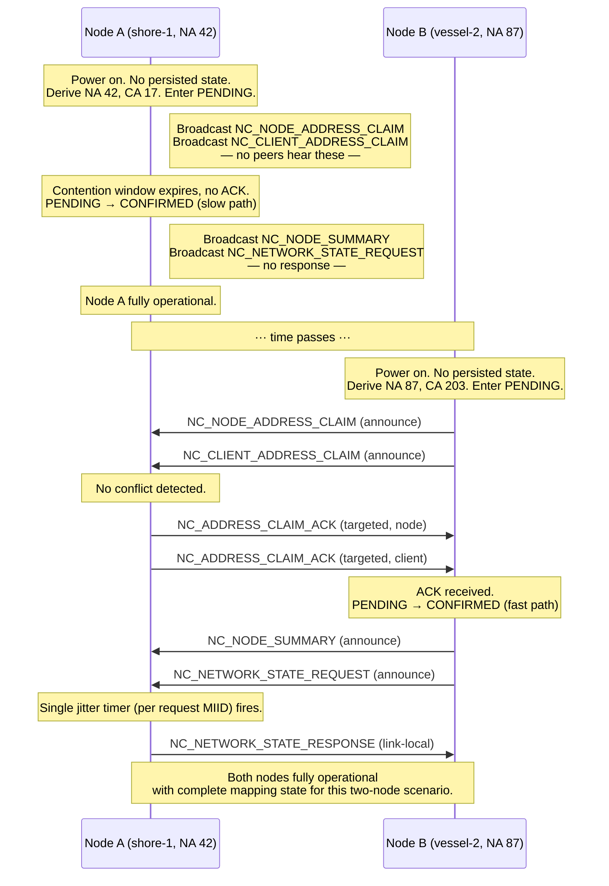

**Figure 11 — Network Bootstrap Sequence (Two-Node Join)**

**Phase 1 — Node A cold-starts alone (slow-path confirmation).**

1. Node A has no persisted state and enters UNASSIGNED. It derives NA 42 and CA 17 ([Section 11.1](#111-address-derivation-and-versioning)), sets both claim timestamps to `now()`, and transitions to PENDING.
2. Node A broadcasts NC\_NODE\_ADDRESS\_CLAIM and NC\_CLIENT\_ADDRESS\_CLAIM (announce propagation).
3. No peers exist. No ACK arrives. The contention window expires and both claims auto-confirm (slow path).
4. Node A broadcasts NC\_NODE\_SUMMARY and NC\_NETWORK\_STATE\_REQUEST. No peers respond to the state request; Node A remains CONFIRMED and can send application data.

**Phase 2 — Node B joins an established network (fast-path confirmation).**

1. Node B has no persisted state. It derives NA 87 and CA 203, sets timestamps to `now()`, and transitions to PENDING.
2. Node B broadcasts NC\_NODE\_ADDRESS\_CLAIM and NC\_CLIENT\_ADDRESS\_CLAIM.
3. Node A receives the claims, detects no conflicts, and sends NC\_ADDRESS\_CLAIM\_ACK (targeted) for each claim back to Node B, with random backoff per [Section 11.4.1](#1141-confirmation-paths). Node A updates its address mapping tables.
4. Node B receives the ACKs and transitions to CONFIRMED (fast path). This occurs within the link's round-trip time.
5. Node B broadcasts NC\_NODE\_SUMMARY and NC\_NETWORK\_STATE\_REQUEST.
6. Node A receives the state request, starts exactly one jitter timer for that request MIID ([Section 11.7.2](#1172-nc_network_state_request-32001)), and emits one logical NC\_NETWORK\_STATE\_RESPONSE (single response MIID) containing all known mappings.
7. Node B processes the state response and now has complete mapping state for this two-node scenario. Both nodes are fully operational.

As additional nodes join, the pattern repeats Phase 2: each newcomer's claims are ACKed by one or more existing peers (fast path), and the state request/response exchange provides bulk mapping convergence. When multiple peers exist, ACK suppression ([Section 11.4.1](#1141-confirmation-paths)) and state response jitter suppression ([Section 11.7.2](#1172-nc_network_state_request-32001)) reduce redundant transmissions.

---

## 12. Encryption and Security

**[WIRE FORMAT + BEHAVIORAL]**

This section defines M4P's two-layer security model. Because store-carry-forward relays must read headers for forwarding and deduplication, payload confidentiality is applied end-to-end via the optional M4P payload cipher while DataLink adapters apply per-hop link protection. The layers are independent and complementary. The payload cipher uses AES-CTR with zero ciphertext expansion, preserving payload budget on constrained links.

Figure 12 shows this interaction across a three-node path.

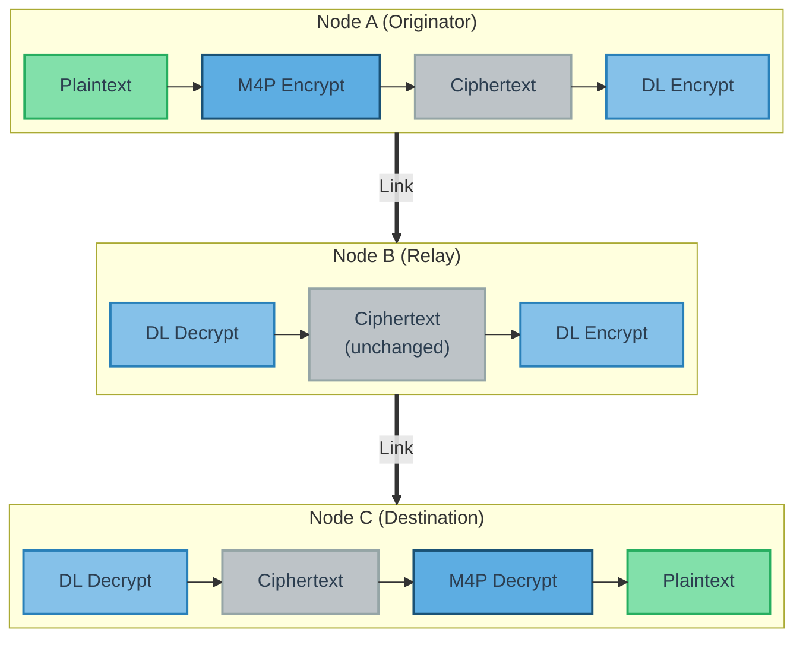

**Figure 12 — M4P Two-Layer Encryption Architecture**

*DL = DataLink-layer encryption (TLS / IPsec / COMSEC). Originator: M4P encrypt + DL encrypt; relay: DL decrypt/re-encrypt only; destination: DL decrypt + M4P decrypt.*

### 12.1 Responsibility Summary

The following table summarizes the division of security responsibilities across protocol layers.

| Responsibility | Owner |
|---|---|
| Application payload encryption/decryption | M4P transport (when PSK is configured) |
| Authentication tag computation/verification | M4P transport (when enabled) |
| Nonce derivation | M4P transport (from its own header fields) |
| NC message payloads | Not encrypted |
| Identity obfuscation (UID obfuscation) | Application (see [Section 12.5](#125-identity-obfuscation)) |
| Link-layer encryption (TLS, IPsec, etc.) | DataLink adapter |
| Key provisioning (PSK, certificates) | Deployment operations |

### 12.2 M4P Payload Cipher

**Configuration.** The payload cipher is controlled by one optional network-wide parameter: **`payload_cipher_key`** (PSK; see [Section 2.4.2](#242-required-configuration-must)). When configured, the transport encrypts outgoing application payloads and decrypts incoming payloads before local delivery. When absent, payloads are carried in the clear. All nodes that host clients and use the payload cipher MUST use the same PSK. Relay-only nodes do not need the PSK and forward ciphertext as opaque bytes.

**Algorithm.** The payload cipher uses **AES-256-CTR** (Counter mode) as defined in NIST SP 800-38A. Key size: 256 bits (32 bytes). Ciphertext expansion: zero (AES-CTR is a stream cipher mode; the ciphertext is the same length as the plaintext). Padding: none required.

#### 12.2.1 What Is Encrypted

The payload cipher operates on **application message payloads only** (see Figure 12 for the two-layer architecture). The following are NOT encrypted:

- All transport-layer packet header fields: `message_type_id`, `source`, `destination`, `timestamp_24h`, `msg_counter`, `payload_length`, `flags`, and all optional header fields.
- All transmission-level metadata: `node_address_sender`.
- Network control (NC) message payloads (message types 32,000–32,767).

Headers and transmission metadata remain visible so intermediate nodes can perform MIID deduplication, scheduling, TTL checks, forwarding, and fragmentation during store-carry-forward operation.

**Design Note (Non-Normative):** NC payloads remain visible so nodes can process discovery, claim, and conflict state without endpoint payload keys; network-layer convergence stays independent of application payload confidentiality.

#### 12.2.2 Nonce Derivation

AES-CTR requires a unique nonce (IV) for each encrypted payload or fragment. The M4P transport derives the nonce from packet header fields available at both sender and receiver, so nonce bytes are not transmitted:

```text
nonce = AES-CTR-NONCE(network_id, source_ca, timestamp_24h, msg_counter, message_type_id, fragment_offset)
```

**Nonce construction.** The nonce is constructed as a 16-byte (128-bit) value:

```text
+-----------------------------------------------+
| network_id_hash          (4 bytes)             |
+-----------------------------------------------+
| source_ca                (2 bytes, zero-padded)|
+-----------------------------------------------+
| timestamp_24h            (3 bytes)             |
+-----------------------------------------------+
| msg_counter              (1 byte)              |
+-----------------------------------------------+
| message_type_id          (2 bytes)             |
+-----------------------------------------------+
| fragment_offset          (2 bytes)             |
+-----------------------------------------------+
| reserved                 (2 bytes, 0x0000)     |
+-----------------------------------------------+
```

**Nonce Byte-Offset Summary**

| Byte Offset | Field | Size | Description |
|---|---|---|---|
| 0–3 | `network_id_hash` | 4 B | First 4 bytes of `SHA-256(network_id)`. Binds nonce to deployment. |
| 4–5 | `source_ca` | 2 B | Client Address, zero-padded to 2 bytes in 8-bit mode. |
| 6–8 | `timestamp_24h` | 3 B | 17-bit timestamp, zero-padded to 3 bytes. |
| 9 | `msg_counter` | 1 B | 7-bit message counter, zero-padded to 1 byte. |
| 10–11 | `message_type_id` | 2 B | Message type, big-endian. |
| 12–13 | `fragment_offset` | 2 B | Fragment byte offset. `0x0000` for unfragmented messages. |
| 14–15 | `reserved` | 2 B | Set to `0x0000`. |

**Response packet nonce fields.** For Response packets, the nonce fields are populated as follows:

| Nonce Field | Response Header Source |
|---|---|
| `source_ca` | The Response's `source` field (the responder's CA) |
| `timestamp_24h` | `timestamp_24h_request` (the original Request's timestamp) |
| `msg_counter` | `msg_counter_request` (the original Request's counter) |

The `(source_ca, timestamp_24h_request, msg_counter_request, message_type_id)` tuple is unique because the transport enforces the one-response-per-request invariant in [Section 6.5](#65-deduplication-rules).

**Nonce uniqueness.** Uniqueness is scoped by the tuple `(network_id_hash, source_ca, timestamp_24h, msg_counter, message_type_id, fragment_offset)`:

| Component | Ensures uniqueness per... |
|---|---|
| `(source_ca, timestamp_24h, msg_counter)` (MIID core) | Message |
| `message_type_id` | Packet class |
| `fragment_offset` | Fragment |
| `network_id_hash` | Deployment |

Under correct protocol behavior, distinct plaintexts do not reuse the same key and nonce tuple.

**24-hour wrap behavior.** Because `timestamp_24h` wraps every 24 hours, long-lived static-key periodic traffic can repeat nonce tuples (aperiodic traffic has lower alignment risk).

Deployments with long-lived periodic traffic MUST mitigate nonce reuse using one or both mechanisms:

- **Key rotation (primary).** Deployments lasting more than 24 hours SHOULD derive short-lived epoch keys from the master PSK (for example via HKDF or SP 800-108), as described in [Section 12.4.1](#1241-payload-cipher-key) and [Section 12.4.3](#1243-key-rotation).
- **Timing jitter (secondary).** Periodic publishers SHOULD add small random jitter (seconds) to transmission timing to avoid deterministic timestamp alignment across days.

#### 12.2.3 Authentication Tag

The M4P transport MAY append an authentication tag (4, 8, or 16 bytes) to encrypted payloads. Applications request tagging per message by setting `AUTH_TAG_SIZE` to a non-zero value. The originating node computes the tag during encryption; the destination node verifies it before client delivery.

**[GUIDANCE] Deployment policy.** Deployments with elevated integrity requirements SHOULD tag all messages. Command-and-control and safety-critical traffic SHOULD use `AUTH_TAG_SIZE = 10` or `11` (8- or 16-byte tags). Constrained telemetry MAY use `AUTH_TAG_SIZE = 01` (4-byte tags).

**Tag computation.** Tags use AES-CMAC (NIST SP 800-38B), truncated to N bytes based on `AUTH_TAG_SIZE`:

| `AUTH_TAG_SIZE` | N (tag bytes) |
|---|---|
| `01` | 4 |
| `10` | 8 |
| `11` | 16 |

```text
tag = TRUNCATE_N(AES-CMAC(key, nonce || header_aad || ciphertext))
```

`key` is the PSK, `nonce` is the 16-byte value from [Section 12.2.2](#1222-nonce-derivation), and `header_aad` is immutable non-encrypted header data in wire order.

**Header AAD construction.** The `header_aad` fields depend on the packet class:

| Packet Class | `header_aad` Fields |
|---|---|
| Status | `flags` (1 byte) ‖ `payload_length` (2 bytes) |
| Event | `flags` (1 byte) ‖ `payload_length` (2 bytes) |
| Request | `destination` (1 or 2 bytes) ‖ `flags` (1 byte) ‖ [`additional_dest_count` (1 byte) ‖ `additional_dest[]` (`additional_dest_count` × CA width)] ‖ `payload_length` (2 bytes) |
| Response | `destination` (1 or 2 bytes) ‖ `payload_length` (2 bytes) ‖ `timestamp_24h_response` (17 bits) ‖ `flags` (7 bits) — packed into 3 bytes |

Packet class is determined from `message_type_id` ranges (see [Section 4.1](#41-message-type-id-ranges)), so sender and receiver agree on AAD shape. For Request packets, the bracketed destination-list fields are present only when `ADDITIONAL_DEST_PRESENT` is set; because `flags` is authenticated, tampering with destination-list presence invalidates the tag.

`header_aad` fields are authenticated but not encrypted.

When `AUTH_TAG_SIZE != 00`, the tag appears as an optional field after all other optional fields and before payload (see [Section 5.7.5](#575-optional-field-ordering)). `payload_length` covers ciphertext only and excludes tag bytes. When `AUTH_TAG_SIZE = 00`, the tag field is absent.

**Security strength (guidance).**

| `AUTH_TAG_SIZE` | Tag Length | Forgery Resistance |
|---|---|---|
| `01` | 4 bytes | ~1 in 2^32 per attempt |
| `10` | 8 bytes | ~1 in 2^64 per attempt |
| `11` | 16 bytes | ~1 in 2^128 per attempt (full CMAC strength) |

**Flag bit allocation.** `AUTH_TAG_SIZE` occupies Status bits [7:6], Event bits [7:6], Request bits [7:6], and Response bits [6:5]. Event bit 4 is reserved in this protocol version. **[Section 5.7](#57-flags-and-optional-fields) is authoritative** for bit positions. The field MUST be non-zero only when the payload cipher is active (PSK configured). If a node without a PSK receives a packet where `AUTH_TAG_SIZE != 00`, it MUST forward the packet unchanged.

#### 12.2.4 Transport Pipeline

The payload cipher is applied at originating and destination nodes; intermediate relays typically perform no cryptographic operations.

**Originating node (encryption).** When a client sends a message and a PSK is configured:

1. The client submits plaintext payload, optionally setting `AUTH_TAG_SIZE`.
2. The transport constructs packet header fields and the 16-byte nonce.
3. The transport encrypts the payload with AES-CTR.
4. If `AUTH_TAG_SIZE != 00`, the transport computes the authentication tag over `nonce || header_aad || ciphertext` and places it in the optional-field area.
5. The transport stores the resulting encrypted packet for scheduling and forwarding.

If fragmentation is required, ordering is defined in [Section 12.2.5](#1225-fragmentation-interaction): encrypt first, then fragment, with per-fragment tags when enabled.

**Destination node (decryption).** When a packet is for local delivery and a PSK is configured:

1. If `AUTH_TAG_SIZE != 00`, reconstruct `header_aad` and nonce, verify the tag, and on mismatch MUST discard the packet (or fragment).
2. For fragmented messages, reassemble verified fragments to reconstruct full ciphertext.
3. Reconstruct the nonce with `fragment_offset = 0`, decrypt with AES-CTR, and deliver plaintext.

**Intermediate nodes (forwarding).** Intermediate nodes store, schedule, and forward ciphertext as opaque bytes; the PSK is not required.

**NC bypass.** Network control messages (types 32,000–32,767) bypass this pipeline and are not encrypted.

**Exception: fragmentation and re-fragmentation.** Splitting ciphertext itself requires no cryptographic operation. However, when `AUTH_TAG_SIZE != 00`, any node that creates new fragments MUST compute fresh per-fragment tags (see [Section 12.2.5](#1225-fragmentation-interaction)), which requires the PSK. Nodes without the PSK MUST NOT fragment or re-fragment authenticated packets; oversized packets are skipped on that link.

#### 12.2.5 Fragmentation Interaction

When a message is fragmented (see [Section 8](#8-fragmentation-and-reassembly)), each fragment has its own `fragment_offset`; because `fragment_offset` is part of the nonce, each fragment has a distinct nonce.

Canonical ordering is:

1. Encrypt the full message payload using the nonce with `fragment_offset = 0`.
2. Fragment the ciphertext as needed (including intermediate-node fragmentation or re-fragmentation; see [Section 8.3.2](#832-who-may-fragment)).
3. If `AUTH_TAG_SIZE != 00`, compute a per-fragment tag using that fragment's nonce (`fragment_offset = <byte_offset>`), `header_aad`, and ciphertext slice; place the tag in each fragment header. Every fragment carries the same `AUTH_TAG_SIZE` value as the original message.
4. If `AUTH_TAG_SIZE != 00`, verify each fragment tag as fragments arrive and discard failures.
5. Reassemble verified fragments to reconstruct full ciphertext.
6. Decrypt the reassembled ciphertext using the nonce with `fragment_offset = 0`.

`header_aad` MUST be derived from each fragment's own header fields; fragment-specific `flags` and `payload_length` are included in that fragment's AAD. Per-fragment authentication allows immediate rejection of tampered fragments before reassembly.

Figure 13 illustrates the encrypt-then-fragment and verify-then-reassemble-then-decrypt ordering at the originating and destination nodes.

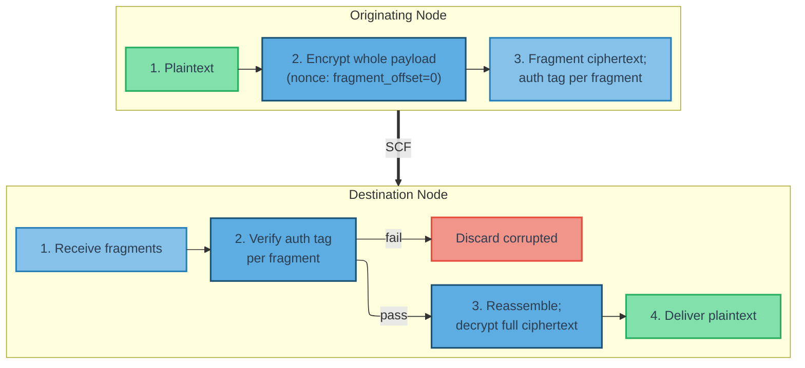

**Figure 13 — Fragmentation and Encryption Interaction**

**Note:** Implementations MAY decrypt per fragment by adjusting the AES-CTR counter to the fragment offset, but whole-message decrypt after reassembly is RECOMMENDED.

### 12.3 DataLink-Layer Encryption

**[GUIDANCE]**

#### 12.3.1 Role

DataLink-layer encryption provides **per-hop confidentiality and integrity** on individual link segments. It is the responsibility of each DataLink adapter and operates below the M4P transport layer. The transport layer is unaware of whether a DataLink encrypts its transmissions.

DataLink-layer encryption complements the M4P payload cipher (see Figure 12 for the two-layer interaction across a multi-hop path):

**M4P Payload Cipher vs. DataLink-Layer Encryption**

| Property | M4P Payload Cipher | DataLink Layer |
|---|---|---|
| Scope | Originating node to destination node | Per-hop (single link segment) |
| Confidentiality | Yes (AES-CTR) | Yes (when using TLS, IPsec, etc.) |
| Integrity / Authentication | Optional (4/8/16-byte auth tag per `AUTH_TAG_SIZE`) | Yes (when using TLS, IPsec, etc.) |
| Header protection | No (headers in the clear) | Yes (entire transmission encrypted) |
| What is protected | Application message payloads only | All M4P data including headers and NC messages |
| Intermediate node involvement | None — ciphertext forwarded as-is | Each hop encrypts/decrypts |
| Key source | Master PSK → HKDF epoch derivation | Per-modality provisioning |
| Key rotation | Epoch-based (e.g., 6–12 hours) | Modality-specific procedures |
| Transition window | Accept current + previous key | N/A (per-hop, immediate) |
| Relay nodes need key? | No — forward ciphertext as-is | Yes — per-hop encrypt/decrypt |
| Independence | Not derived from DataLink keys | Not derived from M4P PSK |

#### 12.3.2 Recommended DataLink Security by Modality

Deployments SHOULD enable DataLink-layer encryption on IP-based links, which are typically the easiest to intercept or inject.

- **IP/MQTT.** SHOULD use TLS 1.2+ with mutual authentication (client certificates). This protects all M4P traffic on that hop (including headers and NC payloads), authenticates peers and broker, and mitigates man-in-the-middle attacks on IP networks. TLS overhead is below M4P and does not consume M4P payload budget.
- **LAN.** SHOULD use IPsec (ESP) or equivalent link protection (for example, WireGuard or MACsec). This protects confidentiality and integrity on the LAN segment; overhead is at the IP/link layer, not the M4P payload budget.
- **Acoustic.** Link-layer encryption is often unavailable. The M4P payload cipher provides payload confidentiality, and integrity-sensitive traffic SHOULD set `AUTH_TAG_SIZE != 00` (see [Section 12.2.3](#1223-authentication-tag)). If modem-native link encryption exists, it SHOULD be enabled as an additional layer.
- **Radio.** SHOULD enable radio COMSEC or waveform-provided encryption when available. If unavailable, the M4P payload cipher still protects payload confidentiality.
- **Satellite.** SHOULD use TLS or DTLS when the terminal provides IP transport. Proprietary terminal encryption MAY provide an additional layer when available.

#### 12.3.3 Gateway and Bridge Behavior

When a node bridges traffic between modalities with different DataLink-layer encryption capabilities, the following invariant holds:

**M4P ciphertext is never modified in transit.** A bridge node:

1. Receives a transmission on one DataLink (e.g., LAN with IPsec). The DataLink adapter decrypts at the link layer, yielding M4P packets with encrypted payloads.
2. Stores the packets in the local message store (payload ciphertext intact).
3. When a transmission opportunity arises on another DataLink (e.g., acoustic), packs the packets into a transmission. The acoustic DataLink transmits them — the payload ciphertext is unchanged.

No re-encryption, tag stripping, or modality-aware crypto logic is required. The bridge node does not need the PSK. DataLink-layer encryption and decryption are handled independently by each DataLink adapter at each hop.

### 12.4 Key Management

#### 12.4.1 Payload Cipher Key

The M4P payload cipher uses the deployment PSK (see [Section 2.4.2](#242-required-configuration-must)). PSK provisioning is outside this specification and handled by deployment operations.

All nodes that host clients producing or consuming messages MUST use the same PSK. Relay-only nodes (no hosted clients) do not need the PSK and forward ciphertext as opaque bytes.

**[GUIDANCE] Epoch key derivation.** For deployments lasting more than 24 hours or involving periodic autonomous traffic, the provisioned PSK SHOULD be treated as a **master key** from which short-lived **epoch keys** are derived using a key derivation function (KDF). A RECOMMENDED approach:

```text
epoch_key = HKDF-Expand(
    PRK    = master_psk,
    info   = "M4P-epoch" || network_id || epoch_number,
    L      = 32  (AES-256 key length)
)
```

`epoch_number` is a monotonically increasing epoch identifier (for example from UTC hours, mission phase, or a deployment schedule). The derived epoch key is used as `payload_cipher_key` for that epoch and avoids nonce reuse across epoch boundaries (see [Section 12.2.2](#1222-nonce-derivation), *24-hour wrap behavior*). This assumes the master PSK is uniformly random 256-bit key material; if it comes from a passphrase or other low-entropy source, implementations SHOULD apply HKDF-Extract first (RFC 5869) before HKDF-Expand.

Deployments that use the master PSK directly (without epoch derivation) MUST account for the 24-hour nonce reuse risk described in [Section 12.2.2](#1222-nonce-derivation), *24-hour wrap behavior*.

See [Section 12.3.1](#1231-role) for a comparison of the M4P payload cipher and DataLink-layer encryption, including key management properties.

#### 12.4.2 Key Scope

The PSK is scoped to a deployment (network ID). Different deployments SHOULD use different keys. Combined with the `network_id_hash` in the nonce, this ensures that ciphertext from one deployment is not decryptable with another deployment's key, even if message header fields happen to collide.

#### 12.4.3 Key Rotation

Key rotation (epoch derivation in [Section 12.4.1](#1241-payload-cipher-key) or manual PSK replacement) requires DTN-aware coordination because nodes may not transition simultaneously.

**Transition window.** During the period between one node adopting a new epoch key and the last node transitioning:

- Nodes SHOULD accept decryption attempts with both the current and previous epoch key.
- If decryption with the current key fails and a previous key is available, the node SHOULD attempt decryption with the previous key before discarding the payload.
- Nodes MUST retain previous keys for at least the maximum configured message TTL to decrypt in-flight messages created under a prior epoch.

**Epoch synchronization.** For time-based derivation, all nodes derive from the same master PSK and epoch schedule. Sub-second agreement is unnecessary; nodes only need to agree on the current epoch. Deployments SHOULD choose intervals (for example 6 or 12 hours) that prevent nonce reuse while tolerating clock drift and DTN propagation delay.

**Scheduling guidance.** Deployments SHOULD minimize the transition window by placing epoch boundaries during high-connectivity periods (for example, surfaced operations or LAN availability).

Implementations MAY use the nonce's `reserved` field (2 bytes, currently `0x0000`) as a key epoch identifier in future protocol versions to facilitate unambiguous key selection without trial decryption.

#### 12.4.4 DataLink-Layer Keys

DataLink-layer key management is modality-specific:

- **MQTT/TLS:** X.509 certificates or PSK, managed per standard TLS provisioning practices.
- **IPsec:** Pre-shared keys or certificates, managed per standard IPsec/IKE provisioning.
- **Radio COMSEC:** Managed per the radio system's key management procedures.
- **Satellite:** Managed per the satellite terminal's security provisioning.

DataLink-layer keys are independent of the M4P payload cipher PSK.

### 12.5 Identity Obfuscation

NodeUIDs and ClientUIDs are opaque strings from M4P's perspective: transport and network logic do not interpret UID content. Applications MAY provide obfuscated UIDs (for example, pseudonyms instead of `vehicle-123`), and M4P uses them unchanged for address derivation, NC payloads, and conflict handling. This preserves protocol behavior while reducing identity exposure in NC traffic, which is not encrypted by the payload cipher.

Identity obfuscation is an application-layer responsibility. M4P does not define the mechanism, but all nodes in a deployment MUST apply the same scheme so the same logical identity maps to the same obfuscated UID. Deployments in contested environments SHOULD obfuscate all NodeUIDs and ClientUIDs (for example, HMAC-based pseudonymization) to reduce passive fleet enumeration.

### 12.6 Security Properties and Limitations

#### 12.6.1 What This Model Provides

- **Payload confidentiality from originating node to destination node** across all modalities. Intermediate forwarding nodes cannot access plaintext payloads.
- **Per-message payload integrity and authentication** via the optional authentication tag (`AUTH_TAG_SIZE`: 4, 8, or 16 bytes).
- **Per-hop integrity and confidentiality** on IP-based links (LAN, MQTT) via standard link-layer security (TLS, IPsec).
- **Defense in depth:** The M4P payload cipher and DataLink-layer encryption operate independently. Compromise of one layer does not compromise the other.
- **Transparent bridging:** Gateway nodes forward ciphertext payloads without cryptographic awareness or processing.
- **Transparent to applications:** Clients publish and subscribe as usual; M4P transport handles cryptographic operations when PSK is configured.

#### 12.6.2 What This Model Does Not Provide

- **Application-to-application confidentiality.** Originating and destination M4P transports see plaintext payloads. Applications that require confidentiality from M4P SHOULD encrypt payloads before submission.
- **Header confidentiality (end-to-end).** Transport headers (source/destination CA, message type, timestamps, payload length) remain in the clear; observers can infer communication patterns. DataLink encryption protects headers per-hop on supported links, not end-to-end.
- **Protection against traffic analysis.** Even with the payload cipher and DataLink-layer encryption, packet sizes, timing, and addressing patterns are observable. M4P does not provide traffic flow confidentiality.
- **NC message payload confidentiality (end-to-end).** NC payloads containing NodeUIDs and ClientUIDs are not encrypted by the payload cipher; they rely on DataLink-layer encryption where available. Identity obfuscation (see [Section 12.5](#125-identity-obfuscation)) mitigates passive exposure.

**Design Note (Non-Normative): Threat model alignment.** This model targets autonomous maritime deployments where fleet nodes share a trust domain. Primary threats and mitigations:

- **Passive IP eavesdropping:** Mitigated by DataLink-layer TLS/IPsec plus the M4P payload cipher.
- **Active IP interception/injection:** Mitigated by DataLink mutual authentication and integrity protections.
- **Passive acoustic eavesdropping:** Mitigated by the M4P payload cipher.
- **Active acoustic tampering:** Mitigated when `AUTH_TAG_SIZE != 00` is used (see [Section 12.2.3](#1223-authentication-tag)).

**Standards alignment.** M4P specifies AES-256-CTR (NIST SP 800-38A) and AES-CMAC (NIST SP 800-38B). Deployments requiring FIPS 140-2/3 assurances SHOULD use validated modules. Independent payload-cipher and DataLink layers support defense in depth (for example, CSfC). AES-256 satisfies CNSA 2.0 symmetric baseline requirements.

---

## 13. Future Features (Non-Normative)

This section is non-normative. It describes features under consideration for future protocol versions. RFC 2119 keywords are not used; language describes design intent, not binding requirements.

The following capabilities were considered during protocol design and deliberately deferred. The current specification reserves space for their addition in future versions.

### 13.1 Runtime Network ID Management

The `network_id` is currently a static deployment-time parameter ([Section 2.4.2](#242-required-configuration-must)). A future version could define a protocol-native mechanism for runtime `network_id` reassignment, allowing cross-network node management. This requires bypassing `network_id` scoping isolation — a core protocol invariant — likely via unscoped messages addressed by UID rather than CA. Until specified, deployments requiring runtime reconfiguration can use out-of-band mechanisms (e.g., a LAN-based management interface).

### 13.2 Graceful Network Departure

Currently, node departure is detected passively via claim expiration after `expiration_interval` ([Section 11.3](#113-claim-expiration-and-renewal)). A future **NC_NODE_DEPARTURE** message (Announce propagation) would accelerate address reclamation by broadcasting an incremented `address_version` that supersedes the active claim. Claim expiration remains the correctness backstop for unreachable nodes. Key challenges include distinguishing departure from conflict-triggered re-addressing, handling stale state in partitioned networks, and surfacing departure events to the application layer.

### 13.3 Message Type Defaults Synchronization

Per-message-type defaults (priority, TTL, modality mask) are currently static deployment-time parameters ([Section 2.4.3](#243-recommended-configuration-should)). A future version will add NC messages for querying peers' defaults and detecting configuration mismatches.

**On-demand query.** A Query/Answer pair (following the pattern in [Section 11.6.2](#1162-propagation-models)) would allow a node encountering an unknown `message_type_id` to flood a query that is absorbed by any node with configured defaults. Transitive resolution (as with NC_CLIENT_UID_QUERY) would enable learned defaults to propagate. Queries would need rate-limiting to prevent floods from bursts of unknown-type traffic.

**Bulk exchange.** An Announce request/response pair (following the NC_NETWORK_STATE_REQUEST/RESPONSE pattern) would enable rapid bootstrapping and link-local convergence on high-bandwidth links. The response payload (`2 + count × 5` bytes) could require fragmentation, which interacts with the NC no-fragment rule — this interaction needs resolution.

**Mismatch handling.** Unlike address conflicts, default mismatches have no protocol-level resolution; the protocol would detect and surface mismatches to the application layer for operator intervention. NC message type IDs for these four messages are not yet allocated.

---

## 14. Normative References

The following documents are referenced in normative portions of this specification. Implementers MUST understand these documents to correctly implement the M4P protocol.

- **[RFC2119]** Bradner, S., "Key words for use in RFCs to Indicate Requirement Levels", BCP 14, RFC 2119, March 1997. Referenced in [Section 1.3](#13-conventions) for MUST/SHOULD/MAY keyword interpretation.

- **[FIPS180-4]** National Institute of Standards and Technology, "Secure Hash Standard (SHS)", FIPS PUB 180-4, August 2015. SHA-256 is used in address derivation ([Section 11.1](#111-address-derivation-and-versioning)), nonce construction ([Section 12.2.2](#1222-nonce-derivation), *Nonce construction*), and client address fingerprint ([Appendix A.6](#a6-client-address-fingerprint)).

- **[FIPS197]** National Institute of Standards and Technology, "Advanced Encryption Standard (AES)", FIPS PUB 197, November 2001. AES-256 is the block cipher underlying the M4P payload cipher and CMAC authentication.

- **[SP800-38A]** Dworkin, M., "Recommendation for Block Cipher Modes of Operation: Methods and Techniques", NIST Special Publication 800-38A, December 2001. Defines AES-CTR mode used by the M4P payload cipher ([Section 12.2](#122-m4p-payload-cipher)).

- **[SP800-38B]** Dworkin, M., "Recommendation for Block Cipher Modes of Operation: The CMAC Mode for Authentication", NIST Special Publication 800-38B, May 2005. Defines AES-CMAC used for the authentication tag ([Section 12.2.3](#1223-authentication-tag), *Tag computation*).

## 15. Informative References

The following documents are referenced for background and context. They are not required for implementation.

- **[RFC9171]** Burleigh, S., Fall, K., and E. Birrane, "Bundle Protocol Version 7", RFC 9171, January 2022. The IETF's delay-tolerant networking protocol; M4P references the Bundle Protocol's custody transfer model in [Section 2.8](#28-relationship-to-existing-standards-non-normative) as a design contrast.

- **[RFC5050]** Scott, K. and S. Burleigh, "Bundle Protocol Specification", RFC 5050, November 2007. The predecessor DTN Bundle Protocol, referenced alongside RFC 9171.

- **[RFC3552]** Rescorla, E. and B. Korver, "Guidelines for Writing RFC Text on Security Considerations", BCP 72, RFC 3552, July 2003. Guidance document for security analysis methodology.

- **[RFC5869]** Krawczyk, H. and P. Eronen, "HMAC-based Extract-and-Expand Key Derivation Function (HKDF)", RFC 5869, May 2010. HKDF is recommended for epoch key derivation in [Section 12.4.1](#1241-payload-cipher-key).

- **[SP800-108r1]** Chen, L., "Recommendation for Key Derivation Using Pseudorandom Functions", NIST Special Publication 800-108 Revision 1, August 2022. Alternative KDF referenced in [Section 12.4.1](#1241-payload-cipher-key) guidance.

---

## Appendix A: Reference Algorithms

The following reference implementations are provided for clarity. They are non-normative; any implementation that produces equivalent results is conformant.

### A.1 Compact Type Encoding

```python
def encode_cte(type_id: int) -> bytes:
    """Encode a Message Type ID using Compact Type Encoding."""
    if type_id <= 127:
        return bytes([type_id])
    else:
        return bytes([0x80 | ((type_id >> 8) & 0x7F), type_id & 0xFF])


def decode_cte(data: bytes, offset: int) -> tuple[int, int]:
    """Decode a CTE value. Returns (type_id, bytes_consumed)."""
    if data[offset] & 0x80 == 0:
        return (data[offset], 1)
    else:
        value = ((data[offset] & 0x7F) << 8) | data[offset + 1]
        return (value, 2)
```

### A.2 TTL Encoding and Decoding

```python
def encode_ttl(seconds: int) -> int:
    """Encode a TTL value in seconds to the wire format (0-255)."""
    if seconds == 0:
        return 0  # One-hop
    elif seconds <= 60:
        return seconds
    elif seconds <= 660:
        return min(60 + (seconds - 60) // 10, 120)
    elif seconds <= 4260:
        return min(120 + (seconds - 660) // 60, 180)
    else:
        return min(180 + (seconds - 4260) // 300, 255)


def decode_ttl(n: int) -> int:
    """Decode a wire TTL value to seconds. 0 = one-hop only."""
    if n == 0:
        return 0  # One-hop only
    elif n <= 60:
        return n
    elif n <= 120:
        return (n - 60) * 10 + 60
    elif n <= 180:
        return (n - 120) * 60 + 660
    else:  # 181-255
        return (n - 180) * 300 + 4260
```

### A.3 Timestamp Age Calculation

```python
def calculate_packet_age(current_time_24h: int, packet_timestamp_24h: int) -> int:
    """Calculate packet age in seconds, handling 24-hour wraparound."""
    diff = current_time_24h - packet_timestamp_24h

    if diff > 43200:
        diff = diff - 86400
    elif diff < -43200:
        diff = diff + 86400

    return max(0, diff)
```

### A.4 MIID Computation

```python
def pack_miid32(src_ca: int, ts_seconds: int, counter: int) -> int:
    """Compute MIID32 for 8-bit addressing mode."""
    ts24 = int(ts_seconds) % 86400
    return ((src_ca & 0xFF) << 24) | ((ts24 & 0x1FFFF) << 7) | (counter & 0x7F)


def unpack_miid32(miid32: int) -> tuple[int, int, int]:
    """Decompose MIID32 into (source_ca, timestamp_24h, msg_counter)."""
    src_ca = (miid32 >> 24) & 0xFF
    ts24 = (miid32 >> 7) & 0x1FFFF
    ctr = miid32 & 0x7F
    return (src_ca, ts24, ctr)


def pack_miid40(src_ca: int, ts_seconds: int, counter: int) -> int:
    """Compute MIID40 for 16-bit addressing mode."""
    ts24 = int(ts_seconds) % 86400
    return ((src_ca & 0xFFFF) << 24) | ((ts24 & 0x1FFFF) << 7) | (counter & 0x7F)


def unpack_miid40(miid40: int) -> tuple[int, int, int]:
    """Decompose MIID40 into (source_ca, timestamp_24h, msg_counter)."""
    src_ca = (miid40 >> 24) & 0xFFFF
    ts24 = (miid40 >> 7) & 0x1FFFF
    ctr = miid40 & 0x7F
    return (src_ca, ts24, ctr)
```

### A.5 Address Derivation

```python
import hashlib

PRIME_STEP = 7919

def derive_address_base(network_id: str, uid: str, address_space: int) -> int:
    """Derive the base address for a UID within a network."""
    nid_bytes = network_id.encode('utf-8')
    hash_input = len(nid_bytes).to_bytes(2, 'big') + nid_bytes + uid.encode('utf-8')
    digest = hashlib.sha256(hash_input).digest()
    raw = int.from_bytes(digest[:4], 'big')
    return raw % address_space


def derive_address(network_id: str, uid: str, version: int,
                   address_space: int, occupied: set[int]) -> tuple[int, int]:
    """Derive an address, skipping broadcast (0) and occupied addresses.
    Returns (address, version) after any necessary increments."""
    base = derive_address_base(network_id, uid, address_space)
    while True:
        addr = (base + version * PRIME_STEP) % address_space
        if addr != 0 and addr not in occupied:
            return (addr, version)
        version += 1
```

### A.6 Client Address Fingerprint

```python
def compute_ca_fingerprint(client_uid: str, ca: int, address_version: int) -> int:
    """Compute the 16-bit client address fingerprint."""
    digest = hashlib.sha256(
        client_uid.encode('utf-8')
        + ca.to_bytes(2, 'big')
        + address_version.to_bytes(2, 'big')
    ).digest()
    return (digest[0] << 8) | digest[1]
```

### A.7 Authentication Tag (CMAC with Header AAD)

**Compatibility note.** Earlier draft reference code mapped Network Control Message Type IDs (`32,000-32,767`) to `"request"` in `get_packet_class` with an inline warning comment. This version raises `ValueError` for NC Message Type IDs so NC exclusion from payload encryption/header-AAD handling is explicit.

```python
from cryptography.hazmat.primitives.cmac import CMAC
from cryptography.hazmat.primitives.ciphers.algorithms import AES


# --- Packet class determination ---

# Status:   message_type_id 0 - 7,999
# Event:    message_type_id 8,000 - 9,999
# Request:  message_type_id 10,001 - 31,997 (odd)
# Response: message_type_id 10,000 - 31,998 (even)
# NC:       message_type_id 32,000 - 32,767 (not encrypted in this version)

def get_packet_class(message_type_id: int) -> str:
    """Determine the packet class from the message_type_id."""
    if message_type_id <= 7999:
        return "status"
    elif message_type_id <= 9999:
        return "event"
    elif message_type_id == 31999:
        raise ValueError("Message Type ID 31,999 is reserved")
    elif message_type_id >= 32000:
        raise ValueError(
            "NC packets are not encrypted in this version and do not use header_aad"
        )
    elif message_type_id % 2 == 1:
        return "request"
    else:
        return "response"


# --- Header AAD construction ---

def build_header_aad_status(flags: int, payload_length: int) -> bytes:
    """Construct header_aad for a Status or Event packet.

    header_aad = flags (1 byte) || payload_length (2 bytes, big-endian)
    """
    return (
        flags.to_bytes(1, 'big')
        + payload_length.to_bytes(2, 'big')
    )


def build_header_aad_request(destination: int, flags: int,
                             payload_length: int,
                             is_16bit_addressing: bool,
                             additional_dests: list[int] | None = None) -> bytes:
    """Construct header_aad for a Request packet.

    header_aad = destination (1 or 2 bytes) || flags (1 byte)
                 || [additional_dest_count (1 byte)
                     || additional_dest[] (count * addr_size bytes)]
                 || payload_length (2 bytes, big-endian)

    The bracketed fields are present only when ADDITIONAL_DEST_PRESENT
    (bit 4) is set in flags.
    """
    addr_size = 2 if is_16bit_addressing else 1
    aad = (
        destination.to_bytes(addr_size, 'big')
        + flags.to_bytes(1, 'big')
    )
    if flags & (1 << 4):  # ADDITIONAL_DEST_PRESENT
        dests = additional_dests or []
        aad += len(dests).to_bytes(1, 'big')
        for ca in dests:
            aad += ca.to_bytes(addr_size, 'big')
    aad += payload_length.to_bytes(2, 'big')
    return aad


def build_header_aad_response(destination: int,
                               timestamp_24h_response: int,
                               flags_7bit: int,
                               payload_length: int,
                               is_16bit_addressing: bool) -> bytes:
    """Construct header_aad for a Response packet.

    header_aad = destination (1 or 2 bytes)
                 || payload_length (2 bytes, big-endian)
                 || timestamp_24h_response (17 bits) + flags (7 bits)
                    packed into 3 bytes

    Fields are concatenated in wire order per Section 5.4.
    """
    addr_size = 2 if is_16bit_addressing else 1
    # Pack timestamp_24h_response (17 bits) and flags (7 bits) into 3 bytes
    packed_ts_flags = (timestamp_24h_response << 7) | (flags_7bit & 0x7F)
    return (
        destination.to_bytes(addr_size, 'big')
        + payload_length.to_bytes(2, 'big')
        + packed_ts_flags.to_bytes(3, 'big')
    )


def build_header_aad(message_type_id: int, flags: int,
                     payload_length: int,
                     is_16bit_addressing: bool,
                     destination: int = 0,
                     timestamp_24h_response: int = 0,
                     additional_dests: list[int] | None = None) -> bytes:
    """Construct header_aad for any packet class.

    Args:
        message_type_id: Determines the packet class.
        flags: 8-bit flags for Status/Event/Request, 7-bit for Response.
        payload_length: Payload length in bytes.
        is_16bit_addressing: True for 16-bit addressing mode.
        destination: Destination address (Request/Response only).
        timestamp_24h_response: Response timestamp (Response only).
        additional_dests: Additional destination CAs (group Requests only).
    """
    packet_class = get_packet_class(message_type_id)
    if packet_class in ("status", "event"):
        return build_header_aad_status(flags, payload_length)
    elif packet_class == "request":
        return build_header_aad_request(
            destination, flags, payload_length, is_16bit_addressing,
            additional_dests
        )
    else:
        return build_header_aad_response(
            destination, timestamp_24h_response, flags,
            payload_length, is_16bit_addressing
        )


# --- AUTH_TAG_SIZE mapping ---

AUTH_TAG_SIZE_MAP = {
    0b01: 4,   # Standard tag
    0b10: 8,   # Extended tag
    0b11: 16,  # Full tag (untruncated CMAC)
}


def get_tag_length(auth_tag_size: int) -> int:
    """Return the tag length in bytes for a given AUTH_TAG_SIZE value.

    auth_tag_size: 2-bit value from the flags field (0b00 = no tag).
    Raises ValueError if auth_tag_size is 0b00 (no tag) or invalid.
    """
    if auth_tag_size not in AUTH_TAG_SIZE_MAP:
        raise ValueError(f"Invalid AUTH_TAG_SIZE: {auth_tag_size:#04b}")
    return AUTH_TAG_SIZE_MAP[auth_tag_size]


# --- Tag computation and verification ---

def compute_auth_tag(key: bytes, nonce: bytes, header_aad: bytes,
                     ciphertext: bytes,
                     auth_tag_size: int = 0b01) -> bytes:
    """Compute the authentication tag.

    tag = TRUNCATE_N(AES-CMAC(key, nonce || header_aad || ciphertext))

    where N is determined by auth_tag_size:
        0b01 -> 4 bytes (standard)
        0b10 -> 8 bytes (extended)
        0b11 -> 16 bytes (full CMAC output)
    """
    tag_len = get_tag_length(auth_tag_size)
    c = CMAC(AES(key))
    c.update(nonce + header_aad + ciphertext)
    full_mac = c.finalize()
    return full_mac[:tag_len]


def verify_auth_tag(key: bytes, nonce: bytes, header_aad: bytes,
                    ciphertext: bytes, received_tag: bytes,
                    auth_tag_size: int = 0b01) -> bool:
    """Verify a received authentication tag. Returns True if valid."""
    expected_tag = compute_auth_tag(key, nonce, header_aad, ciphertext,
                                   auth_tag_size)
    # Note: production implementations SHOULD use a constant-time comparison
    # function (e.g., hmac.compare_digest). This reference uses hmac for
    # correctness; a simple byte-by-byte comparison would be vulnerable to
    # timing side channels.
    import hmac
    return hmac.compare_digest(expected_tag, received_tag)
```

---

## Appendix B: Glossary

| Term | Definition |
|---|---|
| **AUTH_TAG_SIZE** | A 2-bit flag field (bits [7:6] for Status/Event/Request, bits [6:5] for Response) that controls the presence and size of the AES-CMAC authentication tag: `00` = no tag, `01` = 4 bytes, `10` = 8 bytes, `11` = 16 bytes. See [Section 12.2.3](#1223-authentication-tag) for details. |
| **Broadcast** | A packet with `destination = 0`, intended for all reachable nodes and clients. |
| **Client** | An application-layer endpoint that originates or consumes Messages. Identified globally by a ClientUID and locally by a Client Address (CA). |
| **Client Address (CA)** | An 8-bit or 16-bit local address identifying a client endpoint on the wire. Appears in the `source` and `destination` fields of packet headers. |
| **ClientUID** | A globally unique, persistent string identifying a specific client instance. Does not appear in transport layer packet headers. |
| **Compact Type Encoding (CTE)** | Variable-length encoding for Message Type IDs: 1 byte for values 0-127, 2 bytes for values 128-32,767. |
| **DataLink** | A modality adapter that connects M4P to a physical communication layer. Reports transmission opportunities and payload budgets. |
| **Event** | A broadcast application message class for fact records ("what happened") retained per message instance until TTL expiry; newer Events do not supersede older ones. |
| **Fragment** | A portion of a larger message, carried in a packet with the `IS_FRAGMENT` flag set. Each fragment's `offset` field identifies its starting byte position within the original ciphertext payload. Any node may further split (re-fragment) a received fragment; the resulting sub-fragments carry correct byte offsets and are interchangeable with fragments produced by any other node. |
| **Message** | An application-layer unit (status update, event, command, query, response) produced or consumed by a Client. Directed messages (Request/Response) specify their destination by ClientUID; the transport layer resolves to an on-wire Client Address internally. |
| **Message Instance ID (MIID)** | A unique identifier derived from packet header fields, used for deduplication and request/response correlation. |
| **Message Type ID** | An unsigned integer classifying the packet payload and determining its transport semantics (Status `0-7,999`, Event `8,000-9,999`, Request/Response `10,000-31,998`, or Network Control `32,000-32,767`). |
| **Modality** | A class of data link (acoustic, radio, satellite, LAN, IP/MQTT). |
| **Network Control** | Reserved message types (32,000-32,767) used for transport-internal and network layer coordination. Not delivered to application clients. |
| **Node** | A physical participant in the M4P network. Runs the M4P transport, hosts zero or more Clients, and connects to one or more DataLinks. Identified globally by a NodeUID and locally by a Node Address (NA). |
| **Node Address (NA)** | An 8-bit or 16-bit local address identifying a node for transport and forwarding purposes. Does not appear in transport layer data packet headers; carried in transmission metadata and network layer messages. |
| **NodeUID** | A globally unique, persistent string identifying a physical node. Does not appear in transport layer packet headers. |
| **One-hop** | A transmission mode (`ttl_override = 0`) where the packet is sent once and not forwarded by receiving nodes. |
| **Packet** | The smallest addressable unit within a Transmission. Contains a packet header and carries a complete Message or a Fragment. |
| **Request** | A directed application message class used for command/query interactions. Requests are retained per message instance, may be retried under resend policy, and are correlated to Responses by MIID. |
| **Response** | A directed application message class sent to answer a Request. Carries the corresponding `request_MIID` for correlation and is retained per response instance subject to TTL and resend policy. |
| **Status** | A broadcast application message class for current-state snapshots ("what is true now"). Status values supersede older values per `(source CA, message_type_id, status_key)` variant. |
| **Store-carry-forward (SCF)** | The delay-tolerant forwarding model where nodes store packets locally and forward them opportunistically when link opportunities arise. |
| **Transmission** | One send operation on a specific data link modality, carrying one or more serialized Packets plus transmission metadata. |
| **TTL (Time-to-Live)** | The maximum duration a packet remains valid in the network. Expired packets are discarded and not forwarded. |

---

## Appendix C: Application Integration Guidelines (Non-Normative)

This appendix provides guidance for application developers on message payload design and effective use of M4P. The recommendations here are non-normative — they represent best practices but are not required for protocol conformance.

**UID-based application API.** Applications interact with M4P exclusively through UIDs (see [Section 2.7](#27-application-layer-responsibilities), [Section 3.1](#31-global-identities)). If the destination ClientUID's address mapping is not yet known at submission time, the transport queues the message in a **pending address resolution** state (see [Section 9.2](#92-per-node-message-store)). Nodes that bootstrap via NC_NETWORK_STATE_REQUEST ([Section 11.7.3](#1173-nc_network_state_response-32002) guidance) will have mappings available shortly after startup, minimizing resolution delay.

**Message Type ID allocation.** M4P does not define or govern specific Message Type IDs within the application ranges (Status `0-7,999`, Event `8,000-9,999`, and Request/Response `10,000-31,998`). Each deployment defines its own message type catalog — the set of type IDs, their payload schemas, and their per-type configuration defaults (priority, TTL). There is no protocol-level registry or coordination mechanism for application type IDs — type allocation is fully owned by each application or deployment. See [Section 4.1](#41-message-type-id-ranges) for the range definitions and [Section 2.4.3](#243-recommended-configuration-should) for per-type configuration guidance.

### C.1 Message Payload Design

Application message payloads SHOULD be designed with the following principles:

**Use compact encoding.** On constrained links where payload budgets may be measured in tens of bytes, encoding efficiency directly determines mission capability. Applications SHOULD:

- Use binary encoding rather than text-based formats (JSON, XML) where feasible.
- Employ fixed-width fields or variable-length encoding appropriate to the data range.
- Avoid redundant or optional metadata that can be inferred from context.
- Consider domain-specific compression for telemetry and sensor data.

**Design for the operating environment.** Effective M4P applications require deliberate message design:

- Prioritize mission-critical information over nice-to-have data.
- Design command payloads to be compact and unambiguous.
- Use bounded Event TTLs on constrained deployments. Event messages are append-retained per message instance, so high-rate event streams can accumulate until expiration.
- Consider the fragmentation threshold: messages requiring fragmentation consume more transmission opportunities and have lower delivery probability on lossy links. This is especially important for Status messages, which are subject to supersession — if a newer Status value arrives before all fragments of the older value are reassembled, the older fragments represent wasted bandwidth and the reassembly buffer is discarded ([Section 8.4.2](#842-status-reassembly-supersession)). Status payloads SHOULD be sized to fit within the smallest expected link budget for any modality the message targets, avoiding fragmentation entirely where possible.

### C.2 Data Link Integration

Adaptive data link behaviors are the application's responsibility (see [Section 10.4](#104-data-link-adaptation)).

**Example: Acoustic TDMA adaptation.** Consider a deployment using acoustic modems with configurable TDMA scheduling. On startup, the application pre-provisions the TDMA schedule based on the expected fleet composition (matching the M4P network state obtained via NC_NETWORK_STATE_REQUEST/RESPONSE per [Section 11.7.3](#1173-nc_network_state_response-32002) guidance). During operation:

1. A new AUV is deployed mid-mission. It broadcasts NC_NODE_ADDRESS_CLAIM and NC_NODE_SUMMARY.
2. Each existing node's M4P network layer receives the summary and updates its peer registry.
3. Each existing node's application observes the new peer in the registry.
4. Each application reconfigures its local acoustic adapter's TDMA schedule to include a slot for the new node, using the adapter's modem-specific command interface.
5. The new node's application similarly configures its acoustic adapter based on the fleet state it learns from NC_NETWORK_STATE_RESPONSE broadcasts or accumulated NC_NODE_SUMMARY broadcasts.

The M4P protocol is uninvolved in steps 3–5. The transport layer continues to receive transmission opportunities from the adapter and build transmissions — it does not know or care that the TDMA schedule changed. This separation means the same M4P transport code works with TDMA modems, CSMA modems, unscheduled modems, or any future MAC protocol, with only the application-layer integration logic changing.

**What M4P does not provide.** M4P does not guarantee that all nodes will converge on the same TDMA schedule simultaneously. Schedule convergence depends on NC message propagation latency and the application's adaptation logic. During the transition period, some nodes may operate with the old schedule while others have updated. This is acceptable because M4P's transport layer is schedule-agnostic — it sends when the adapter offers an opportunity, regardless of the underlying MAC state. Temporary schedule inconsistency may reduce acoustic throughput but does not cause protocol-level failures.

---

## Appendix D: Test Vectors (Forthcoming)

This appendix will provide byte-level test vectors for independent implementation verification. Test vectors will be generated from the reference algorithms in Appendix A after all wire format changes are finalized. The following areas will be covered:

1. **MIID computation** — `(source_CA, timestamp_24h, msg_counter)` inputs with expected MIID32 and MIID40 hex outputs for both addressing modes.
2. **Packet serialization** — Complete Status, Event, Request, and Response packets (8-bit and 16-bit modes, with and without optional fields) as annotated hex byte sequences with field boundary markers.
3. **Nonce construction** — Header field values mapped to the 16-byte nonce for each packet class, including the Response nonce field mapping ([Section 12.2.2](#1222-nonce-derivation), *Nonce construction*).
4. **Address derivation** — `(network_id, uid)` inputs through SHA-256, base address extraction, and conflict-step derivation for both addressing modes.
5. **TTL encoding round-trip** — Encode and decode at each piecewise boundary (0, 30, 60, 90, 120, 180, 255) to verify the non-linear encoding.
6. **CMAC authentication tag** — Tag computation including header AAD construction for each packet class ([Section 12.2.3](#1223-authentication-tag), *Tag computation*), with 4-byte, 8-byte, and 16-byte truncation outputs.
7. **Encryption round-trip** — Plaintext payload through nonce construction, AES-256-CTR encryption, and decryption, verifying ciphertext and recovered plaintext match.
8. **Fragment byte-range coverage** — Coverage tracking and redundancy decisions for overlapping fragments, re-fragmented fragments, and cross-form interactions.

Each test vector will include all intermediate values (hash digests, derived keys, nonce bytes) to enable implementers to isolate errors at each computation step.

---

*End of specification.*
