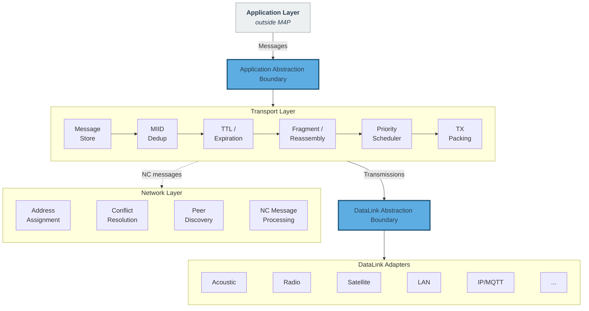
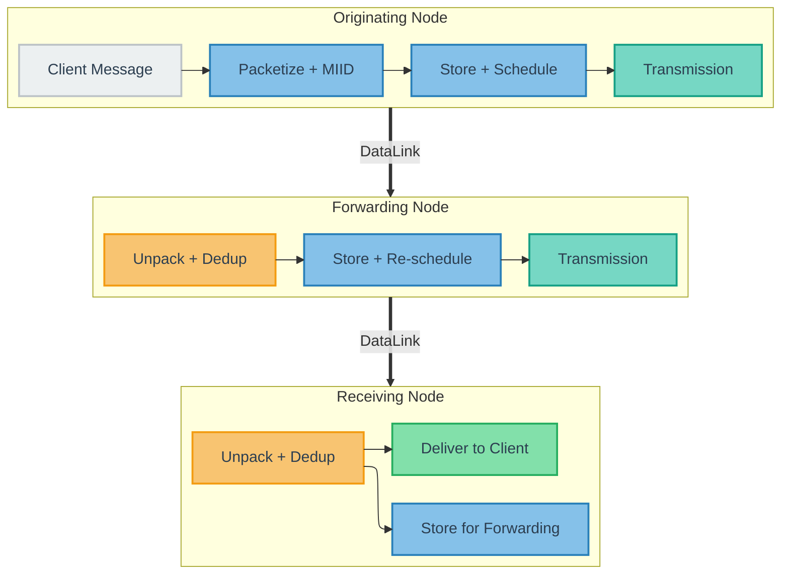
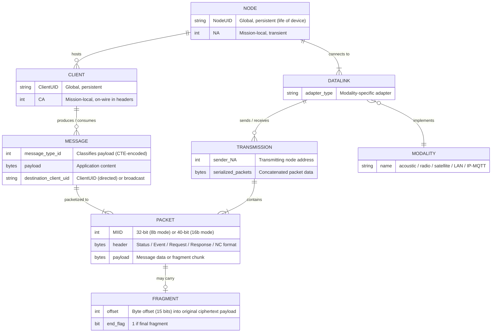

## 2. Protocol Overview {#2-protocol-overview}

### 2.1 Design Philosophy

M4P is built for intermittently connected, bandwidth-constrained maritime networks with mobile nodes, high latency, and modest scale (typically tens to hundreds of nodes).

**Primary use case (non-normative).** M4P is primarily designed to enable collaborative autonomy: multiple autonomous platforms and operator endpoints coordinating shared mission state, telemetry, and command/response workflows over intermittent, heterogeneous links. This design driver favors eventual dissemination, bounded staleness, and bandwidth-efficient forwarding over connection-oriented guarantees such as ordered delivery and per-hop acknowledgments.

- **Local broadcast + store-carry-forward.** Transmissions are sent as modality-local broadcast; receiving nodes may store and forward packets as later link opportunities appear (see [Section 9.1](#91-store-carry-forward-model)). End-to-end paths are not assumed at send time.
- **Local decisions, no global routing.** Nodes do not require global routing tables, topology convergence, or centralized coordination. Forwarding, address management, conflict resolution, and peer discovery operate through local observation and peer state exchange.
- **Dissemination over path optimality.** Scheduling prioritizes packets likely to add the most new information to peers, rather than shortest-path routing. Dispersion-aware scheduling is optional and interoperable (see [Section 9.10](#910-dispersion-aware-scheduling-mesh-modalities)).
- **Bandwidth-aware transport, bandwidth-agnostic applications.** Applications produce messages without per-link tuning; transport adapts per modality by selecting and packing the highest-value packets within each payload budget (see [Section 9.4](#94-priority-and-scheduling) through [Section 9.7](#97-link-opportunities-and-transmission-building)).
- **Wire efficiency first.** Header overhead is minimized for small payload budgets (for example, an 8-byte Status header, Compact Type Encoding in [Section 4.2](#42-compact-type-encoding-cte), and nonce derivation from existing header fields).
- **Static baseline, dynamic runtime convergence.** Nodes are pre-provisioned with network-wide constants (`network_id`, addressing mode, payload cipher settings, claim expiration interval, and per-message-type transport defaults; see [Section 2.4](#24-network-wide-configuration)). Runtime state (peer membership, address mappings/conflicts, and forwarding opportunities) converges through NC exchange and local observation.

### 2.2 Protocol Layers

M4P is organized into two protocol layers and a link abstraction boundary:

**Transport Layer.** Moves application messages across opportunistic links. It owns packet formats, message instance tracking and deduplication (MIID), Time-to-Live (TTL) and expiration, fragmentation and reassembly, priority scheduling, transmission packing, and store-carry-forward forwarding behavior. The transport layer is fully specified in this document.

**Network Layer.** Coordinates identity and address state needed by the transport layer across a deployment: mission-scoped address assignment and conflict resolution, global-identity to local-address mapping, peer discovery, and fleet membership signaling. In M4P this is a coordination layer, not a global routing protocol. It uses reserved Network Control message types (see [Section 4.1](#41-message-type-id-ranges)) carried by the transport layer and is specified in [Section 11](#11-network-layer).

**DataLink Abstraction.** Boundary between M4P and physical communication. Each modality adapter (acoustic modem, radio, satellite terminal, LAN interface) exposes transmission opportunities and payload budgets to M4P; modality-specific mechanics remain below this boundary. The DataLink abstraction is defined in [Section 10](#10-datalink-abstraction).

Figure 1 illustrates the three-layer architecture and the boundaries between them.

**Figure 1 — M4P Protocol Layer Architecture**

### 2.3 Message Flow

The fundamental data flow through M4P follows this path:

1. An application client issues a **Message** containing a message type identifier, a payload, and (for directed messages) a destination **ClientUID**. Broadcast application classes (Status and Event) carry no destination field. The transport layer resolves directed ClientUIDs to on-wire Client Addresses (CA) internally.
2. The originating node's transport layer converts the Message into one or more **Packets**, fragmenting if necessary, and stores them for delivery.
3. When a DataLink reports a transmission opportunity and payload budget, the node's scheduler selects eligible packets, packs them into a **Transmission** that fits within the budget, and delivers the Transmission to the DataLink for sending.
4. A receiving node unpacks the Transmission, deduplicates against previously seen MIIDs, delivers packets addressed to local clients (including group Requests addressed to any locally-hosted CA), and stores packets for subsequent forwarding.

This cycle repeats across every link and every intermediate node until the message reaches its destination or its TTL expires. Figure 2 illustrates this end-to-end data flow.

**Figure 2 — Message → Packet → Transmission Data Flow**

Receiving nodes deliver packets addressed to local clients and store them for forwarding to other neighbors. The detailed lifecycle of packets within the message store is specified in [Section 9.1](#91-store-carry-forward-model).

**Data Unit Summary**

| Unit | Key Metadata | Created By | Consumed By |
|---|---|---|---|
| **Message** | type, payload, destination ClientUID | Application Client | Destination Client |
| **Packet** | header + payload, MIID | Transport (packetize) | Transport (unpack, deduplicate) |
| **Transmission** | sender NA + serialized packets | Scheduler/Packer | DataLink (send) → DataLink (receive) |

### 2.4 Network-Wide Configuration

M4P uses a small set of deployment-wide configuration parameters. Some are required for interoperability (MUST): `network_id`, addressing mode, payload cipher configuration (when used), and claim expiration interval. Others improve transport efficiency (SHOULD) but are not strictly required for interoperability.

#### 2.4.1 Addressing Mode Configuration

M4P supports two network-wide addressing modes that govern the size of address fields in packet headers:

- **8-bit addressing**: Client Addresses (CA) and Node Addresses (NA) are 8-bit unsigned integers (address space: 1-255, with 0 reserved for broadcast). Produces 32-bit MIIDs.
- **16-bit addressing**: Client Addresses and Node Addresses are 16-bit unsigned integers (address space: 1-65,535, with 0 reserved for broadcast). Produces 40-bit MIIDs.

The addressing mode is a network-wide configuration parameter. All nodes in a deployment MUST use the same addressing mode. The addressing mode affects packet header sizes, MIID computation, and address field widths throughout this specification. Where field sizes differ between modes, both variants are specified.

#### 2.4.2 Required Configuration (MUST)

The following parameters MUST be consistent across all nodes in a deployment:

**Network identifier.** All nodes in a deployment MUST be configured with the same `network_id` — a UTF-8 string that uniquely identifies the M4P network instance. The `network_id` serves three roles:

1. **Address scoping.** Addresses are scoped to a `network_id`. Separate M4P networks MAY reuse the same numeric addresses without conflict, enabling multiple independent network instances to coexist on shared communication infrastructure.
2. **Address derivation.** The `network_id` is an input to the address derivation hash (see [Section 11.1](#111-address-derivation-and-versioning)).
3. **Encryption nonce construction.** The `network_id` is an input to nonce generation (see [Section 12.2.2](#1222-nonce-derivation), *Nonce construction*), ensuring that identical plaintext on different networks produces different ciphertext.

On data links that support topic or channel separation (e.g., MQTT), the `network_id` SHOULD be used as a topic prefix or equivalent mechanism to enforce network isolation at the data link layer.

The format and content of the `network_id` are deployment-specific (e.g., a mission name, a UUID, a fleet identifier). Two deployments operating in overlapping communication range MUST use different `network_id` values to prevent address collisions and nonce reuse.

The `network_id` is a static deployment-time configuration parameter. Runtime `network_id` assignment (cross-network management) is outside the scope of this version of the specification. Deployments requiring runtime reconfiguration MAY use out-of-band mechanisms (e.g., a LAN-based management interface) to update node configuration.

**Addressing mode.** All nodes in a deployment MUST use the same addressing mode (8-bit or 16-bit), as defined in [Section 2.4.1](#241-addressing-mode-configuration). The addressing mode determines the size of address fields in packet headers and MIID width. Nodes operating in different addressing modes cannot interoperate.

**Payload cipher configuration.** The M4P payload cipher key (also referred to as the pre-shared key, or PSK) is a symmetric key shared by nodes participating in payload encryption. If the optional M4P payload cipher is used (see [Section 12](#12-encryption-and-security)), all nodes that host application clients MUST share the same PSK. For deployments lasting more than 24 hours, the PSK SHOULD be used as a master key for epoch-based key derivation (see [Section 12.4.1](#1241-payload-cipher-key)). The payload cipher is fixed to AES-256-CTR (see [Section 12.2](#122-m4p-payload-cipher)); there are no configurable cipher suite options. Encryption configuration is all-or-nothing across a deployment:

- When a PSK is configured, the M4P transport encrypts application message payloads at the originating node and decrypts them at the destination node. Intermediate forwarding nodes do not need the PSK — they forward ciphertext payloads as opaque bytes.
- When no PSK is configured, payloads are carried in the clear (subject to any DataLink-layer encryption).

Nodes with inconsistent PSK configuration cannot decrypt each other's messages. The payload cipher is optional; deployments MAY operate without it if the threat model permits. The two-layer encryption architecture (payload cipher + DataLink-layer) is illustrated in Figure 12.

**Claim expiration interval.** All nodes in a deployment MUST use the same `expiration_interval` — the maximum duration an address claim remains valid without renewal (see [Section 11.3.1](#1131-expiration-interval)). Claim expiration status is computed independently by each node from the `claim_renewal_timestamp` and the shared `expiration_interval`; divergent values would cause disagreement on active addresses, producing inconsistent peer registries and potential address conflicts.

#### 2.4.3 Recommended Configuration (SHOULD)

**Per-message-type defaults.** Each Message Type ID SHOULD have default **Priority** and **TTL** values stored in per-node configuration and applied automatically during scheduling and forwarding. Per-packet overrides are available via the `priority_override` and `ttl_override` optional fields (see [Section 5.7.6](#576-optional-field-definitions) and [Section 7](#7-time-to-live-and-packet-expiration)). Defaults are deployment-specific and can be provisioned statically or synchronized dynamically (see [Section 13.3](#133-message-type-defaults-synchronization)). When a node receives a packet with a Message Type ID for which it has no configured defaults, it MUST NOT discard the packet; it MUST apply implementation-defined fallback values for priority and TTL so the packet can still be stored, scheduled, and forwarded.

### 2.5 Design Constraints and Deliberate Tradeoffs

M4P is not a general-purpose networking protocol. It is optimized for the collaborative-autonomy traffic patterns described in [Section 2.1](#21-design-philosophy): periodic telemetry (Status), append-retained observations (Event), command-and-control exchanges (Request/Response), and coordination signals among small fleets. The on-wire format reflects deliberate tradeoffs that optimize for these patterns under intermittent connectivity, extreme bandwidth constraints, and dynamic topology.

M4P deliberately omits reliable ordered delivery, per-packet acknowledgments, flow/congestion control, long-lived connection state, and large address spaces. These features assume conditions that do not hold in the target environment: continuous end-to-end connectivity, measurable round-trip times, and bidirectional links. Instead, M4P provides MIID deduplication, TTL expiration, request/response correlation, latest-value Status coalescing, and append-retained Event handling — mechanisms designed for intermittent, delay-tolerant networks. Headers are compact: a Status packet header can be as small as 8 bytes (Event minimum is 9 bytes).

**Design Note (Non-Normative):** Packet headers do not carry a protocol-version field to preserve byte budget on constrained links. Version compatibility is managed at deployment scope, with limited wire-level tolerance handled by rules such as unknown-flag processing (see [Section 9.9.2](#992-unknown-flag-bits) and [Section 9.9.3](#993-protocol-version-compatibility)).

#### 2.5.1 Timestamp Ambiguity Window

Timestamps use `mod 86400` arithmetic and are unambiguous within ±12 hours.

**Design Note (Non-Normative):** Ambiguity arises when any of the following applies:

- Packet age exceeds 12 hours between send and decode.
- Sender/receiver clock offset exceeds 12 hours.
- Packet age and clock offset combine to exceed the ±12-hour window.

The effective TTL range remains bounded below this window (maximum encodable TTL is ~7.4 hours), so packets expire before timestamp wrap ambiguity dominates under expected drift.

### 2.6 Core Concepts and Terminology

| Concept | Definition | Normative Section |
|------------|---------------------------------------------------------------|--------------------------|
| **Node** | Physical network participant (one per platform); hosts Clients, connects to DataLinks, maintains a local message store for store-carry-forward operation. Identified by NodeUID (global, persistent) and NA (mission-scoped). | [Section 3.1](#31-global-identities) |
| **Client** | Application-layer endpoint hosted on a Node; originates and consumes Messages. Each Client is independently addressable and isolated from other Clients on the same Node. Identified by ClientUID (global) and CA (mission-scoped). | [Section 3.1](#31-global-identities) |
| **Message** | Application-layer unit of communication (state update, event, command, query, response). Carries a Message Type ID, payload, optional destination ClientUID (directed classes only), and optional overrides (priority, TTL, modality mask, status key for Status only, authentication tag). | [Section 4](#4-message-classification), [Section 5.7.6](#576-optional-field-definitions) |
| **Packet** | On-wire unit; header (Status, Event, Request, Response, or NC format) + payload. Carries a complete Message or a single Fragment. | [Section 5](#5-on-wire-formats) |
| **Fragment** | Portion of a Message split across multiple Packets when the payload exceeds a DataLink's budget. All Fragments share the same MIID and Message Type ID. | [Section 8](#8-fragmentation-and-reassembly) |
| **Transmission** | One send operation on a DataLink; contains one or more serialized Packets plus the sender's NA. | [Section 9.7](#97-link-opportunities-and-transmission-building) |
| **DataLink** | Modality adapter connecting M4P to a physical communication layer. Exposes transmission opportunities and payload budgets; encapsulates all modality-specific mechanics. A node may have multiple DataLinks active simultaneously. | [Section 10](#10-datalink-abstraction) |
| **Modality** | Class of data link technology (acoustic, radio, satellite, LAN, IP/MQTT). Classified as **infrastructure** (reliable delivery to all peers; rebroadcast is redundant) or **mesh** (range-limited/lossy; multi-hop rebroadcast propagates packets). | [Section 9.8.2](#982-infrastructure-and-mesh-modality-forwarding) |

**Message fields.** A Message carries required fields (Message Type ID, payload), a destination ClientUID for directed Request/Response traffic, and optional overrides (priority, TTL, modality mask, status key for Status only, authentication tag). Field definitions are in [Section 5.7.6](#576-optional-field-definitions).

**Infrastructure vs. mesh modalities.** Infrastructure links deliver reliably to all connected peers (rebroadcast is redundant; examples: LAN, MQTT). Mesh links are range-limited or lossy (multi-hop rebroadcast propagates packets; examples: acoustic, radio). This classification is a property of the DataLink adapter, not the physical medium itself; the same radio technology may be classified either way by operating context. See [Section 9.8.2](#982-infrastructure-and-mesh-modality-forwarding) for forwarding rules.

**Processing hierarchy.** A Node hosts Clients and DataLinks. Clients produce and consume Messages; transport converts Messages to Packets (fragmenting if needed), packs Packets into Transmissions on link opportunities, and reverses that process on receive before client delivery.

Figure 3 illustrates the structural relationships between these entities.

**Figure 3 — M4P Entity Relationships**

### 2.7 Application Layer Responsibilities

M4P handles transport-layer concerns (multi-hop delivery, deduplication, scheduling, fragmentation, expiration) and network-layer concerns (address assignment, conflict resolution, peer discovery). Applications are responsible for:

- **Message class intent.** Assigning Message Type IDs so transport semantics match intent: Status for "what is true now", Event for "what happened", and Request/Response for directed interactions.
- **Message payload design.** Defining application-specific payload schemas and using M4P's transport features effectively (see [Appendix C](#appendix-c-application-integration-guidelines-non-normative)).
- **Data link adaptation.** Configuring modality-specific behaviors (TDMA scheduling, MAC parameters, transmission power) based on operational context and M4P's network topology awareness (see [Section 10.4](#104-data-link-adaptation)). This is deployment-level policy, not per-message adaptation by applications.

Detailed guidance for application developers is provided in [Appendix C](#appendix-c-application-integration-guidelines-non-normative) (non-normative).

### 2.8 Relationship to Existing Standards (Non-Normative)

M4P shares conceptual heritage with the Bundle Protocol (RFC 9171) and related DTN standards. Both use store-carry-forward delivery, message-level identification for deduplication, and link abstraction layers. M4P diverges from BP in several areas driven by the constrained maritime operating environment:

- **Header compactness.** A BP primary block requires a minimum of ~26 bytes (CBOR-encoded). An M4P Status header can be as compact as 8 bytes. On acoustic links with 30-byte payload budgets, this difference determines whether a message carries mission data.
- **No custody transfer.** BP supports custody transfer and custody signaling. M4P omits custody in favor of TTL-based expiration and MIID deduplication, reducing protocol complexity and per-hop state.
- **Integrated addressing.** BP relies on external address resolution. M4P integrates a fully decentralized, hash-based address management system for environments without centralized infrastructure.

M4P's DataLink abstraction serves a similar architectural role to BP's Convergence Layer Adapter (CLA) — both decouple the networking layer from link-specific mechanics. M4P's DataLink interface is intentionally narrower: it provides only transmission opportunity and payload budget signals to the transport layer, with adaptive link behaviors (TDMA scheduling, MAC configuration) managed by the application layer rather than the protocol (see [Section 10.1](#101-datalink-interface)). Existing acoustic communication standards such as JANUS (STANAG 4748) could serve as DataLinks under M4P. M4P does not replace or compete with physical-layer standards — it provides the networking layer above them.

---

