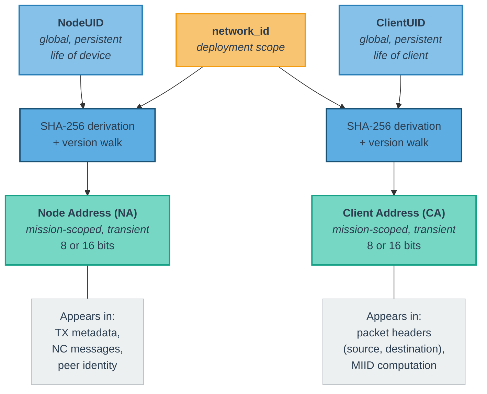

<!--
Copyright (c) 2026 Poseidon's Forge, Inc. All rights reserved.

This work is licensed under the Creative Commons Attribution 4.0
International License. To view a copy of this license, visit
https://creativecommons.org/licenses/by/4.0/

You are free to share (copy and redistribute) and adapt (remix, transform,
and build upon) this material in any medium or format for any purpose,
including commercial, under the following terms:
- Attribution: You must give appropriate credit to Poseidon's Forge, Inc.,
  provide a link to the license, and indicate if changes were made.
-->

## 3. Identity and Addressing Model {#3-identity-and-addressing-model}
**[WIRE FORMAT]**

M4P distinguishes between **global identities** (persistent, human-readable) and **local addresses** (compact, mission-scoped, transient). This separation applies to both nodes and clients.

### 3.1 Global Identities

#### 3.1.1 Node Unique Identifier (NodeUID)

A globally unique string identifying a physical node (device, vehicle, buoy, shore station, relay, etc.). The NodeUID is persistent and does not change over the life of the device — analogous to a serial number or MAC address. The NodeUID does not appear in transport layer packet headers. It is used for provisioning, configuration, address assignment logic, metadata exchange, and network layer control messages.

#### 3.1.2 Client Unique Identifier (ClientUID)

A globally unique string identifying a specific application-layer endpoint. Examples: `veh-123`, `veh-123.backseat`, `buoy-7`, `operator-123`. The ClientUID is provided by the client application when it registers with its local node. The ClientUID does not appear in transport layer packet headers. It is used for application-layer message addressing, configuration, logging, management, and network layer control messages. When an application submits a directed message (Request or Response), it specifies the destination by ClientUID; the transport layer resolves this to an on-wire Client Address internally (see [Section 9.2](#92-per-node-message-store)).

### 3.2 Local Addresses

Local addresses are small unsigned integers that appear on the wire. They are transient, mission-scoped, and may change between deployments.

#### 3.2.1 Node Address (NA)

An 8-bit or 16-bit unsigned integer (determined by the network-wide addressing mode) that identifies a node within a deployment. The Node Address is used by the transport layer for forwarding history, per-node metrics, and policies. The Node Address does not appear in transport layer data packet headers. It is carried in the Transmission encoding (see [Section 5.8](#58-transmission-encoding)) and in network layer control messages.

#### 3.2.2 Client Address (CA)

An 8-bit or 16-bit unsigned integer (determined by the network-wide addressing mode) that identifies a client endpoint within a deployment. The Client Address is encoded in the `source` field for all application packets, and in the `destination` field for directed application packets (Request/Response). Status and Event packets are broadcast classes and do not carry a `destination` field. The value `0` is reserved for broadcast addressing. Valid unicast Client Addresses range from `1` to `255` (8-bit mode) or `1` to `65,535` (16-bit mode). Each client that participates in M4P is assigned exactly one CA per deployment.

Client Addresses and Node Addresses are internal to the protocol and are not exposed at the application API boundary; applications interact with M4P exclusively through UIDs (see [Section 3.1](#31-global-identities)).

### 3.3 Address Scope and Lifetime

Scope, lifetime, and wire presence for each identifier type are summarized in the Identifier Summary table after Figure 4.

### 3.4 Address Context Disambiguation

Client Addresses and Node Addresses share the same numeric space but are always disambiguated by context:

- In packet headers, application packets always carry a Client Address in `source`; only directed application classes (Request/Response) carry a `destination` Client Address. For Network Control (NC) messages (message_type_id range 32,000–32,767), these fields refer to **Node Addresses** (see [Section 11.6.1](#1161-transport-properties)). The transport distinguishes the two cases by message_type_id.
- In transmission metadata, node-level fields always refer to **Node Addresses**.
- In network layer control messages, the field semantics are defined per message type.

It is valid for a Client Address and a Node Address with the same numeric value to coexist in the same deployment.

### 3.5 Where Identifiers and Addresses Appear

Where each identifier type is used across the protocol is summarized in the "Where It Appears" column of the Identifier Summary table after Figure 4.

**Figure 4 — Identifier Scope and Mapping Hierarchy**

**Identifier Summary**

| Identifier | Scope | Lifetime | On Wire? | Primary Use | Where It Appears |
|:---|:---|:---|:---|:---|:---|
| **NodeUID** | Global | Persistent (life of device) | No | Provisioning, NC messages, conflict resolution | NC messages, provisioning/config |
| **ClientUID** | Global | Persistent (life of client) | No | Application-layer message addressing, provisioning, NC messages, conflict resolution | Application API (message destination/source), NC messages, provisioning/config |
| **Node Address (NA)** | Deployment-local | Mission-scoped; reassignable | No (TX metadata only) | Forwarding history, peer identity, NC addressing | TX metadata, NC messages |
| **Client Address (CA)** | Deployment-local | Mission-scoped; reassignable | Yes (`source`; `destination` on directed classes) | MIID computation, routing, dedup | Packet headers (`source`, `destination` where present), MIID computation, NC messages |

Decentralized addressing comes from deterministic derivation: each node computes addresses from UID and `network_id` ([Section 11.1](#111-address-derivation-and-versioning)), so no central allocator is required. The UID/address split complements this by keeping persistent identity separate from mission-scoped on-wire addresses. UIDs also anchor conflict resolution and stale-mapping handling ([Section 11.8](#118-conflict-detection-and-resolution)). Keeping CAs in packet headers and NAs in transmission/NC metadata preserves wire compactness while supporting per-node forwarding state.

---
