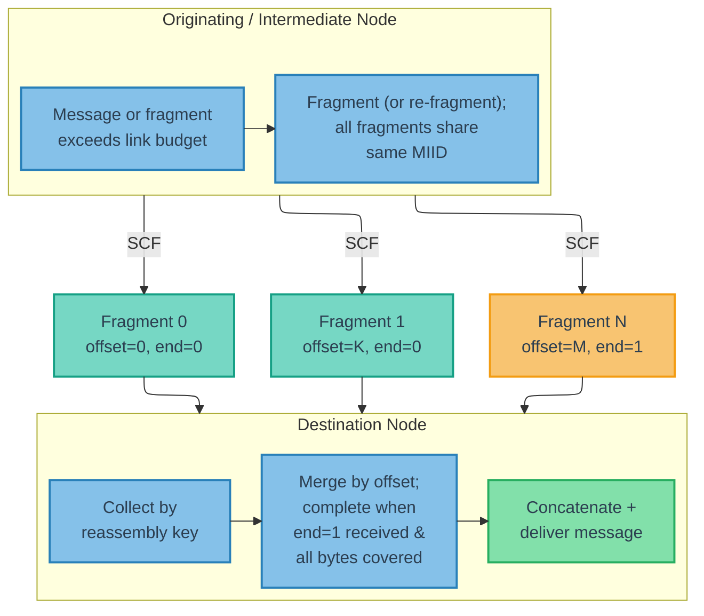

<!--
Copyright (c) 2026 Poseidon's Forge, Inc. All rights reserved.

This work is licensed under the Creative Commons Attribution 4.0
International License. To view a copy of this license, visit
https://creativecommons.org/licenses/by/4.0/

You are free to share (copy and redistribute) and adapt (remix, transform,
and build upon) this material in any medium or format for any purpose,
including commercial, under the following terms:
- Attribution: You must give appropriate credit to Poseidon's Forge, Inc.,
  provide a link to the license, and indicate if changes were made.
-->

## 8. Fragmentation and Reassembly {#8-fragmentation-and-reassembly}

**[WIRE FORMAT + BEHAVIORAL]**

### 8.1 Overview

Any message class (Status, Event, Request, or Response) MAY be fragmented when the message payload exceeds the capacity of a data link's transmission budget. Fragmentation is indicated by setting the `IS_FRAGMENT` flag in the packet header. For the interaction between fragmentation and the M4P payload cipher (encrypt-then-fragment ordering), see [Section 12.2.5](#1225-fragmentation-interaction) (Figure 13).

M4P uses **byte-offset-based fragmentation**. Each fragment's `offset` field encodes the fragment's starting byte position within the original ciphertext payload. Fragments at the same byte offset from different producers carry identical ciphertext and are interchangeable; fragments at different offsets are complementary regardless of which node produced them or what fragment size was used. Any node — originator or intermediate — MAY therefore fragment a complete message or re-fragment a received fragment without coordination.

Fragmentation is a **transmission-time decision**, not a storage decision. The message store holds complete (unfragmented) messages whenever possible; fragment size is determined by each link's payload budget minus per-fragment header overhead. Any node MAY fragment or re-fragment when the available link budget is insufficient (see [Section 8.3](#83-fragmentation-behavior) for rules).

Figure 5 illustrates the fragmentation and reassembly lifecycle, showing how a message payload is split, forwarded independently via store-carry-forward (SCF), and reassembled at the destination.



**Figure 5 — Fragmentation and Reassembly Pipeline**

### 8.2 Fragment Structure

**[WIRE FORMAT]**

When `IS_FRAGMENT` is set, the fragment fields appear immediately after the flags byte (and before any other optional fields) in the packet header:

```text
+-----------------------------------------------+
| offset (15b)                    | end (1b)    |
+-----------------------------------------------+
| fragment_payload (payload_length bytes)        |
+-----------------------------------------------+
```

- **`offset`** (15 bits): Byte offset into the original (unfragmented) ciphertext payload where this fragment's data begins. The first fragment has `offset = 0`.
- **`end`** (1 bit): `1` if this is the final fragment; `0` otherwise.
- **`fragment_payload`**: The portion of the original message payload carried by this fragment. The `payload_length` field in the packet header reflects the size of the fragment payload, not the total message size.

All fragments of a message carry the same `message_type_id`, `source`, `timestamp_24h`, and `msg_counter` as the original message. Consequently, all fragments share the same MIID.

### 8.3 Fragmentation Behavior

**[BEHAVIORAL]**

#### 8.3.1 Transmission-Time Decision

The message store holds complete messages; fragmentation occurs during transmission building ([Section 9.7](#97-link-opportunities-and-transmission-building)) when the serialized packet exceeds the available payload budget. The unfragmented message remains in the store for forwarding on other modalities.

#### 8.3.2 Who May Fragment

Any node — originator or intermediate — MAY fragment a complete unfragmented message when the available link budget is insufficient for the complete packet. This is essential for multi-modal operation: a message received unfragmented on a high-bandwidth link (e.g., LAN) can be forwarded as fragments on a constrained link (e.g., acoustic).

Any node MAY also **re-fragment** a received fragment into smaller fragments when the fragment exceeds the payload budget of an outgoing link. Each sub-fragment's `offset` is computed as the original fragment's `offset` plus the sub-fragment's starting position within the original fragment's payload. The `end` flag is set to `1` only on the sub-fragment that includes the final byte of the original fragment, and only if the original fragment had `end = 1`; all other sub-fragments have `end = 0`.

#### 8.3.3 Fragment Identity

All fragments — whether produced by the originating node or by intermediate nodes during re-fragmentation — share the original message's header fields and MIID ([Section 8.2](#82-fragment-structure)). Each fragment's `offset` is set to its starting byte position within the original ciphertext payload.

#### 8.3.4 Independent Forwarding

Intermediate nodes MUST treat each fragment as independently forwardable as soon as it is received. Implementations MAY enqueue/store fragments and forward them on normal transmission opportunities, but nodes MUST NOT suppress or delay forwarding of a fragment because other fragments of the same message have not yet been received.

#### 8.3.5 Encryption Interaction

When `AUTH_TAG_SIZE == 00`, fragmenting or re-fragmenting encrypted payloads requires no cryptographic operations — the ciphertext is split as opaque bytes (AES-CTR ciphertext can be split at arbitrary byte boundaries).

When `AUTH_TAG_SIZE != 00`, per-fragment authentication tags must be computed for each new fragment, which requires access to the PSK. Consequently, only nodes that possess the PSK MAY fragment or re-fragment authenticated messages. Nodes without the PSK (e.g., infrastructure relays) MUST NOT fragment or re-fragment authenticated messages — if the message or fragment exceeds the link budget, it is skipped for that link.

See [Section 12.2.4](#1224-transport-pipeline) and [Section 12.2.5](#1225-fragmentation-interaction) for the full encrypt-then-fragment pipeline and per-fragment authentication tag computation.

### 8.4 Reassembly

**[BEHAVIORAL]**

Reassembly for delivery is performed at the destination node for Request/Response packets (or at every node hosting a CA in the destination list for group Requests), or at every receiving node for Status and Event packets:

1. Collect all fragments with the same reassembly key: `(MIID, message_type_id)` for Status/Event/Request fragments, or `(request_MIID, message_type_id, source_CA)` for Response fragments.
2. Track received byte ranges: for each fragment, record `[offset, offset + payload_length)`.
3. Reassembly is complete when a fragment with `end = 1` has been received AND all bytes from offset 0 through `last_fragment_offset + last_fragment_payload_length` are covered. Total message size = final fragment's `offset` + final fragment's `payload_length`.
4. Place each fragment's payload at its byte offset to reconstruct the original message payload.

The reassembly key groups all fragments of the same message into a single reassembly buffer and keys the received byte-range set used for fragment forwarding suppression ([Section 6.5](#65-deduplication-rules)).

> **Design rationale:** When a broadcast or multicast Request elicits fragmented Responses from multiple nodes, all Responses share the same `request_MIID`. Without `source_CA` in the reassembly key, fragments from different responders would collide in the same reassembly buffer, producing corrupted payloads. Including `source_CA` keeps the reassembly key consistent with the Response deduplication key defined in [Section 6.5](#65-deduplication-rules).

Implementations SHOULD buffer out-of-order and overlapping fragments until all byte ranges are covered or the message's TTL expires. Overlapping fragments (from different nodes using different fragment sizes) carry identical ciphertext at the same byte positions and can be safely merged.

**Opportunistic intermediate reassembly.** Intermediate nodes MAY opportunistically reassemble fragments into a complete message for local storage. A reassembled message is stored as an unfragmented message and is available for future transmission opportunities on any link. Opportunistic reassembly is not required for correct forwarding — fragments are always forwarded individually as they arrive per [Section 8.3.4](#834-independent-forwarding).

#### 8.4.1 Cross-Form Deduplication

Because nodes may fragment unfragmented messages (see [Section 8.3](#83-fragmentation-behavior)), the same message may exist in the network in both unfragmented and fragmented form simultaneously. Cross-form deduplication is handled by message-level deduplication ([Section 6.5](#65-deduplication-rules)) and received byte-range tracking ([Section 8.4](#84-reassembly)).

Nodes performing delivery reassembly (destination nodes for directed traffic, and every receiving node for Status/Event traffic) MUST apply both mechanisms to prevent double delivery:

- When a complete unfragmented message is received and delivered, the node MUST record the base deduplication key as delivered — `(MIID, message_type_id)` for Status/Event/Request packets, or `(request_MIID, message_type_id, source_CA)` for Response packets. The node MUST mark the received byte-range set for the corresponding reassembly key as fully covered. Subsequent fragments for that reassembly key are therefore redundant and MUST be discarded. If a reassembly buffer exists for the same reassembly key, the node SHOULD discard it.
- When reassembly completes from fragments and the message is delivered, the node MUST record the base deduplication key as delivered. A subsequently received unfragmented copy with the same deduplication key MUST be treated as a duplicate and MUST NOT be re-delivered.

Intermediate forwarding nodes that hold a complete unfragmented message in their store MAY suppress forwarding of received fragments for the same reassembly key, since they can serve the same forwarding purpose by fragmenting the stored message on demand.

#### 8.4.2 Status Reassembly Supersession

Status messages have supersession semantics: the transport layer maintains only the latest value per `(source CA, message_type_id, status_key)` variant ([Section 9.3.3](#933-status-coalescing)). This supersession MUST extend to reassembly buffers. These supersession rules are Status-only.

When a node receives a Status message (fragmented or unfragmented) for a variant `(source CA, message_type_id, status_key)` that is newer than a partially-reassembled Status message for the same variant, the node MUST discard the older reassembly buffer. "Newer" is determined by MIID: if the newly received Status has a different MIID than the in-progress reassembly buffer, the buffer's contents are stale and MUST be discarded.

#### 8.4.3 Event Reassembly Behavior

Event messages are retained and forwarded per message instance. Unlike Status, Event reassembly buffers MUST NOT be superseded by newer same-type Event traffic. A node receiving a newer Event (different MIID) while an older Event reassembly is in progress MUST keep both as independent messages, subject to normal deduplication and TTL expiration.

### 8.5 Fragment NACKs (Network Control Type 32,003)

**[BEHAVIORAL + GUIDANCE]**

Any node MAY send a Fragment NACK message to request retransmission of missing byte ranges for a fragmented message. Fragment NACKs use the Network Control message type `32,003`.

Fragment NACK payload:

```text
+-----------------------------------------------+
| flags                    (u8)                 |
|   bit 0: RESPONSE_FRAGMENT                    |
+-----------------------------------------------+
| original_miid            (32b or 40b)         |
+-----------------------------------------------+
| original_message_type_id (CTE: 8b or 16b)    |
+-----------------------------------------------+
| original_source_ca       (8b or 16b)          |
|   [present only if RESPONSE_FRAGMENT is set]  |
+-----------------------------------------------+
| missing_range_count      (u8)                 |
+-----------------------------------------------+
| missing_start[0]         (16b)                |
| missing_length[0]        (16b)                |
| missing_start[1]         (16b)                |
| missing_length[1]        (16b)                |
| ...                                           |
+-----------------------------------------------+
```

- **`flags`** (u8): Bit 0 (`RESPONSE_FRAGMENT`, value `0x01`): when set, the NACK targets a Response fragment stream and the `original_source_ca` field is present. All other bits are reserved and MUST be set to 0.
- **`original_miid`**: The MIID of the fragmented message (32 bits in 8-bit addressing mode, 40 bits in 16-bit addressing mode). For Response fragments, this is the `request_MIID`.
- **`original_message_type_id`**: The Message Type ID of the fragmented message (CTE-encoded).
- **`original_source_ca`**: The Client Address of the responder whose fragment stream contains the missing fragments (8 bits for 8-bit addressing mode, 16 bits for 16-bit addressing mode). Present only when the `RESPONSE_FRAGMENT` flag (bit 0) is set.
- **`missing_range_count`** (u8): The number of missing byte ranges (0 - 255).
- **`missing_start`** (16 bits each): Starting byte offset of a missing range within the original ciphertext payload.
- **`missing_length`** (16 bits each): Length in bytes of the missing range.

> **Note:** The `RESPONSE_FRAGMENT` flag allows parsers to determine the NACK layout from the `flags` byte alone, without needing to inspect `original_message_type_id` to infer whether the target is a Response.

> **Design rationale:** Byte-range NACKs align naturally with the offset-based fragment model: the requester reports gaps in its byte coverage map without needing to know how the sender originally fragmented the message. The number of contiguous gaps is typically small (often 1–3 ranges even when many individual fragments are missing), so byte-range encoding is usually more compact than enumerating missing fragments individually. Any node receiving a byte-range NACK can retransmit using its own fragment sizes to cover the requested ranges.

Fragment NACKs SHOULD be rate-limited to avoid excessive retransmission requests over constrained links.

> [GUIDANCE] Intermediate nodes SHOULD only send Fragment NACKs when they have a reasonable expectation of completing reassembly (e.g., most fragments already received) and the link has sufficient budget for both the NACK and the expected retransmissions. On severely constrained links (e.g., acoustic), Fragment NACKs MAY be disabled entirely — the store-carry-forward model provides natural redundancy through multiple peers and paths. Fragment NACKs are most useful on higher-bandwidth links (LAN, radio) where retransmission cost is low.

---
