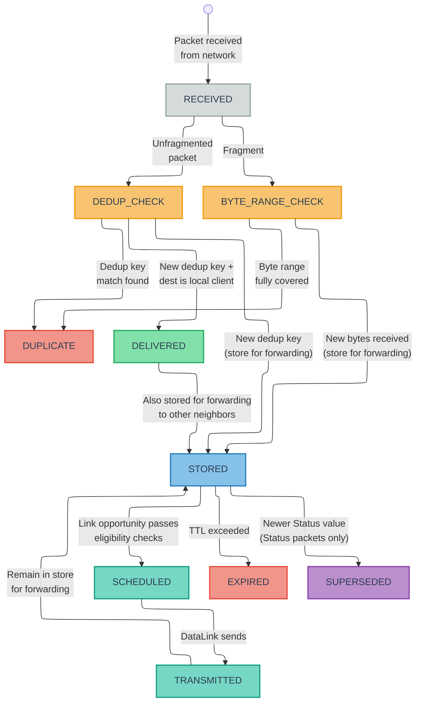
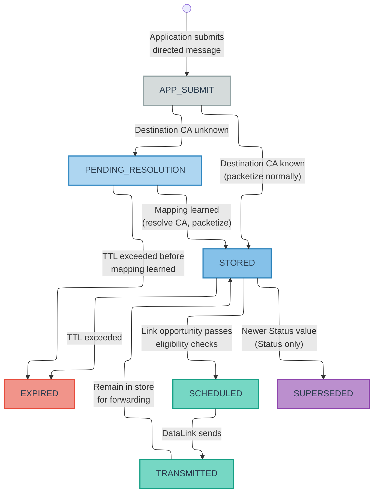
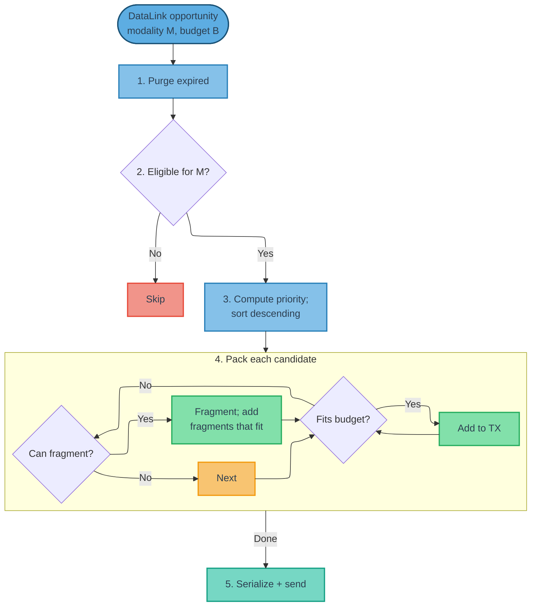

## 9. Transport Behavior {#9-transport-behavior}

**[BEHAVIORAL + GUIDANCE]**

### 9.1 Store-Carry-Forward Model

**[BEHAVIORAL]**

Each node maintains a local message store containing packets awaiting delivery or forwarding. Forwarding decisions are made locally and opportunistically based on available link opportunities. No global routing table or topology awareness is required.

The store-carry-forward cycle at each node:

1. **Receive**: Unpack incoming transmissions, apply message-level deduplication and fragment byte-range coverage checks, deliver to local clients, store packets for forwarding.
2. **Store**: Maintain packets in the message store until delivered, forwarded, or expired.
3. **Forward**: When a data link reports a transmission opportunity, select eligible packets, build a transmission, and send.

### 9.2 Per-Node Message Store

**[BEHAVIORAL]**

Each node MUST maintain a message store (or equivalent data structure) that tracks, at minimum, the following metadata per packet:

- MIID and `message_type_id`.
- Source address and (where present) destination header addresses (CA for application packets, NA for NC packets). For group Requests, the destination includes the full CA list (`destination` field + `additional_dest[]`).
- Effective TTL and creation timestamp.
- Effective priority (default or overridden).
- Effective modality mask (default or overridden).
- Per-modality last-sent time and send count.
- Whether the packet originated from a locally hosted client ("internal") or was received from the network ("external").
- Per-MIID forwarding history (which neighbors have already received this packet).
- Per-reassembly-key received byte-range coverage for fragmented messages (`[offset, offset + payload_length)`), used for both reassembly completion and fragment forwarding suppression.

Forwarding history entries MUST be retained for the lifetime of the associated MIID in the message store — that is, until the packet expires (TTL) or is purged. When the MIID entry is purged, its forwarding history is purged with it. Implementations SHOULD track forwarding history using a compact representation (e.g., a bitmask or small set of Node Addresses) rather than an unbounded list.

For Status messages, the store MUST additionally track:

- The latest value per `(source CA, message_type_id, status_key)` variant. Newer Status messages MUST supersede older ones for the same variant.
- Per-modality last-sent time for each Status variant.

For Event messages, the store MUST additionally track:

- Independent per-message instances (no supersession by newer same-type Events).
- Per-modality last-sent time and send count per Event message instance.

For cached Responses, the store SHOULD additionally track:

- Per-modality count of how many times the matching Request MIID has been observed after the Response was cached.

Figure 6 illustrates the per-packet lifecycle within the message store, showing the states a packet traverses from initial receipt (or local submission) through deduplication, storage, scheduling, transmission, and terminal disposition.

**Figure 6a — Inbound Message Lifecycle (received from network)**

**Figure 6b — Outbound Message Lifecycle (submitted by local application)**

Figures 6a–6b show the message lifecycle within the per-node message store. Figure 6a shows the inbound path for packets received from the network. Figure 6b shows the outbound path for directed messages submitted by a local application client, including the pending-address-resolution state for destinations with unknown CA mappings. Both paths converge at STORED, from which the forwarding cycle (STORED → SCHEDULED → TRANSMITTED → STORED) is identical.

As shown in Figure 6a, unfragmented packets that pass message-level deduplication and fragments that contribute new byte ranges enter the STORED state, from which they cycle through SCHEDULED → TRANSMITTED → STORED as link opportunities arise. Forwarding history is updated on each TRANSMITTED transition, tracking which neighbors have already received the packet. Packets addressed to a local client are both DELIVERED to the client and STORED for forwarding to other neighbors — these are not mutually exclusive outcomes. Terminal states (EXPIRED, DUPLICATE, SUPERSEDED) remove packets from the active store. Status coalescing (the SUPERSEDED transition) occurs when a newer Status value arrives for the same `(source_CA, message_type_id, status_key)` variant, as specified in [Section 9.3.3](#933-status-coalescing).

#### 9.2.1 Pending Address Resolution (Outbound)

When the transport layer accepts a directed message (Request or Response) from a local application client, the destination ClientUID must be resolved to a Client Address before the message can be packetized and scheduled. If the destination ClientUID is not in the local address mapping table (see [Section 11.9.3](#1193-address-mapping-state)), the message enters a **pending address resolution** state (the `APP_SUBMIT → PENDING_RESOLUTION` path in Figure 6b):

- The message is accepted from the application (not rejected or errored).
- The message is stored in the message store with its TTL ticking normally.
- The message is NOT eligible for packetization, scheduling, or transmission — it does not enter the STORED state until the destination CA is resolved.
- The transport SHOULD emit an NC_CLIENT_ADDRESS_RESOLVE_QUERY ([Section 11.7.15](#11715-nc_client_address_resolve_query-32017)) to actively seek the mapping.
- When the mapping is learned (from any NC source — NC_NODE_SUMMARY, NC_CLIENT_ADDRESS_RESOLVE_ANSWER, NC_NETWORK_STATE_RESPONSE, NC_CLIENT_ADDRESS_CLAIM — or from locally persisted state), the transport resolves the destination CA and transitions the message to normal scheduling eligibility (STORED state).
- If the TTL expires before the mapping is learned, the message expires normally — the same expiration rules apply as for any other message in the store.

> **Note:** For group Requests where one or more destination ClientUIDs have no known CA mapping, the **entire group Request** enters pending-address-resolution state. The transport MUST NOT send a partial group to the resolved subset. TTL ticks normally, consistent with single-destination behavior. When all destination CA mappings are learned, the group Request transitions to normal scheduling eligibility.

#### 9.2.2 Source Identity Resolution (Inbound)

When a node delivers a received message to a local application client, the transport provides the source **ClientUID** resolved from the source CA via the address mapping table. If the source CA has no known identity mapping, the node SHOULD emit an NC_CLIENT_UID_QUERY ([Section 11.7.6](#1176-nc_client_uid_query-32015)) for the unknown source CA, subject to query coalescing (the node MUST NOT emit a duplicate query if one for the same CA is already outstanding and has not expired). The message SHOULD still be delivered to the application with the source identity marked as unresolved.

### 9.3 Resend Behavior

#### 9.3.1 Request Resend

Requests MAY be retransmitted multiple times on each modality to improve robustness in lossy or intermittent environments. The effective resend frequency for a given `(Request MIID, modality)` SHOULD:

- Start aggressively (transmit as soon as possible on the first opportunity).
- Back off approximately exponentially with the number of prior transmissions on that modality.
- Respect any per-modality minimum send interval configuration.

Requests MUST NOT be retransmitted after their effective TTL has expired.

**Response-based resend stop condition.** The originating node SHOULD cease resending a Request when matching Responses indicate that the Request has been received by its intended destination(s):

- **Unicast Requests:** The originator SHOULD cease resend when a Response matching the Request MIID is received from the destination CA.
- **Group Requests (`ADDITIONAL_DEST_PRESENT` set):** The originator SHOULD cease resend when matching Responses have been received from all CAs in the destination list. The originator tracks which destination CAs have responded by matching incoming Responses (via `request_MIID` and `source_CA`) against the destination list.

In both cases, the originator MUST stop resending at TTL expiry regardless of Response status. The Response-based stop condition is an optimization that reduces unnecessary retransmissions; a Request that does not elicit Responses (e.g., a fire-and-forget command) continues resending per the exponential backoff schedule until the backoff limit is reached or TTL expires.

#### 9.3.2 Response Caching and Resend

The transport layer MUST NOT accept more than one Response per `(request_MIID, message_type_id, source_CA)` from a local client. If a client submits a Response and the transport has already accepted a Response with the same `(request_MIID, message_type_id, source_CA)` key, the transport MUST reject the submission with an error and MUST NOT encrypt or transmit it (see [Section 6.5](#65-deduplication-rules) for rationale). If a client receives a duplicate of a Request it has already responded to (detected via the Request's MIID), the node's transport layer handles retransmission of the cached Response — the client is not asked to generate a second Response.

Nodes MAY cache Responses keyed by the full dedup key `(request_MIID, message_type_id, source_CA)`. When a group Request addresses multiple CAs hosted on the same node, each local CA may independently submit a Response; the node caches up to one Response per local CA, each tracked independently. For each cached Response and modality `m`, the transport tracks:

- The number of times the Response has been transmitted on `m`.
- The number of times the matching Request MIID has been observed on `m` (total observations on that modality since the Response was cached).

On a given modality `m`, a cached Response SHOULD be transmitted at most `max(1, n)` times, where `n` is the number of times the matching Request MIID has been observed on `m`. This ensures:

- Responses are sent at least once per DataLink adapter instance.
- Responses do not "overshoot" the number of observed Requests.

Once this budget is exhausted or the Response's TTL expires, further observations of the same Request MIID on that modality SHOULD NOT trigger additional Response transmissions.

#### 9.3.3 Status Coalescing

The transport layer MUST maintain only the latest Status per `(source CA, message_type_id, status_key)` variant; newer Status messages supersede older ones.

Status coalescing is Status-only. Implementations MUST NOT apply Status supersession rules to Event, Request, or Response packets.

For each modality, the scheduler tracks when the latest Status for a given variant was last transmitted. The effective scheduling priority for Status messages MAY depend on:

- The message type's base priority.
- Time since that Status variant was last sent on the modality (variants that have not been sent recently SHOULD receive a scheduling boost, capped by implementation).

On rate-limited modalities, this promotes rotation across Status variants while still favoring high-priority Status types. On high-throughput modalities, implementations MAY simplify to sending each new Status value at most once per update.

#### 9.3.4 Event Resend

Event messages MAY be retransmitted on each modality to improve robustness in lossy or intermittent environments, using the same general eligibility style as Status (TTL-valid, modality-allowed, and send-interval/backoff policy as configured by the implementation).

Unlike Status, Event resend scheduling is per message instance: each retained Event is an independent resend candidate until expiration. Nodes MUST NOT coalesce or supersede Event messages during resend scheduling.

### 9.4 Priority and Scheduling

**[GUIDANCE]**

**Base priority.** Every Message Type ID has a configured default priority value (`0` - `255`, higher values indicate higher priority; see [Section 2.4.3](#243-recommended-configuration-should)). The `priority_override` field, when present, replaces the default priority for that individual packet. Only the relative ordering (higher value = higher priority) is normative.

**Two-stage scheduling model.** Implementations SHOULD schedule in two stages:

1. **Eligibility (gating):** determine whether a packet is eligible to send on the current modality and time, including TTL/expiration checks, forwarding-history rules, modality mask checks, Request resend backoff, Response resend budget, Event resend rules, and Status coalescing rules.
2. **Ordering (ranking):** rank eligible packets by effective priority for selection/packing.

**Class bias defaults.** Implementations SHOULD apply class-aware bias so the default behavior favors:

1. **Network Control** — highest default bias.
2. **Request** — above Response, Event, and Status.
3. **Response** — above Event and Status.
4. **Event** — above Status.
5. **Status** — lowest default bias.

Class bias is advisory and implementation-defined (for example: weights, offsets, tie-breakers, or queue ordering). It is **not** an absolute preemption rule. A sufficiently high-priority packet in any class MAY outrank a lower-priority packet in another class.

**Retransmission interaction.** Request backoff, Response resend-budget, Event per-instance resend, and Status coalescing rules are part of eligibility, not class precedence. Backoff limits *when* a Request can be resent; resend budgets limit *how many times* a Response can be sent per modality; Event resend rules keep each retained Event as an independent candidate until expiry. Once packets are eligible, they compete using effective priority.

**Internal vs. external bias.** Internal traffic comprises packets whose `source` CA is assigned to a client hosted on the local node (originated locally). External traffic comprises packets first observed from the network (received from another node). Implementations SHOULD prefer internal traffic over external traffic when effective priority is otherwise similar.

**Future class compatibility.** If additional application classes are introduced in future revisions, they SHOULD integrate through the same mechanism: default per-type priorities plus optional class bias, without introducing strict cross-class barriers.

### 9.5 Modality Classification

**[GUIDANCE]**

M4P distinguishes between two classes of modalities for scheduling purposes. The classification of each modality is deployment-specific.

**Rate-limited / capacity-constrained modalities.** Examples: acoustic links, satellite links with strict airtime budgets. Characteristics: transmission opportunities are infrequent (seconds to tens of seconds between opportunities), and each transmission has a small payload limit. Scheduling approach: Full effective-priority scoring — incorporating class-bias weighting, resend-state gating (Request backoff, Response budget, Event resend, Status coalescing/staleness), and origin bias — with capacity-constrained packing to maximize the value of each scarce transmission opportunity.

**High-throughput / effectively-unlimited modalities.** Examples: LAN, IP/MQTT, many short-range radio configurations. Characteristics: transmission opportunities occur at high rates, and per-transmission payload limits are large or effectively absent for M4P's purposes. Scheduling approach: Simplified binary-eligibility scheduling where packets that pass gating checks (modality mask, resend rules, forwarding history) are included in the transmission, up to an implementation-defined per-transmission packet cap.

### 9.6 Scheduling Modes

**[GUIDANCE]**

**Rate-limited scheduling.** For rate-limited or capacity-constrained modalities, nodes SHOULD:

1. Discard expired packets.
2. Gather eligible packets for the modality based on: modality mask, forwarding history and one-hop semantics, and per-modality resend rules (Request backoff, Response budget, Event resend, Status coalescing).
3. Compute an effective priority for each candidate that respects class bias defaults and base priority (or override), and MAY factor in age, internal/external origin, Event age, Status variant staleness, Request ingress recency (early-hop spread urgency for Request packets only), and dispersion-aware bridge scoring ([Section 9.10](#910-dispersion-aware-scheduling-mesh-modalities)).
4. Sort candidates by effective priority (highest first).
5. Greedily pack packets into the Transmission up to the available capacity, selecting the highest effective-priority packet that fits in the remaining capacity at each step.
6. After sending, update per-modality state (send counts, last-sent timestamps, forwarding history).

**High-throughput scheduling.** For high-throughput modalities, nodes MAY use a simplified scheduling approach:

1. Discard expired packets.
2. Build the candidate set for the modality and apply gating checks (modality mask, forwarding-history/rebroadcast rules, Request backoff, Response resend budget, Event resend, and Status coalescing eligibility).
3. Order eligible candidates primarily by effective priority; implementations MAY use lightweight class/origin bucketing as an approximation if it preserves the intended behavior that high-priority packets can outrank lower-priority packets across classes.
4. Include candidates up to an implementation-defined per-transmission packet cap.

Because high-throughput links are capacity-rich, implementations MAY use simplified ranking approximations instead of full global sorting, provided priority semantics are preserved.

### 9.7 Link Opportunities and Transmission Building

When a DataLink signals a transmission opportunity with an available payload budget (see [Section 10](#10-datalink-abstraction)), the node builds a Transmission by:

1. Discarding any expired packets from the message store.
2. Identifying candidate packets that are eligible for transmission on the available modality (per modality mask, forwarding history, and resend rules).
3. Selecting and packing packets into the Transmission according to the priority and scheduling rules defined in [Section 9.4](#94-priority-and-scheduling) through [Section 9.6](#96-scheduling-modes). If a candidate packet exceeds the remaining transmission budget but is eligible for fragmentation (see [Section 8.3](#83-fragmentation-behavior)), the node MAY fragment it and pack as many resulting fragments as fit. Fragmentation eligibility depends on the authentication configuration: when `AUTH_TAG_SIZE == 00`, any complete message or received fragment may be fragmented or re-fragmented; when `AUTH_TAG_SIZE != 00`, only nodes possessing the PSK may fragment or re-fragment ([Section 8.3.5](#835-encryption-interaction)). See [Section 9.7.1](#971-fragment-size-selection) for fragment size guidance.
4. Transmitting via the DataLink.
5. Updating per-modality send counts, last-sent timestamps, and forwarding history for all transmitted packets.

Figure 7 illustrates this pipeline as a flow chart, showing the scheduling loop from the DataLink opportunity signal through candidate selection, effective-priority scoring, capacity-constrained packing, and handoff to the DataLink.

**Figure 7 — Transmission Building Pipeline**

#### 9.7.1 Fragment Size Selection

**[GUIDANCE]**

When fragmentation is required during transmission building, the node SHOULD fragment to the remaining transmission budget minus per-fragment header overhead (2 bytes for the `offset`/`end` fields). This maximizes fragment payload size, minimizing total fragment count and reassembly latency at the destination.

Each node fragments to its own outgoing link's budget. Downstream nodes re-fragment as needed ([Section 8.3.2](#832-who-may-fragment)). There is no requirement to anticipate downstream link constraints.

Implementations MAY use smaller fragment sizes to improve transmission packing density (e.g., reserving budget for additional lower-priority packets), but SHOULD NOT fragment below a deployment-configured minimum fragment payload size.

> **Design rationale:** Fragment sends interact with priority scoring and staleness tracking in non-trivial ways. A partially-transmitted message has no application value until reassembly completes, which argues for prioritizing fragment completion. However, on constrained links, monopolizing consecutive transmission opportunities for one message reduces information diversity across the network. The balance between fragment completion priority and message diversity is deployment-dependent and left to implementations.

#### 9.7.2 Worked Example: Mixed-Origin Transmission Packing

The message store is a **unified pool** containing all packets awaiting delivery or forwarding, regardless of origin or class. Locally-originated packets (from hosted clients) and externally-received packets (forwarded on behalf of other nodes) reside in the same store and compete for space in each transmission through the same scheduling pipeline, subject to priority ordering (including the internal-over-external bias defined in [Section 9.4](#94-priority-and-scheduling)). The scheduler does not maintain separate queues for local vs. forwarded traffic — it treats the store as a single priority-ordered pool that feeds each transmission opportunity.

The following example illustrates how the transmission building pipeline ([Section 9.7](#97-link-opportunities-and-transmission-building) steps 1–5) selects and packs packets from this unified message store into a single transmission on a rate-limited acoustic link.

**Scenario.** Node A hosts two clients (`veh-a.nav` at CA 12, `veh-a.backseat` at CA 13) and has an acoustic DataLink (mesh modality, 64-byte payload budget). Node A's message store contains:

| # | Packet | Class | Source | Origin | Serialized Size | Effective Priority |
|---|--------------------------|-------------|-------------|----------------|---------------|------------------|
| 1 | NC_NODE_SUMMARY | Network Control | Node A (NA 5) | Internal | 18 B | Highest default class bias |
| 2 | Emergency Stop (type 10,001) | Request | CA 99 → CA 13 | External (forwarded) | 14 B | Priority 240 (Request) |
| 3 | Leak Alarm Event (type 8,120) | Event | CA 77 | External (forwarded) | 10 B | Priority 190 (Event) |
| 4 | Navigation Status (type 100) | Status | CA 12 | Internal | 22 B | Priority 128 (Status) |
| 5 | Health Status (type 200) | Status | CA 45 | External (forwarded) | 16 B | Priority 80 (Status) |
| 6 | Sensor Telemetry (type 300) | Status | CA 13 | Internal | 30 B | Priority 64 (Status) |

**Transmission building.** The acoustic DataLink signals a transmission opportunity with a 64-byte budget. The scheduler executes:

1. **Purge expired:** All packets are within TTL. No packets removed.
2. **Filter eligible:** All six packets pass modality mask and resend checks for acoustic.
3. **Priority sort:** Sorted by effective priority with class bias and other tie-breakers:
   - Packet 1: NC (highest default class bias)
   - Packet 2: Request (priority 240)
   - Packet 3: Event (priority 190)
   - Packet 4: Status (priority 128, internal)
   - Packet 5: Status (priority 80, external)
   - Packet 6: Status (priority 64, internal — but lower base priority than Packet 5)
4. **Pack** (64-byte budget):
   - Packet 1 (18 B): fits → add. Remaining: 46 B.
   - Packet 2 (14 B): fits → add. Remaining: 32 B.
   - Packet 3 (10 B): fits → add. Remaining: 22 B.
   - Packet 4 (22 B): fits → add. Remaining: 0 B.
   - Packet 5 (16 B): does not fit (budget exhausted) → skip.
   - Packet 6 (30 B): does not fit (budget exhausted) → skip.
5. **Transmit:** The resulting transmission contains 4 packets totaling 64 bytes — an NC message, a forwarded Request, a forwarded Event, and a locally-originated Status — packed into a single 64-byte acoustic send.

#### 9.7.3 Worked Example: Fragmentation During Packing

The following example extends the transmission building pipeline to illustrate fragmentation decisions on a constrained link.

**Scenario.** Node B has an acoustic DataLink (mesh modality, 64-byte payload budget). Its message store contains:

| # | Packet | Class | Serialized Size | Effective Priority |
|---|--------|-------|-----------------|--------------------|
| 1 | NC_NODE_SUMMARY | Network Control | 18 B | Highest default class bias |
| 2 | Sensor Report (type 400) | Status | 90 B | Priority 128 (Status) |
| 3 | Health Status (type 200) | Status | 14 B | Priority 80 (Status) |

**Transmission building** (64-byte budget):

1. **Purge expired:** All packets are within TTL.
2. **Filter eligible:** All three packets pass modality mask and resend checks.
3. **Priority sort:** Packet 1 (NC, highest default class bias), then Packet 2 (Status, priority 128), then Packet 3 (Status, priority 80).
4. **Pack:**
   - Packet 1 (18 B): fits → add. Remaining: 46 B.
   - Packet 2 (90 B): does not fit (90 > 46). Eligible for fragmentation → fragment to remaining budget. Fragment 0: `offset=0`, 44 B payload (46 B budget − 2 B fragment header), `end=0` → add. Remaining: 0 B.
   - Packet 3 (14 B): does not fit (budget exhausted) → skip.
5. **Transmit:** The transmission contains 2 packets totaling 64 bytes: one NC message and one fragment of the Sensor Report.

The unfragmented Sensor Report (90 B) remains in the message store. On the next transmission opportunity, the remaining bytes (`offset=44`, 46 B payload, `end=1`) can be sent — along with Packet 3 if budget permits. An implementation that prioritizes fragment completion MAY boost the remaining fragment's effective priority to accelerate reassembly at the destination.

### 9.8 Forwarding Semantics

**[BEHAVIORAL]**

#### 9.8.1 Broadcast Semantics

The destination value `0` denotes broadcast. Broadcast is used for Network Control traffic and for Status and Event messages. Requests and Responses use directed (unicast or group) addressing; broadcast is not applicable to request/response exchanges.

Broadcast packets MUST obey TTL expiration and MIID deduplication. Nodes SHOULD forward each broadcast MIID at most once per DataLink adapter instance and MUST respect one-hop semantics when `ttl_override = 0`.

Broadcast forwarding policy MAY depend on modality, link cost, and local constraints. Implementations SHOULD keep TTLs short for broadcast packets on constrained links.

#### 9.8.2 Infrastructure and Mesh Modality Forwarding
The transport applies different forwarding policies to infrastructure and mesh modalities based on their delivery characteristics (defined in [Section 2.6](#26-core-concepts-and-terminology)).

**Infrastructure modalities.** [BEHAVIORAL] Nodes MUST NOT rebroadcast a packet on the same infrastructure link from which it was received. All peers on that link already received the original transmission; rebroadcasting produces redundant traffic that scales as O(N²) across all nodes on the link. For Status messages, each new value SHOULD be sent at most once per infrastructure modality until superseded by a newer value or expired. Event messages are retained and scheduled per message instance until expired.

**Mesh modalities.** [BEHAVIORAL] Nodes MAY rebroadcast packets received on mesh modalities, subject to TTL, one-hop semantics (when `ttl_override = 0`), forwarding history, and MIID deduplication. Mesh rebroadcasting extends the reach of packets beyond the originator's direct range. All per-modality statistics (last-sent time, send count, Response resend budget) are local to the node.

**Cross-modality forwarding.** Packets received on any modality SHOULD be forwarded on other modalities (both infrastructure and mesh) subject to normal TTL, deduplication, and modality mask constraints. The value of store-carry-forward is moving packets *across* modalities — a message received acoustically while submerged may be forwarded over LAN when the vehicle surfaces.

**Forwarding deferral windows.** [GUIDANCE] Implementations MAY apply a per-link forwarding-deferral window to externally received packets before their first forwarding attempt on that link. When enabled, forwarding becomes eligible only after both (a) the deferral timer has elapsed and (b) the link has a transmission opportunity. If the same packet is observed on that link during the deferral window, implementations MAY cancel the pending first-forward attempt on that link ("cancel-on-seen") to reduce redundant rebroadcast traffic.

Deferral window policy SHOULD be link-adapted:

- On deterministic scheduled links (for example, TDMA), implementations SHOULD use zero or near-zero deferral to avoid missing scarce scheduled opportunities.
- On contention-style links (for example, ALOHA/CSMA variants), implementations SHOULD use non-zero randomized deferral (jitter) to reduce near-simultaneous relay bursts.
- On infrastructure links (for example, LAN/IP-MQTT), bounded deferral with cancel-on-seen is often effective for suppressing redundant cross-link echoes.

This mechanism is a local scheduling policy. It does not change wire format or interoperability requirements.

### 9.9 Error Handling

#### 9.9.1 Malformed Packets

Nodes MUST silently discard packets that cannot be parsed due to:
- Invalid or truncated CTE encoding.
- `payload_length` exceeding the remaining bytes in the Transmission.
- Truncated headers (insufficient bytes for the indicated packet class).
- `message_type_id` values that fall outside any defined range (see [Section 4.1](#41-message-type-id-ranges)).

Malformed packets MUST NOT be forwarded.

#### 9.9.2 Unknown Flag Bits

Status, Event, Request, and Response flag layouts are defined in [Section 5.7](#57-flags-and-optional-fields). Event bit 4 is reserved in this protocol version and MUST be zero. A received packet with non-zero reserved bits or any flag bit combination not defined by this specification indicates a protocol version mismatch or future extension; the node SHOULD forward the packet via store-carry-forward (preserving it for nodes that may understand it) but MUST NOT attempt to parse optional fields or payload, as the header layout may differ from what this version expects. See [Section 9.9.3](#993-protocol-version-compatibility) for version compatibility requirements.

#### 9.9.3 Protocol Version Compatibility

All nodes in a deployment MUST run the same M4P protocol version. The M4P transport layer does not include a protocol version field in packet headers or transmission metadata (see [Section 2.5](#25-design-constraints-and-deliberate-tradeoffs) for rationale). Version compatibility is ensured through deployment configuration. Interoperability between different protocol versions is outside the scope of this specification.

The following protocol-intrinsic properties enforce version-lock — a change to any of these requires fleet-wide coordinated upgrade:

- **Header field layout.** A version mismatch causes silent misalignment of address, timestamp, and control fields.
- **Addressing mode.** Mixed-mode nodes cannot parse each other's packets (see [Section 2.4.1](#241-addressing-mode-configuration)).
- **Address derivation algorithm.** The hash function and PRIME_STEP constant ([Section 11.1](#111-address-derivation-and-versioning)) are fixed per version.
- **CTE encoding.** The Compact Type Encoding scheme ([Section 4.2](#42-compact-type-encoding-cte)) reserves values 32,768+ for future extended encoding that current parsers cannot decode.
- **Cryptographic primitives.** The payload cipher (AES-256-CTR) and authentication (AES-CMAC) are fixed per version.

### 9.10 Dispersion-Aware Scheduling (Mesh Modalities)

**[GUIDANCE — EXPERIMENTAL]**

> **EXPERIMENTAL** — Dispersion-aware scheduling is an optional optimization for constrained mesh links. It is not required for interoperability and is expected to evolve with implementation experience.

Traditional network protocols optimize for routing: "what is the best path for this packet to reach its destination?" Because M4P operates without global routing tables or topology knowledge, that question has no answer. On rate-limited mesh modalities (acoustic links in particular), the relevant question becomes: "given this one scarce transmission opportunity, what is the most valuable thing I can send to add the most new information to my local neighborhood of the network?" Nodes MAY apply dispersion-aware scoring to answer this question — estimating which messages nearby peers have already received, prioritizing packets they are least likely to have seen, and reducing redundant rebroadcasts while preserving robust multi-hop propagation. These estimates can be informed by application-layer context such as estimated peer positions and data-link evidence such as SNR or signal strength.

The model is conceptual:

1. Estimate link reachability between peers using local evidence (and optional context hints).
2. Estimate, per peer and message, the likelihood that the peer has already seen the message.
3. Derive a bridge value that approximates expected new reach if this node transmits the message.
4. Combine bridge value with base scheduling factors (priority, class bias, resend state, size efficiency) when ranking candidates.

Implementations SHOULD use a two-pass packing strategy on constrained links:

1. **Deterministic pass:** greedily pack highest-value eligible candidates.
2. **Safety pass:** apply bounded probabilistic inclusion for non-selected candidates to avoid total suppression under model uncertainty.

The following invariants apply:

- Dispersion-aware scheduling changes scheduler behavior only; it does not change wire formats.
- Nodes that do not implement this optimization remain fully interoperable and continue to use base scheduling rules.
- Network Control traffic remains exempt from dispersion-based suppression.
- TTL expiry and per-modality minimum send intervals remain hard constraints.
- Missing or stale evidence should bias toward relaying more, not less.

When dispersion-aware scheduling is enabled, Request resend backoff MAY be integrated as a continuous scoring/selection decay rather than a binary eligibility gate, provided the base rate-limiting intent of [Section 9.3.1](#931-request-resend) is preserved.

---

