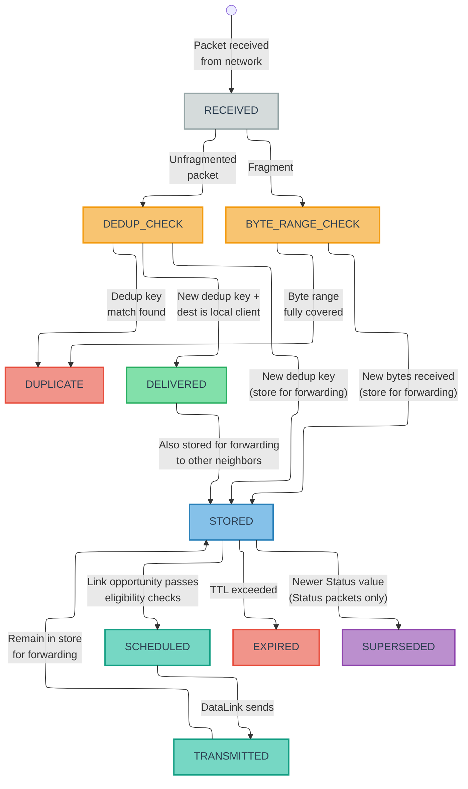
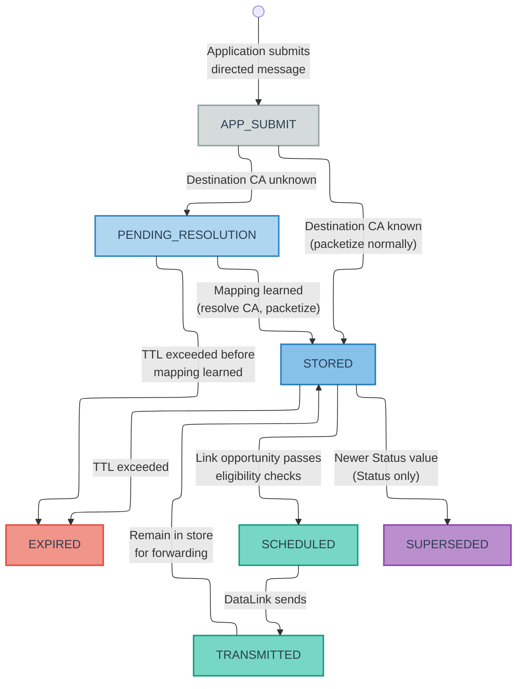
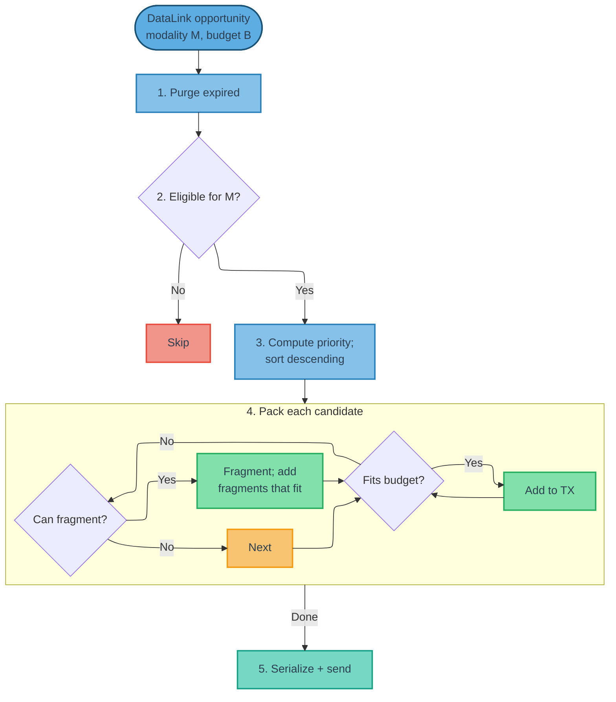

<!--
Copyright (c) 2026 Poseidon's Forge, Inc. All rights reserved.

This work is licensed under the Creative Commons Attribution 4.0
International License. To view a copy of this license, visit
https://creativecommons.org/licenses/by/4.0/

You are free to share (copy and redistribute) and adapt (remix, transform,
and build upon) this material in any medium or format for any purpose,
including commercial, under the following terms:
- Attribution: You must give appropriate credit to Poseidon's Forge, Inc.,
  provide a link to the license, and indicate if changes were made.
-->

## 9. Transport Behavior {#9-transport-behavior}

**[BEHAVIORAL + GUIDANCE]**

*PSFI-1347 transport update drafted by a Codex agent, 2026-08-31.*

### 9.1 Store-Carry-Forward Model

**[BEHAVIORAL]**

Each node maintains a local message store containing packets awaiting delivery or forwarding. Forwarding decisions are made locally and opportunistically based on available link opportunities. No global routing table or topology awareness is required.

The store-carry-forward cycle at each node:

1. **Receive**: Unpack incoming transmissions, apply message-level deduplication and fragment byte-range coverage checks, deliver to local clients, store packets for forwarding.
2. **Store**: Maintain packets in the message store until delivered, forwarded, or expired.
3. **Forward**: When a data link reports a transmission opportunity, select eligible packets, build a transmission, and send.

### 9.2 Per-Node Message Store

**[BEHAVIORAL]**

Each node MUST maintain a message store (or equivalent data structure) that tracks, at minimum, the following metadata per packet:

- MIID and `message_type_id`.
- Source address and (where present) destination header addresses (CA for application packets, NA for NC packets). For group Requests, the destination includes the full CA list (`destination` field + `additional_dest[]`).
- Effective TTL and creation timestamp.
- Effective priority (default or overridden).
- Effective modality mask (default or overridden).
- Per-DataLink-adapter successful-send time and send count, including sends since the current
  audience was established.
- Whether the packet originated from a locally hosted client ("internal") or was received from the network ("external").
- Evidence sufficient to distinguish confirmed peer holding from estimated peer holding. The
  representation of this evidence is implementation-defined.
- Per-reassembly-key received byte-range coverage for fragmented messages (`[offset, offset + payload_length)`), used for both reassembly completion and fragment forwarding suppression.

Peer-holding evidence associated with a retained record MUST be purged when that record expires,
is superseded, or is otherwise removed. Implementations MUST NOT use estimated holding to declare
directed traffic terminal; terminal knowledge requires confirmed evidence.

For Status messages, the store MUST additionally track:

- The latest value per `(source CA, message_type_id, status_key)` variant. Newer Status messages MUST supersede older ones for the same variant.
- Per-DataLink-adapter send state for each Status variant.

For Event messages, the store MUST additionally track:

- Independent per-message instances (no supersession by newer same-type Events).
- Per-DataLink-adapter send state per Event message instance.

Cached Responses use the same per-link spacing and peer-holding evidence as other retained records.

Figure 6 illustrates the per-packet lifecycle within the message store, showing the states a packet traverses from initial receipt (or local submission) through deduplication, storage, scheduling, transmission, and terminal disposition.


```mermaid
---
config:
  theme: default
  layout: elk
  themeVariables:
    background: '#ffffff'
  elk:
    mergeEdges: false
    nodePlacementStrategy: SIMPLE
---
flowchart TD
    START(( )) -->|"Packet received<br>from network"| RECEIVED["RECEIVED"]:::entry

    RECEIVED -->|"Unfragmented<br>packet"| DEDUP_CHECK["DEDUP_CHECK"]:::check
    RECEIVED -->|"Fragment"| BYTE_RANGE_CHECK["BYTE_RANGE_CHECK"]:::check

    DEDUP_CHECK -->|"Dedup key<br>match found"| DUPLICATE["DUPLICATE"]:::terminal
    DEDUP_CHECK -->|"New dedup key<br>(store for forwarding)"| STORED
    DEDUP_CHECK -->|"New dedup key +<br>dest is local client"| DELIVERED["DELIVERED"]:::success

    BYTE_RANGE_CHECK -->|"Byte range<br>fully covered"| DUPLICATE
    BYTE_RANGE_CHECK -->|"New bytes received<br>(store for forwarding)"| STORED

    DELIVERED -->|"Also stored for forwarding<br>to other neighbors"| STORED["STORED"]:::active

    STORED -->|"Link opportunity passes<br>eligibility checks"| SCHEDULED["SCHEDULED"]:::sched
    STORED -->|"TTL exceeded"| EXPIRED["EXPIRED"]:::terminal
    STORED -->|"Newer Status value<br>(Status packets only)"| SUPERSEDED["SUPERSEDED"]:::special

    SCHEDULED -->|"DataLink sends"| TRANSMITTED["TRANSMITTED"]:::sched

    TRANSMITTED -->|"Remain in store<br>for forwarding"| STORED

    classDef entry fill:#d5dbdb,color:#2c3e50,stroke:#95a5a6,stroke-width:2px
    classDef check fill:#f8c471,color:#2c3e50,stroke:#f39c12,stroke-width:2px
    classDef active fill:#85c1e9,color:#2c3e50,stroke:#2980b9,stroke-width:2px
    classDef sched fill:#76d7c4,color:#2c3e50,stroke:#16a085,stroke-width:2px
    classDef success fill:#82e0aa,color:#2c3e50,stroke:#27ae60,stroke-width:2px
    classDef terminal fill:#f1948a,color:#2c3e50,stroke:#e74c3c,stroke-width:2px
    classDef special fill:#bb8fce,color:#2c3e50,stroke:#8e44ad,stroke-width:2px
```

**Figure 6a — Inbound Message Lifecycle (received from network)**


```mermaid
---
config:
  theme: default
  layout: elk
  themeVariables:
    background: '#ffffff'
  elk:
    mergeEdges: false
    nodePlacementStrategy: SIMPLE
---
flowchart TD
    START(( )) -->|"Application submits<br>directed message"| APP_SUBMIT["APP_SUBMIT"]:::entry

    APP_SUBMIT -->|"Destination CA unknown"| PENDING_RESOLUTION["PENDING_RESOLUTION"]:::pending
    APP_SUBMIT -->|"Destination CA known<br>(packetize normally)"| STORED

    PENDING_RESOLUTION -->|"Mapping learned<br>(resolve CA, packetize)"| STORED
    PENDING_RESOLUTION -->|"TTL exceeded before<br>mapping learned"| EXPIRED["EXPIRED"]:::terminal

    STORED["STORED"]:::active -->|"Link opportunity passes<br>eligibility checks"| SCHEDULED["SCHEDULED"]:::sched
    STORED -->|"TTL exceeded"| EXPIRED
    STORED -->|"Newer Status value<br>(Status only)"| SUPERSEDED["SUPERSEDED"]:::special

    SCHEDULED -->|"DataLink sends"| TRANSMITTED["TRANSMITTED"]:::sched

    TRANSMITTED -->|"Remain in store<br>for forwarding"| STORED

    classDef entry fill:#d5dbdb,color:#2c3e50,stroke:#95a5a6,stroke-width:2px
    classDef active fill:#85c1e9,color:#2c3e50,stroke:#2980b9,stroke-width:2px
    classDef sched fill:#76d7c4,color:#2c3e50,stroke:#16a085,stroke-width:2px
    classDef terminal fill:#f1948a,color:#2c3e50,stroke:#e74c3c,stroke-width:2px
    classDef special fill:#bb8fce,color:#2c3e50,stroke:#8e44ad,stroke-width:2px
    classDef pending fill:#aed6f1,color:#2c3e50,stroke:#2e86c1,stroke-width:2px
```

**Figure 6b — Outbound Message Lifecycle (submitted by local application)**

Figures 6a–6b show the message lifecycle within the per-node message store. Figure 6a shows the inbound path for packets received from the network. Figure 6b shows the outbound path for directed messages submitted by a local application client, including the pending-address-resolution state for destinations with unknown CA mappings. Both paths converge at STORED, from which the forwarding cycle (STORED → SCHEDULED → TRANSMITTED → STORED) is identical.

As shown in Figure 6a, unfragmented packets that pass message-level deduplication and fragments that contribute new byte ranges enter the STORED state, from which they cycle through SCHEDULED → TRANSMITTED → STORED as link opportunities arise. Each successful transmission updates the record's per-link send state and peer-holding estimate. Packets addressed to a local client are both DELIVERED to the client and STORED for forwarding to other neighbors — these are not mutually exclusive outcomes. Terminal states (EXPIRED, DUPLICATE, SUPERSEDED) remove packets from the active store. Status coalescing (the SUPERSEDED transition) occurs when a newer Status value arrives for the same `(source_CA, message_type_id, status_key)` variant, as specified in [Section 9.3.3](#933-status-coalescing).

#### 9.2.1 Pending Address Resolution (Outbound)

When the transport layer accepts a directed message (Request or Response) from a local application client, the destination ClientUID must be resolved to a Client Address before the message can be packetized and scheduled. If the destination ClientUID is not in the local address mapping table (see [Section 11.9.3](#1193-address-mapping-state)), the message enters a **pending address resolution** state (the `APP_SUBMIT → PENDING_RESOLUTION` path in Figure 6b):

- The message is accepted from the application (not rejected or errored).
- The message is stored in the message store with its TTL ticking normally.
- The message is NOT eligible for packetization, scheduling, or transmission — it does not enter the STORED state until the destination CA is resolved.
- The transport SHOULD emit an NC_CLIENT_ADDRESS_RESOLVE_QUERY ([Section 11.7.15](#11715-nc_client_address_resolve_query-32017)) to actively seek the mapping.
- When the mapping is learned (from any NC source — NC_NODE_SUMMARY, NC_CLIENT_ADDRESS_RESOLVE_ANSWER, NC_NETWORK_STATE_RESPONSE, NC_CLIENT_ADDRESS_CLAIM — or from locally persisted state), the transport resolves the destination CA and transitions the message to normal scheduling eligibility (STORED state).
- If the TTL expires before the mapping is learned, the message expires normally — the same expiration rules apply as for any other message in the store.

> **Note:** For group Requests where one or more destination ClientUIDs have no known CA mapping, the **entire group Request** enters pending-address-resolution state. The transport MUST NOT send a partial group to the resolved subset. TTL ticks normally, consistent with single-destination behavior. When all destination CA mappings are learned, the group Request transitions to normal scheduling eligibility.

#### 9.2.2 Source Identity Resolution (Inbound)

When a node delivers a received message to a local application client, the transport provides the source **ClientUID** resolved from the source CA via the address mapping table. If the source CA has no known identity mapping, the node SHOULD emit an NC_CLIENT_UID_QUERY ([Section 11.7.6](#1176-nc_client_uid_query-32015)) for the unknown source CA, subject to query coalescing (the node MUST NOT emit a duplicate query if one for the same CA is already outstanding and has not expired). The message SHOULD still be delivered to the application with the source identity marked as unresolved.

### 9.3 Emergent Resend Cadence

**[BEHAVIORAL + GUIDANCE]**

M4P does not assign a separate resend algorithm to each message class. Every retained application,
Network Control, and forward-compatible opaque record is reconsidered when a DataLink adapter
offers an opportunity. Eligibility, audience novelty, effective priority, wire size, and the
available byte budget together determine whether the record is sent. A send opportunity is never
created by a resend timer.

#### 9.3.1 Common Spacing Ladder

The first send after insertion or an audience reset MAY use the first eligible opportunity. After
a successful send on one DataLink adapter, that record MUST NOT be sent again on the same link and
audience before the configured spacing interval has elapsed. If `n` is the number of successful
sends since the audience reset, the interval before the next send is:

```text
minimum_spacing(class) * spacing_multiplier^min(n - 1, maximum_exponent)
```

The shipped recommended defaults use a spacing multiplier of `2`, a maximum exponent of `6`, and
the following minimum spacing values:

| Record class | Minimum spacing | Resulting default ladder |
|---|---:|---|
| Network Control | 5 s | 5, 10, 20, 40, 80, 160, then 320 s |
| Request | 1 s | 1, 2, 4, 8, 16, 32, then 64 s |
| Response | 1 s | 1, 2, 4, 8, 16, 32, then 64 s |
| Event | 5 s | 5, 10, 20, 40, 80, 160, then 320 s |
| Status | 10 s | 10, 20, 40, 80, 160, 320, then 640 s |
| Forward-compatible opaque | 5 s | 5, 10, 20, 40, 80, 160, then 320 s |

The capped interval repeats; reaching the cap does not itself remove the record. TTL, one-hop
rules, terminal confirmed knowledge for directed traffic, and supersession remain the terminal
conditions. A newly observed peer, peer-restart evidence, or demand evidence that clears stale
knowledge resets spacing for the affected audience so newly useful traffic can compete promptly.

Spacing is a floor, not a target cadence. Once the floor opens, the record still competes for
packing by effective priority, estimated novel utility, and wire size. Tick-driven opportunities
use recommended novelty admission floors of `0.02` on mesh links and `0.15` on infrastructure
links; explicitly offered opportunities use `0.005` total audience novelty. These floors bound
low-value retransmission without scheduling any send.

#### 9.3.2 Request and Response Termination

Requests and cached Responses use the common ladder. The transport layer MUST NOT accept more than
one Response per `(request_MIID, message_type_id, source_CA)` from a local client. A duplicate
submission MUST be rejected and MUST NOT be encrypted or transmitted; the retained Response, not
the client, remains the forwarding candidate when a Request is heard again.

A Request becomes terminal when every destination CA has a matching Response or satisfied-demand
entry. A Response becomes terminal when confirmed evidence shows that the requester's host holds
it. Until those conditions or TTL expiry, both classes remain ordinary novelty-governed candidates.
Demand wanting and satisfied evidence can reopen or terminate those gradients as specified in
[Section 11.11](#1111-demand-state-record).

#### 9.3.3 Status Coalescing

The transport layer MUST maintain only the latest Status per
`(source CA, message_type_id, status_key)` variant. Status MIIDs from the same source MUST be
ordered by `timestamp_24h` modulo 86,400 using a half-day comparison window; within the same
second, the greater message counter is newer. An older Status MUST NOT replace or regress the
retained variant, including across midnight.

Status coalescing is Status-only. Implementations MUST NOT apply Status supersession rules to
Event, Request, or Response packets. Each retained Status version otherwise uses the common
spacing and novelty rules. An optional infrastructure Status limiter MAY impose an additional
minimum interval, but it is a throttle and MUST NOT cause an unchanged Status to be resent.

#### 9.3.4 Event Resend

Each retained Event is an independent candidate under the common spacing ladder until it expires.
Nodes MUST NOT coalesce or supersede Event instances during scheduling.

### 9.4 Priority and Scheduling

**[GUIDANCE]**

**Base priority.** Every Message Type ID has a configured default priority value (`0` - `255`, higher values indicate higher priority; see [Section 2.4.3](#243-recommended-configuration-should)). The `priority_override` field, when present, replaces the default priority for that individual packet. Only the relative ordering (higher value = higher priority) is normative.

**Two-stage scheduling model.** Implementations SHOULD schedule in two stages:

1. **Eligibility (gating):** determine whether a record is eligible on the current DataLink adapter,
   including TTL, policy, one-hop, observation, terminal-knowledge, spacing, admission-floor, and
   wire-feasibility checks.
2. **Ordering (ranking):** rank eligible records by expected novel utility per wire byte and pack
   them within the offered budget.

The recommended score density is:

```text
effective_priority * audience_novelty * in_flight_boosts / wire_size
```

Fragment-completion and Fragment NACK urgency are in-flight boosts. Message class and local versus
forwarded origin do not add separate score multipliers. Cross-class preference comes from the
message catalog's default priorities, and the existing per-packet override remains authoritative.

Future application classes SHOULD integrate through the same mechanism: a catalog priority,
ordinary knowledge-based novelty, the common spacing ladder, and the common hard filters.

### 9.5 Modality Classification

**[GUIDANCE]**

M4P distinguishes between two classes of modalities for scheduling purposes. The classification of each modality is deployment-specific.

**Rate-limited / capacity-constrained modalities.** Examples: acoustic links and satellite links
with strict airtime budgets. Opportunities are infrequent and payload budgets are small, so score
density and fragmentation choices materially affect which novel information fits.

**High-throughput / effectively-unlimited modalities.** Examples: LAN, WAN, and many short-range
radio configurations. Opportunities occur more often and budgets are larger, but records still use
the same eligibility, novelty, spacing, and score-density model. Link class changes the recommended
novelty admission floor; it does not select a separate resend policy.

### 9.6 Scheduling Modes

**[GUIDANCE]**

**Rate-limited scheduling.** For rate-limited or capacity-constrained modalities, nodes SHOULD:

1. Discard expired packets.
2. Gather records eligible for the DataLink adapter under the common hard filters and spacing
   ladder.
3. Estimate audience novelty as described in [Section 9.10](#910-knowledge-driven-scheduling) and
   compute score density from effective priority, novelty, wire size, and applicable in-flight
   boosts.
4. Sort candidates by descending score density.
5. Greedily pack records into the Transmission up to the available capacity, using fragmentation
   where permitted.
6. After a successful send result, update per-DataLink-adapter send state and the relevant
   peer-holding estimates.

**High-throughput scheduling.** For high-throughput modalities, nodes MAY use a simplified scheduling approach:

1. Discard expired packets.
2. Build the candidate set for the DataLink adapter and apply the same common hard filters,
   audience novelty, and spacing ladder.
3. Order eligible candidates by score density.
4. Include candidates up to an implementation-defined per-transmission packet cap.

Because high-throughput links are capacity-rich, implementations MAY use a simplified stable
approximation to global sorting, provided effective priority, novelty, and wire-size ordering are
preserved.

### 9.7 Link Opportunities and Transmission Building

When a DataLink signals a transmission opportunity with an available payload budget (see [Section 10](#10-datalink-abstraction)), the node builds a Transmission by:

1. Discarding any expired packets from the message store.
2. Identifying records eligible for transmission on that DataLink adapter under the common hard
   filters, spacing ladder, and novelty admission floor.
3. Selecting and packing packets into the Transmission according to the priority and scheduling rules defined in [Section 9.4](#94-priority-and-scheduling) through [Section 9.6](#96-scheduling-modes). If a candidate packet exceeds the remaining transmission budget but is eligible for fragmentation (see [Section 8.3](#83-fragmentation-behavior)), the node MAY fragment it and pack as many resulting fragments as fit. Fragmentation eligibility depends on the authentication configuration: when `AUTH_TAG_SIZE == 00`, any complete message or received fragment may be fragmented or re-fragmented; when `AUTH_TAG_SIZE != 00`, only nodes possessing the PSK may fragment or re-fragment ([Section 8.3.5](#835-encryption-interaction)). See [Section 9.7.1](#971-fragment-size-selection) for fragment size guidance.
4. Transmitting via the DataLink.
5. On successful send confirmation, updating per-DataLink-adapter send state and peer-holding
   estimates for all transmitted records.

Figure 7 illustrates this pipeline as a flow chart, showing the scheduling loop from the DataLink opportunity signal through candidate selection, effective-priority scoring, capacity-constrained packing, and handoff to the DataLink.


```mermaid
---
config:
  theme: default
  layout: elk
  themeVariables:
    background: '#ffffff'
---
flowchart TD
    TRIGGER(["DataLink opportunity<br>modality M, budget B"]):::trigger
    S1["1. Purge expired"]:::blue
    S2{"2. Eligible for M?"}
    SKIP["Skip"]:::red
    S3["3. Compute priority;<br>sort descending"]:::blue
    S6["5. Serialize + send"]:::teal

    TRIGGER --> S1 --> S2
    S2 -->|"Yes"| S3
    S2 -->|"No"| SKIP
    S3 --> LOOP
    LOOP -->|"Done"| S6

    subgraph LOOP["4. Pack each candidate"]
        direction LR
        S5{"Fits budget?"}
        ADD["Add to TX"]:::green
        FRAG{"Can fragment?"}
        FRAG_ADD["Fragment; add<br>fragments that fit"]:::green
        SKIP2["Next"]:::orange
        S5 -->|"Yes"| ADD --> S5
        S5 -->|"No"| FRAG
        FRAG -->|"Yes"| FRAG_ADD --> S5
        FRAG -->|"No"| SKIP2 --> S5
    end

    classDef trigger fill:#5dade2,color:#2c3e50,stroke:#1a5276,stroke-width:2px
    classDef blue fill:#85c1e9,color:#2c3e50,stroke:#2980b9,stroke-width:2px
    classDef green fill:#82e0aa,color:#2c3e50,stroke:#27ae60,stroke-width:2px
    classDef orange fill:#f8c471,color:#2c3e50,stroke:#f39c12,stroke-width:2px
    classDef red fill:#f1948a,color:#2c3e50,stroke:#e74c3c,stroke-width:2px
    classDef teal fill:#76d7c4,color:#2c3e50,stroke:#16a085,stroke-width:2px
```

**Figure 7 — Transmission Building Pipeline**

#### 9.7.1 Fragment Size Selection

**[GUIDANCE]**

When fragmentation is required during transmission building, the node SHOULD fragment to the remaining transmission budget minus per-fragment header overhead (2 bytes for the `offset`/`end` fields). This maximizes fragment payload size, minimizing total fragment count and reassembly latency at the destination.

Each node fragments to its own outgoing link's budget. Downstream nodes re-fragment as needed ([Section 8.3.2](#832-who-may-fragment)). There is no requirement to anticipate downstream link constraints.

Implementations MAY use smaller fragment sizes to improve transmission packing density (e.g., reserving budget for additional lower-priority packets), but SHOULD NOT fragment below a deployment-configured minimum fragment payload size.

> **Design rationale:** Fragment sends interact with priority scoring and staleness tracking in non-trivial ways. A partially-transmitted message has no application value until reassembly completes, which argues for prioritizing fragment completion. However, on constrained links, monopolizing consecutive transmission opportunities for one message reduces information diversity across the network. The balance between fragment completion priority and message diversity is deployment-dependent and left to implementations.

#### 9.7.2 Worked Example: Mixed-Origin Transmission Packing

The message store is a **unified pool** containing all packets awaiting delivery or forwarding,
regardless of origin or class. Locally originated and externally received records compete through
the same score-density and packing pipeline; there is no separate local-origin queue or score
multiplier.

The following example illustrates how the transmission building pipeline ([Section 9.7](#97-link-opportunities-and-transmission-building) steps 1–5) selects and packs packets from this unified message store into a single transmission on a rate-limited acoustic link.

**Scenario.** Node A hosts two clients (`veh-a.nav` at CA 12, `veh-a.backseat` at CA 13) and has an acoustic DataLink (mesh modality, 64-byte payload budget). Node A's message store contains:

| # | Packet | Class | Source | Origin | Serialized Size | Effective Priority |
|---|--------------------------|-------------|-------------|----------------|---------------|------------------|
| 1 | NC_NODE_SUMMARY | Network Control | Node A (NA 5) | Internal | 18 B | Priority 80 |
| 2 | Emergency Stop (type 10,001) | Request | CA 99 → CA 13 | External (forwarded) | 14 B | Priority 240 (Request) |
| 3 | Leak Alarm Event (type 8,120) | Event | CA 77 | External (forwarded) | 10 B | Priority 190 (Event) |
| 4 | Navigation Status (type 100) | Status | CA 12 | Internal | 22 B | Priority 128 (Status) |
| 5 | Health Status (type 200) | Status | CA 45 | External (forwarded) | 16 B | Priority 80 (Status) |
| 6 | Sensor Telemetry (type 300) | Status | CA 13 | Internal | 30 B | Priority 64 (Status) |

For a compact arithmetic example, assume all six records have novelty `1.0`, no in-flight boost,
and no fragmentation is useful in the final two bytes. The acoustic DataLink signals a
transmission opportunity with a 64-byte budget:

1. **Purge expired:** All packets are within TTL. No packets removed.
2. **Filter eligible:** All six packets pass the common hard filters.
3. **Score-density sort:** With equal novelty, `priority / size` orders the packets as 3, 2, 4,
   5, 1, then 6. Origin and class add no multiplier.
4. **Pack** (64-byte budget):
   - Packet 3 (10 B): fits → add. Remaining: 54 B.
   - Packet 2 (14 B): fits → add. Remaining: 40 B.
   - Packet 4 (22 B): fits → add. Remaining: 18 B.
   - Packet 5 (16 B): fits → add. Remaining: 2 B.
   - Packets 1 and 6 do not fit the remainder.
5. **Transmit:** The resulting transmission contains four packets totaling 62 bytes. A class does
   not jump the order; the NC catalog priority participates in the same density calculation.

#### 9.7.3 Worked Example: Fragmentation During Packing

The following example extends the transmission building pipeline to illustrate fragmentation decisions on a constrained link.

**Scenario.** Node B has an acoustic DataLink (mesh modality, 64-byte payload budget). Its message store contains:

| # | Packet | Class | Serialized Size | Effective Priority |
|---|--------|-------|-----------------|--------------------|
| 1 | NC_NODE_SUMMARY | Network Control | 18 B | Priority 80 |
| 2 | Sensor Report (type 400) | Status | 90 B | Priority 128 (Status) |
| 3 | Health Status (type 200) | Status | 14 B | Priority 80 (Status) |

Assume equal novelty and no in-flight boost. **Transmission building** for the 64-byte budget is:

1. **Purge expired:** All packets are within TTL.
2. **Filter eligible:** All three packets pass the common hard filters.
3. **Score-density sort:** Packet 3, then Packet 1, then Packet 2.
4. **Pack:**
   - Packet 3 (14 B): fits → add. Remaining: 50 B.
   - Packet 1 (18 B): fits → add. Remaining: 32 B.
   - Packet 2 (90 B): does not fit and may use the remaining budget through permitted
     fragmentation.
5. **Transmit:** The transmission contains the Health Status, the NC summary, and the first
   feasible Sensor Report fragment.

The Sensor Report remains retained. On later opportunities, fragment-completion state may boost
its remaining fragments as described in [Section 9.4](#94-priority-and-scheduling).

### 9.8 Forwarding Semantics

**[BEHAVIORAL]**

#### 9.8.1 Broadcast Semantics

The destination value `0` denotes broadcast. Broadcast is used for Network Control traffic and for Status and Event messages. Requests and Responses use directed (unicast or group) addressing; broadcast is not applicable to request/response exchanges.

Broadcast packets MUST obey TTL expiration, MIID deduplication, the common spacing ladder, and
one-hop semantics when `ttl_override = 0`. A retained broadcast record MAY be transmitted more
than once on a DataLink adapter while it remains novel to the audience.

Broadcast forwarding policy MAY depend on modality, link cost, and local constraints. Implementations SHOULD keep TTLs short for broadcast packets on constrained links.

#### 9.8.2 Infrastructure and Mesh Modality Forwarding
The transport applies different forwarding policies to infrastructure and mesh modalities based on their delivery characteristics (defined in [Section 2.6](#26-core-concepts-and-terminology)).

**Infrastructure modalities.** [BEHAVIORAL] A node MUST NOT immediately rebroadcast a packet on
the same infrastructure DataLink adapter from which it was received while that observation covers
the current audience. A newly observed or restarted peer reopens the audience, allowing retained
state to catch the peer up. Status and Event records then follow the same novelty and spacing rules
as other records until supersession or expiry.

**Mesh modalities.** [BEHAVIORAL] Nodes MAY rebroadcast packets received on mesh modalities,
subject to TTL, one-hop semantics, MIID deduplication, peer-holding evidence, the spacing ladder,
and the novelty admission floor. Per-link send state is local to the node.

**Cross-modality forwarding.** Packets received on any modality SHOULD be forwarded on other modalities (both infrastructure and mesh) subject to normal TTL, deduplication, and modality mask constraints. The value of store-carry-forward is moving packets *across* modalities — a message received acoustically while submerged may be forwarded over LAN when the vehicle surfaces.

**Forwarding deferral windows.** [GUIDANCE] Implementations MAY apply a per-link forwarding-deferral window to externally received packets before their first forwarding attempt on that link. When enabled, forwarding becomes eligible only after both (a) the deferral timer has elapsed and (b) the link has a transmission opportunity. If the same packet is observed on that link during the deferral window, implementations MAY cancel the pending first-forward attempt on that link ("cancel-on-seen") to reduce redundant rebroadcast traffic.

Deferral window policy SHOULD be link-adapted:

- On deterministic scheduled links (for example, TDMA), implementations SHOULD use zero or near-zero deferral to avoid missing scarce scheduled opportunities.
- On contention-style links (for example, ALOHA/CSMA variants), implementations SHOULD use non-zero randomized deferral (jitter) to reduce near-simultaneous relay bursts.
- On infrastructure links (for example, LAN/IP-MQTT), bounded deferral with cancel-on-seen is often effective for suppressing redundant cross-link echoes.

This mechanism is a local scheduling policy. It does not change wire format or interoperability requirements.

### 9.9 Error Handling

#### 9.9.1 Malformed Packets

Nodes MUST silently discard packets that cannot be parsed due to:
- Invalid or truncated CTE encoding.
- `payload_length` exceeding the remaining bytes in the Transmission.
- Truncated headers (insufficient bytes for the indicated packet class).
- `message_type_id` values that fall outside any defined range (see [Section 4.1](#41-message-type-id-ranges)).

Malformed packets MUST NOT be forwarded.

#### 9.9.2 Unknown Flag Bits

Status, Event, Request, and Response flag layouts are defined in [Section 5.7](#57-flags-and-optional-fields). Event bit 4 is reserved in this protocol version and MUST be zero. A received packet with non-zero reserved bits or any flag bit combination not defined by this specification indicates a protocol version mismatch or future extension; the node SHOULD forward the packet via store-carry-forward (preserving it for nodes that may understand it) but MUST NOT attempt to parse optional fields or payload, as the header layout may differ from what this version expects. See [Section 9.9.3](#993-protocol-version-compatibility) for version compatibility requirements.

#### 9.9.3 Protocol Version Compatibility

All nodes in a deployment MUST run the same M4P protocol version. The M4P transport layer does not include a protocol version field in packet headers or transmission metadata (see [Section 2.5](#25-design-constraints-and-deliberate-tradeoffs) for rationale). Version compatibility is ensured through deployment configuration. Interoperability between different protocol versions is outside the scope of this specification.

The following protocol-intrinsic properties enforce version-lock — a change to any of these requires fleet-wide coordinated upgrade:

- **Header field layout.** A version mismatch causes silent misalignment of address, timestamp, and control fields.
- **Addressing mode.** Mixed-mode nodes cannot parse each other's packets (see [Section 2.4.1](#241-addressing-mode-configuration)).
- **Address derivation algorithm.** The hash function and PRIME_STEP constant ([Section 11.1](#111-address-derivation-and-versioning)) are fixed per version.
- **CTE encoding.** The Compact Type Encoding scheme ([Section 4.2](#42-compact-type-encoding-cte)) reserves values 32,768+ for future extended encoding that current parsers cannot decode.
- **Cryptographic primitives.** The payload cipher (AES-256-CTR) and authentication (AES-CMAC) are fixed per version.

### 9.10 Knowledge-Driven Scheduling {#910-knowledge-driven-scheduling}

**[GUIDANCE]**

M4P is an estimator rather than a path router. At each opportunity, the useful local question is:
"which retained records are the reachable audience least likely to hold?" An implementation can
answer that question with two separate local beliefs:

1. **Peer holding:** for each retained record and peer, an estimate of how much useful content that
   peer holds, plus a distinct confirmed floor established only by direct evidence.
2. **Channel reachability:** for each peer and DataLink adapter, an estimate of how likely a send is
   to reach that peer now.

These beliefs are implementation guidance, not interoperable state. They MUST NOT be transmitted
as another node's beliefs. The demand-state record in [Section 11.11](#1111-demand-state-record) is
different: it is a normative statement by one requester host about its own outstanding demand.

Useful holding evidence includes receiving a whole record from a peer, receiving a duplicate from
that peer, confirmed per-peer delivery feedback, and the sender's own successful transmissions
weighted by the link's delivery evidence. Soft evidence may reduce estimated novelty but SHOULD
retain residual uncertainty. Only confirmed evidence should terminate directed Request or Response
carriage. A broadcast record remains bounded by its TTL and the admission floor rather than by
soft estimated coverage.

For a candidate record `m`, a useful conceptual novelty estimate is:

```text
novelty(m) = sum over audience peers v of
             reachability(v) * carrier_weight(v, m) * (1 - holding(v, m))
```

Destination hosts receive full carrier weight for directed traffic; relays may receive a smaller
nonzero weight. Broadcast traffic uses equal carrier weight. Dividing
`effective_priority * novelty` by wire size gives the score-density model in [Section 9.4](#94-priority-and-scheduling).

The following guidance keeps the estimator conservative:

- Missing evidence biases toward more forwarding, never suppression.
- The passage of time may lower a reachability estimate, but MUST NOT erase a confirmed holding
  fact.
- Evidence that a peer lacks a record may reopen that record's spacing state immediately.
- Unknown or absent peers are treated as novel enough to bootstrap discovery rather than as
  already covered.
- Network Control records whose forwarding scope is not None use the same novelty and spacing
  model as application records.
- Selection remains deterministic for fixed state and opportunities; model uncertainty does not
  require random inclusion.

---
