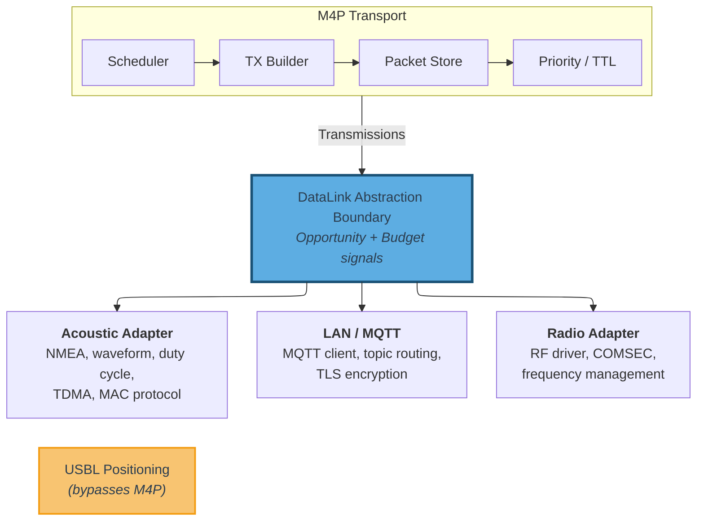

## 10. DataLink Abstraction {#10-datalink-abstraction}

**[GUIDANCE + BEHAVIORAL]**

The DataLink abstraction defines the boundary between the M4P transport layer and the physical communication layer.

### 10.1 DataLink Interface

**[BEHAVIORAL]**

Each data link modality (acoustic modem, radio, satellite terminal, LAN interface, etc.) is integrated with M4P through a DataLink adapter. The adapter exposes two pieces of information to the transport layer:

1. **Transmission opportunity**: An indication that the link is ready to send data ("I can send now" or "I cannot send now").
2. **Payload budget**: The maximum number of bytes the link can carry in the current transmission opportunity.

The adapter also delivers received transmissions to the transport for processing. The transport registers a callback with each adapter for inbound data delivery.

All modality-specific mechanics — waveform selection, duty-cycle management, MAC protocol behavior, TDMA scheduling, modem command interfaces, and physical-layer configuration — remain encapsulated within the DataLink adapter. The M4P transport layer MUST NOT depend on any modality-specific behavior beyond the transmission opportunity and payload budget interface.

**Boundary asymmetry.** The DataLink abstraction is intentionally asymmetric with respect to fleet-wide topology. The transport does not push fleet membership information — which peers exist on the network, when nodes join or depart, fleet size — down to DataLink adapters. Adaptive data link behaviors that depend on fleet composition (such as TDMA slot allocation and contention window sizing) are deployment-specific and are managed by the application layer (see [Section 10.4](#104-data-link-adaptation)).

**[GUIDANCE] Extended adapter interface.** The two-signal interface (transmission opportunity, payload budget) is the required contract. Adapters MAY additionally provide link quality or congestion metrics that the transport can use for scheduling and priority decisions. Implementations will typically expose richer scheduling metadata (timing constraints, rate characteristics, capability declarations) and may support modality-specific delivery optimizations (such as targeted delivery to a known peer's link-layer address on IP-based modalities). These implementation choices do not affect interoperability — the on-wire format of Transmissions is identical regardless of the adapter's internal interface. An adapter that provides only the required interface is fully conformant; the transport MUST function correctly without extended metadata.

**Non-networking capabilities.** The DataLink abstraction does not prevent applications or adapters from using hardware capabilities that fall outside M4P's networking scope. When a capability is networking-related (e.g., link-quality metrics that inform routing), it SHOULD be integrated into the M4P transport layer so all nodes benefit. When a capability falls outside the networking domain (e.g., USBL positioning from an acoustic modem), the DataLink adapter is free to expose it directly to applications through its own interfaces, independent of M4P.

Figure 8 illustrates the DataLink abstraction boundary with an expanded view of the adapter layer, showing how the M4P transport hands Transmissions to the boundary and how modality-specific adapters implement the connection to physical hardware.

**Figure 8 — DataLink Abstraction Boundary**

### 10.2 Modality Classification

**[BEHAVIORAL]**

Each DataLink adapter MUST declare whether it operates as an infrastructure or mesh modality (see [Section 2.6](#26-core-concepts-and-terminology)). The transport uses this classification to apply the appropriate forwarding policy ([Section 9.8.2](#982-infrastructure-and-mesh-modality-forwarding)). The classification is fixed for the lifetime of the adapter and reflects the link's delivery characteristics, not its physical layer technology.

### 10.3 Transmission Metadata

The canonical Transmission wire format and parsing rules are defined in [Section 5.8](#58-transmission-encoding). The DataLink adapter is responsible for delivering a complete Transmission — including the `node_address_sender` — to the transport layer on receive, and accepting one from the transport on send.

When a DataLink adapter carries the sender NA out-of-band (as permitted by [Section 5.8](#58-transmission-encoding)), both the sending and receiving adapters for that modality MUST use the same convention. The sending adapter omits the `node_address_sender` prefix from the wire payload; the receiving adapter reconstructs it from link-layer metadata and delivers the canonical format to the transport. The transport layer is unaware of this optimization.

Evidence-plane metadata ([Section 10.5](#105-scheduling-inputs)), when provided alongside a received Transmission, is local API data and MUST NOT be forwarded to other nodes. Each node's evidence-plane observations are consumed locally by the transport's scheduling logic.

### 10.4 Data Link Adaptation

Adaptive data link behaviors — such as TDMA slot allocation, contention window sizing, MAC schedule adjustment in response to fleet size changes, and transmission power management — vary significantly across modem hardware, fleet compositions, mission profiles, and operational phases. These behaviors cannot be generalized into a modality-agnostic protocol without coupling the protocol to specific hardware and operational scenarios. They are outside the scope of M4P and are managed by the application or autonomy layer.

The expected integration pattern for deployments that require adaptive data link behavior is:

1. **M4P provides network awareness.** The NC discovery mechanisms (NC_NODE_SUMMARY/NC_CLAIM_RENEWAL, address claims, claim expiration — see [Section 11.9](#119-peer-discovery-and-fleet-membership)) provide the application with current fleet membership: which nodes are present, when new nodes join, and when nodes depart (via claim expiration). Applications access this information through the implementation's peer registry interface.

2. **The application decides.** The application or autonomy layer evaluates the current fleet state alongside operational context that M4P does not possess: mission phase, node roles, positional information, modem capabilities, and deployment-specific scheduling policies. Based on this evaluation, the application determines the appropriate data link configuration.

3. **The application configures the adapter.** The application issues configuration commands to the DataLink adapter through the adapter's modality-specific interface (e.g., modem command protocol, adapter API). The adapter adjusts its behavior accordingly. M4P's transport layer is unaffected — it continues to receive transmission opportunities and payload budgets through the standard interface.

See [Appendix C](#appendix-c-application-integration-guidelines-non-normative) for a concrete TDMA adaptation example.

[GUIDANCE] Common data link adaptation scenarios include:

- **TDMA slot allocation.** When M4P's peer registry indicates a new node has joined (via NC_NODE_SUMMARY), the application MAY reconfigure the acoustic adapter's TDMA schedule to allocate a slot for the new node. When a node's claim expires (indicating departure), the application MAY reclaim the slot. The specific slot assignment algorithm is deployment-specific and depends on the modem's TDMA capabilities.

- **Contention-based MAC tuning.** For modems using contention-based MAC (e.g., CSMA-style protocols), the application MAY adjust contention window parameters based on the number of active peers known to M4P's peer registry. Larger fleets benefit from wider contention windows to reduce collision probability.

- **Pre-provisioned schedules.** Deployments with known fleet composition at launch time (the common case for planned operations — see [Section 11.7.3](#1173-nc_network_state_response-32002) guidance on initial network state provisioning) SHOULD pre-configure data link schedules alongside M4P network parameters. Runtime adaptation then serves as a correction mechanism for unplanned topology changes, not the primary configuration path.

**Note:** The full DataLink adapter API design — including configuration interfaces, state machines, event models, and modem command protocols — is implementation-specific and outside the scope of this protocol specification.

### 10.5 Scheduling Inputs

**[GUIDANCE — EXPERIMENTAL]**

> **EXPERIMENTAL** — Scheduling inputs support the dispersion-aware scheduling model ([Section 9.10](#910-dispersion-aware-scheduling-mesh-modalities)), which is not yet fully implemented. This section is expected to evolve alongside it.

The dispersion-aware scheduling model ([Section 9.10](#910-dispersion-aware-scheduling-mesh-modalities)) benefits from optional inputs beyond the minimum data-plane contract. These inputs arrive from two sources — the application layer (context hints) and the data link layer (evidence plane) — and are consumed locally by the transport's scheduling logic. Neither source modifies on-wire formats, affects interoperability, or is required for protocol correctness. The transport MUST function correctly when no scheduling inputs are provided.

**Application context hints.** The application MAY provide environmental context that improves scheduling efficiency on constrained modalities. Context hints follow the same integration pattern as data link adaptation ([Section 10.4](#104-data-link-adaptation)): the application evaluates operational context that M4P does not possess and provides relevant parameters to the transport. Inputs include self-position and peer position estimates (with uncertainty and timestamps), NodeUID-to-Node-Address identity mapping, and propagation model parameters (reliable range, maximum range). Position hints may originate from any source — USBL ranging, GPS-at-surface telemetry, INS dead reckoning, mission-planned waypoints, or peer status message payloads.

**Data link evidence plane.** When delivering a received Transmission, a DataLink adapter MAY attach reception quality metadata (SNR, RSSI, decode confidence). All fields are individually optional; when none are provided, the transport treats reception as a binary event. Each adapter SHOULD declare at initialization which reception quality fields it can provide; an adapter that declares none is fully conformant. Evidence-plane data is local API only — never encoded in any on-wire structure — and MUST NOT be forwarded to other nodes.

**Invariants.** Missing or stale inputs from either source MUST cause the transport to degrade toward more aggressive forwarding, never toward suppression.

---

