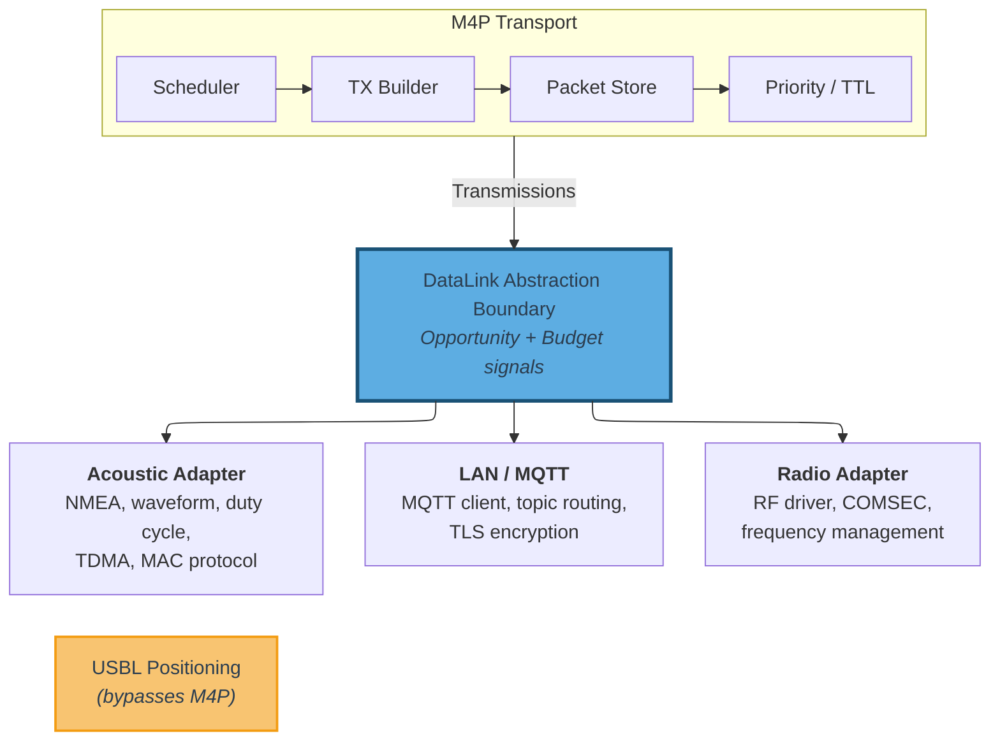

<!--
Copyright (c) 2026 Poseidon's Forge, Inc. All rights reserved.

This work is licensed under the Creative Commons Attribution 4.0
International License. To view a copy of this license, visit
https://creativecommons.org/licenses/by/4.0/

You are free to share (copy and redistribute) and adapt (remix, transform,
and build upon) this material in any medium or format for any purpose,
including commercial, under the following terms:
- Attribution: You must give appropriate credit to Poseidon's Forge, Inc.,
  provide a link to the license, and indicate if changes were made.
-->

## 10. DataLink Abstraction {#10-datalink-abstraction}

**[GUIDANCE + BEHAVIORAL]**

The DataLink abstraction defines the boundary between the M4P transport layer and the physical communication layer.

### 10.1 DataLink Interface

**[BEHAVIORAL]**

Each data link modality (acoustic modem, radio, satellite terminal, LAN interface, etc.) is integrated with M4P through a DataLink adapter. The adapter exposes two pieces of information to the transport layer:

1. **Transmission opportunity**: An indication that the link is ready to send data ("I can send now" or "I cannot send now").
2. **Payload budget**: The maximum number of bytes the link can carry in the current transmission opportunity.

The adapter also delivers received transmissions to the transport for processing. The transport registers a callback with each adapter for inbound data delivery.

In link-managed mode ([Section 10.4.1](#1041-link-managed-mode-default)), all modality-specific mechanics — waveform selection, duty-cycle management, MAC protocol behavior, modem command interfaces, and physical-layer configuration — remain encapsulated within the DataLink adapter. In M4P-managed TDMA mode ([Section 10.4.2](#1042-m4p-managed-tdma-mode)), TDMA participant convergence and slot assignment are protocol-defined; the adapter remains responsible for the physical send/receive path. In both modes, the M4P transport layer MUST NOT depend on any modality-specific behavior beyond the transmission opportunity and payload budget interface.

**Boundary asymmetry.** The DataLink abstraction remains intentionally asymmetric with respect to fleet-wide topology in link-managed mode: the transport does not push fleet membership directly to adapters. For M4P-managed TDMA, the node runtime provides derived schedule parameters rather than raw network-control packets (see [Section 10.4](#104-data-link-adaptation)).

**[GUIDANCE] Extended adapter interface.** The two-signal interface (transmission opportunity, payload budget) is the required contract. Adapters MAY additionally provide link quality or congestion metrics that the transport can use for scheduling and priority decisions. Implementations will typically expose richer scheduling metadata (timing constraints, rate characteristics, capability declarations) and may support modality-specific delivery optimizations (such as targeted delivery to a known peer's link-layer address on IP-based modalities). These implementation choices do not affect interoperability — the on-wire format of Transmissions is identical regardless of the adapter's internal interface. An adapter that provides only the required interface is fully conformant; the transport MUST function correctly without extended metadata.

**Non-networking capabilities.** The DataLink abstraction does not prevent applications or adapters from using hardware capabilities that fall outside M4P's networking scope. When a capability is networking-related (e.g., link-quality metrics that inform routing), it SHOULD be integrated into the M4P transport layer so all nodes benefit. When a capability falls outside the networking domain (e.g., USBL positioning from an acoustic modem), the DataLink adapter is free to expose it directly to applications through its own interfaces, independent of M4P.

Figure 8 illustrates the DataLink abstraction boundary with an expanded view of the adapter layer, showing how the M4P transport hands Transmissions to the boundary and how modality-specific adapters implement the connection to physical hardware.

**Figure 8 — DataLink Abstraction Boundary**

### 10.2 Modality Classification

**[BEHAVIORAL]**

Each DataLink adapter MUST declare whether it operates as an infrastructure or mesh modality (see [Section 2.6](#26-core-concepts-and-terminology)). The transport uses this classification to apply the appropriate forwarding policy ([Section 9.8.2](#982-infrastructure-and-mesh-modality-forwarding)). The classification is fixed for the lifetime of the adapter and reflects the link's delivery characteristics, not its physical layer technology.

### 10.3 Transmission Metadata

The canonical Transmission wire format and parsing rules are defined in [Section 5.8](#58-transmission-encoding). The DataLink adapter is responsible for delivering a complete Transmission — including the `node_address_sender` — to the transport layer on receive, and accepting one from the transport on send.

When a DataLink adapter carries the sender NA out-of-band (as permitted by [Section 5.8](#58-transmission-encoding)), both the sending and receiving adapters for that modality MUST use the same convention. The sending adapter omits the `node_address_sender` prefix from the wire payload; the receiving adapter reconstructs it from link-layer metadata and delivers the canonical format to the transport. The transport layer is unaware of this optimization.

Evidence-plane metadata ([Section 10.5](#105-scheduling-inputs)), when provided alongside a received Transmission, is local API data and MUST NOT be forwarded to other nodes. Each node's evidence-plane observations are consumed locally by the transport's scheduling logic.

### 10.4 Data Link Adaptation

**[BEHAVIORAL + GUIDANCE]**

M4P supports two MAC-management modes at the DataLink boundary. A link instance MUST operate in exactly one mode for its lifetime (unless explicitly re-registered with a different mode).

The selected mode determines who owns transmission-opportunity timing:

- **Link-managed:** the adapter decides when opportunities exist.
- **M4P-managed TDMA:** the M4P runtime decides when opportunities exist from NC-derived schedule state.

In both modes, the adapter remains responsible for the physical send/receive path and payload budget constraints.

#### 10.4.1 Link-Managed Mode (default)

In link-managed mode, the DataLink adapter owns MAC behavior and transmission-opportunity timing. The adapter decides when to expose send opportunities and with what payload budget, and M4P treats the adapter as an opaque MAC implementation.

M4P MUST NOT assume any specific slotting, contention, or link-layer scheduler algorithm in this mode.

#### 10.4.2 M4P-Managed TDMA Mode

In M4P-managed TDMA mode, TDMA participation and schedule convergence are protocol-defined through `NC_TDMA_JOIN` and `NC_TDMA_SCHEDULE` ([Section 11.7.17](#11717-nc_tdma_join-32030), [Section 11.7.18](#11718-nc_tdma_schedule-32031)). Slot assignment MUST follow the deterministic algorithm in [Section 11.7.18.1](#117181-slot-assignment-algorithm).

For this mode, send timing is driven by the M4P node runtime (daemon in the reference architecture), not by link-originated timing callbacks. The DataLink adapter functions as a transport pipe: it accepts `SendTransmission` directives and reports send outcomes.

Implementations in this mode MUST treat TDMA timing as protocol-owned behavior. The adapter MUST NOT be the authoritative source of slot timing.

All participants on a modality MUST use identical TDMA timing parameters (cycle duration, contention window, slot duration, guard time). These are deployment-configured, per-modality parameters — not negotiated over the wire. Divergent timing values produce incorrect slot computations and slot collisions.

Before a local schedule exists, implementations MAY provide contention-window transmission opportunities so required NC bootstrap traffic (for example address claims and TDMA joins) can be emitted. After schedule assignment, transmission opportunities MUST follow assigned TDMA slots.

#### 10.4.3 Complementary Application-Layer Adaptation

Application/autonomy logic remains a complementary source of adaptation policy in both modes. M4P provides network-awareness signals; the application may apply mission-specific policy and issue adapter configuration updates that are outside interoperability scope.

[GUIDANCE] Common adaptation scenarios include:

- **Fleet-aware tuning.** The application MAY tune modem parameters (power profile, waveform, channel coding, contention policy) based on current peer population and mission phase.
- **Mode selection per link.** Deployments MAY use link-managed MAC on some links and M4P-managed TDMA on others, according to modality constraints and operational goals.
- **Pre-provisioned timing.** Deployments with known fleet composition at launch SHOULD pre-configure baseline TDMA timing parameters; runtime behavior then handles unplanned topology change.
- **Contention sizing policy.** For deployments using TDMA contention windows, the application MAY tune contention parameters to expected peer density and channel conditions.

See [Appendix C](#appendix-c-application-integration-guidelines-non-normative) for a concrete adaptation example.

**Note:** DataLink adapter API shape (configuration commands, state machines, modem command protocols) remains implementation-specific and outside this protocol specification.

### 10.5 Scheduling Inputs

**[GUIDANCE — EXPERIMENTAL]**

> **EXPERIMENTAL** — Scheduling inputs support the dispersion-aware scheduling model ([Section 9.10](#910-dispersion-aware-scheduling-mesh-modalities)), which is not yet fully implemented. This section is expected to evolve alongside it.

The dispersion-aware scheduling model ([Section 9.10](#910-dispersion-aware-scheduling-mesh-modalities)) benefits from optional inputs beyond the minimum data-plane contract. These inputs arrive from two sources — the application layer (context hints) and the data link layer (evidence plane) — and are consumed locally by the transport's scheduling logic. Neither source modifies on-wire formats, affects interoperability, or is required for protocol correctness. The transport MUST function correctly when no scheduling inputs are provided.

**Application context hints.** The application MAY provide environmental context that improves scheduling efficiency on constrained modalities. Context hints follow the same integration pattern as data link adaptation ([Section 10.4](#104-data-link-adaptation)): the application evaluates operational context that M4P does not possess and provides relevant parameters to the transport. Inputs include self-position and peer position estimates (with uncertainty and timestamps), NodeUID-to-Node-Address identity mapping, and propagation model parameters (reliable range, maximum range). Position hints may originate from any source — USBL ranging, GPS-at-surface telemetry, INS dead reckoning, mission-planned waypoints, or peer status message payloads.

**Data link evidence plane.** When delivering a received Transmission, a DataLink adapter MAY attach reception quality metadata (SNR, RSSI, decode confidence). All fields are individually optional; when none are provided, the transport treats reception as a binary event. Each adapter SHOULD declare at initialization which reception quality fields it can provide; an adapter that declares none is fully conformant. Evidence-plane data is local API only — never encoded in any on-wire structure — and MUST NOT be forwarded to other nodes.

**Invariants.** Missing or stale inputs from either source MUST cause the transport to degrade toward more aggressive forwarding, never toward suppression.

---
