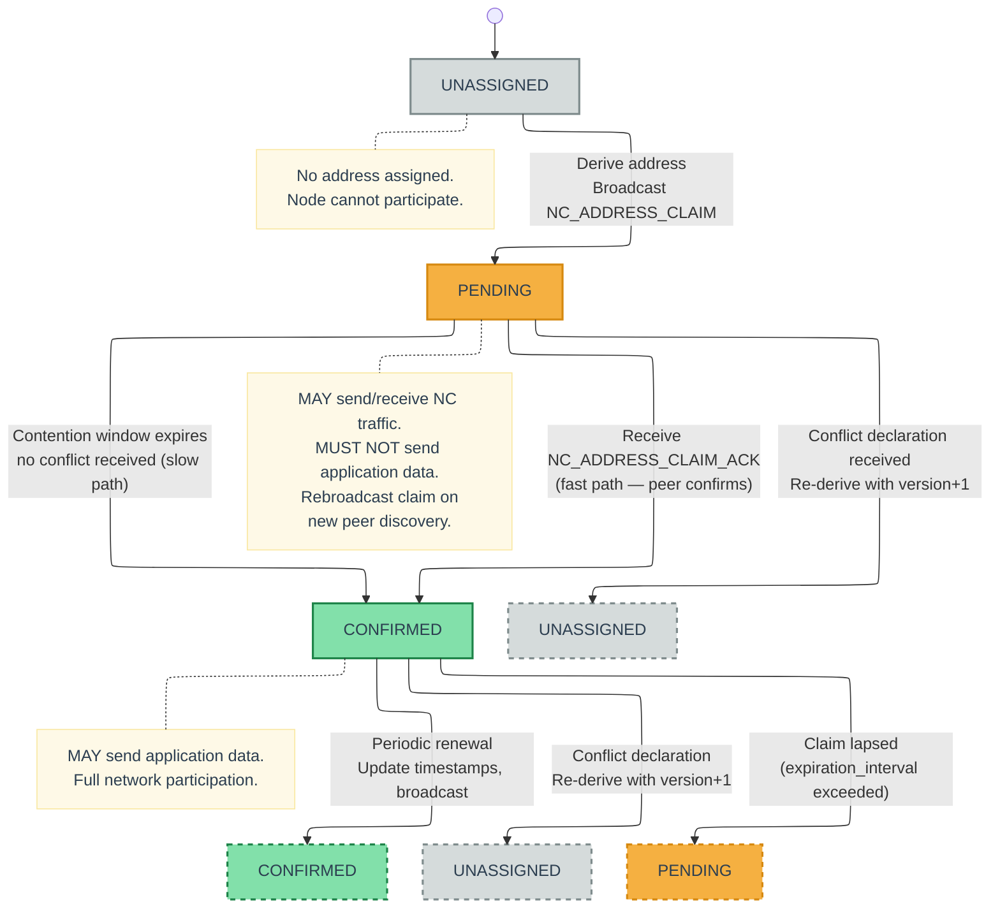
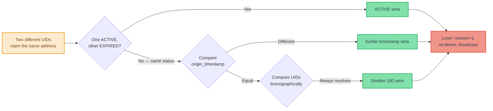
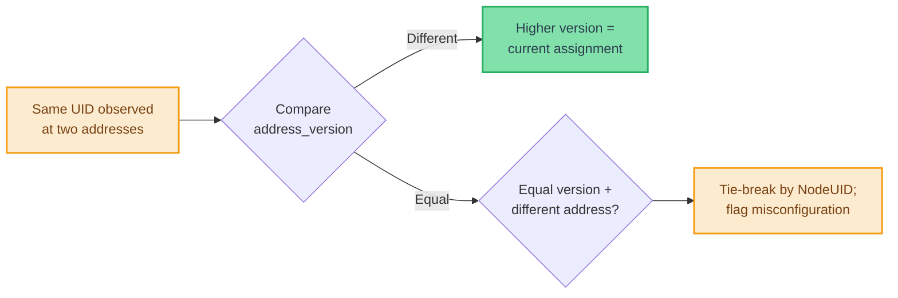
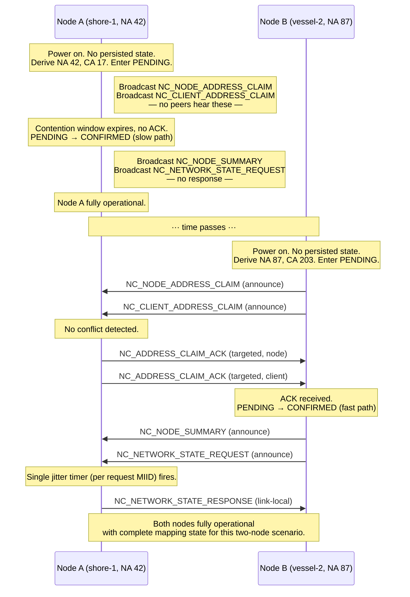

<!--
Copyright (c) 2026 Poseidon's Forge, Inc. All rights reserved.

This work is licensed under the Creative Commons Attribution 4.0
International License. To view a copy of this license, visit
https://creativecommons.org/licenses/by/4.0/

You are free to share (copy and redistribute) and adapt (remix, transform,
and build upon) this material in any medium or format for any purpose,
including commercial, under the following terms:
- Attribution: You must give appropriate credit to Poseidon's Forge, Inc.,
  provide a link to the license, and indicate if changes were made.
-->

## 11. Network Layer {#11-network-layer}

**[WIRE FORMAT + BEHAVIORAL]**

Network layer functions operate through Network Control (NC) messages — reserved message types (32,000–32,767) carried by the transport layer using the same store-carry-forward mechanisms as application traffic (see [Section 4.1](#41-message-type-id-ranges)). NC messages are never delivered to application clients. The network layer is fully decentralized; address coordination, conflict resolution, and peer discovery decisions are made locally from information exchanged between peers.

### 11.1 Address Derivation and Versioning

**[WIRE FORMAT]**

Each Node Address and Client Address is derived deterministically from global identity and network ID, so a given identity yields the same initial address on every node. This reduces (but does not eliminate) conflicts; full claim lifecycle behavior is shown in Figure 9 ([Section 11.4](#114-claim-lifecycle)).

The derivation algorithm:

```text
ADDRESS_SPACE = configured address space size (256 for 8-bit, 65536 for 16-bit)
PRIME_STEP = 7919  (coprime to ADDRESS_SPACE; 7919 is prime and odd, so coprime to 2^8 and 2^16)

network_id_bytes = UTF-8(network_id)
uid_bytes = UTF-8(uid)
digest = SHA-256(len(network_id_bytes) || network_id_bytes || uid_bytes)
base = (digest[0] << 24 | digest[1] << 16 | digest[2] << 8 | digest[3]) mod ADDRESS_SPACE
address(version) = (base + version * PRIME_STEP) mod ADDRESS_SPACE
```

Where `||` denotes byte-string concatenation, `len(network_id_bytes)` is the byte length of the UTF-8-encoded `network_id` as a 2-byte big-endian unsigned integer, and `digest[0..3]` are the first four bytes of the SHA-256 output, interpreted as a big-endian unsigned 32-bit integer. The length prefix eliminates domain ambiguity between the `network_id` and `uid` fields.

- First assignment: `version = 0`, `address = address(0)`.
- On conflict loss: increment version, compute `address(version)`, skip if locally occupied, continue incrementing until a free address is found.
- Because PRIME_STEP = 7919 is coprime to both 2^8 and 2^16, the sequence `address(0), address(1), ...` visits every address in the space (256 for 8-bit mode, 65,536 for 16-bit mode) before repeating. Address exhaustion occurs only when the space is full.

Valid unicast addresses range from `1` to `ADDRESS_SPACE - 1` (1–255 for 8-bit, 1–65,535 for 16-bit). The value `0` is reserved for broadcast and MUST NOT be assigned.

If the derived address for any version is 0 (broadcast) or already occupied by another local client, the node MUST increment the version and recompute. This is the same mechanism used after conflict loss.

Each address assignment carries a monotonically increasing `address_version` (unsigned 16-bit integer). The version is incremented each time a node or client re-addresses (e.g., after losing a conflict).

Address versioning solves the **stale mapping** problem: when the same UID is observed at two different addresses by different parts of the network, the higher version identifies the current assignment.

Resolution rules for stale mappings (same UID, different addresses):

- `new_version > stored_version` → accept the update as current.
- `new_version < stored_version` → discard as stale.
- `new_version == stored_version` with different address → tie-break by NodeUID; flag as potential misconfiguration.

### 11.2 Claim Timestamps

Each address assignment carries two timestamps:

- **`claim_origin_timestamp`** (u32, Unix epoch seconds): Set when an address assignment is created, persisted with the assignment, and immutable until the assignment changes. It MUST be reset to `now()` for a new assignment event (conflict loss, claim lapse, or network switch).
- **`claim_renewal_timestamp`** (u32, Unix epoch seconds): Set to `now()` on initial claim and updated on each claim refresh (NC_NODE_SUMMARY, NC_CLAIM_RENEWAL, or explicit claim broadcast). It is persisted with the assignment.

`claim_origin_timestamp` provides first-come ordering for active claim conflicts. `claim_renewal_timestamp` provides liveness (`active` vs `expired`).

**Clock synchronization assumption.** Nodes need reasonably aligned clocks for origin-timestamp ordering. Typical maritime timing sources (for example, GPS when surfaced) are sufficient. If clocks diverge significantly, tie-breaking falls back to deterministic UID ordering.

Address version, origin timestamp, and renewal timestamp each solve a different problem, as summarized in the following table:

| Scenario | Resolution Mechanism |
|---|---|
| Same address, different UIDs (conflict) | Active/expired status (`claim_renewal_timestamp`), then `claim_origin_timestamp` (earlier wins), then UID tiebreak |
| Same UID, different addresses (stale mapping) | `address_version` (higher wins) |
| Is this node still present? (liveness) | `claim_renewal_timestamp` vs `expiration_interval` |

Lifecycle rules that update these fields are defined in [Section 11.1](#111-address-derivation-and-versioning), [Section 11.3](#113-claim-expiration-and-renewal), [Section 11.4](#114-claim-lifecycle), and [Section 11.5](#115-local-persistence).

**Note:** Claim timestamps use Unix epoch seconds (u32) for absolute ordering across hours and days. This differs from the transport `timestamp_24h` field, which is a compact 24-hour transport timestamp. The two fields are not interchangeable.

### 11.3 Claim Expiration and Renewal

Address claims expire unless periodically refreshed, allowing reclamation of addresses held by departed nodes.

Expiration status is the first conflict-resolution factor: active beats expired; ties fall through to timestamp and UID rules ([Section 11.8.2](#1182-resolution-rules)).

#### 11.3.1 Expiration Interval

The `expiration_interval` is a network-wide configuration parameter defining the maximum duration a claim remains valid without renewal. A claim is **active** if:

```text
now - claim_renewal_timestamp < expiration_interval
```

A claim is **expired** if:

```text
now - claim_renewal_timestamp >= expiration_interval
```

Because `claim_renewal_timestamp` is carried in the NC payload and `expiration_interval` is a shared network-wide parameter, every node that receives the same claim computes the same active/expired status. This is fully deterministic.

The `expiration_interval` SHOULD be configured based on the deployment's operational profile — longer intervals (hours to days) for stable deployments with infrequent topology changes; shorter intervals (hours) for dynamic deployments with frequent node turnover.

#### 11.3.2 Refresh Mechanism

Nodes MUST periodically re-broadcast their address claims to keep them active. Two NC messages serve as refresh mechanisms:

- **NC_NODE_SUMMARY** ([Section 11.7.1](#1171-nc_node_summary-32000)) carries full identity and claim data. Used on modalities where the summary fits within the payload budget.
- **NC_CLAIM_RENEWAL** ([Section 11.7.14](#11714-nc_claim_renewal-32004)) carries only addresses and renewal timestamps. Used on constrained modalities where the full summary exceeds the payload budget.

Both refresh `claim_renewal_timestamp` values and keep claims active.

The recommended broadcast interval for NC_NODE_SUMMARY and NC_CLAIM_RENEWAL is:

```text
summary_broadcast_interval = expiration_interval / 2
```

Broadcasting at half-interval provides at least two renewal opportunities per expiration window. Deployments with very high loss MAY use a smaller fraction (for example, `expiration_interval / 3` or `expiration_interval / 4`).

**[GUIDANCE] NC summary scheduling on constrained links.** On mesh links, each summary interval produces one self-broadcast per node. Deployments SHOULD manage this overhead by:

- **Temporal jitter.** Add random jitter (up to `summary_broadcast_interval / N`) to stagger broadcasts and reduce clustering.
- **Short UIDs.** Keep node and client UIDs short; UID strings dominate summary size.
- **Expiration interval scaling.** For large fleets on severely constrained links, use longer `expiration_interval` values to reduce summary frequency.
- **Constrained-link fallback.** On modalities where the full NC_NODE_SUMMARY exceeds the payload budget, nodes SHOULD send NC_CLAIM_RENEWAL instead ([Section 11.7.14](#11714-nc_claim_renewal-32004)).

**Sizing reference:** Per-node summary payload is approximately `(13 + L_node + C × (12 + L_client))` bytes in 8-bit mode (`+1` byte per address field in 16-bit mode), where `L_node` and `L_client` are UID lengths and `C` is hosted client count.

#### 11.3.3 Lapsed Claim Detection

A node can detect that its own claim has lapsed by checking:

```text
now - last_broadcast_renewal_timestamp >= expiration_interval
```

This occurs when a node has been unable to broadcast for longer than the expiration interval. When a node detects that its own claim has lapsed, it MUST treat the next broadcast as a **new claim**:

- Set `claim_origin_timestamp = now()` (the node is now a new claimant, not the original holder).
- Set `claim_renewal_timestamp = now()`.
- Retain the existing `address` and `address_version` (attempt reclaim of the prior address).

If the address was taken during the lapse, normal conflict rules make the returning node lose (later `claim_origin_timestamp`) and re-address, preventing displacement of an established holder.

### 11.4 Claim Lifecycle

**[BEHAVIORAL]**

When a node derives or re-derives an address (first boot, conflict loss, or network join), it moves through a confirmation lifecycle before sending application traffic.

Figure 9 shows the lifecycle states (UNASSIGNED, PENDING, CONFIRMED) and transitions, including conflict recovery and lapsed-claim re-entry.



**Figure 9 — Address Claim Lifecycle State Machine**

**Claim states.** Each address assignment (node or client) is in one of three states: **UNASSIGNED** (no address derived; node cannot participate), **PENDING** (claim broadcast but not yet confirmed; node MAY send/receive NC traffic but MUST NOT send application data), and **CONFIRMED** (claim confirmed; node MAY send application data).

#### 11.4.1 Confirmation Paths

A PENDING claim transitions to CONFIRMED via either of two paths:

**Fast path (peer ACK).** A 1-hop neighbor receives the claim, checks its known address mappings, finds no conflict, and sends an NC_ADDRESS_CLAIM_ACK targeted back to the claimant. Upon receiving any single ACK, the claiming node transitions the address to CONFIRMED. In an established network, at least one neighbor typically responds within the fastest available link's round-trip time.

**Slow path (contention timeout).** If no ACK is received within the contention window, the claim auto-confirms. This covers the bootstrap case where the node is the first (or only) participant on the network and there are no peers to ACK.

If a conflict declaration (NC_NODE_ADDRESS_CONFLICT or NC_CLIENT_ADDRESS_CONFLICT) is received while PENDING, the node re-addresses immediately without waiting for the contention window to expire.

**Contention window.** [GUIDANCE] The `contention_scalar` is deployment-configurable. The contention window affects only the fallback auto-confirmation path; in the presence of peers, claims are confirmed by ACK receipt (Section 11.7.12) independent of the contention window. Conflict resolution operates regardless of confirmation state (Section 11.8), ensuring that divergent contention window configurations do not produce permanent addressing inconsistencies. Implementations SHOULD tune `contention_scalar` to match the expected round-trip characteristics of the deployment's primary modality.

**ACK suppression.** [GUIDANCE] ACK suppression uses a random backoff delay before sending an ACK, to reduce the probability of simultaneous ACK transmissions from multiple nodes. The backoff range SHOULD be tuned to the characteristics of the underlying data link — shorter delays for low-latency links (LAN, IP/MQTT), longer delays for high-latency or half-duplex links (radio), and potentially unnecessary on links where transmit scheduling already provides natural spacing (acoustic). The specific backoff ranges are an implementation choice.

#### 11.4.2 Pending Claim Rebroadcast

A node with a PENDING claim SHOULD rebroadcast the claim when it discovers a new 1-hop peer — that is, when it receives any NC message from a Node Address not previously known to the node. The new peer may not have been online when the original claim was broadcast and therefore has never had an opportunity to ACK or contest it.

This accelerates staggered boot convergence: the first node can be ACKed soon after peers appear instead of waiting for full contention timeout. Rebroadcast is event-driven (new-peer discovery), not timer-driven.

#### 11.4.3 Restored Claims

On startup, restored claim state enters the same lifecycle as fresh claims using these boot-path rules (for the node claim and each persisted client claim):

| Boot Condition | Entry State | Required Actions |
|---|---|---|
| **Active persisted claim** (`now - claim_renewal_timestamp < expiration_interval`) | CONFIRMED | Restore address and `address_version`; set `claim_renewal_timestamp = now()`; broadcast claim/summary/renewal refresh |
| **Lapsed persisted claim** (`now - claim_renewal_timestamp >= expiration_interval`) | PENDING | Restore address and `address_version` (increment only if a later conflict is lost); set `claim_origin_timestamp = now()` and `claim_renewal_timestamp = now()`; complete normal confirmation before application traffic |
| **No persisted state** | UNASSIGNED | Derive `address = derive(0)` with `address_version = 0`; set both timestamps to `now()` |

If an address was taken during a lapse, the returning claimant loses by `claim_origin_timestamp` ordering and re-addresses per normal conflict rules.

### 11.5 Local Persistence

Address assignments MUST be persisted locally to survive reboots without requiring full re-resolution. The persisted state per network includes:

- Node: `(NodeUID, node_address, address_version, claim_origin_timestamp, claim_renewal_timestamp)`
- Per client: `(ClientUID, client_address, address_version, claim_origin_timestamp, claim_renewal_timestamp)`

On startup, nodes MUST load persisted state for the active network ID. If persisted NodeUID does not match the current node identity, the node claim state MUST be treated as absent. Restored node/client claims then follow the boot-path lifecycle rules in [Section 11.4.3](#1143-restored-claims).

### 11.6 Network Control Message Format

**[WIRE FORMAT]**

#### 11.6.1 Transport Properties

NC messages use the same MIID deduplication, TTL expiration, and store-carry-forward delivery as application traffic.

NC Message Type IDs fall in the reserved range `32,000–32,767` and always use the 2-byte Compact Type Encoding.

NC messages MUST NOT be delivered to application clients. Nodes MUST intercept NC messages after unpacking a Transmission and route them to the network layer for processing.

NC messages use the dedicated NC packet header formats defined in [Section 5.5](#55-network-control-packet-headers). These headers use Node Addresses (not Client Addresses), carry no flags field, and do not support optional fields or fragmentation.

- **Announce and Query** NC messages use the NC Announce header ([Section 5.5.1](#551-nc-announce-header)); `source` is the origin node NA.
- **Targeted** NC messages use the NC Targeted header ([Section 5.5.2](#552-nc-targeted-header)); `source` and `destination` are NAs and are routed via peer-registry knowledge.

Only NC_NODE_SUMMARY and NC_NODE_ADDRESS_CLAIM carry origin NodeUID in payload. Other NC types omit it to reduce overhead; sender identity is resolved from source NA (header) or `node_address` fields plus summary/WHOIS state.

**Payload encoding.** NC payloads use binary encoding with big-endian byte order. String fields are length-prefixed (`u8` length + bytes). This keeps NC messages compact for constrained links.

**Address field widths.** All address fields in NC payloads (node addresses and client addresses) MUST use the same width as the network-wide addressing mode: 8-bit in 8-bit addressing deployments, 16-bit in 16-bit addressing deployments. The notation `(NA width)` and `(CA width)` in the payload diagrams below refers to this configured width (1 or 2 bytes).

#### 11.6.2 Propagation Models

NC defines three propagation models:

**Announce.** Broadcast + forward at each receiver; MIID deduplication prevents loops.

Specific NC message types may further constrain Announce forwarding by modality — see individual catalog entries in [Section 11.7](#117-nc-message-catalog). In particular, NC_NODE_SUMMARY and NC_CLAIM_RENEWAL suppress mesh forwarding ([Section 11.7.1](#1171-nc_node_summary-32000), [Section 11.7.14](#11714-nc_claim_renewal-32004)), and NC_NETWORK_STATE_REQUEST/RESPONSE suppress all forwarding ([Section 11.7.2](#1172-nc_network_state_request-32001), [Section 11.7.3](#1173-nc_network_state_response-32002)).

- **Header:** NC Announce ([Section 5.5.1](#551-nc-announce-header)).
- Used by: NC_NODE_SUMMARY, NC_CLAIM_RENEWAL, NC_NETWORK_STATE_REQUEST, NC_NETWORK_STATE_RESPONSE, NC_NODE_ADDRESS_CLAIM, NC_CLIENT_ADDRESS_CLAIM, NC_NODE_ADDRESS_CONFLICT, NC_CLIENT_ADDRESS_CONFLICT.

**Query/Response.** Queries propagate like Announce until reaching a resolver (local host state or learned mapping). A resolver:

1. MUST NOT forward the query further.
2. MUST emit the corresponding response, targeted back to the querier.

Responses are targeted to the querier NA (not network-wide broadcast). Query/answer provides on-demand resolution; periodic NC_NODE_SUMMARY provides eventual network-wide convergence.

If multiple nodes can resolve, each MAY absorb and answer; the querier accepts the first and discards duplicates.

- **Header:** Queries use the NC Announce header ([Section 5.5.1](#551-nc-announce-header)); answers use the NC Targeted header ([Section 5.5.2](#552-nc-targeted-header)).
- Used by: NC_CLIENT_UID_QUERY → NC_CLIENT_UID_ANSWER, NC_NODE_UID_QUERY → NC_NODE_UID_ANSWER, NC_CLIENT_ADDRESS_RESOLVE_QUERY → NC_CLIENT_ADDRESS_RESOLVE_ANSWER.

> [GUIDANCE] A resolver answering from learned (non-local) state may return stale data. This is acceptable in DTN operation: stale mappings are corrected by address versioning (Section 11.1), fingerprint-triggered refresh (Section 11.9.4), and periodic NC_NODE_SUMMARY convergence (Section 11.7.1).

**Targeted.** Addressed to one destination and forwarded only toward that destination via store-carry-forward.

- **Header:** NC Targeted ([Section 5.5.2](#552-nc-targeted-header)).
- Used by: NC_ADDRESS_CLAIM_ACK, NC_NODE_UID_ANSWER, NC_CLIENT_UID_ANSWER, NC_CLIENT_ADDRESS_RESOLVE_ANSWER, Fragment NACK.

The propagation definitions above are authoritative; message-type usage is listed in each model's "Used by" line and in the catalog below.

### 11.7 NC Message Catalog

#### 11.7.0 Scheduling Bias

**Scheduling bias.** NC messages have the highest *default* class bias relative to application traffic because correct address mappings and peer state are prerequisites for reliable application delivery. Recommended class bias order: (1) Network Control, (2) Request, (3) Response, (4) Event, (5) Status. This is a scheduling bias, not strict preemption: higher-priority eligible application packets MAY outrank lower-priority NC packets.

Conflict-related catalog entries in this section define trigger surfaces and message contents. Deterministic winner/loser rules, convergence, and declaration suppression are defined canonically in [Section 11.8](#118-conflict-detection-and-resolution).

**Shared catalog rules (unless overridden below):**
- **Propagation labels.** `Announce`, `Query`, and `Targeted` semantics (including header selection) are defined in [Section 11.6.2](#1162-propagation-models).
- **Query receiver handling.** For `NC_CLIENT_UID_QUERY`, `NC_NODE_UID_QUERY`, and `NC_CLIENT_ADDRESS_RESOLVE_QUERY`, a receiver that can resolve one or more queried items MUST emit the corresponding targeted answer(s) for resolved items; it MUST absorb (not forward) only when all queried items are resolvable; otherwise it forwards the full query and MAY include partial answers.
- **Mapping update handling.** Messages that carry UID/address mappings (summaries, claims, answers, and state responses) MUST apply stale-mapping rules from [Section 11.1](#111-address-derivation-and-versioning) and conflict rules from [Section 11.8](#118-conflict-detection-and-resolution).

NC message default priorities are deployment-configurable. The following RECOMMENDED defaults reflect the relative urgency of each message type:

| Type ID | Name | Propagation | Default Priority | Urgency |
|--------:|----------------------------|-----------|:------------:|-------------------------|
| 32,000 | NC_NODE_SUMMARY | Announce | 40 | Low — periodic background maintenance |
| 32,001 | NC_NETWORK_STATE_REQUEST | Announce | 120 | Medium — bulk sync, not time-critical |
| 32,002 | NC_NETWORK_STATE_RESPONSE | Announce | 120 | Medium — bulk sync response |
| 32,003 | Fragment NACK | Targeted | 160 | Medium — retransmission request |
| 32,004 | NC_CLAIM_RENEWAL | Announce | 40 | Low — periodic background maintenance |
| 32,010 | NC_NODE_ADDRESS_CLAIM | Announce | 200 | High — network formation |
| 32,011 | NC_CLIENT_ADDRESS_CLAIM | Announce | 200 | High — network formation |
| 32,012 | NC_ADDRESS_CLAIM_ACK | Targeted | 200 | High — unblocks application data |
| 32,013 | NC_NODE_UID_QUERY | Query | 160 | Medium — on-demand resolution |
| 32,014 | NC_NODE_UID_ANSWER | Targeted | 160 | Medium — on-demand resolution |
| 32,015 | NC_CLIENT_UID_QUERY | Query | 160 | Medium — on-demand resolution |
| 32,016 | NC_CLIENT_UID_ANSWER | Targeted | 160 | Medium — on-demand resolution |
| 32,017 | NC_CLIENT_ADDRESS_RESOLVE_QUERY | Query | 160 | Medium — on-demand resolution |
| 32,018 | NC_CLIENT_ADDRESS_RESOLVE_ANSWER | Targeted | 160 | Medium — on-demand resolution |
| 32,020 | NC_NODE_ADDRESS_CONFLICT | Announce | 240 | Critical — stop using wrong address |
| 32,021 | NC_CLIENT_ADDRESS_CONFLICT | Announce | 240 | Critical — stop using wrong address |

#### 11.7.1 NC_NODE_SUMMARY (32,000)

**Purpose:** Periodic broadcast of a node's identity, address, and hosted clients; primary baseline discovery.

**Propagation:** Announce.

**When sent:**
- On node startup (after address assignment).
- Periodically at `expiration_interval / 2` (see [Section 11.3.2](#1132-refresh-mechanism)).
- When the node's address or hosted client set changes.

**Payload:**

```text
+-----------------------------------------------+
| origin_node_uid_len    (u8)                    |
+-----------------------------------------------+
| origin_node_uid        (origin_node_uid_len B) |
+-----------------------------------------------+
| node_address           (NA width)              |
+-----------------------------------------------+
| node_address_version   (u16)                   |
+-----------------------------------------------+
| node_claim_origin_ts   (u32)                   |
+-----------------------------------------------+
| node_claim_renewal_ts  (u32)                   |
+-----------------------------------------------+
| hosted_client_count    (u8)                    |
+-----------------------------------------------+
| repeat hosted_client_count times:              |
|   client_address       (CA width)              |
|   client_address_version (u16)                 |
|   client_claim_origin_ts (u32)                 |
|   client_claim_renewal_ts (u32)                |
|   client_uid_len       (u8)                    |
|   client_uid           (client_uid_len B)      |
+-----------------------------------------------+
```

**Payload size:** `13 + N + C × (12 + Cᵢ)` bytes (8-bit) | `14 + N + C × (13 + Cᵢ)` bytes (16-bit), where N = `origin_node_uid_len`, C = `hosted_client_count`, Cᵢ = `client_uid_len` for each client.

**Receiver behavior:**
- Apply shared mapping-update handling and update node/client mapping state.

**Mesh forwarding suppression.** [BEHAVIORAL] Nodes MUST NOT forward received NC_NODE_SUMMARY packets on mesh modalities; only the originator broadcasts its own summary. On infrastructure modalities, normal Announce forwarding applies.

This suppression applies to NC_NODE_SUMMARY and NC_CLAIM_RENEWAL. NC_NETWORK_STATE_REQUEST and NC_NETWORK_STATE_RESPONSE suppress all forwarding (see [Section 11.7.2](#1172-nc_network_state_request-32001), [Section 11.7.3](#1173-nc_network_state_response-32002)). Other Announce NC messages remain fully forwarded.

#### 11.7.2 NC_NETWORK_STATE_REQUEST (32,001)

**Purpose:** Request known network mapping state from peers for fast bootstrap.

**Propagation:** Announce.

**When sent:**
- On node startup (after address assignment) on high-bandwidth modalities (LAN, MQTT).
- Optionally after extended downtime or reinitialization when local mapping state may be stale.
- SHOULD NOT be sent on constrained links (acoustic) where the response payload would exceed practical limits.
- A node MUST NOT send more than one NC_NETWORK_STATE_REQUEST per link within a cooldown period (implementation-defined, recommended minimum 30 seconds).
- A node MAY send one logical NC_NETWORK_STATE_REQUEST concurrently on multiple high-bandwidth modalities; all such transmissions MUST reuse the same MIID.

**Payload:** None (empty payload).

**Payload size:** `0` bytes.

**Forwarding suppression.** [BEHAVIORAL] Nodes MUST NOT forward received NC_NETWORK_STATE_REQUEST packets on any modality. This message is strictly link-local.

**Receiver behavior:**
- On first observation of a request MIID, start exactly one randomized jitter timer (single logical request; never per link or per modality) and choose the delay once: recommended range 50–500 ms if the request is observed only on LAN high-bandwidth links, or 1–5 s if observed on any non-LAN high-bandwidth link (for example, MQTT).
- If the same request MIID is later received on additional modalities, treat it as the same logical request; do not start, reset, or re-tune the timer.
- During the jitter window, monitor NC_NETWORK_STATE_RESPONSE traffic across all high-bandwidth modalities where the request was observed.
- When the timer fires, evaluate exactly once: respond with an NC_NETWORK_STATE_RESPONSE only if the node holds mappings that are newer than or absent from responses already observed. If all local mappings are already covered, suppress the response. See [Section 11.7.3](#1173-nc_network_state_response-32002) for truncation interaction.
- If responding, enqueue exactly one logical NC_NETWORK_STATE_RESPONSE in the local message store. The transport MAY transmit that logical response on one or more high-bandwidth modalities; all such transmissions MUST reuse the same response MIID.
- A node MUST NOT re-evaluate or enqueue more than one logical response per request MIID.

#### 11.7.3 NC_NETWORK_STATE_RESPONSE (32,002)

**Purpose:** Broadcast of a node's known mappings for bootstrap and link-local convergence.

**Propagation:** Announce.

**When sent:**
- After receiving an NC_NETWORK_STATE_REQUEST, subject to jitter-based suppression (see [Section 11.7.2](#1172-nc_network_state_request-32001) receiver behavior).
- A responder MAY emit one logical NC_NETWORK_STATE_RESPONSE on multiple high-bandwidth modalities that observed the request; this is one response instance (one MIID), not one response per modality.

**Payload:**

```text
+-----------------------------------------------+
| known_node_count       (u16)                   |
+-----------------------------------------------+
| repeat known_node_count times:                 |
|   node_uid_len         (u8)                    |
|   node_uid             (node_uid_len B)        |
|   node_address         (NA width)              |
|   node_address_version (u16)                   |
|   node_claim_origin_ts (u32)                   |
|   node_claim_renewal_ts (u32)                  |
|   hosted_client_count  (u8)                    |
|   repeat hosted_client_count times:            |
|     client_address     (CA width)              |
|     client_address_version (u16)               |
|     client_claim_origin_ts (u32)               |
|     client_claim_renewal_ts (u32)              |
|     client_uid_len     (u8)                    |
|     client_uid         (client_uid_len B)      |
+-----------------------------------------------+
```

**Payload size:** Variable. `2` bytes fixed (known_node_count), plus per node: `13 + N + C × (12 + Cᵢ)` bytes (8-bit) | `14 + N + C × (13 + Cᵢ)` bytes (16-bit), where N = `node_uid_len`, C = `hosted_client_count`, Cᵢ = `client_uid_len` for each client.

This is an **optional bootstrap optimization**; correctness does not depend on it. Because NC messages MUST NOT be fragmented ([Section 5.5](#55-network-control-packet-headers)), the sender MUST truncate the response to fit one packet and SHOULD prioritize entries with the most recent `node_claim_renewal_ts` values.

**Truncation and convergence.** When a peer's jitter timer fires and it has observed truncated responses, the peer SHOULD respond only if it holds mappings with newer `claim_renewal_ts` values than the newest entry in observed responses, or mappings for nodes entirely absent from observed responses. A peer SHOULD NOT respond solely to provide lower-priority entries that prior responders intentionally omitted by the most-recent-first truncation rule.

**Forwarding suppression.** [BEHAVIORAL] Nodes MUST NOT forward received NC_NETWORK_STATE_RESPONSE packets on any modality. This message is strictly link-local.

**Receiver behavior:**
- All receiving nodes — not only the original requester — MUST process each entry as if it were an NC_NODE_SUMMARY and apply shared mapping-update handling.
- Receivers MUST deduplicate NC_NETWORK_STATE_RESPONSE by MIID across modalities; duplicate copies of the same response are ignored after first processing.

**[GUIDANCE] Initial network state provisioning.** When deploying a new node into a network with established participants, the joining node SHOULD broadcast NC_NETWORK_STATE_REQUEST on high-bandwidth modalities immediately after address assignment. Existing peers respond with their current mapping state, allowing NC discovery to act primarily as convergence and correction rather than cold-start discovery.

#### 11.7.4 NC_NODE_ADDRESS_CLAIM (32,010)

**Purpose:** Explicit Node Address claim.

**Propagation:** Announce.

**When sent:**
- On node startup.
- After re-addressing due to conflict loss.
- Periodically alongside NC_NODE_SUMMARY or NC_CLAIM_RENEWAL (at `expiration_interval / 2`). On modalities where NC_CLAIM_RENEWAL is used as the refresh mechanism, the renewal satisfies the periodic claim obligation — separate explicit claims are not required.

**Payload:**

```text
+-----------------------------------------------+
| origin_node_uid_len    (u8)                    |
+-----------------------------------------------+
| origin_node_uid        (origin_node_uid_len B) |
+-----------------------------------------------+
| node_address           (NA width)              |
+-----------------------------------------------+
| address_version        (u16)                   |
+-----------------------------------------------+
| claim_origin_ts        (u32)                   |
+-----------------------------------------------+
| claim_renewal_ts       (u32)                   |
+-----------------------------------------------+
```

**Payload size:** `12 + N` bytes (8-bit) | `13 + N` bytes (16-bit), where N = `origin_node_uid_len`.

**Receiver behavior:**
- Apply shared mapping-update handling.
- If the claimed NA matches the receiver's own NA from a different NodeUID, emit NC_NODE_ADDRESS_CONFLICT (subject to [Section 11.8.5](#1185-conflict-declaration-suppression)).
- If no conflict is detected and the receiver is a 1-hop neighbor, send NC_ADDRESS_CLAIM_ACK (with backoff/suppression per [Section 11.4.1](#1141-confirmation-paths)).

#### 11.7.5 NC_CLIENT_ADDRESS_CLAIM (32,011)

**Purpose:** Explicit Client Address claim.

**Propagation:** Announce.

**When sent:**
- When a client registers on the node.
- After re-addressing due to conflict loss.
- Periodically alongside NC_NODE_SUMMARY or NC_CLAIM_RENEWAL (at `expiration_interval / 2`). On modalities where NC_CLAIM_RENEWAL is used as the refresh mechanism, the renewal satisfies the periodic claim obligation — separate explicit claims are not required.

**Payload:**

```text
+-----------------------------------------------+
| node_address           (NA width)              |
+-----------------------------------------------+
| client_address         (CA width)              |
+-----------------------------------------------+
| address_version        (u16)                   |
+-----------------------------------------------+
| claim_origin_ts        (u32)                   |
+-----------------------------------------------+
| claim_renewal_ts       (u32)                   |
+-----------------------------------------------+
| client_uid_len         (u8)                    |
| client_uid             (client_uid_len B)      |
+-----------------------------------------------+
```

**Payload size:** `13 + C` bytes (8-bit) | `15 + C` bytes (16-bit), where C = `client_uid_len`.

The host NodeUID is omitted to reduce overhead; `node_address` identifies the host and NodeUID can be resolved via summary/WHOIS state.

**Receiver behavior:**
- Apply shared mapping-update handling.
- If the claimed CA matches an existing mapping from a different ClientUID, emit NC_CLIENT_ADDRESS_CONFLICT (subject to [Section 11.8.5](#1185-conflict-declaration-suppression)).
- If no conflict is detected and the receiver is a 1-hop neighbor, send NC_ADDRESS_CLAIM_ACK (with backoff/suppression per [Section 11.4.1](#1141-confirmation-paths)).

#### 11.7.6 NC_CLIENT_UID_QUERY (32,015)

**Purpose:** WHOIS query for one or more Client Addresses with unknown identity mapping.

**Propagation:** Query.

**When sent:**
- When a node encounters one or more Client Addresses (in data traffic or via fingerprint mismatch) for which it has no known or valid identity mapping.
- Multiple unknown addresses SHOULD be batched into a single query to reduce transmit overhead on constrained links.
- Rate-limited to avoid excessive query traffic. The node MUST NOT emit a duplicate query if one for the same CA is already outstanding and has not expired.

**Payload:**

```text
+-----------------------------------------------+
| queried_address_count  (u8)                    |
+-----------------------------------------------+
| repeat queried_address_count times:            |
|   queried_client_address (CA width)            |
+-----------------------------------------------+
```

**Payload size:** `1 + C` bytes (8-bit) | `1 + 2C` bytes (16-bit), where C = `queried_address_count`.

**Receiver behavior:**
- Apply shared query receiver handling; resolver eligibility includes locally hosted clients and learned mappings.

#### 11.7.7 NC_CLIENT_UID_ANSWER (32,016)

**Purpose:** Targeted WHOIS answer for Client Address ownership.

**Propagation:** Targeted.

**When sent:**
- In response to an NC_CLIENT_UID_QUERY that the node can resolve (either hosts the client locally or has previously learned the mapping from other nodes).

**Payload:**

```text
+-----------------------------------------------+
| host_node_address      (NA width)              |
+-----------------------------------------------+
| client_address         (CA width)              |
+-----------------------------------------------+
| address_version        (u16)                   |
+-----------------------------------------------+
| claim_origin_ts        (u32)                   |
+-----------------------------------------------+
| claim_renewal_ts       (u32)                   |
+-----------------------------------------------+
| client_uid_len         (u8)                    |
| client_uid             (client_uid_len B)      |
+-----------------------------------------------+
```

**Payload size:** `13 + C` bytes (8-bit) | `15 + C` bytes (16-bit), where C = `client_uid_len`.

The host NodeUID is omitted; `host_node_address` provides routing context, and NodeUID can be resolved through summary/WHOIS state. A node may answer from learned mapping state.

**Receiver behavior:**
- Apply shared mapping-update handling.
- If the answer was for a locally originated query, mark that query as answered.
- If conflicting answers arrive (different UIDs for the same CA), emit conflict handling per [Section 11.8](#118-conflict-detection-and-resolution).

#### 11.7.8 NC_NODE_UID_QUERY (32,013)

**Purpose:** WHOIS query for one or more Node Addresses with unknown identity mapping.

**Propagation:** Query.

**When sent:**
- When a node encounters one or more Node Addresses (in data traffic, NC messages, or transmission metadata) for which it has no known identity mapping.
- Multiple unknown addresses SHOULD be batched into a single query to reduce transmit overhead on constrained links.
- Rate-limited to avoid excessive query traffic.

**Payload:**

```text
+-----------------------------------------------+
| queried_address_count  (u8)                    |
+-----------------------------------------------+
| repeat queried_address_count times:            |
|   queried_node_address (NA width)              |
+-----------------------------------------------+
```

**Payload size:** `1 + C` bytes (8-bit) | `1 + 2C` bytes (16-bit), where C = `queried_address_count`.

**Receiver behavior:**
- Apply shared query receiver handling; resolver eligibility includes self-identity and learned mappings.

#### 11.7.9 NC_NODE_UID_ANSWER (32,014)

**Purpose:** Targeted WHOIS answer for Node Address ownership.

**Propagation:** Targeted.

**When sent:**
- In response to an NC_NODE_UID_QUERY that the node can resolve (either is the queried node itself or has previously learned the mapping from other nodes).

**Payload:**

```text
+-----------------------------------------------+
| node_address           (NA width)              |
+-----------------------------------------------+
| address_version        (u16)                   |
+-----------------------------------------------+
| claim_origin_ts        (u32)                   |
+-----------------------------------------------+
| claim_renewal_ts       (u32)                   |
+-----------------------------------------------+
| node_uid_len           (u8)                    |
| node_uid               (node_uid_len B)        |
+-----------------------------------------------+
```

**Payload size:** `12 + N` bytes (8-bit) | `13 + N` bytes (16-bit), where N = `node_uid_len`.

**Receiver behavior:**
- Apply shared mapping-update handling.
- If the answer was for a locally originated query, mark that query as answered.

#### 11.7.10 NC_NODE_ADDRESS_CONFLICT (32,020)

**Purpose:** Conflict declaration for contested Node Address ownership.

**Propagation:** Announce.

**When sent:**
- When a node detects that two different NodeUIDs are claiming the same NA (via NC claims or transmission metadata), subject to declaration suppression ([Section 11.8.5](#1185-conflict-declaration-suppression)).

**Payload:**

```text
+-----------------------------------------------+
| conflict_node_address  (NA width)              |
+-----------------------------------------------+
| winner_claim_origin_ts (u32)                   |
+-----------------------------------------------+
| winner_node_uid_len    (u8)                    |
| winner_node_uid        (winner_node_uid_len B) |
+-----------------------------------------------+
```

**Payload size:** `6 + W` bytes (8-bit) | `7 + W` bytes (16-bit), where W = `winner_node_uid_len`.

**Receiver behavior:**
- If the local node is the winner for this NA: no action, keep address.
- If the local node is the loser: re-address (bump version, derive new NA, persist, emit new NC_NODE_ADDRESS_CLAIM).
- If the local node had independently detected the same conflict but not yet emitted a declaration: suppress its own declaration and start the re-claim watchdog timer ([Section 11.8.5](#1185-conflict-declaration-suppression)).
- Update local address mappings to reflect the winning assignment.

#### 11.7.11 NC_CLIENT_ADDRESS_CONFLICT (32,021)

**Purpose:** Conflict declaration for contested Client Address ownership.

**Propagation:** Announce.

**When sent:**
- When a node detects that two different ClientUIDs are claiming the same CA (via NC claims, WHOIS answers, or data-plane MIID detection), subject to declaration suppression ([Section 11.8.5](#1185-conflict-declaration-suppression)).

**Payload:**

```text
+-----------------------------------------------+
| conflict_client_address (CA width)             |
+-----------------------------------------------+
| winner_claim_origin_ts  (u32)                  |
+-----------------------------------------------+
| winner_client_uid_len   (u8)                   |
| winner_client_uid       (winner_client_uid_len B) |
+-----------------------------------------------+
```

**Payload size:** `6 + W` bytes (8-bit) | `7 + W` bytes (16-bit), where W = `winner_client_uid_len`.

**Receiver behavior:**
- If the local node hosts the winning ClientUID at this CA: no action, keep address.
- If the local node hosts the losing ClientUID at this CA: re-address (bump version, derive new CA, persist, emit new NC_CLIENT_ADDRESS_CLAIM).
- If the local node had independently detected the same conflict but not yet emitted a declaration: suppress its own declaration and start the re-claim watchdog timer ([Section 11.8.5](#1185-conflict-declaration-suppression)).
- Update local address mappings to reflect the winning assignment.

#### 11.7.12 NC_ADDRESS_CLAIM_ACK (32,012)

**Purpose:** Positive acknowledgment of an address claim.

**Propagation:** Targeted.

**When sent:**
- When a 1-hop neighbor receives an NC_NODE_ADDRESS_CLAIM or NC_CLIENT_ADDRESS_CLAIM, detects no conflict, and its random backoff timer fires before hearing another peer's ACK for the same claim (see [Section 11.4.1](#1141-confirmation-paths), *ACK suppression*).

**Payload:**

```text
+-----------------------------------------------+
| claimed_address        (NA or CA width)        |
+-----------------------------------------------+
| address_type           (u8)                    |
+-----------------------------------------------+
```

**Payload size:** `2` bytes (8-bit) | `3` bytes (16-bit).

- **`claimed_address`**: The address being acknowledged (node or client address).
- **`address_type`** (u8): `0` = Node Address, `1` = Client Address.

**Receiver behavior:**
- If the ACK matches a locally held PENDING claim, transition the claim to CONFIRMED (see [Section 11.4](#114-claim-lifecycle)).
- If the claim is already CONFIRMED, discard.

#### 11.7.13 Fragment NACK (32,003)

**Propagation:** Targeted.

Defined in [Section 8.5](#85-fragment-nacks-network-control-type-32003). Included here for catalog completeness.

#### 11.7.14 NC_CLAIM_RENEWAL (32,004)

**Purpose:** Lightweight claim refresh for constrained links where NC_NODE_SUMMARY exceeds the payload budget.

**Propagation:** Announce.

**When sent:**
- Periodically at `expiration_interval / 2`, on modalities where the node's NC_NODE_SUMMARY does not fit within the available payload budget.
- SHOULD NOT be sent on modalities where the full NC_NODE_SUMMARY fits.

**Payload:**

```text
+-----------------------------------------------+
| node_address           (NA width)              |
+-----------------------------------------------+
| node_claim_renewal_ts  (u32)                   |
+-----------------------------------------------+
| hosted_client_count    (u8)                    |
+-----------------------------------------------+
| repeat hosted_client_count times:              |
|   client_address       (CA width)              |
|   client_claim_renewal_ts (u32)                |
+-----------------------------------------------+
```

**Payload size:** `6 + C × 5` bytes (8-bit) | `7 + C × 6` bytes (16-bit), where C = `hosted_client_count`.

**Header/payload consistency.** If the NC Announce header `source` field and payload `node_address` differ, the packet is malformed and MUST be dropped.

**Receiver behavior:**
- NC_CLAIM_RENEWAL MUST NOT create, alter, or remove UID-to-address bindings, address versions, or origin timestamps. It updates `claim_renewal_ts` only.
- For the node claim: if `node_address` matches a known mapping, update `claim_renewal_ts` using `stored = max(stored, incoming)`. If unknown, ignore.
- For each client claim: if `client_address` matches a known mapping **hosted by the same node**, update `claim_renewal_ts` using `stored = max(stored, incoming)`. If the address is unknown or mapped to a different host node, ignore it.
- A receiver MAY emit NC_NODE_UID_QUERY for an unrecognized `node_address` to learn the full mapping, subject to existing query rate-limiting and duplicate-suppression rules ([Section 11.7.8](#1178-nc_node_uid_query-32013)).

**Large client sets.** When the hosted client count exceeds what fits in a single packet, the sender MUST split clients across multiple NC_CLAIM_RENEWAL packets. All packets carry the same `node_address` and `node_claim_renewal_ts`. Receivers accumulate client renewals across packets — there is no complete-set requirement.

**Mesh forwarding suppression.** [BEHAVIORAL] Same rule as NC_NODE_SUMMARY: nodes MUST NOT forward received NC_CLAIM_RENEWAL packets on mesh modalities. On infrastructure modalities, normal Announce forwarding applies.

#### 11.7.15 NC_CLIENT_ADDRESS_RESOLVE_QUERY (32,017)

**Purpose:** Reverse WHOIS query for ClientUID-to-CA resolution.

**Propagation:** Query.

**When sent:**
- When the transport layer accepts a message destined for a ClientUID with no known address mapping (see [Section 9.2](#92-per-node-message-store), *Pending address resolution*).
- Rate-limited to avoid excessive query traffic. The node MUST NOT emit a duplicate query if one for the same ClientUID is already outstanding and has not expired.

**Payload:**

```text
+-----------------------------------------------+
| queried_uid_count      (u8)                    |
+-----------------------------------------------+
| repeat queried_uid_count times:               |
|   client_uid_len       (u8)                    |
|   client_uid           (client_uid_len B)      |
+-----------------------------------------------+
```

**Payload size:** Variable. `1 + sum(1 + client_uid_len)` bytes.

**Receiver behavior:**
- Apply shared query receiver handling; resolver eligibility includes locally hosted clients and learned mappings.

#### 11.7.16 NC_CLIENT_ADDRESS_RESOLVE_ANSWER (32,018)

**Purpose:** Targeted reverse-WHOIS answer with ClientUID-to-CA mapping.

**Propagation:** Targeted.

**When sent:**
- In response to an NC_CLIENT_ADDRESS_RESOLVE_QUERY that the node can resolve (either hosts the client locally or has previously learned the mapping from other nodes).

**Payload:** Identical to NC_CLIENT_UID_ANSWER ([Section 11.7.7](#1177-nc_client_uid_answer-32016)).

**Payload size:** `13 + C` bytes (8-bit) | `15 + C` bytes (16-bit), where C = `client_uid_len`.

**Receiver behavior:**
- Apply shared mapping-update handling.
- Resolve pending-address-resolution messages for the resolved ClientUID (see [Section 9.2](#92-per-node-message-store)).

### 11.8 Conflict Detection and Resolution

**[BEHAVIORAL + GUIDANCE]**

#### 11.8.1 Detection Mechanisms

Address conflicts can be detected through three paths:

**Data-plane MIID detection (Client Address conflicts).** Each node maintains a cache of MIIDs for packets originated by its locally hosted clients. When an inbound packet has a source CA assigned to a local client but the MIID is not in the local origin cache, another node is originating traffic with the same CA. This triggers an NC conflict flow.

**Transmission metadata detection (Node Address conflicts).** Each incoming Transmission carries the sender's Node Address in its metadata (`node_address_sender`). If this value equals the local node's own NA and the transmission did not originate locally, another node is using the same NA.

**NC claim detection (both).** When an NC claim (node or client) is received and the claimed address matches a locally held address from a different UID, the conflict is detected directly from the claim.

#### 11.8.2 Resolution Rules

All conflict resolution is deterministic — given the same inputs, every node computes the same winner.

**Same address, different UIDs (address conflict):**

1. If one claim is **active** and the other is **expired** → the active claim wins.
2. If both claims are **active** (or both **expired**) → compare `claim_origin_timestamp` values. The earlier timestamp wins (first come, first serve).
3. If `claim_origin_timestamp` values are equal → the lexicographically smaller UID wins.
   - For client conflicts: compare `(ClientUID, host NodeUID)` tuples.
   - For node conflicts: compare `NodeUID`.

**Same UID, different addresses (stale mapping):**

1. Compare `address_version` values. The higher version is the current assignment.
2. If versions are equal with different addresses: tie-break by `NodeUID` (for cases where the same ClientUID is hosted on different nodes); flag as potential misconfiguration.

Figure 10 visualizes both resolution cascades as decision trees.



**Figure 10a — Same Address, Different UIDs (Address Conflict)**



**Figure 10b — Same UID, Different Addresses (Stale Mapping)**

#### 11.8.3 Loser Behavior

The node hosting the losing UID in a conflict MUST:

1. Increment `address_version`.
2. Set `claim_origin_timestamp = now()` and `claim_renewal_timestamp = now()` (new assignment).
3. Derive a new address using `address(new_version)`.
4. If the derived address is locally occupied, continue incrementing until a free address is found.
5. Persist the new assignment.
6. Emit a new NC address claim (NC_NODE_ADDRESS_CLAIM or NC_CLIENT_ADDRESS_CLAIM) with the updated address, version, and timestamps.

#### 11.8.4 Convergence

Deterministic winner rules plus announce propagation of `NC_*_CONFLICT` ensure that observers converge on the same assignment.

Typical sequence:

1. Two nodes claim the same address.
2. An observer detects the conflict, computes the winner, and emits `NC_*_CONFLICT`.
3. Other observers suppress duplicate declarations and start watchdogs.
4. The loser re-addresses and emits a new claim with higher `address_version`.
5. Nodes update mappings and cancel watchdogs.

#### 11.8.5 Conflict Declaration Suppression

Because `NC_*_ADDRESS_CLAIM` uses Announce propagation, multiple nodes can detect the same conflict and emit redundant declarations. Suppression reduces this to one declaration in the common case while preserving self-healing under loss.

**[BEHAVIORAL]** When a node detects an address conflict:

1. If the node has already received a conflict declaration (NC_NODE_ADDRESS_CONFLICT or NC_CLIENT_ADDRESS_CONFLICT) for the same contested address declaring the same winner: suppress its own declaration and start a **re-claim watchdog timer**.
2. Otherwise: emit the conflict declaration (announce propagation).

**[BEHAVIORAL]** Re-claim watchdog: After suppressing a declaration (or after emitting one), the node monitors for a new address claim from the loser — a claim with a higher `address_version` for a different address from the same UID. Two outcomes:

- **Loser re-claims (happy path).** The loser's new NC_*_ADDRESS_CLAIM arrives before the watchdog expires. The node cancels the watchdog and updates its address mappings. The conflict is resolved.
- **Watchdog expires (unhappy path).** No new claim arrives within the timeout. The loser may not have received any conflict declaration. The node MUST re-emit the conflict declaration to ensure eventual delivery. The watchdog restarts on re-emission.

> [GUIDANCE] The watchdog timeout SHOULD allow sufficient time for the conflict declaration to propagate to the loser via store-carry-forward and for the loser's new claim to propagate back. On infrastructure links, a timeout of 2× the expected round-trip propagation delay is reasonable. On mesh or disruption-tolerant links, longer timeouts are appropriate. The specific timeout values are deployment-configurable.

> [GUIDANCE] When multiple nodes detect a conflict simultaneously and no prior conflict declaration has propagated, random backoff before emitting the first conflict declaration reduces the probability of simultaneous transmissions, allowing natural suppression to take effect. The backoff range SHOULD follow the same link-adapted principles as ACK suppression ([Section 11.4.1](#1141-confirmation-paths), *ACK suppression*).

### 11.9 Peer Discovery and Fleet Membership

**[BEHAVIORAL + GUIDANCE]**

#### 11.9.1 Link-Level Discovery

DataLink adapters (LAN, MQTT, radio) handle one-hop neighbor discovery and maintain `NA → transport endpoint` reachability mappings. This is link-specific and operates below the M4P network layer.

Link-level discovery determines *how to reach* a neighbor (which socket, topic, or endpoint). The network layer determines *who* that neighbor is (which NodeUID, which ClientUIDs it hosts).

Link-level adapters SHOULD NOT advertise client-level identity mappings. All client identity resolution is the responsibility of the network layer via NC messages.

#### 11.9.2 Network-Level Discovery

Network-level discovery operates through NC messages and provides multi-hop identity/address convergence:

- **NC_NODE_SUMMARY / NC_CLAIM_RENEWAL**: Periodic broadcasts provide baseline discovery and liveness. NC_NODE_SUMMARY carries full identity and client data; NC_CLAIM_RENEWAL refreshes timestamps only on constrained links.
- **NC_NETWORK_STATE_REQUEST / NC_NETWORK_STATE_RESPONSE**: Bulk bootstrap and link-local convergence — the joining node broadcasts a request on high-bandwidth links; peers respond with their known mappings, suppressing redundant responses through jitter-based observation.
- **NC_*_ADDRESS_CLAIM**: Explicit claims propagate address mappings as they change.
- **NC_NODE_UID_QUERY / NC_NODE_UID_ANSWER**: On-demand resolution for unknown NAs encountered in traffic or NC messages.
- **NC_CLIENT_UID_QUERY / NC_CLIENT_UID_ANSWER**: On-demand resolution for unknown CAs encountered in data traffic.
- **NC_CLIENT_ADDRESS_RESOLVE_QUERY / NC_CLIENT_ADDRESS_RESOLVE_ANSWER**: On-demand resolution for unknown ClientUIDs when the transport needs to route an outbound directed message (reverse direction: UID → CA).

These mechanisms provide eventual convergence without requiring continuous full connectivity. `NC_NETWORK_STATE_*` accelerates startup on high-bandwidth links but is optional for correctness.

Typical join flow: derive address, emit claims, receive ACK/confirm, emit summary, then broadcast NC_NETWORK_STATE_REQUEST on high-bandwidth modalities for fast bootstrap.

#### 11.9.3 Address Mapping State

Each node MUST maintain identity-to-address mappings sufficient to support the following operations:

- Resolving a Node Address to a NodeUID and its hosted clients.
- Resolving a Client Address to a ClientUID, its host NodeUID, address version, and claim timestamps.
- Resolving a ClientUID to a Client Address for outbound message routing (see [Section 9.2](#92-per-node-message-store), *Pending address resolution*).
- Detecting address conflicts (same address claimed by different UIDs).
- Detecting stale mappings (same UID observed at different addresses).
- Determining claim liveness (active vs. expired based on `claim_renewal_timestamp` and `expiration_interval`).

These mappings are populated and updated by NC messages (summaries, renewals, claims, answers, conflict declarations) and queried by the transport layer when resolving source identity for client-facing delivery.

#### 11.9.4 Accelerated Client Address Convergence

The periodic refresh cadence (`expiration_interval / 2` for NC_NODE_SUMMARY or NC_CLAIM_RENEWAL) guarantees eventual liveness, but the convergence window can be hours long. A node returning from downtime may therefore hold stale `CA -> ClientUID` mappings until fresh summaries arrive.

On high-bandwidth links (LAN, MQTT), NC_NETWORK_STATE_REQUEST triggers link-local broadcast responses from peers, enabling fast bulk refresh and convergence. On constrained links, response size limits make bulk refresh impractical. The client address fingerprint mechanism provides low-overhead staleness detection across all modalities.

**Client address fingerprint.** Each outgoing packet MAY carry a 2-byte **client address fingerprint** — a compact hash of the source client's identity and address assignment:

```text
digest = SHA-256(ClientUID_bytes || CA_bytes || address_version_bytes)
fingerprint = digest[0] << 8 | digest[1]
```

Where `ClientUID_bytes` is UTF-8 ClientUID, `CA_bytes` is a 2-byte big-endian CA (zero-padded in 8-bit mode), and `address_version_bytes` is a 2-byte big-endian version.

The fingerprint is carried as an optional packet field (see [Section 5.7](#57-flags-and-optional-fields)); when present, 2 bytes are appended to the optional-field area.

**Injection frequency.** Nodes SHOULD include a fingerprint on roughly every 5th transmission. Selection is implementation-defined (for example, counter-based or probabilistic). On ~30-byte acoustic payloads, this yields ~1.4% amortized overhead.

**Receiver behavior.** When a node receives a packet with the client address fingerprint flag set:

1. Extract the source CA from the packet header.
2. Look up the source CA in the local peer registry.
3. **CA found**: Compute the expected fingerprint from cached `(ClientUID, CA, address_version)` and compare.
   - **Match**: mapping is consistent; no action.
   - **Mismatch**: mapping may be stale; node SHOULD emit NC_CLIENT_UID_QUERY for that CA (see [Section 11.7.6](#1176-nc_client_uid_query-32015)), subject to normal query rate limits and duplicate suppression.
4. **CA not found**: handle via normal discovery (NC_NODE_SUMMARY and/or query).

**Forwarding.** Fingerprints are retained on forwarded packets, allowing each hop to validate its local mapping and accelerate convergence network-wide.

**Properties:**

- **Overhead:** 1 flag bit in the header and 2 bytes of fingerprint data on ~1 in 5 transmissions (~1.4% amortized acoustic overhead).
- **Detection latency:** bounded by `5 × transmit_interval` for traffic from a given CA (about 3.75 minutes at 45-second transmit intervals).
- **Correctness:** fingerprinting is detection-only; authoritative recovery remains NC_CLIENT_UID_QUERY/ANSWER plus normal conflict resolution. Hash collisions (~1/65536) may delay detection but do not create incorrect state.

#### 11.9.5 Worked Example: Network Bootstrap Sequence (Non-Normative)

The following example traces the NC message exchange for the first two nodes to join a fresh deployment, illustrating both confirmation paths from [Section 11.4.1](#1141-confirmation-paths). Figure 11 shows the complete message sequence.

**Scenario.** Node A (`shore-1`, NA 42, hosting one client `shore-1.ops` at CA 17) powers on alone. Node B (`vessel-2`, NA 87, hosting one client `vessel-2.nav` at CA 203) joins tens of seconds later. Both share a high-bandwidth link (LAN). No persisted state exists (fresh deployment, 8-bit addressing mode).



**Figure 11 — Network Bootstrap Sequence (Two-Node Join)**

**Phase 1 — Node A cold-starts alone (slow-path confirmation).**

1. Node A has no persisted state and enters UNASSIGNED. It derives NA 42 and CA 17 ([Section 11.1](#111-address-derivation-and-versioning)), sets both claim timestamps to `now()`, and transitions to PENDING.
2. Node A broadcasts NC\_NODE\_ADDRESS\_CLAIM and NC\_CLIENT\_ADDRESS\_CLAIM (announce propagation).
3. No peers exist. No ACK arrives. The contention window expires and both claims auto-confirm (slow path).
4. Node A broadcasts NC\_NODE\_SUMMARY and NC\_NETWORK\_STATE\_REQUEST. No peers respond to the state request; Node A remains CONFIRMED and can send application data.

**Phase 2 — Node B joins an established network (fast-path confirmation).**

1. Node B has no persisted state. It derives NA 87 and CA 203, sets timestamps to `now()`, and transitions to PENDING.
2. Node B broadcasts NC\_NODE\_ADDRESS\_CLAIM and NC\_CLIENT\_ADDRESS\_CLAIM.
3. Node A receives the claims, detects no conflicts, and sends NC\_ADDRESS\_CLAIM\_ACK (targeted) for each claim back to Node B, with random backoff per [Section 11.4.1](#1141-confirmation-paths). Node A updates its address mapping tables.
4. Node B receives the ACKs and transitions to CONFIRMED (fast path). This occurs within the link's round-trip time.
5. Node B broadcasts NC\_NODE\_SUMMARY and NC\_NETWORK\_STATE\_REQUEST.
6. Node A receives the state request, starts exactly one jitter timer for that request MIID ([Section 11.7.2](#1172-nc_network_state_request-32001)), and emits one logical NC\_NETWORK\_STATE\_RESPONSE (single response MIID) containing all known mappings.
7. Node B processes the state response and now has complete mapping state for this two-node scenario. Both nodes are fully operational.

As additional nodes join, the pattern repeats Phase 2: each newcomer's claims are ACKed by one or more existing peers (fast path), and the state request/response exchange provides bulk mapping convergence. When multiple peers exist, ACK suppression ([Section 11.4.1](#1141-confirmation-paths)) and state response jitter suppression ([Section 11.7.2](#1172-nc_network_state_request-32001)) reduce redundant transmissions.

---
