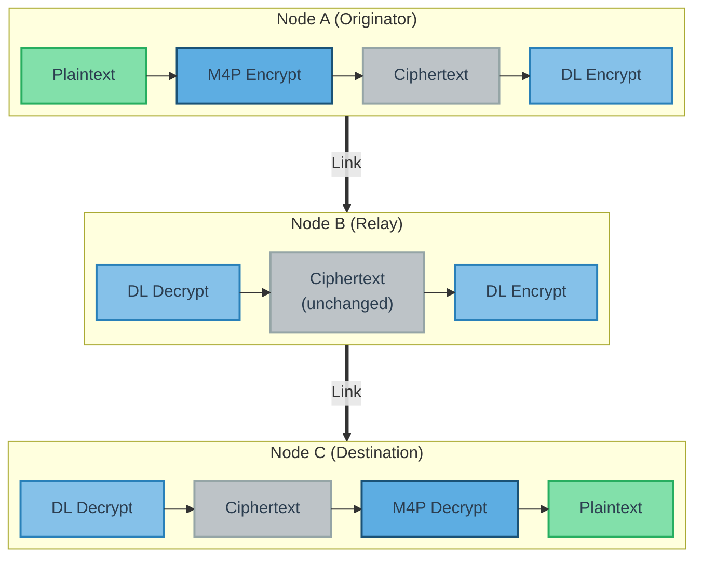
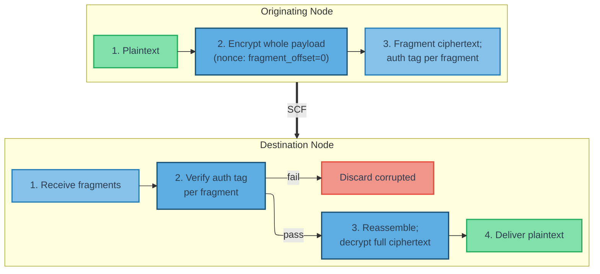

<!--
Copyright (c) 2026 Poseidon's Forge, Inc. All rights reserved.

This work is licensed under the Creative Commons Attribution 4.0
International License. To view a copy of this license, visit
https://creativecommons.org/licenses/by/4.0/

You are free to share (copy and redistribute) and adapt (remix, transform,
and build upon) this material in any medium or format for any purpose,
including commercial, under the following terms:
- Attribution: You must give appropriate credit to Poseidon's Forge, Inc.,
  provide a link to the license, and indicate if changes were made.
-->

## 12. Encryption and Security {#12-encryption-and-security}

**[WIRE FORMAT + BEHAVIORAL]**

This section defines M4P's two-layer security model. Because store-carry-forward relays must read headers for forwarding and deduplication, payload confidentiality is applied end-to-end via the optional M4P payload cipher while DataLink adapters apply per-hop link protection. The layers are independent and complementary. The payload cipher uses AES-CTR with zero ciphertext expansion, preserving payload budget on constrained links.

Figure 12 shows this interaction across a three-node path.



**Figure 12 — M4P Two-Layer Encryption Architecture**

*DL = DataLink-layer encryption (TLS / IPsec / COMSEC). Originator: M4P encrypt + DL encrypt; relay: DL decrypt/re-encrypt only; destination: DL decrypt + M4P decrypt.*

### 12.1 Responsibility Summary

The following table summarizes the division of security responsibilities across protocol layers.

| Responsibility | Owner |
|---|---|
| Application payload encryption/decryption | M4P transport (when PSK is configured) |
| Authentication tag computation/verification | M4P transport (when enabled) |
| Nonce derivation | M4P transport (from its own header fields) |
| NC message payloads | Not encrypted |
| Identity obfuscation (UID obfuscation) | Application (see [Section 12.5](#125-identity-obfuscation)) |
| Link-layer encryption (TLS, IPsec, etc.) | DataLink adapter |
| Key provisioning (PSK, certificates) | Deployment operations |

### 12.2 M4P Payload Cipher

**Configuration.** The payload cipher is controlled by one optional network-wide parameter: **`payload_cipher_key`** (PSK; see [Section 2.4.2](#242-required-configuration-must)). When configured, the transport encrypts outgoing application payloads and decrypts incoming payloads before local delivery. When absent, payloads are carried in the clear. All nodes that host clients and use the payload cipher MUST use the same PSK. Relay-only nodes do not need the PSK and forward ciphertext as opaque bytes.

**Algorithm.** The payload cipher uses **AES-256-CTR** (Counter mode) as defined in NIST SP 800-38A. Key size: 256 bits (32 bytes). Ciphertext expansion: zero (AES-CTR is a stream cipher mode; the ciphertext is the same length as the plaintext). Padding: none required.

#### 12.2.1 What Is Encrypted

The payload cipher operates on **application message payloads only** (see Figure 12 for the two-layer architecture). The following are NOT encrypted:

- All transport-layer packet header fields: `message_type_id`, `source`, `destination`, `timestamp_24h`, `msg_counter`, `payload_length`, `flags`, and all optional header fields.
- All transmission-level metadata: `node_address_sender`.
- Network control (NC) message payloads (message types 32,000–32,767).

Headers and transmission metadata remain visible so intermediate nodes can perform MIID deduplication, scheduling, TTL checks, forwarding, and fragmentation during store-carry-forward operation.

**Design Note (Non-Normative):** NC payloads remain visible so nodes can process discovery, claim, and conflict state without endpoint payload keys; network-layer convergence stays independent of application payload confidentiality.

#### 12.2.2 Nonce Derivation

AES-CTR requires a unique nonce (IV) for each encrypted payload or fragment. The M4P transport derives the nonce from packet header fields available at both sender and receiver, so nonce bytes are not transmitted:

```text
nonce = AES-CTR-NONCE(network_id, source_ca, timestamp_24h, msg_counter, message_type_id, fragment_offset)
```

**Nonce construction.** The nonce is constructed as a 16-byte (128-bit) value:

```text
+-----------------------------------------------+
| network_id_hash          (4 bytes)             |
+-----------------------------------------------+
| source_ca                (2 bytes, zero-padded)|
+-----------------------------------------------+
| timestamp_24h            (3 bytes)             |
+-----------------------------------------------+
| msg_counter              (1 byte)              |
+-----------------------------------------------+
| message_type_id          (2 bytes)             |
+-----------------------------------------------+
| fragment_offset          (2 bytes)             |
+-----------------------------------------------+
| reserved                 (2 bytes, 0x0000)     |
+-----------------------------------------------+
```

**Nonce Byte-Offset Summary**

| Byte Offset | Field | Size | Description |
|---|---|---|---|
| 0–3 | `network_id_hash` | 4 B | First 4 bytes of `SHA-256(network_id)`. Binds nonce to deployment. |
| 4–5 | `source_ca` | 2 B | Client Address, zero-padded to 2 bytes in 8-bit mode. |
| 6–8 | `timestamp_24h` | 3 B | 17-bit timestamp, zero-padded to 3 bytes. |
| 9 | `msg_counter` | 1 B | 7-bit message counter, zero-padded to 1 byte. |
| 10–11 | `message_type_id` | 2 B | Message type, big-endian. |
| 12–13 | `fragment_offset` | 2 B | Fragment byte offset. `0x0000` for unfragmented messages. |
| 14–15 | `reserved` | 2 B | Set to `0x0000`. |

**Response packet nonce fields.** For Response packets, the nonce fields are populated as follows:

| Nonce Field | Response Header Source |
|---|---|
| `source_ca` | The Response's `source` field (the responder's CA) |
| `timestamp_24h` | `timestamp_24h_request` (the original Request's timestamp) |
| `msg_counter` | `msg_counter_request` (the original Request's counter) |

The `(source_ca, timestamp_24h_request, msg_counter_request, message_type_id)` tuple is unique because the transport enforces the one-response-per-request invariant in [Section 6.5](#65-deduplication-rules).

**Nonce uniqueness.** Uniqueness is scoped by the tuple `(network_id_hash, source_ca, timestamp_24h, msg_counter, message_type_id, fragment_offset)`:

| Component | Ensures uniqueness per... |
|---|---|
| `(source_ca, timestamp_24h, msg_counter)` (MIID core) | Message |
| `message_type_id` | Packet class |
| `fragment_offset` | Fragment |
| `network_id_hash` | Deployment |

Under correct protocol behavior, distinct plaintexts do not reuse the same key and nonce tuple.

**24-hour wrap behavior.** Because `timestamp_24h` wraps every 24 hours, long-lived static-key periodic traffic can repeat nonce tuples (aperiodic traffic has lower alignment risk).

Deployments with long-lived periodic traffic MUST mitigate nonce reuse using one or both mechanisms:

- **Key rotation (primary).** Deployments lasting more than 24 hours SHOULD derive short-lived epoch keys from the master PSK (for example via HKDF or SP 800-108), as described in [Section 12.4.1](#1241-payload-cipher-key) and [Section 12.4.3](#1243-key-rotation).
- **Timing jitter (secondary).** Periodic publishers SHOULD add small random jitter (seconds) to transmission timing to avoid deterministic timestamp alignment across days.

#### 12.2.3 Authentication Tag

The M4P transport MAY append an authentication tag (4, 8, or 16 bytes) to encrypted payloads. Applications request tagging per message by setting `AUTH_TAG_SIZE` to a non-zero value. The originating node computes the tag during encryption; the destination node verifies it before client delivery.

**[GUIDANCE] Deployment policy.** Deployments with elevated integrity requirements SHOULD tag all messages. Command-and-control and safety-critical traffic SHOULD use `AUTH_TAG_SIZE = 10` or `11` (8- or 16-byte tags). Constrained telemetry MAY use `AUTH_TAG_SIZE = 01` (4-byte tags).

**Tag computation.** Tags use AES-CMAC (NIST SP 800-38B), truncated to N bytes based on `AUTH_TAG_SIZE`:

| `AUTH_TAG_SIZE` | N (tag bytes) |
|---|---|
| `01` | 4 |
| `10` | 8 |
| `11` | 16 |

```text
tag = TRUNCATE_N(AES-CMAC(key, nonce || header_aad || ciphertext))
```

`key` is the PSK, `nonce` is the 16-byte value from [Section 12.2.2](#1222-nonce-derivation), and `header_aad` is immutable non-encrypted header data in wire order.

**Header AAD construction.** The `header_aad` fields depend on the packet class:

| Packet Class | `header_aad` Fields |
|---|---|
| Status | `flags` (1 byte) ‖ `payload_length` (2 bytes) |
| Event | `flags` (1 byte) ‖ `payload_length` (2 bytes) |
| Request | `destination` (1 or 2 bytes) ‖ `flags` (1 byte) ‖ [`additional_dest_count` (1 byte) ‖ `additional_dest[]` (`additional_dest_count` × CA width)] ‖ `payload_length` (2 bytes) |
| Response | `destination` (1 or 2 bytes) ‖ `payload_length` (2 bytes) ‖ `timestamp_24h_response` (17 bits) ‖ `flags` (7 bits) — packed into 3 bytes |

Packet class is determined from `message_type_id` ranges (see [Section 4.1](#41-message-type-id-ranges)), so sender and receiver agree on AAD shape. For Request packets, the bracketed destination-list fields are present only when `ADDITIONAL_DEST_PRESENT` is set; because `flags` is authenticated, tampering with destination-list presence invalidates the tag.

`header_aad` fields are authenticated but not encrypted.

When `AUTH_TAG_SIZE != 00`, the tag appears as an optional field after all other optional fields and before payload (see [Section 5.7.5](#575-optional-field-ordering)). `payload_length` covers ciphertext only and excludes tag bytes. When `AUTH_TAG_SIZE = 00`, the tag field is absent.

**Security strength (guidance).**

| `AUTH_TAG_SIZE` | Tag Length | Forgery Resistance |
|---|---|---|
| `01` | 4 bytes | ~1 in 2^32 per attempt |
| `10` | 8 bytes | ~1 in 2^64 per attempt |
| `11` | 16 bytes | ~1 in 2^128 per attempt (full CMAC strength) |

**Flag bit allocation.** `AUTH_TAG_SIZE` occupies Status bits [7:6], Event bits [7:6], Request bits [7:6], and Response bits [6:5]. Event bit 4 is reserved in this protocol version. **[Section 5.7](#57-flags-and-optional-fields) is authoritative** for bit positions. The field MUST be non-zero only when the payload cipher is active (PSK configured). If a node without a PSK receives a packet where `AUTH_TAG_SIZE != 00`, it MUST forward the packet unchanged.

#### 12.2.4 Transport Pipeline

The payload cipher is applied at originating and destination nodes; intermediate relays typically perform no cryptographic operations.

**Originating node (encryption).** When a client sends a message and a PSK is configured:

1. The client submits plaintext payload, optionally setting `AUTH_TAG_SIZE`.
2. The transport constructs packet header fields and the 16-byte nonce.
3. The transport encrypts the payload with AES-CTR.
4. If `AUTH_TAG_SIZE != 00`, the transport computes the authentication tag over `nonce || header_aad || ciphertext` and places it in the optional-field area.
5. The transport stores the resulting encrypted packet for scheduling and forwarding.

If fragmentation is required, ordering is defined in [Section 12.2.5](#1225-fragmentation-interaction): encrypt first, then fragment, with per-fragment tags when enabled.

**Destination node (decryption).** When a packet is for local delivery and a PSK is configured:

1. If `AUTH_TAG_SIZE != 00`, reconstruct `header_aad` and nonce, verify the tag, and on mismatch MUST discard the packet (or fragment).
2. For fragmented messages, reassemble verified fragments to reconstruct full ciphertext.
3. Reconstruct the nonce with `fragment_offset = 0`, decrypt with AES-CTR, and deliver plaintext.

**Intermediate nodes (forwarding).** Intermediate nodes store, schedule, and forward ciphertext as opaque bytes; the PSK is not required.

**NC bypass.** Network control messages (types 32,000–32,767) bypass this pipeline and are not encrypted.

**Exception: fragmentation and re-fragmentation.** Splitting ciphertext itself requires no cryptographic operation. However, when `AUTH_TAG_SIZE != 00`, any node that creates new fragments MUST compute fresh per-fragment tags (see [Section 12.2.5](#1225-fragmentation-interaction)), which requires the PSK. Nodes without the PSK MUST NOT fragment or re-fragment authenticated packets; oversized packets are skipped on that link.

#### 12.2.5 Fragmentation Interaction

When a message is fragmented (see [Section 8](#8-fragmentation-and-reassembly)), each fragment has its own `fragment_offset`; because `fragment_offset` is part of the nonce, each fragment has a distinct nonce.

Canonical ordering is:

1. Encrypt the full message payload using the nonce with `fragment_offset = 0`.
2. Fragment the ciphertext as needed (including intermediate-node fragmentation or re-fragmentation; see [Section 8.3.2](#832-who-may-fragment)).
3. If `AUTH_TAG_SIZE != 00`, compute a per-fragment tag using that fragment's nonce (`fragment_offset = <byte_offset>`), `header_aad`, and ciphertext slice; place the tag in each fragment header. Every fragment carries the same `AUTH_TAG_SIZE` value as the original message.
4. If `AUTH_TAG_SIZE != 00`, verify each fragment tag as fragments arrive and discard failures.
5. Reassemble verified fragments to reconstruct full ciphertext.
6. Decrypt the reassembled ciphertext using the nonce with `fragment_offset = 0`.

`header_aad` MUST be derived from each fragment's own header fields; fragment-specific `flags` and `payload_length` are included in that fragment's AAD. Per-fragment authentication allows immediate rejection of tampered fragments before reassembly.

Figure 13 illustrates the encrypt-then-fragment and verify-then-reassemble-then-decrypt ordering at the originating and destination nodes.



**Figure 13 — Fragmentation and Encryption Interaction**

**Note:** Implementations MAY decrypt per fragment by adjusting the AES-CTR counter to the fragment offset, but whole-message decrypt after reassembly is RECOMMENDED.

### 12.3 DataLink-Layer Encryption

**[GUIDANCE]**

#### 12.3.1 Role

DataLink-layer encryption provides **per-hop confidentiality and integrity** on individual link segments. It is the responsibility of each DataLink adapter and operates below the M4P transport layer. The transport layer is unaware of whether a DataLink encrypts its transmissions.

DataLink-layer encryption complements the M4P payload cipher (see Figure 12 for the two-layer interaction across a multi-hop path):

**M4P Payload Cipher vs. DataLink-Layer Encryption**

| Property | M4P Payload Cipher | DataLink Layer |
|---|---|---|
| Scope | Originating node to destination node | Per-hop (single link segment) |
| Confidentiality | Yes (AES-CTR) | Yes (when using TLS, IPsec, etc.) |
| Integrity / Authentication | Optional (4/8/16-byte auth tag per `AUTH_TAG_SIZE`) | Yes (when using TLS, IPsec, etc.) |
| Header protection | No (headers in the clear) | Yes (entire transmission encrypted) |
| What is protected | Application message payloads only | All M4P data including headers and NC messages |
| Intermediate node involvement | None — ciphertext forwarded as-is | Each hop encrypts/decrypts |
| Key source | Master PSK → HKDF epoch derivation | Per-modality provisioning |
| Key rotation | Epoch-based (e.g., 6–12 hours) | Modality-specific procedures |
| Transition window | Accept current + previous key | N/A (per-hop, immediate) |
| Relay nodes need key? | No — forward ciphertext as-is | Yes — per-hop encrypt/decrypt |
| Independence | Not derived from DataLink keys | Not derived from M4P PSK |

#### 12.3.2 Recommended DataLink Security by Modality

Deployments SHOULD enable DataLink-layer encryption on IP-based links, which are typically the easiest to intercept or inject.

- **IP/MQTT.** SHOULD use TLS 1.2+ with mutual authentication (client certificates). This protects all M4P traffic on that hop (including headers and NC payloads), authenticates peers and broker, and mitigates man-in-the-middle attacks on IP networks. TLS overhead is below M4P and does not consume M4P payload budget.
- **LAN.** SHOULD use IPsec (ESP) or equivalent link protection (for example, WireGuard or MACsec). This protects confidentiality and integrity on the LAN segment; overhead is at the IP/link layer, not the M4P payload budget.
- **Acoustic.** Link-layer encryption is often unavailable. The M4P payload cipher provides payload confidentiality, and integrity-sensitive traffic SHOULD set `AUTH_TAG_SIZE != 00` (see [Section 12.2.3](#1223-authentication-tag)). If modem-native link encryption exists, it SHOULD be enabled as an additional layer.
- **Radio.** SHOULD enable radio COMSEC or waveform-provided encryption when available. If unavailable, the M4P payload cipher still protects payload confidentiality.
- **Satellite.** SHOULD use TLS or DTLS when the terminal provides IP transport. Proprietary terminal encryption MAY provide an additional layer when available.

#### 12.3.3 Gateway and Bridge Behavior

When a node bridges traffic between modalities with different DataLink-layer encryption capabilities, the following invariant holds:

**M4P ciphertext is never modified in transit.** A bridge node:

1. Receives a transmission on one DataLink (e.g., LAN with IPsec). The DataLink adapter decrypts at the link layer, yielding M4P packets with encrypted payloads.
2. Stores the packets in the local message store (payload ciphertext intact).
3. When a transmission opportunity arises on another DataLink (e.g., acoustic), packs the packets into a transmission. The acoustic DataLink transmits them — the payload ciphertext is unchanged.

No re-encryption, tag stripping, or modality-aware crypto logic is required. The bridge node does not need the PSK. DataLink-layer encryption and decryption are handled independently by each DataLink adapter at each hop.

### 12.4 Key Management

#### 12.4.1 Payload Cipher Key

The M4P payload cipher uses the deployment PSK (see [Section 2.4.2](#242-required-configuration-must)). PSK provisioning is outside this specification and handled by deployment operations.

All nodes that host clients producing or consuming messages MUST use the same PSK. Relay-only nodes (no hosted clients) do not need the PSK and forward ciphertext as opaque bytes.

**[GUIDANCE] Epoch key derivation.** For deployments lasting more than 24 hours or involving periodic autonomous traffic, the provisioned PSK SHOULD be treated as a **master key** from which short-lived **epoch keys** are derived using a key derivation function (KDF). A RECOMMENDED approach:

```text
epoch_key = HKDF-Expand(
    PRK    = master_psk,
    info   = "M4P-epoch" || network_id || epoch_number,
    L      = 32  (AES-256 key length)
)
```

`epoch_number` is a monotonically increasing epoch identifier (for example from UTC hours, mission phase, or a deployment schedule). The derived epoch key is used as `payload_cipher_key` for that epoch and avoids nonce reuse across epoch boundaries (see [Section 12.2.2](#1222-nonce-derivation), *24-hour wrap behavior*). This assumes the master PSK is uniformly random 256-bit key material; if it comes from a passphrase or other low-entropy source, implementations SHOULD apply HKDF-Extract first (RFC 5869) before HKDF-Expand.

Deployments that use the master PSK directly (without epoch derivation) MUST account for the 24-hour nonce reuse risk described in [Section 12.2.2](#1222-nonce-derivation), *24-hour wrap behavior*.

See [Section 12.3.1](#1231-role) for a comparison of the M4P payload cipher and DataLink-layer encryption, including key management properties.

#### 12.4.2 Key Scope

The PSK is scoped to a deployment (network ID). Different deployments SHOULD use different keys. Combined with the `network_id_hash` in the nonce, this ensures that ciphertext from one deployment is not decryptable with another deployment's key, even if message header fields happen to collide.

#### 12.4.3 Key Rotation

Key rotation (epoch derivation in [Section 12.4.1](#1241-payload-cipher-key) or manual PSK replacement) requires DTN-aware coordination because nodes may not transition simultaneously.

**Transition window.** During the period between one node adopting a new epoch key and the last node transitioning:

- Nodes SHOULD accept decryption attempts with both the current and previous epoch key.
- If decryption with the current key fails and a previous key is available, the node SHOULD attempt decryption with the previous key before discarding the payload.
- Nodes MUST retain previous keys for at least the maximum configured message TTL to decrypt in-flight messages created under a prior epoch.

**Epoch synchronization.** For time-based derivation, all nodes derive from the same master PSK and epoch schedule. Sub-second agreement is unnecessary; nodes only need to agree on the current epoch. Deployments SHOULD choose intervals (for example 6 or 12 hours) that prevent nonce reuse while tolerating clock drift and DTN propagation delay.

**Scheduling guidance.** Deployments SHOULD minimize the transition window by placing epoch boundaries during high-connectivity periods (for example, surfaced operations or LAN availability).

Implementations MAY use the nonce's `reserved` field (2 bytes, currently `0x0000`) as a key epoch identifier in future protocol versions to facilitate unambiguous key selection without trial decryption.

#### 12.4.4 DataLink-Layer Keys

DataLink-layer key management is modality-specific:

- **MQTT/TLS:** X.509 certificates or PSK, managed per standard TLS provisioning practices.
- **IPsec:** Pre-shared keys or certificates, managed per standard IPsec/IKE provisioning.
- **Radio COMSEC:** Managed per the radio system's key management procedures.
- **Satellite:** Managed per the satellite terminal's security provisioning.

DataLink-layer keys are independent of the M4P payload cipher PSK.

### 12.5 Identity Obfuscation

NodeUIDs and ClientUIDs are opaque strings from M4P's perspective: transport and network logic do not interpret UID content. Applications MAY provide obfuscated UIDs (for example, pseudonyms instead of `vehicle-123`), and M4P uses them unchanged for address derivation, NC payloads, and conflict handling. This preserves protocol behavior while reducing identity exposure in NC traffic, which is not encrypted by the payload cipher.

Identity obfuscation is an application-layer responsibility. M4P does not define the mechanism, but all nodes in a deployment MUST apply the same scheme so the same logical identity maps to the same obfuscated UID. Deployments in contested environments SHOULD obfuscate all NodeUIDs and ClientUIDs (for example, HMAC-based pseudonymization) to reduce passive fleet enumeration.

### 12.6 Security Properties and Limitations

#### 12.6.1 What This Model Provides

- **Payload confidentiality from originating node to destination node** across all modalities. Intermediate forwarding nodes cannot access plaintext payloads.
- **Per-message payload integrity and authentication** via the optional authentication tag (`AUTH_TAG_SIZE`: 4, 8, or 16 bytes).
- **Per-hop integrity and confidentiality** on IP-based links (LAN, MQTT) via standard link-layer security (TLS, IPsec).
- **Defense in depth:** The M4P payload cipher and DataLink-layer encryption operate independently. Compromise of one layer does not compromise the other.
- **Transparent bridging:** Gateway nodes forward ciphertext payloads without cryptographic awareness or processing.
- **Transparent to applications:** Clients publish and subscribe as usual; M4P transport handles cryptographic operations when PSK is configured.

#### 12.6.2 What This Model Does Not Provide

- **Application-to-application confidentiality.** Originating and destination M4P transports see plaintext payloads. Applications that require confidentiality from M4P SHOULD encrypt payloads before submission.
- **Header confidentiality (end-to-end).** Transport headers (source/destination CA, message type, timestamps, payload length) remain in the clear; observers can infer communication patterns. DataLink encryption protects headers per-hop on supported links, not end-to-end.
- **Protection against traffic analysis.** Even with the payload cipher and DataLink-layer encryption, packet sizes, timing, and addressing patterns are observable. M4P does not provide traffic flow confidentiality.
- **NC message payload confidentiality (end-to-end).** NC payloads containing NodeUIDs and ClientUIDs are not encrypted by the payload cipher; they rely on DataLink-layer encryption where available. Identity obfuscation (see [Section 12.5](#125-identity-obfuscation)) mitigates passive exposure.

**Design Note (Non-Normative): Threat model alignment.** This model targets autonomous maritime deployments where fleet nodes share a trust domain. Primary threats and mitigations:

- **Passive IP eavesdropping:** Mitigated by DataLink-layer TLS/IPsec plus the M4P payload cipher.
- **Active IP interception/injection:** Mitigated by DataLink mutual authentication and integrity protections.
- **Passive acoustic eavesdropping:** Mitigated by the M4P payload cipher.
- **Active acoustic tampering:** Mitigated when `AUTH_TAG_SIZE != 00` is used (see [Section 12.2.3](#1223-authentication-tag)).

**Standards alignment.** M4P specifies AES-256-CTR (NIST SP 800-38A) and AES-CMAC (NIST SP 800-38B). Deployments requiring FIPS 140-2/3 assurances SHOULD use validated modules. Independent payload-cipher and DataLink layers support defense in depth (for example, CSfC). AES-256 satisfies CNSA 2.0 symmetric baseline requirements.

---
